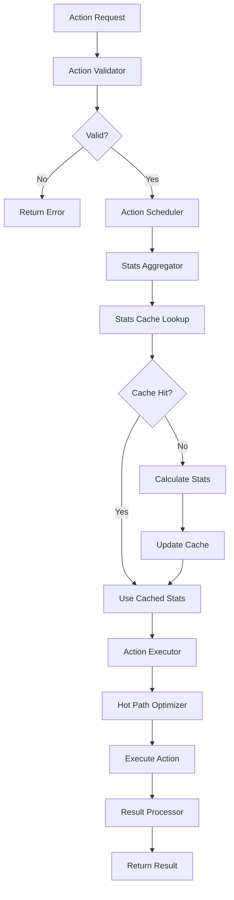

# Action Execution Engine

## 📋 **Tổng Quan**

Action Execution Engine là core component của Action Core, chịu trách nhiệm thực thi tất cả các actions trong game. Engine này được thiết kế để xử lý hàng nghìn actions mỗi giây với performance tối ưu và tích hợp seamless với derived stats từ Element Core.

## 🎯 **Core Principles**

### **1. High Performance**
- **Hot Path Optimization**: Critical execution path được tối ưu
- **Batch Processing**: Process multiple actions cùng lúc
- **Smart Caching**: Cache frequently used data
- **Memory Pool**: Reuse objects để giảm allocation

### **2. Derived Stats Integration**
- **Real-time Access**: Access derived stats trong real-time
- **Intelligent Caching**: Cache stats với smart invalidation
- **Stat Aggregation**: Aggregate stats từ multiple sources
- **Performance Optimization**: Optimize stat access patterns

### **3. Unified Interface**
- **Consistent API**: Unified interface cho tất cả action types
- **Type Safety**: Strong typing cho action parameters
- **Error Handling**: Comprehensive error handling
- **Validation**: Built-in validation cho actions

## 🏗️ **Architecture**

### **Core Components**

```rust
pub struct ActionExecutionEngine {
    // Core components
    action_scheduler: ActionScheduler,
    action_validator: ActionValidator,
    action_executor: ActionExecutor,
    result_processor: ActionResultProcessor,
    
    // Stats integration
    stats_aggregator: StatsAggregator,
    stats_cache: StatsCacheManager,
    stats_calculator: StatsCalculator,
    
    // Performance optimization
    hot_path_optimizer: HotPathOptimizer,
    batch_processor: BatchProcessor,
    memory_pool: MemoryPool,
    
    // Configuration
    config: ActionEngineConfig,
}
```

### **Action Execution Flow**



## 🔧 **Core Components**

### **1. Action Scheduler**

```rust
pub struct ActionScheduler {
    priority_queue: BinaryHeap<ActionRequest>,
    execution_queue: VecDeque<ActionRequest>,
    batch_size: usize,
    max_concurrent: usize,
}

impl ActionScheduler {
    pub fn schedule_action(&mut self, request: ActionRequest) -> Result<(), ActionError> {
        // Validate action
        self.validate_action(&request)?;
        
        // Add to priority queue
        self.priority_queue.push(request);
        
        // Process if batch is full
        if self.priority_queue.len() >= self.batch_size {
            self.process_batch()?;
        }
        
        Ok(())
    }
    
    pub fn process_batch(&mut self) -> Result<Vec<ActionResult>, ActionError> {
        let mut results = Vec::new();
        let mut batch = Vec::new();
        
        // Extract batch from priority queue
        for _ in 0..self.batch_size.min(self.priority_queue.len()) {
            if let Some(request) = self.priority_queue.pop() {
                batch.push(request);
            }
        }
        
        // Process batch
        for request in batch {
            let result = self.execute_action(request)?;
            results.push(result);
        }
        
        Ok(results)
    }
}
```

### **2. Action Validator**

```rust
pub struct ActionValidator {
    validation_rules: HashMap<String, ValidationRule>,
    stat_requirements: HashMap<String, Vec<String>>,
    resource_requirements: HashMap<String, ResourceRequirement>,
}

impl ActionValidator {
    pub fn validate_action(&self, request: &ActionRequest) -> ValidationResult {
        let mut errors = Vec::new();
        
        // Validate action type
        if let Some(rule) = self.validation_rules.get(&request.action_type) {
            if let Err(e) = rule.validate(request) {
                errors.push(e);
            }
        }
        
        // Validate stat requirements
        if let Some(required_stats) = self.stat_requirements.get(&request.action_type) {
            for stat in required_stats {
                if !request.context.derived_stats.has_stat(stat) {
                    errors.push(ValidationError::MissingStat(stat.clone()));
                }
            }
        }
        
        // Validate resource requirements
        if let Some(resource_req) = self.resource_requirements.get(&request.action_type) {
            if let Err(e) = resource_req.validate(&request.context.actor) {
                errors.push(e);
            }
        }
        
        if errors.is_empty() {
            ValidationResult::Valid
        } else {
            ValidationResult::Invalid(errors)
        }
    }
}
```

### **3. Action Executor**

```rust
pub struct ActionExecutor {
    action_handlers: HashMap<String, Box<dyn ActionHandler>>,
    execution_context: ExecutionContext,
    performance_monitor: PerformanceMonitor,
}

impl ActionExecutor {
    pub fn execute_action(&mut self, request: ActionRequest) -> Result<ActionResult, ActionError> {
        let start_time = Instant::now();
        
        // Get action handler
        let handler = self.action_handlers.get(&request.action_type)
            .ok_or_else(|| ActionError::UnknownActionType(request.action_type.clone()))?;
        
        // Prepare execution context
        let mut context = self.prepare_context(&request)?;
        
        // Execute action
        let result = handler.execute(&mut context)?;
        
        // Record performance metrics
        let execution_time = start_time.elapsed();
        self.performance_monitor.record_execution(&request.action_type, execution_time);
        
        Ok(result)
    }
    
    fn prepare_context(&self, request: &ActionRequest) -> Result<ExecutionContext, ActionError> {
        // Prepare derived stats context
        let stats_context = self.prepare_stats_context(&request.context)?;
        
        // Prepare combat context
        let combat_context = self.prepare_combat_context(&request.context)?;
        
        // Prepare environment context
        let environment_context = self.prepare_environment_context(&request.context)?;
        
        Ok(ExecutionContext {
            actor: request.context.actor.clone(),
            target: request.context.target.clone(),
            derived_stats: stats_context,
            combat_stats: combat_context,
            environment: environment_context,
            action_params: request.parameters.clone(),
        })
    }
}
```

### **4. Stats Aggregator**

```rust
pub struct StatsAggregator {
    element_core_client: ElementCoreClient,
    stats_cache: StatsCacheManager,
    aggregation_rules: HashMap<String, AggregationRule>,
}

impl StatsAggregator {
    pub async fn get_derived_stats(&mut self, actor: &Actor) -> Result<DerivedStatsSnapshot, ActionError> {
        // Check cache first
        if let Some(cached_stats) = self.stats_cache.get(&actor.id) {
            if cached_stats.is_valid() {
                return Ok(cached_stats);
            }
        }
        
        // Fetch from Element Core
        let element_stats = self.element_core_client.get_derived_stats(actor).await?;
        
        // Apply aggregation rules
        let aggregated_stats = self.apply_aggregation_rules(element_stats)?;
        
        // Create snapshot
        let snapshot = DerivedStatsSnapshot::new(aggregated_stats);
        
        // Update cache
        self.stats_cache.insert(actor.id, snapshot.clone());
        
        Ok(snapshot)
    }
    
    fn apply_aggregation_rules(&self, stats: HashMap<String, f64>) -> Result<HashMap<String, f64>, ActionError> {
        let mut aggregated = stats;
        
        for (stat_name, rule) in &self.aggregation_rules {
            if let Some(value) = aggregated.get(stat_name) {
                let new_value = rule.apply(*value, &aggregated)?;
                aggregated.insert(stat_name.clone(), new_value);
            }
        }
        
        Ok(aggregated)
    }
}
```

### **5. Hot Path Optimizer**

```rust
pub struct HotPathOptimizer {
    critical_paths: HashMap<String, CriticalPath>,
    optimization_rules: Vec<OptimizationRule>,
    performance_profiler: PerformanceProfiler,
}

impl HotPathOptimizer {
    pub fn optimize_execution(&self, context: &mut ExecutionContext) -> Result<(), ActionError> {
        // Identify critical path
        let critical_path = self.identify_critical_path(&context.action_type)?;
        
        // Apply optimizations
        for rule in &self.optimization_rules {
            if rule.applies_to(&critical_path) {
                rule.apply(context)?;
            }
        }
        
        // Pre-calculate frequently used values
        self.pre_calculate_values(context)?;
        
        Ok(())
    }
    
    fn pre_calculate_values(&self, context: &mut ExecutionContext) -> Result<(), ActionError> {
        // Pre-calculate damage-related stats
        if context.action_type == "attack" {
            context.pre_calculated.damage_multiplier = self.calculate_damage_multiplier(context)?;
            context.pre_calculated.critical_chance = self.calculate_critical_chance(context)?;
            context.pre_calculated.accuracy = self.calculate_accuracy(context)?;
        }
        
        // Pre-calculate skill-related stats
        if context.action_type == "skill" {
            context.pre_calculated.skill_power = self.calculate_skill_power(context)?;
            context.pre_calculated.cooldown_reduction = self.calculate_cooldown_reduction(context)?;
        }
        
        Ok(())
    }
}
```

## 🚀 **Performance Optimization**

### **1. Caching Strategy**

```rust
pub struct StatsCacheManager {
    cache: HashMap<ActorId, CachedStats>,
    ttl: Duration,
    max_size: usize,
    eviction_policy: EvictionPolicy,
}

impl StatsCacheManager {
    pub fn get(&self, actor_id: &ActorId) -> Option<&CachedStats> {
        self.cache.get(actor_id).and_then(|cached| {
            if cached.is_valid() {
                Some(cached)
            } else {
                None
            }
        })
    }
    
    pub fn insert(&mut self, actor_id: ActorId, stats: DerivedStatsSnapshot) {
        // Check cache size
        if self.cache.len() >= self.max_size {
            self.evict_oldest();
        }
        
        // Insert new stats
        let cached = CachedStats::new(stats, Instant::now() + self.ttl);
        self.cache.insert(actor_id, cached);
    }
}
```

### **2. Batch Processing**

```rust
pub struct BatchProcessor {
    batch_size: usize,
    processing_threads: usize,
    thread_pool: ThreadPool,
}

impl BatchProcessor {
    pub async fn process_batch(&self, actions: Vec<ActionRequest>) -> Result<Vec<ActionResult>, ActionError> {
        let chunks = actions.chunks(self.batch_size);
        let mut handles = Vec::new();
        
        for chunk in chunks {
            let chunk = chunk.to_vec();
            let handle = self.thread_pool.spawn(async move {
                self.process_chunk(chunk).await
            });
            handles.push(handle);
        }
        
        let mut results = Vec::new();
        for handle in handles {
            let chunk_results = handle.await??;
            results.extend(chunk_results);
        }
        
        Ok(results)
    }
}
```

### **3. Memory Pool**

```rust
pub struct MemoryPool {
    action_contexts: Vec<ExecutionContext>,
    action_results: Vec<ActionResult>,
    stats_snapshots: Vec<DerivedStatsSnapshot>,
}

impl MemoryPool {
    pub fn get_context(&mut self) -> &mut ExecutionContext {
        self.action_contexts.pop().unwrap_or_else(|| ExecutionContext::new())
    }
    
    pub fn return_context(&mut self, context: ExecutionContext) {
        context.reset();
        self.action_contexts.push(context);
    }
}
```

## 📊 **Performance Metrics**

### **Target Metrics**
- **Action Execution**: < 0.1ms per action
- **Stats Access**: < 0.01ms per stat lookup
- **Cache Hit Rate**: > 95%
- **Memory Usage**: < 50MB for 1000 actors
- **Throughput**: > 10,000 actions/second

### **Monitoring**

```rust
pub struct PerformanceMonitor {
    metrics: HashMap<String, MetricCollector>,
    alerts: Vec<PerformanceAlert>,
}

impl PerformanceMonitor {
    pub fn record_execution(&mut self, action_type: &str, duration: Duration) {
        if let Some(collector) = self.metrics.get_mut(action_type) {
            collector.record_duration(duration);
            
            // Check for performance alerts
            if duration > Duration::from_millis(1) {
                self.alerts.push(PerformanceAlert::SlowExecution {
                    action_type: action_type.to_string(),
                    duration,
                });
            }
        }
    }
}
```

## 🧪 **Testing Strategy**

### **Unit Tests**
```rust
#[cfg(test)]
mod tests {
    use super::*;
    
    #[tokio::test]
    async fn test_action_execution() {
        let mut engine = ActionExecutionEngine::new();
        let request = ActionRequest::new("attack", actor, target);
        
        let result = engine.execute_action(request).await.unwrap();
        assert!(result.success);
    }
    
    #[tokio::test]
    async fn test_stats_caching() {
        let mut engine = ActionExecutionEngine::new();
        let actor = create_test_actor();
        
        // First call - should calculate
        let stats1 = engine.get_derived_stats(&actor).await.unwrap();
        
        // Second call - should use cache
        let stats2 = engine.get_derived_stats(&actor).await.unwrap();
        
        assert_eq!(stats1, stats2);
    }
}
```

### **Performance Tests**
```rust
#[tokio::test]
async fn test_performance_benchmark() {
    let mut engine = ActionExecutionEngine::new();
    let actions = create_test_actions(1000);
    
    let start = Instant::now();
    let results = engine.process_batch(actions).await.unwrap();
    let duration = start.elapsed();
    
    assert!(duration < Duration::from_millis(100));
    assert_eq!(results.len(), 1000);
}
```

## 🔗 **Integration Points**

### **Element Core Integration**
- **Stats Provider**: Access derived stats
- **Stats Calculator**: Calculate complex interactions
- **Stats Cache**: Cache stats với smart invalidation

### **Combat Core Integration**
- **Damage Input**: Provide formatted stats
- **Damage Output**: Process damage results
- **Status Effects**: Handle status application

### **Actor Core Integration**
- **Actor State**: Access actor properties
- **Resource Management**: Handle resource changes
- **Event System**: Trigger action events

---

**Last Updated**: 2025-01-27  
**Version**: 1.0  
**Status**: Design Phase  
**Maintainer**: Chaos World Team
