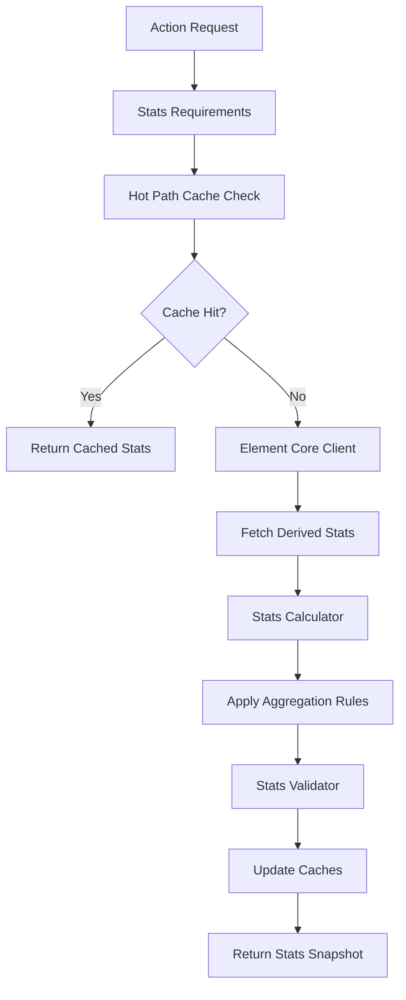

# Derived Stats Integration

## 📋 **Tổng Quan**

Derived Stats Integration là core component của Action Core, chịu trách nhiệm tích hợp và tối ưu hóa việc access đến derived stats từ Element Core. Component này đảm bảo rằng actions có thể access đến hàng trăm derived stats một cách hiệu quả và real-time.

## 🎯 **Vấn Đề Cần Giải Quyết**

### **1. Stats Complexity**
- Element Core có **hàng trăm derived stats** (từ 11_Advanced_Derived_Stats_Design.md)
- Actions cần access đến **multiple stats** cùng lúc
- Cần **intelligent caching** để tránh recalculation

### **2. Performance Requirements**
- **Real-time Access**: Stats cần được access trong real-time
- **High Throughput**: Hàng nghìn actions mỗi giây
- **Low Latency**: < 0.01ms per stat lookup
- **Memory Efficiency**: Tối ưu memory usage

### **3. Integration Challenges**
- **Element Core**: Source of truth cho derived stats
- **Combat Core**: Consumer của stats cho damage calculation
- **Action Core**: Orchestrator giữa hai systems

## 🏗️ **Architecture**

### **Core Components**

```rust
pub struct DerivedStatsIntegration {
    // Core components
    stats_aggregator: StatsAggregator,
    stats_cache: StatsCacheManager,
    stats_calculator: StatsCalculator,
    stats_validator: StatsValidator,
    
    // Element Core integration
    element_core_client: ElementCoreClient,
    stats_provider: StatsProvider,
    
    // Performance optimization
    hot_path_cache: HotPathCache,
    batch_processor: BatchProcessor,
    memory_pool: MemoryPool,
    
    // Configuration
    config: StatsIntegrationConfig,
}
```

### **Stats Integration Flow**



## 🔧 **Core Components**

### **1. Stats Aggregator**

```rust
pub struct StatsAggregator {
    // Element Core integration
    element_core_client: ElementCoreClient,
    element_stats_provider: ElementStatsProvider,
    
    // Resource Manager integration
    resource_manager_client: ResourceManagerClient,
    resource_stats_provider: ResourceStatsProvider,
    
    // Combat Core integration
    combat_core_client: CombatCoreClient,
    combat_stats_provider: CombatStatsProvider,
    
    // Aggregation rules
    aggregation_rules: HashMap<String, AggregationRule>,
    stat_dependencies: HashMap<String, Vec<String>>,
    performance_monitor: PerformanceMonitor,
}

impl StatsAggregator {
    pub async fn get_derived_stats(&mut self, actor: &Actor) -> Result<DerivedStatsSnapshot, StatsError> {
        let start_time = Instant::now();
        
        // Get Element Core stats
        let element_stats = self.element_core_client.get_derived_stats(actor).await?;
        
        // Get Resource Manager stats
        let resource_stats = self.resource_manager_client.get_resource_stats(actor).await?;
        
        // Get Combat Core stats
        let combat_stats = self.combat_core_client.get_combat_stats(actor).await?;
        
        // Aggregate all stats
        let aggregated_stats = self.aggregate_all_stats(element_stats, resource_stats, combat_stats, actor).await?;
        
        // Create snapshot
        let snapshot = DerivedStatsSnapshot::new(aggregated_stats);
        
        // Record performance metrics
        let duration = start_time.elapsed();
        self.performance_monitor.record_stats_aggregation(duration);
        
        Ok(snapshot)
    }
    
    async fn aggregate_all_stats(
        &self,
        element_stats: ElementDerivedStats,
        resource_stats: ResourceStats,
        combat_stats: CombatDerivedStats,
        actor: &Actor
    ) -> Result<HashMap<String, f64>, StatsError> {
        let mut aggregated = HashMap::new();
        
        // Add Element Core stats
        self.add_element_stats(&mut aggregated, &element_stats)?;
        
        // Add Resource Manager stats
        self.add_resource_stats(&mut aggregated, &resource_stats)?;
        
        // Add Combat Core stats
        self.add_combat_stats(&mut aggregated, &combat_stats)?;
        
        // Apply aggregation rules
        for (stat_name, rule) in &self.aggregation_rules {
            if let Some(value) = aggregated.get(stat_name) {
                let new_value = rule.apply(*value, &aggregated, actor).await?;
                aggregated.insert(stat_name.clone(), new_value);
            }
        }
        
        Ok(aggregated)
    }
    
    fn add_element_stats(&self, aggregated: &mut HashMap<String, f64>, stats: &ElementDerivedStats) -> Result<(), StatsError> {
        // Counterbalance Pairs (from fire_element.yaml)
        aggregated.insert("power_point".to_string(), stats.power_point);
        aggregated.insert("defense_point".to_string(), stats.defense_point);
        aggregated.insert("crit_rate".to_string(), stats.crit_rate);
        aggregated.insert("resist_crit_rate".to_string(), stats.resist_crit_rate);
        aggregated.insert("crit_damage".to_string(), stats.crit_damage);
        aggregated.insert("resist_crit_damage".to_string(), stats.resist_crit_damage);
        aggregated.insert("accurate_rate".to_string(), stats.accurate_rate);
        aggregated.insert("dodge_rate".to_string(), stats.dodge_rate);
        aggregated.insert("status_probability".to_string(), stats.status_probability);
        aggregated.insert("status_resistance".to_string(), stats.status_resistance);
        aggregated.insert("status_duration".to_string(), stats.status_duration);
        aggregated.insert("status_duration_reduction".to_string(), stats.status_duration_reduction);
        aggregated.insert("status_intensity".to_string(), stats.status_intensity);
        aggregated.insert("status_intensity_reduction".to_string(), stats.status_intensity_reduction);
        aggregated.insert("element_penetration".to_string(), stats.element_penetration);
        aggregated.insert("element_absorption".to_string(), stats.element_absorption);
        aggregated.insert("element_amplification".to_string(), stats.element_amplification);
        aggregated.insert("element_reduction".to_string(), stats.element_reduction);
        aggregated.insert("reflection_rate".to_string(), stats.reflection_rate);
        aggregated.insert("resist_reflection_rate".to_string(), stats.resist_reflection_rate);
        aggregated.insert("reflection_damage".to_string(), stats.reflection_damage);
        aggregated.insert("resist_reflection_damage".to_string(), stats.resist_reflection_damage);
        
        // Parry System (from fire_element.yaml)
        aggregated.insert("parry_rate".to_string(), stats.parry_rate);
        aggregated.insert("parry_break".to_string(), stats.parry_break);
        aggregated.insert("parry_strength".to_string(), stats.parry_strength);
        aggregated.insert("parry_shred".to_string(), stats.parry_shred);
        
        // Block System (from fire_element.yaml)
        aggregated.insert("block_rate".to_string(), stats.block_rate);
        aggregated.insert("block_break".to_string(), stats.block_break);
        aggregated.insert("block_strength".to_string(), stats.block_strength);
        aggregated.insert("block_shred".to_string(), stats.block_shred);
        
        // Skill Execution & Performance (from fire_element.yaml)
        aggregated.insert("skill_execution_speed".to_string(), stats.skill_execution_speed);
        aggregated.insert("skill_cooldown_reduction".to_string(), stats.skill_cooldown_reduction);
        aggregated.insert("attack_skill_effectiveness".to_string(), stats.attack_skill_effectiveness);
        aggregated.insert("defense_skill_effectiveness".to_string(), stats.defense_skill_effectiveness);
        aggregated.insert("status_skill_effectiveness".to_string(), stats.status_skill_effectiveness);
        aggregated.insert("movement_technique_effectiveness".to_string(), stats.movement_technique_effectiveness);
        aggregated.insert("healing_skill_effectiveness".to_string(), stats.healing_skill_effectiveness);
        aggregated.insert("support_skill_effectiveness".to_string(), stats.support_skill_effectiveness);
        aggregated.insert("utility_skill_effectiveness".to_string(), stats.utility_skill_effectiveness);
        aggregated.insert("skill_effectiveness".to_string(), stats.skill_effectiveness);
        
        // Resource Management (from fire_element.yaml)
        aggregated.insert("resource_regeneration".to_string(), stats.resource_regeneration);
        aggregated.insert("resource_efficiency".to_string(), stats.resource_efficiency);
        
        // Element Mastery Bonuses (from HashMap)
        for (element_name, mastery_level) in &stats.element_mastery {
            aggregated.insert(format!("{}_mastery", element_name), *mastery_level);
        }
        
        // Element Interaction Bonuses
        for (interaction_type, bonus) in &stats.element_interaction_bonuses {
            aggregated.insert(format!("element_interaction_{}", interaction_type), *bonus);
        }
        
        // Social & Economy (Future features - if enabled)
        if stats.is_feature_enabled("element_leadership_bonus") {
            aggregated.insert("element_leadership_bonus".to_string(), stats.element_leadership_bonus);
        }
        if stats.is_feature_enabled("element_teaching_efficiency") {
            aggregated.insert("element_teaching_efficiency".to_string(), stats.element_teaching_efficiency);
        }
        if stats.is_feature_enabled("element_crafting_efficiency") {
            aggregated.insert("element_crafting_efficiency".to_string(), stats.element_crafting_efficiency);
        }
        if stats.is_feature_enabled("element_resource_discovery") {
            aggregated.insert("element_resource_discovery".to_string(), stats.element_resource_discovery);
        }
        
        // Perception & Detection (from fire_element.yaml)
        aggregated.insert("element_sensitivity".to_string(), stats.element_sensitivity);
        
        // Mastery Synergy
        if stats.is_feature_enabled("mastery_synergy_bonus") {
            aggregated.insert("mastery_synergy_bonus".to_string(), stats.mastery_synergy_bonus);
        }
        
        Ok(())
    }
    
    fn add_resource_stats(&self, aggregated: &mut HashMap<String, f64>, stats: &ResourceStats) -> Result<(), StatsError> {
        // Unified resource stats
        aggregated.insert("resource_efficiency".to_string(), stats.resource_efficiency);
        aggregated.insert("resource_regeneration".to_string(), stats.resource_regeneration);
        
        // Individual resource values
        for (resource_name, value) in &stats.current_values {
            aggregated.insert(format!("{}_current", resource_name), *value);
        }
        
        // Individual resource max values
        for (resource_name, value) in &stats.max_values {
            aggregated.insert(format!("{}_max", resource_name), *value);
        }
        
        // Individual resource regeneration rates
        for (resource_name, value) in &stats.regeneration_rates {
            aggregated.insert(format!("{}_regen", resource_name), *value);
        }
        
        Ok(())
    }
    
    fn add_combat_stats(&self, aggregated: &mut HashMap<String, f64>, stats: &CombatDerivedStats) -> Result<(), StatsError> {
        // Base combat stats (from fire_element.yaml base_properties)
        aggregated.insert("base_damage".to_string(), stats.base_damage);
        aggregated.insert("base_defense".to_string(), stats.base_defense);
        aggregated.insert("base_crit_rate".to_string(), stats.base_crit_rate);
        aggregated.insert("base_crit_damage".to_string(), stats.base_crit_damage);
        aggregated.insert("base_accuracy".to_string(), stats.base_accuracy);
        
        // Derived combat stats (calculated from Element Core)
        aggregated.insert("power_point".to_string(), stats.power_point);
        aggregated.insert("defense_point".to_string(), stats.defense_point);
        aggregated.insert("crit_rate".to_string(), stats.crit_rate);
        aggregated.insert("resist_crit_rate".to_string(), stats.resist_crit_rate);
        aggregated.insert("crit_damage".to_string(), stats.crit_damage);
        aggregated.insert("resist_crit_damage".to_string(), stats.resist_crit_damage);
        aggregated.insert("accurate_rate".to_string(), stats.accurate_rate);
        aggregated.insert("dodge_rate".to_string(), stats.dodge_rate);
        
        // Element damage stats (from HashMap)
        for (element_name, damage_bonus) in &stats.element_damage {
            aggregated.insert(format!("{}_damage", element_name), *damage_bonus);
        }
        
        // Advanced combat mechanics (from fire_element.yaml)
        aggregated.insert("element_penetration".to_string(), stats.element_penetration);
        aggregated.insert("element_absorption".to_string(), stats.element_absorption);
        aggregated.insert("element_amplification".to_string(), stats.element_amplification);
        aggregated.insert("element_reduction".to_string(), stats.element_reduction);
        aggregated.insert("reflection_rate".to_string(), stats.reflection_rate);
        aggregated.insert("resist_reflection_rate".to_string(), stats.resist_reflection_rate);
        aggregated.insert("reflection_damage".to_string(), stats.reflection_damage);
        aggregated.insert("resist_reflection_damage".to_string(), stats.resist_reflection_damage);
        
        // Parry System (from fire_element.yaml)
        aggregated.insert("parry_rate".to_string(), stats.parry_rate);
        aggregated.insert("parry_break".to_string(), stats.parry_break);
        aggregated.insert("parry_strength".to_string(), stats.parry_strength);
        aggregated.insert("parry_shred".to_string(), stats.parry_shred);
        
        // Block System (from fire_element.yaml)
        aggregated.insert("block_rate".to_string(), stats.block_rate);
        aggregated.insert("block_break".to_string(), stats.block_break);
        aggregated.insert("block_strength".to_string(), stats.block_strength);
        aggregated.insert("block_shred".to_string(), stats.block_shred);
        
        // Status Effects (from fire_element.yaml)
        aggregated.insert("status_probability".to_string(), stats.status_probability);
        aggregated.insert("status_resistance".to_string(), stats.status_resistance);
        aggregated.insert("status_duration".to_string(), stats.status_duration);
        aggregated.insert("status_duration_reduction".to_string(), stats.status_duration_reduction);
        aggregated.insert("status_intensity".to_string(), stats.status_intensity);
        aggregated.insert("status_intensity_reduction".to_string(), stats.status_intensity_reduction);
        
        // Skill Effectiveness (from fire_element.yaml)
        aggregated.insert("combat_skill_effectiveness".to_string(), stats.combat_skill_effectiveness);
        aggregated.insert("status_skill_effectiveness".to_string(), stats.status_skill_effectiveness);
        aggregated.insert("movement_technique_effectiveness".to_string(), stats.movement_technique_effectiveness);
        aggregated.insert("healing_skill_effectiveness".to_string(), stats.healing_skill_effectiveness);
        aggregated.insert("skill_effectiveness".to_string(), stats.skill_effectiveness);
        
        // Resource Management (from fire_element.yaml)
        aggregated.insert("resource_regeneration".to_string(), stats.resource_regeneration);
        aggregated.insert("resource_efficiency".to_string(), stats.resource_efficiency);
        
        // Mastery bonuses
        aggregated.insert("mastery_damage_bonus".to_string(), stats.mastery_damage_bonus);
        aggregated.insert("mastery_defense_bonus".to_string(), stats.mastery_defense_bonus);
        aggregated.insert("mastery_critical_bonus".to_string(), stats.mastery_critical_bonus);
        
        Ok(())
    }
    
    fn is_feature_enabled(&self, feature_name: &str) -> bool {
        // Check feature flags from configuration
        // This would be implemented based on the feature flags system
        true // Placeholder
    }
}
```

### **2. Stats Cache Manager**

```rust
pub struct StatsCacheManager {
    // Multi-level cache
    l1_cache: L1Cache,           // Hot stats (frequently accessed)
    l2_cache: L2Cache,           // Warm stats (moderately accessed)
    l3_cache: L3Cache,           // Cold stats (rarely accessed)
    
    // Cache configuration
    config: CacheConfig,
    eviction_policy: EvictionPolicy,
    invalidation_strategy: InvalidationStrategy,
}

impl StatsCacheManager {
    pub fn get(&self, actor_id: &ActorId, stat_name: &str) -> Option<f64> {
        // Try L1 cache first (hot stats)
        if let Some(value) = self.l1_cache.get(actor_id, stat_name) {
            return Some(value);
        }
        
        // Try L2 cache (warm stats)
        if let Some(value) = self.l2_cache.get(actor_id, stat_name) {
            // Promote to L1 cache
            self.l1_cache.insert(actor_id.clone(), stat_name.to_string(), value);
            return Some(value);
        }
        
        // Try L3 cache (cold stats)
        if let Some(value) = self.l3_cache.get(actor_id, stat_name) {
            // Promote to L2 cache
            self.l2_cache.insert(actor_id.clone(), stat_name.to_string(), value);
            return Some(value);
        }
        
        None
    }
    
    pub fn insert(&mut self, actor_id: ActorId, stat_name: String, value: f64, access_frequency: AccessFrequency) {
        match access_frequency {
            AccessFrequency::Hot => {
                self.l1_cache.insert(actor_id, stat_name, value);
            },
            AccessFrequency::Warm => {
                self.l2_cache.insert(actor_id, stat_name, value);
            },
            AccessFrequency::Cold => {
                self.l3_cache.insert(actor_id, stat_name, value);
            },
        }
    }
}
```

### **3. Stats Calculator**

```rust
pub struct StatsCalculator {
    calculation_rules: HashMap<String, CalculationRule>,
    formula_engine: FormulaEngine,
    performance_monitor: PerformanceMonitor,
}

impl StatsCalculator {
    pub fn calculate_stat(
        &self,
        stat_name: &str,
        base_value: f64,
        dependencies: &HashMap<String, f64>,
        actor: &Actor
    ) -> Result<f64, StatsError> {
        let start_time = Instant::now();
        
        // Get calculation rule
        let rule = self.calculation_rules.get(stat_name)
            .ok_or_else(|| StatsError::UnknownStat(stat_name.to_string()))?;
        
        // Calculate stat value
        let result = match rule.calculation_type {
            CalculationType::Formula => {
                self.formula_engine.evaluate(&rule.formula, dependencies)?
            },
            CalculationType::Lookup => {
                self.lookup_calculation(rule, dependencies)?
            },
            CalculationType::Custom => {
                rule.custom_calculator.calculate(base_value, dependencies, actor)?
            },
        };
        
        // Apply bounds and validation
        let final_result = self.apply_bounds(result, &rule.bounds)?;
        
        // Record performance metrics
        let duration = start_time.elapsed();
        self.performance_monitor.record_calculation(stat_name, duration);
        
        Ok(final_result)
    }
    
    fn apply_bounds(&self, value: f64, bounds: &StatBounds) -> Result<f64, StatsError> {
        let clamped = value.clamp(bounds.min, bounds.max);
        
        if clamped != value {
            return Err(StatsError::ValueOutOfBounds {
                stat_name: bounds.stat_name.clone(),
                value,
                min: bounds.min,
                max: bounds.max,
            });
        }
        
        Ok(clamped)
    }
}
```

### **4. Hot Path Cache**

```rust
pub struct HotPathCache {
    // Pre-calculated values for hot path
    element_stats: HashMap<ActorId, ElementDerivedStats>,
    combat_stats: HashMap<ActorId, CombatDerivedStats>,
    resource_stats: HashMap<ActorId, ResourceStats>,
    
    // Cache invalidation
    invalidation_triggers: HashMap<String, Vec<ActorId>>,
    last_update: HashMap<ActorId, Instant>,
}

impl HotPathCache {
    pub fn get_element_stats(&self, actor_id: &ActorId) -> Option<&ElementDerivedStats> {
        self.element_stats.get(actor_id)
    }
    
    pub fn get_combat_stats(&self, actor_id: &ActorId) -> Option<&CombatDerivedStats> {
        self.combat_stats.get(actor_id)
    }
    
    pub fn get_resource_stats(&self, actor_id: &ActorId) -> Option<&ResourceStats> {
        self.resource_stats.get(actor_id)
    }
    
    pub fn update_element_stats(&mut self, actor_id: ActorId, stats: ElementDerivedStats) {
        self.element_stats.insert(actor_id.clone(), stats);
        self.last_update.insert(actor_id, Instant::now());
    }
    
    pub fn update_combat_stats(&mut self, actor_id: ActorId, stats: CombatDerivedStats) {
        self.combat_stats.insert(actor_id.clone(), stats);
        self.last_update.insert(actor_id, Instant::now());
    }
    
    pub fn update_resource_stats(&mut self, actor_id: ActorId, stats: ResourceStats) {
        self.resource_stats.insert(actor_id.clone(), stats);
        self.last_update.insert(actor_id, Instant::now());
    }
    
    pub fn invalidate_actor(&mut self, actor_id: &ActorId) {
        self.element_stats.remove(actor_id);
        self.combat_stats.remove(actor_id);
        self.resource_stats.remove(actor_id);
        self.last_update.remove(actor_id);
    }
}
```

## 📊 **Stats Categories**

### **1. Element Core Integration (Hot Path)**

```rust
/// Element Core derived stats - integrated from Element Core
/// This struct represents the unified interface for all Element Core derived stats
/// Based on fire_element.yaml configuration structure
pub struct ElementDerivedStats {
    // Core Element Mastery (from Elemental Mastery System)
    pub element_mastery: HashMap<String, f64>, // element_name -> mastery_level
    
    // Counterbalance Pairs (from fire_element.yaml)
    pub power_point: f64,
    pub defense_point: f64,
    pub crit_rate: f64,
    pub resist_crit_rate: f64,
    pub crit_damage: f64,
    pub resist_crit_damage: f64,
    pub accurate_rate: f64,
    pub dodge_rate: f64,
    pub status_probability: f64,
    pub status_resistance: f64,
    pub status_duration: f64,
    pub status_duration_reduction: f64,
    pub status_intensity: f64,
    pub status_intensity_reduction: f64,
    pub element_penetration: f64,
    pub element_absorption: f64,
    pub element_amplification: f64,
    pub element_reduction: f64,
    pub reflection_rate: f64,
    pub resist_reflection_rate: f64,
    pub reflection_damage: f64,
    pub resist_reflection_damage: f64,
    
    // Parry System (from fire_element.yaml)
    pub parry_rate: f64,
    pub parry_break: f64,
    pub parry_strength: f64,
    pub parry_shred: f64,
    
    // Block System (from fire_element.yaml)
    pub block_rate: f64,
    pub block_break: f64,
    pub block_strength: f64,
    pub block_shred: f64,
    
    // Skill Execution & Performance (from fire_element.yaml)
    pub skill_execution_speed: f64,
    pub skill_cooldown_reduction: f64,
    pub attack_skill_effectiveness: f64,
    pub defense_skill_effectiveness: f64,
    pub status_skill_effectiveness: f64,
    pub movement_technique_effectiveness: f64,
    pub healing_skill_effectiveness: f64,
    pub support_skill_effectiveness: f64,
    pub utility_skill_effectiveness: f64,
    pub skill_effectiveness: f64,
    
    // Resource Management (from fire_element.yaml)
    pub resource_regeneration: f64,
    pub resource_efficiency: f64,
    
    // Social & Economy (Future features - controlled by feature flags)
    pub element_leadership_bonus: f64,
    pub element_teaching_efficiency: f64,
    pub element_crafting_efficiency: f64,
    pub element_resource_discovery: f64,
    
    // Perception & Detection (from fire_element.yaml)
    pub element_sensitivity: f64,
    
    // Mastery Synergy
    pub mastery_synergy_bonus: f64,
    
    // Element Interaction Bonuses (from Element Interaction System)
    pub element_interaction_bonuses: HashMap<String, f64>, // interaction_type -> bonus
    
    // Feature flags for conditional stats
    pub feature_flags: HashMap<String, bool>,
}

impl ElementDerivedStats {
    pub fn new() -> Self {
        Self {
            element_mastery: HashMap::new(),
            
            // Counterbalance Pairs - initialized to neutral values
            power_point: 0.0,
            defense_point: 0.0,
            crit_rate: 0.0,
            resist_crit_rate: 0.0,
            crit_damage: 1.0,
            resist_crit_damage: 1.0,
            accurate_rate: 0.0,
            dodge_rate: 0.0,
            status_probability: 0.0,
            status_resistance: 0.0,
            status_duration: 1.0,
            status_duration_reduction: 1.0,
            status_intensity: 1.0,
            status_intensity_reduction: 1.0,
            element_penetration: 0.0,
            element_absorption: 0.0,
            element_amplification: 0.0,
            element_reduction: 0.0,
            reflection_rate: 0.0,
            resist_reflection_rate: 0.0,
            reflection_damage: 0.0,
            resist_reflection_damage: 0.0,
            
            // Parry System
            parry_rate: 0.0,
            parry_break: 0.0,
            parry_strength: 0.0,
            parry_shred: 0.0,
            
            // Block System
            block_rate: 0.0,
            block_break: 0.0,
            block_strength: 0.0,
            block_shred: 0.0,
            
            // Skill Execution & Performance
            skill_execution_speed: 1.0,
            skill_cooldown_reduction: 1.0,
            attack_skill_effectiveness: 1.0,
            defense_skill_effectiveness: 1.0,
            status_skill_effectiveness: 1.0,
            movement_technique_effectiveness: 1.0,
            healing_skill_effectiveness: 1.0,
            support_skill_effectiveness: 1.0,
            utility_skill_effectiveness: 1.0,
            skill_effectiveness: 1.0,
            
            // Resource Management
            resource_regeneration: 1.0,
            resource_efficiency: 1.0,
            
            // Social & Economy (Future features)
            element_leadership_bonus: 0.0,
            element_teaching_efficiency: 1.0,
            element_crafting_efficiency: 1.0,
            element_resource_discovery: 0.0,
            
            // Perception & Detection
            element_sensitivity: 0.0,
            
            // Mastery Synergy
            mastery_synergy_bonus: 0.0,
            
            // Element Interaction Bonuses
            element_interaction_bonuses: HashMap::new(),
            
            // Feature flags
            feature_flags: HashMap::new(),
        }
    }
    
    pub fn get_element_mastery(&self, element_name: &str) -> f64 {
        self.element_mastery.get(element_name).copied().unwrap_or(0.0)
    }
    
    pub fn set_element_mastery(&mut self, element_name: String, mastery_level: f64) {
        self.element_mastery.insert(element_name, mastery_level);
    }
    
    pub fn get_interaction_bonus(&self, interaction_type: &str) -> f64 {
        self.element_interaction_bonuses.get(interaction_type).copied().unwrap_or(0.0)
    }
    
    pub fn set_interaction_bonus(&mut self, interaction_type: String, bonus: f64) {
        self.element_interaction_bonuses.insert(interaction_type, bonus);
    }
    
    pub fn is_feature_enabled(&self, feature_name: &str) -> bool {
        self.feature_flags.get(feature_name).copied().unwrap_or(false)
    }
    
    pub fn set_feature_flag(&mut self, feature_name: String, enabled: bool) {
        self.feature_flags.insert(feature_name, enabled);
    }
}
```

### **2. Resource Manager Integration (Warm Path)**

```rust
/// Resource Manager integration - flexible resource stats
pub struct ResourceStats {
    // Resource definitions from Resource Manager
    pub resource_definitions: HashMap<String, ResourceDefinition>,
    
    // Resource values (current)
    pub current_values: HashMap<String, f64>,
    
    // Resource maximum values
    pub max_values: HashMap<String, f64>,
    
    // Resource regeneration rates
    pub regeneration_rates: HashMap<String, f64>,
    
    // Resource efficiency (unified stat)
    pub resource_efficiency: f64,
    
    // Resource regeneration (unified stat)
    pub resource_regeneration: f64,
}

/// Resource definition from Resource Manager
pub struct ResourceDefinition {
    pub name: String,
    pub base_formula: String,
    pub regen_rate: f64,
    pub max_formula: String,
    pub category: ResourceCategory,
    pub dependencies: Vec<String>,
}

/// Resource categories from Resource Manager
pub enum ResourceCategory {
    Health,
    Magic,
    Stamina,
    Qi,
    Experience,
    Custom(String),
}
```

### **3. Combat Core Integration (Hot Path)**

```rust
/// Combat Core derived stats - for damage calculation
/// This struct represents combat-specific stats that are calculated from Element Core stats
/// Based on fire_element.yaml configuration structure
pub struct CombatDerivedStats {
    // Base combat stats (from fire_element.yaml base_properties)
    pub base_damage: f64,
    pub base_defense: f64,
    pub base_crit_rate: f64,
    pub base_crit_damage: f64,
    pub base_accuracy: f64,
    
    // Derived combat stats (calculated from Element Core)
    pub power_point: f64,
    pub defense_point: f64,
    pub crit_rate: f64,
    pub resist_crit_rate: f64,
    pub crit_damage: f64,
    pub resist_crit_damage: f64,
    pub accurate_rate: f64,
    pub dodge_rate: f64,
    
    // Element damage stats (calculated from Element Core mastery)
    pub element_damage: HashMap<String, f64>, // element_name -> damage_bonus
    
    // Advanced combat mechanics (from fire_element.yaml)
    pub element_penetration: f64,
    pub element_absorption: f64,
    pub element_amplification: f64,
    pub element_reduction: f64,
    pub reflection_rate: f64,
    pub resist_reflection_rate: f64,
    pub reflection_damage: f64,
    pub resist_reflection_damage: f64,
    
    // Parry System (from fire_element.yaml)
    pub parry_rate: f64,
    pub parry_break: f64,
    pub parry_strength: f64,
    pub parry_shred: f64,
    
    // Block System (from fire_element.yaml)
    pub block_rate: f64,
    pub block_break: f64,
    pub block_strength: f64,
    pub block_shred: f64,
    
    // Status Effects (from fire_element.yaml)
    pub status_probability: f64,
    pub status_resistance: f64,
    pub status_duration: f64,
    pub status_duration_reduction: f64,
    pub status_intensity: f64,
    pub status_intensity_reduction: f64,
    
    // Skill Effectiveness (from fire_element.yaml)
    pub combat_skill_effectiveness: f64,
    pub status_skill_effectiveness: f64,
    pub movement_technique_effectiveness: f64,
    pub healing_skill_effectiveness: f64,
    pub skill_effectiveness: f64,
    
    // Resource Management (from fire_element.yaml)
    pub resource_regeneration: f64,
    pub resource_efficiency: f64,
    
    // Mastery bonuses (derived from Element Core mastery)
    pub mastery_damage_bonus: f64,
    pub mastery_defense_bonus: f64,
    pub mastery_critical_bonus: f64,
}

impl CombatDerivedStats {
    pub fn new() -> Self {
        Self {
            // Base combat stats (from fire_element.yaml base_properties)
            base_damage: 0.0,
            base_defense: 0.0,
            base_crit_rate: 0.0,
            base_crit_damage: 1.0,
            base_accuracy: 0.0,
            
            // Derived combat stats (calculated from Element Core)
            power_point: 0.0,
            defense_point: 0.0,
            crit_rate: 0.0,
            resist_crit_rate: 0.0,
            crit_damage: 1.0,
            resist_crit_damage: 1.0,
            accurate_rate: 0.0,
            dodge_rate: 0.0,
            
            // Element damage stats
            element_damage: HashMap::new(),
            
            // Advanced combat mechanics
            element_penetration: 0.0,
            element_absorption: 0.0,
            element_amplification: 0.0,
            element_reduction: 0.0,
            reflection_rate: 0.0,
            resist_reflection_rate: 0.0,
            reflection_damage: 0.0,
            resist_reflection_damage: 0.0,
            
            // Parry System
            parry_rate: 0.0,
            parry_break: 0.0,
            parry_strength: 0.0,
            parry_shred: 0.0,
            
            // Block System
            block_rate: 0.0,
            block_break: 0.0,
            block_strength: 0.0,
            block_shred: 0.0,
            
            // Status Effects
            status_probability: 0.0,
            status_resistance: 0.0,
            status_duration: 1.0,
            status_duration_reduction: 1.0,
            status_intensity: 1.0,
            status_intensity_reduction: 1.0,
            
            // Skill Effectiveness
            attack_skill_effectiveness: 1.0,
            defense_skill_effectiveness: 1.0,
            status_skill_effectiveness: 1.0,
            movement_technique_effectiveness: 1.0,
            healing_skill_effectiveness: 1.0,
            support_skill_effectiveness: 1.0,
            utility_skill_effectiveness: 1.0,
            skill_effectiveness: 1.0,
            
            // Resource Management
            resource_regeneration: 1.0,
            resource_efficiency: 1.0,
            
            // Mastery bonuses
            mastery_damage_bonus: 0.0,
            mastery_defense_bonus: 0.0,
            mastery_critical_bonus: 0.0,
        }
    }
    
    pub fn get_element_damage(&self, element_name: &str) -> f64 {
        self.element_damage.get(element_name).copied().unwrap_or(0.0)
    }
    
    pub fn set_element_damage(&mut self, element_name: String, damage_bonus: f64) {
        self.element_damage.insert(element_name, damage_bonus);
    }
    
    pub fn calculate_total_damage(&self, base_damage: f64, element_name: &str) -> f64 {
        let element_bonus = self.get_element_damage(element_name);
        let mastery_bonus = self.mastery_damage_bonus;
        let effectiveness = self.combat_skill_effectiveness;
        
        base_damage * (1.0 + element_bonus) * (1.0 + mastery_bonus) * effectiveness
    }
    
    pub fn calculate_total_defense(&self, base_defense: f64) -> f64 {
        let mastery_bonus = self.mastery_defense_bonus;
        
        base_defense + (base_defense * mastery_bonus)
    }
    
    pub fn calculate_critical_chance(&self, base_critical: f64) -> f64 {
        let mastery_bonus = self.mastery_critical_bonus;
        (base_critical + self.crit_rate + mastery_bonus).min(1.0)
    }
    
    pub fn calculate_accuracy(&self, base_accuracy: f64) -> f64 {
        (base_accuracy + self.accurate_rate).min(1.0)
    }
    
    pub fn calculate_dodge_chance(&self, base_dodge: f64) -> f64 {
        (base_dodge + self.dodge_rate).min(1.0)
    }
    
    pub fn calculate_parry_chance(&self, base_parry: f64) -> f64 {
        (base_parry + self.parry_rate).min(1.0)
    }
    
    pub fn calculate_block_chance(&self, base_block: f64) -> f64 {
        (base_block + self.block_rate).min(1.0)
    }
    
    pub fn calculate_status_probability(&self, base_probability: f64) -> f64 {
        (base_probability + self.status_probability).min(1.0)
    }
    
    pub fn calculate_status_resistance(&self, base_resistance: f64) -> f64 {
        (base_resistance + self.status_resistance).min(1.0)
    }
}
```

## 🔥 **Multi-Element Action System**

### **1. Multi-Element Action Definition**

```rust
/// Multi-element action definition for hybrid skills
/// Example: Ice-Fire Blast, Lightning-Wind Storm, etc.
pub struct MultiElementAction {
    pub action_id: String,
    pub action_name: String,
    pub element_effects: Vec<ElementEffect>,
    pub execution_duration_formula: String,
    pub cooldown_duration_formula: String,
    pub resource_consumption_formula: String,
    pub effectiveness_formula: String,
}

/// Individual element effect within a multi-element action
pub struct ElementEffect {
    pub element_name: String,
    pub effect_type: ElementEffectType,
    pub base_damage: f64,
    pub base_probability: f64,
    pub mastery_weight: f64, // Trọng số tinh thông cho element này
}

pub enum ElementEffectType {
    Damage,
    Status,
    Healing,
    Buff,
    Debuff,
}
```

### **2. Multi-Element Calculation Engine**

```rust
/// Multi-element calculation engine for hybrid skills
pub struct MultiElementCalculator {
    element_core_client: ElementCoreClient,
    config: MultiElementConfig,
}

impl MultiElementCalculator {
    /// Calculate execution duration for multi-element action
    /// Uses weighted average mastery of all elements
    pub async fn calculate_execution_duration(
        &self,
        action: &MultiElementAction,
        actor: &Actor
    ) -> Result<f64, ActionError> {
        let average_mastery = self.calculate_weighted_average_mastery(action, actor).await?;
        let base_duration = self.parse_formula(&action.execution_duration_formula)?;
        let mastery_bonus = self.calculate_mastery_bonus(average_mastery);
        
        Ok(base_duration * mastery_bonus)
    }
    
    /// Calculate cooldown duration for multi-element action
    pub async fn calculate_cooldown_duration(
        &self,
        action: &MultiElementAction,
        actor: &Actor
    ) -> Result<f64, ActionError> {
        let average_mastery = self.calculate_weighted_average_mastery(action, actor).await?;
        let base_cooldown = self.parse_formula(&action.cooldown_duration_formula)?;
        let mastery_bonus = self.calculate_mastery_bonus(average_mastery);
        
        Ok(base_cooldown * mastery_bonus)
    }
    
    /// Calculate resource consumption for multi-element action
    pub async fn calculate_resource_consumption(
        &self,
        action: &MultiElementAction,
        actor: &Actor
    ) -> Result<HashMap<String, f64>, ActionError> {
        let average_mastery = self.calculate_weighted_average_mastery(action, actor).await?;
        let base_consumption = self.parse_resource_formula(&action.resource_consumption_formula)?;
        let efficiency_bonus = self.calculate_efficiency_bonus(average_mastery);
        
        // Apply efficiency bonus to all resources
        let mut final_consumption = HashMap::new();
        for (resource_name, amount) in base_consumption {
            final_consumption.insert(resource_name, amount * efficiency_bonus);
        }
        
        Ok(final_consumption)
    }
    
    /// Calculate effectiveness for multi-element action
    pub async fn calculate_effectiveness(
        &self,
        action: &MultiElementAction,
        actor: &Actor
    ) -> Result<f64, ActionError> {
        let average_mastery = self.calculate_weighted_average_mastery(action, actor).await?;
        let base_effectiveness = self.parse_formula(&action.effectiveness_formula)?;
        let mastery_bonus = self.calculate_mastery_bonus(average_mastery);
        
        Ok(base_effectiveness * mastery_bonus)
    }
    
    /// Calculate weighted average mastery for all elements in action
    async fn calculate_weighted_average_mastery(
        &self,
        action: &MultiElementAction,
        actor: &Actor
    ) -> Result<f64, ActionError> {
        let mut total_mastery = 0.0;
        let mut total_weight = 0.0;
        
        for effect in &action.element_effects {
            let mastery = self.element_core_client.get_element_mastery(
                actor.id, 
                &effect.element_name
            ).await?;
            
            total_mastery += mastery * effect.mastery_weight;
            total_weight += effect.mastery_weight;
        }
        
        if total_weight > 0.0 {
            Ok(total_mastery / total_weight)
        } else {
            Ok(0.0)
        }
    }
    
    /// Calculate mastery bonus based on average mastery
    fn calculate_mastery_bonus(&self, average_mastery: f64) -> f64 {
        // Mastery bonus formula: 1 + (mastery * 0.01)
        // Có thể điều chỉnh theo config
        1.0 + (average_mastery * self.config.mastery_bonus_rate)
    }
    
    /// Calculate efficiency bonus based on average mastery
    fn calculate_efficiency_bonus(&self, average_mastery: f64) -> f64 {
        // Efficiency bonus formula: 1 - (mastery * 0.005)
        // Có thể điều chỉnh theo config
        1.0 - (average_mastery * self.config.efficiency_bonus_rate)
    }
}
```

### **3. Multi-Element Configuration**

```rust
/// Multi-element configuration
pub struct MultiElementConfig {
    pub mastery_bonus_rate: f64,      // 0.01 = 1% bonus per mastery point
    pub efficiency_bonus_rate: f64,   // 0.005 = 0.5% efficiency per mastery point
    pub min_mastery_threshold: f64,   // Minimum mastery required for bonus
    pub max_mastery_cap: f64,         // Maximum mastery cap for calculations
    pub synergy_bonus_enabled: bool,  // Enable synergy bonuses between elements
    pub synergy_threshold: f64,       // Mastery difference threshold for synergy
}

impl Default for MultiElementConfig {
    fn default() -> Self {
        Self {
            mastery_bonus_rate: 0.01,
            efficiency_bonus_rate: 0.005,
            min_mastery_threshold: 10.0,
            max_mastery_cap: 1000.0,
            synergy_bonus_enabled: true,
            synergy_threshold: 50.0,
        }
    }
}
```

### **4. Element Synergy System**

```rust
impl MultiElementCalculator {
    /// Calculate synergy bonus between elements
    /// Elements with balanced mastery levels get synergy bonus
    pub async fn calculate_synergy_bonus(
        &self,
        action: &MultiElementAction,
        actor: &Actor
    ) -> Result<f64, ActionError> {
        if !self.config.synergy_bonus_enabled || action.element_effects.len() < 2 {
            return Ok(1.0);
        }
        
        let mut masteries = Vec::new();
        for effect in &action.element_effects {
            let mastery = self.element_core_client.get_element_mastery(
                actor.id, 
                &effect.element_name
            ).await?;
            masteries.push(mastery);
        }
        
        // Calculate synergy based on mastery balance
        let max_mastery = masteries.iter().fold(0.0, |a, &b| a.max(b));
        let min_mastery = masteries.iter().fold(f64::INFINITY, |a, &b| a.min(b));
        let mastery_difference = max_mastery - min_mastery;
        
        if mastery_difference <= self.config.synergy_threshold {
            // Elements are balanced, give synergy bonus
            let synergy_bonus = 1.0 + (self.config.synergy_threshold - mastery_difference) * 0.01;
            Ok(synergy_bonus)
        } else {
            // Elements are imbalanced, no synergy bonus
            Ok(1.0)
        }
    }
}
```

### **5. Example: Ice-Fire Blast Action**

```yaml
# ice_fire_blast.yaml
action_id: "ice_fire_blast"
action_name: "Ice Fire Blast"
description: "A powerful attack combining ice and fire elements"

element_effects:
  - element_name: "fire"
    effect_type: "damage"
    base_damage: 150.0
    base_probability: 0.8
    mastery_weight: 0.6  # Fire có trọng số cao hơn
    
  - element_name: "ice"
    effect_type: "damage"
    base_damage: 120.0
    base_probability: 0.7
    mastery_weight: 0.4  # Ice có trọng số thấp hơn

execution_duration_formula: "2000 * (1 - mastery_bonus * 0.3)"
cooldown_duration_formula: "5000 * (1 - mastery_bonus * 0.2)"
resource_consumption_formula: "mana: 80 * efficiency_bonus, stamina: 40 * efficiency_bonus"
effectiveness_formula: "1.0 + mastery_bonus * 0.5"
```

### **6. Calculation Example**

```rust
// Ví dụ: Actor có Fire Mastery = 80, Ice Mastery = 60
let fire_mastery = 80.0;
let ice_mastery = 60.0;
let fire_weight = 0.6;
let ice_weight = 0.4;

// Tính weighted average mastery
let total_mastery = (fire_mastery * fire_weight) + (ice_mastery * ice_weight);
let total_weight = fire_weight + ice_weight;
let average_mastery = total_mastery / total_weight; // (80 * 0.6 + 60 * 0.4) / 1.0 = 72.0

// Tính execution duration
let base_duration = 2000.0; // milliseconds
let mastery_bonus = 1.0 + (72.0 * 0.01) = 1.72;
let final_duration = 2000.0 * (1.0 - 1.72 * 0.3) = 2000.0 * 0.484 = 968ms

// Tính cooldown duration
let base_cooldown = 5000.0; // milliseconds
let final_cooldown = 5000.0 * (1.0 - 1.72 * 0.2) = 5000.0 * 0.656 = 3280ms

// Tính resource consumption
let base_mana = 80.0;
let base_stamina = 40.0;
let efficiency_bonus = 1.0 - (72.0 * 0.005) = 0.64;
let final_mana = 80.0 * 0.64 = 51.2;
let final_stamina = 40.0 * 0.64 = 25.6;

// Tính effectiveness
let base_effectiveness = 1.0;
let final_effectiveness = 1.0 + 1.72 * 0.5 = 1.86;
```

## 🚀 **Performance Optimization**

### **1. Multi-Level Caching**

```rust
pub struct L1Cache {
    // Hot stats - accessed most frequently
    cache: HashMap<(ActorId, String), CachedValue>,
    max_size: usize,
    ttl: Duration,
}

pub struct L2Cache {
    // Warm stats - accessed moderately
    cache: HashMap<(ActorId, String), CachedValue>,
    max_size: usize,
    ttl: Duration,
}

pub struct L3Cache {
    // Cold stats - accessed rarely
    cache: HashMap<(ActorId, String), CachedValue>,
    max_size: usize,
    ttl: Duration,
}
```

### **2. Batch Processing**

```rust
pub struct BatchProcessor {
    batch_size: usize,
    processing_threads: usize,
    thread_pool: ThreadPool,
}

impl BatchProcessor {
    pub async fn process_stats_batch(
        &self,
        requests: Vec<StatsRequest>
    ) -> Result<Vec<StatsResponse>, StatsError> {
        let chunks = requests.chunks(self.batch_size);
        let mut handles = Vec::new();
        
        for chunk in chunks {
            let chunk = chunk.to_vec();
            let handle = self.thread_pool.spawn(async move {
                self.process_chunk(chunk).await
            });
            handles.push(handle);
        }
        
        let mut results = Vec::new();
        for handle in handles {
            let chunk_results = handle.await??;
            results.extend(chunk_results);
        }
        
        Ok(results)
    }
}
```

### **3. Memory Pool**

```rust
pub struct MemoryPool {
    stats_snapshots: Vec<DerivedStatsSnapshot>,
    element_stats: Vec<ElementDerivedStats>,
    combat_stats: Vec<CombatDerivedStats>,
    resource_stats: Vec<ResourceStats>,
}

impl MemoryPool {
    pub fn get_stats_snapshot(&mut self) -> DerivedStatsSnapshot {
        self.stats_snapshots.pop().unwrap_or_else(|| DerivedStatsSnapshot::new())
    }
    
    pub fn get_element_stats(&mut self) -> ElementDerivedStats {
        self.element_stats.pop().unwrap_or_else(|| ElementDerivedStats::default())
    }
    
    pub fn get_combat_stats(&mut self) -> CombatDerivedStats {
        self.combat_stats.pop().unwrap_or_else(|| CombatDerivedStats::default())
    }
    
    pub fn get_resource_stats(&mut self) -> ResourceStats {
        self.resource_stats.pop().unwrap_or_else(|| ResourceStats::default())
    }
    
    pub fn return_stats_snapshot(&mut self, snapshot: DerivedStatsSnapshot) {
        snapshot.reset();
        self.stats_snapshots.push(snapshot);
    }
    
    pub fn return_element_stats(&mut self, stats: ElementDerivedStats) {
        self.element_stats.push(stats);
    }
    
    pub fn return_combat_stats(&mut self, stats: CombatDerivedStats) {
        self.combat_stats.push(stats);
    }
    
    pub fn return_resource_stats(&mut self, stats: ResourceStats) {
        self.resource_stats.push(stats);
    }
}
```

## 📈 **Performance Metrics**

### **Target Metrics**
- **Stats Access**: < 0.01ms per stat lookup
- **Cache Hit Rate**: > 95% (L1), > 80% (L2), > 60% (L3)
- **Memory Usage**: < 50MB for 1000 actors
- **Throughput**: > 10,000 stats lookups/second

### **Monitoring**

```rust
pub struct PerformanceMonitor {
    metrics: HashMap<String, MetricCollector>,
    alerts: Vec<PerformanceAlert>,
}

impl PerformanceMonitor {
    pub fn record_stats_access(&mut self, stat_name: &str, duration: Duration) {
        if let Some(collector) = self.metrics.get_mut(stat_name) {
            collector.record_duration(duration);
            
            // Check for performance alerts
            if duration > Duration::from_micros(10) {
                self.alerts.push(PerformanceAlert::SlowStatsAccess {
                    stat_name: stat_name.to_string(),
                    duration,
                });
            }
        }
    }
}
```

## 🧪 **Testing Strategy**

### **Unit Tests**
```rust
#[cfg(test)]
mod tests {
    use super::*;
    
    #[tokio::test]
    async fn test_stats_aggregation() {
        let mut integration = DerivedStatsIntegration::new();
        let actor = create_test_actor();
        
        let stats = integration.get_derived_stats(&actor).await.unwrap();
        assert!(stats.has_stat("fire_damage"));
        assert!(stats.has_stat("critical_chance"));
    }
    
    #[tokio::test]
    async fn test_cache_hit_rate() {
        let mut integration = DerivedStatsIntegration::new();
        let actor = create_test_actor();
        
        // First call - should miss cache
        let stats1 = integration.get_derived_stats(&actor).await.unwrap();
        
        // Second call - should hit cache
        let stats2 = integration.get_derived_stats(&actor).await.unwrap();
        
        assert_eq!(stats1, stats2);
    }
}
```

### **Performance Tests**
```rust
#[tokio::test]
async fn test_performance_benchmark() {
    let mut integration = DerivedStatsIntegration::new();
    let actors = create_test_actors(1000);
    
    let start = Instant::now();
    let results = integration.get_derived_stats_batch(&actors).await.unwrap();
    let duration = start.elapsed();
    
    assert!(duration < Duration::from_millis(100));
    assert_eq!(results.len(), 1000);
}
```

## 🔗 **Integration Points**

### **Element Core Integration**
- **ElementDerivedStats**: Direct integration với Element Core derived stats
- **Feature Flags**: Support cho future features từ Element Core
- **Mastery System**: Integration với Elemental Mastery System
- **Status Effects**: Reuse existing status stats (StatusProbability, StatusResistance, etc.)
- **Advanced Stats**: Support cho advanced derived stats từ 11_Advanced_Derived_Stats_Design.md
- **Multi-Element Actions**: Weighted average mastery calculation cho hybrid skills

### **Resource Manager Integration**
- **ResourceStats**: Flexible resource stats từ Resource Manager
- **Resource Definitions**: Dynamic resource definitions từ Resource Manager
- **Resource Categories**: Support cho Health, Magic, Stamina, Qi, Experience, Custom
- **Resource Efficiency**: Unified resource efficiency stat
- **Resource Regeneration**: Unified resource regeneration stat
- **Multi-Element Resource**: Efficiency bonuses cho hybrid skills

### **Combat Core Integration**
- **CombatDerivedStats**: Stats specifically cho damage calculation
- **Element Damage**: All element damage types từ Element Core
- **Combat Mechanics**: Accuracy, dodge, parry, block rates
- **Advanced Mechanics**: Penetration, absorption, reflection
- **Multi-Element Damage**: Element-specific damage bonuses cho hybrid skills

### **Multi-Element Action Integration**
- **Weighted Mastery**: Calculates average mastery based on element weights
- **Synergy System**: Bonus cho balanced element mastery levels
- **Formula Engine**: Configurable formulas cho duration, cooldown, và effectiveness
- **Element Effects**: Individual element effects within hybrid actions
- **Resource Efficiency**: Reduced resource consumption cho high mastery

### **Action Core Integration**
- **Action Execution**: Provide stats cho action execution
- **Execution Conditions**: Support cho execution condition validation
- **Performance Monitoring**: Monitor stats access performance
- **Cache Management**: Manage stats caching across all systems

---

**Last Updated**: 2025-01-27  
**Version**: 1.0  
**Status**: Design Phase  
**Maintainer**: Chaos World Team
