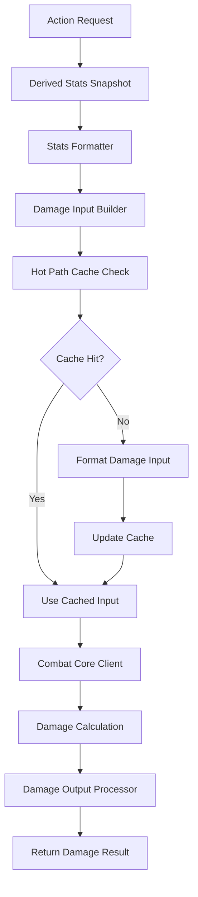

# Damage Calculation Bridge

## 📋 **Tổng Quan**

Damage Calculation Bridge là component quan trọng của Action Core, chịu trách nhiệm kết nối derived stats từ Element Core với damage calculation trong Combat Core. Bridge này đảm bảo rằng tất cả derived stats được format và truyền đúng cách cho damage calculation, với support cho dynamic elements và multi-element actions.

## 🎯 **Vấn Đề Cần Giải Quyết**

### **1. Stats Formatting**
- Element Core cung cấp **raw derived stats** (dynamic elements)
- Combat Core cần **formatted damage input** (flexible structure)
- Cần **transformation layer** giữa hai systems
- Support cho **multi-element actions** (hybrid skills)

### **2. Performance Optimization**
- **Hot Path**: Damage calculation là critical path
- **Batch Processing**: Process multiple damage calculations
- **Caching**: Cache formatted damage inputs
- **Memory Efficiency**: Minimize data copying
- **Dynamic Element Support**: Efficient handling of variable elements

### **3. Integration Complexity**
- **Element Core**: Source of truth cho stats (dynamic elements)
- **Combat Core**: Consumer của formatted stats (flexible structure)
- **Action Core**: Orchestrator và transformer
- **Multi-Element Actions**: Weighted average mastery calculations

## 🏗️ **Architecture**

### **Core Components**

```rust
pub struct DamageCalculationBridge {
    // Core components
    stats_formatter: StatsFormatter,
    damage_input_builder: DamageInputBuilder,
    damage_output_processor: DamageOutputProcessor,
    combat_core_client: CombatCoreClient,
    element_core_client: ElementCoreClient,
    
    // Multi-element support
    multi_element_calculator: MultiElementCalculator,
    element_registry: ElementRegistry,
    
    // Performance optimization
    hot_path_cache: HotPathCache,
    batch_processor: BatchProcessor,
    memory_pool: MemoryPool,
    
    // Configuration
    config: BridgeConfig,
}

/// Element registry for dynamic element support
pub struct ElementRegistry {
    available_elements: HashMap<String, ElementDefinition>,
    element_interactions: HashMap<String, ElementInteraction>,
    element_weights: HashMap<String, f64>,
}

/// Element definition for dynamic elements
pub struct ElementDefinition {
    pub element_name: String,
    pub element_category: ElementCategory,
    pub base_damage: f64,
    pub base_defense: f64,
    pub interaction_rules: Vec<InteractionRule>,
}

pub enum ElementCategory {
    FiveElements,    // Fire, Water, Earth, Metal, Wood
    Advanced,        // Lightning, Ice, Wind
    Divine,          // Light, Dark
    Primordial,      // Life, Death
    Transcendent,    // Time, Space
    Hybrid,          // Combined elements
}
```

### **Damage Calculation Flow**



## 🔧 **Core Components**

### **1. Stats Formatter**

```rust
pub struct StatsFormatter {
    formatting_rules: HashMap<String, FormattingRule>,
    stat_mappings: HashMap<String, String>,
    validation_rules: Vec<ValidationRule>,
    element_registry: ElementRegistry,
}

impl StatsFormatter {
    pub fn format_damage_stats(
        &self,
        derived_stats: &DerivedStatsSnapshot,
        action_type: &str
    ) -> Result<FormattedStats, BridgeError> {
        let mut formatted = FormattedStats::new();
        
        // Format base damage stats
        self.format_base_damage_stats(derived_stats, &mut formatted)?;
        
        // Format dynamic element damage stats
        self.format_dynamic_element_damage_stats(derived_stats, &mut formatted)?;
        
        // Format advanced combat stats
        self.format_advanced_combat_stats(derived_stats, &mut formatted)?;
        
        // Format action-specific stats
        self.format_action_specific_stats(derived_stats, action_type, &mut formatted)?;
        
        // Format multi-element action stats
        self.format_multi_element_action_stats(derived_stats, action_type, &mut formatted)?;
        
        // Validate formatted stats
        self.validate_formatted_stats(&formatted)?;
        
        Ok(formatted)
    }
    
    fn format_base_damage_stats(
        &self,
        derived_stats: &DerivedStatsSnapshot,
        formatted: &mut FormattedStats
    ) -> Result<(), BridgeError> {
        // Base damage
        formatted.base_damage = derived_stats.get_stat("base_damage").unwrap_or(0.0);
        
        // Damage multiplier
        formatted.damage_multiplier = derived_stats.get_stat("damage_multiplier").unwrap_or(1.0);
        
        // Critical hit stats
        formatted.critical_chance = derived_stats.get_stat("critical_chance").unwrap_or(0.0);
        formatted.critical_damage = derived_stats.get_stat("critical_damage").unwrap_or(2.0);
        
        // Accuracy and dodge
        formatted.accuracy = derived_stats.get_stat("accuracy").unwrap_or(0.0);
        formatted.dodge_rate = derived_stats.get_stat("dodge_rate").unwrap_or(0.0);
        
        Ok(())
    }
    
    fn format_dynamic_element_damage_stats(
        &self,
        derived_stats: &DerivedStatsSnapshot,
        formatted: &mut FormattedStats
    ) -> Result<(), BridgeError> {
        // Get all available elements from registry
        for (element_name, _) in &self.element_registry.available_elements {
            let damage_key = format!("{}_damage", element_name);
            let damage_value = derived_stats.get_stat(&damage_key).unwrap_or(0.0);
            formatted.element_damage.insert(element_name.clone(), damage_value);
        }
        
        // Format element mastery stats
        for (element_name, _) in &self.element_registry.available_elements {
            let mastery_key = format!("{}_mastery", element_name);
            let mastery_value = derived_stats.get_stat(&mastery_key).unwrap_or(0.0);
            formatted.element_mastery.insert(element_name.clone(), mastery_value);
        }
        
        // Format element interaction bonuses
        for (interaction_type, _) in &self.element_registry.element_interactions {
            let interaction_key = format!("element_interaction_{}", interaction_type);
            let interaction_value = derived_stats.get_stat(&interaction_key).unwrap_or(0.0);
            formatted.element_interactions.insert(interaction_type.clone(), interaction_value);
        }
        
        Ok(())
    }
    
    fn format_multi_element_action_stats(
        &self,
        derived_stats: &DerivedStatsSnapshot,
        action_type: &str,
        formatted: &mut FormattedStats
    ) -> Result<(), BridgeError> {
        // Check if this is a multi-element action
        if let Some(multi_element_action) = self.get_multi_element_action(action_type) {
            // Calculate weighted average mastery
            let average_mastery = self.calculate_weighted_average_mastery(
                multi_element_action,
                derived_stats
            )?;
            
            // Calculate synergy bonus
            let synergy_bonus = self.calculate_synergy_bonus(
                multi_element_action,
                derived_stats
            )?;
            
            // Set multi-element stats
            formatted.multi_element_average_mastery = average_mastery;
            formatted.multi_element_synergy_bonus = synergy_bonus;
            formatted.multi_element_effects = multi_element_action.element_effects.clone();
        }
        
        Ok(())
    }
}
```

### **2. Damage Input Builder**

```rust
pub struct DamageInputBuilder {
    input_templates: HashMap<String, DamageInputTemplate>,
    validation_rules: Vec<ValidationRule>,
    performance_monitor: PerformanceMonitor,
}

impl DamageInputBuilder {
    pub fn build_damage_input(
        &self,
        formatted_stats: &FormattedStats,
        action_context: &ActionContext
    ) -> Result<DamageInput, BridgeError> {
        let start_time = Instant::now();
        
        // Get input template for action type
        let template = self.input_templates.get(&action_context.action_type)
            .ok_or_else(|| BridgeError::UnknownActionType(action_context.action_type.clone()))?;
        
        // Build damage input
        let mut damage_input = DamageInput::new();
        
        // Set base damage
        damage_input.base_damage = formatted_stats.base_damage;
        damage_input.damage_multiplier = formatted_stats.damage_multiplier;
        
        // Set dynamic element damage
        damage_input.element_damage = self.build_dynamic_element_damage(formatted_stats)?;
        damage_input.element_mastery = self.build_element_mastery(formatted_stats)?;
        damage_input.element_interactions = self.build_element_interactions(formatted_stats)?;
        
        // Set multi-element action stats
        damage_input.multi_element_average_mastery = formatted_stats.multi_element_average_mastery;
        damage_input.multi_element_synergy_bonus = formatted_stats.multi_element_synergy_bonus;
        damage_input.multi_element_effects = formatted_stats.multi_element_effects.clone();
        damage_input.is_multi_element = !formatted_stats.multi_element_effects.is_empty();
        
        // Set critical hit stats
        damage_input.critical_chance = formatted_stats.critical_chance;
        damage_input.critical_damage = formatted_stats.critical_damage;
        
        // Set accuracy and defense stats
        damage_input.accuracy = formatted_stats.accuracy;
        damage_input.dodge_rate = formatted_stats.dodge_rate;
        damage_input.parry_rate = formatted_stats.parry_rate;
        damage_input.block_rate = formatted_stats.block_rate;
        
        // Set advanced combat stats
        damage_input.penetration = formatted_stats.penetration;
        damage_input.absorption = formatted_stats.absorption;
        damage_input.reflection = formatted_stats.reflection;
        
        // Set mastery bonus
        damage_input.mastery_bonus = self.calculate_mastery_bonus(formatted_stats, action_context)?;
        
        // Validate damage input
        self.validate_damage_input(&damage_input)?;
        
        // Record performance metrics
        let duration = start_time.elapsed();
        self.performance_monitor.record_input_building(duration);
        
        Ok(damage_input)
    }
    
    fn build_dynamic_element_damage(&self, formatted_stats: &FormattedStats) -> Result<HashMap<String, f64>, BridgeError> {
        // Build dynamic element damage from formatted stats
        let mut element_damage = HashMap::new();
        
        for (element_name, damage_bonus) in &formatted_stats.element_damage {
            element_damage.insert(element_name.clone(), *damage_bonus);
        }
        
        Ok(element_damage)
    }
    
    fn build_element_mastery(&self, formatted_stats: &FormattedStats) -> Result<HashMap<String, f64>, BridgeError> {
        // Build element mastery from formatted stats
        let mut element_mastery = HashMap::new();
        
        for (element_name, mastery_level) in &formatted_stats.element_mastery {
            element_mastery.insert(element_name.clone(), *mastery_level);
        }
        
        Ok(element_mastery)
    }
    
    fn build_element_interactions(&self, formatted_stats: &FormattedStats) -> Result<HashMap<String, f64>, BridgeError> {
        // Build element interactions from formatted stats
        let mut element_interactions = HashMap::new();
        
        for (interaction_type, bonus) in &formatted_stats.element_interactions {
            element_interactions.insert(interaction_type.clone(), *bonus);
        }
        
        Ok(element_interactions)
    }
    
    fn calculate_mastery_bonus(
        &self,
        formatted_stats: &FormattedStats,
        action_context: &ActionContext
    ) -> Result<f64, BridgeError> {
        // Calculate mastery bonus based on element mastery difference
        let attacker_mastery = self.get_attacker_mastery(formatted_stats, action_context)?;
        let target_mastery = self.get_target_mastery(action_context)?;
        
        let mastery_difference = attacker_mastery - target_mastery;
        let mastery_bonus = mastery_difference * 0.01; // 1% per mastery point difference
        
        Ok(mastery_bonus)
    }
}
```

### **3. Damage Output Processor**

```rust
pub struct DamageOutputProcessor {
    output_handlers: HashMap<String, Box<dyn OutputHandler>>,
    status_effect_processor: StatusEffectProcessor,
    event_system: EventSystem,
}

impl DamageOutputProcessor {
    pub fn process_damage_output(
        &self,
        damage_result: &DamageResult,
        action_context: &ActionContext
    ) -> Result<ProcessedDamageResult, BridgeError> {
        let mut processed = ProcessedDamageResult::new();
        
        // Process base damage
        processed.total_damage = damage_result.total_damage;
        processed.critical_hit = damage_result.critical_hit;
        processed.critical_damage = damage_result.critical_damage;
        
        // Process element damage
        processed.element_damage = self.process_element_damage(&damage_result.element_damage)?;
        
        // Process status effects
        if let Some(status_effects) = &damage_result.status_effects {
            processed.status_effects = self.status_effect_processor.process_status_effects(
                status_effects,
                action_context
            )?;
        }
        
        // Process resource damage
        if let Some(resource_damage) = &damage_result.resource_damage {
            processed.resource_damage = self.process_resource_damage(resource_damage)?;
        }
        
        // Trigger events
        self.event_system.trigger_damage_event(&processed, action_context)?;
        
        Ok(processed)
    }
    
    fn process_element_damage(&self, element_damage: &ElementDamage) -> Result<ProcessedElementDamage, BridgeError> {
        Ok(ProcessedElementDamage {
            fire: element_damage.fire,
            ice: element_damage.ice,
            lightning: element_damage.lightning,
            earth: element_damage.earth,
            water: element_damage.water,
            wind: element_damage.wind,
            metal: element_damage.metal,
            wood: element_damage.wood,
            light: element_damage.light,
            dark: element_damage.dark,
            life: element_damage.life,
            death: element_damage.death,
        })
    }
}
```

## 📊 **Data Structures**

### **1. Formatted Stats**

```rust
pub struct FormattedStats {
    // Base damage stats
    pub base_damage: f64,
    pub damage_multiplier: f64,
    pub critical_chance: f64,
    pub critical_damage: f64,
    pub accuracy: f64,
    pub dodge_rate: f64,
    pub parry_rate: f64,
    pub block_rate: f64,
    
    // Dynamic element damage stats (from Element Core)
    pub element_damage: HashMap<String, f64>, // element_name -> damage_bonus
    pub element_mastery: HashMap<String, f64>, // element_name -> mastery_level
    pub element_interactions: HashMap<String, f64>, // interaction_type -> bonus
    
    // Multi-element action stats
    pub multi_element_average_mastery: f64,
    pub multi_element_synergy_bonus: f64,
    pub multi_element_effects: Vec<ElementEffect>,
    
    // Advanced combat stats
    pub penetration: f64,
    pub absorption: f64,
    pub reflection: f64,
    
    // Status effects
    pub status_probability: f64,
    pub status_resistance: f64,
    pub status_duration: f64,
    pub status_duration_reduction: f64,
    pub status_intensity: f64,
    pub status_intensity_reduction: f64,
}
```

### **2. Damage Input**

```rust
pub struct DamageInput {
    // Base damage
    pub base_damage: f64,
    pub damage_multiplier: f64,
    
    // Dynamic element damage (from Element Core)
    pub element_damage: HashMap<String, f64>, // element_name -> damage_bonus
    pub element_mastery: HashMap<String, f64>, // element_name -> mastery_level
    pub element_interactions: HashMap<String, f64>, // interaction_type -> bonus
    
    // Multi-element action context
    pub multi_element_average_mastery: f64,
    pub multi_element_synergy_bonus: f64,
    pub multi_element_effects: Vec<ElementEffect>,
    
    // Critical hit stats
    pub critical_chance: f64,
    pub critical_damage: f64,
    
    // Accuracy and defense
    pub accuracy: f64,
    pub dodge_rate: f64,
    pub parry_rate: f64,
    pub block_rate: f64,
    
    // Advanced combat stats
    pub penetration: f64,
    pub absorption: f64,
    pub reflection: f64,
    
    // Status effects
    pub status_probability: f64,
    pub status_resistance: f64,
    pub status_duration: f64,
    pub status_duration_reduction: f64,
    pub status_intensity: f64,
    pub status_intensity_reduction: f64,
    
    // Action context
    pub action_type: String,
    pub action_power: f64,
    pub is_multi_element: bool,
}
```

### **3. Damage Result**

```rust
pub struct DamageResult {
    // Base damage result
    pub total_damage: f64,
    pub critical_hit: bool,
    pub critical_damage: f64,
    
    // Element damage result
    pub element_damage: ElementDamage,
    
    // Status effects
    pub status_effects: Option<Vec<StatusEffect>>,
    
    // Resource damage
    pub resource_damage: Option<ResourceDamage>,
    
    // Additional effects
    pub additional_effects: Vec<AdditionalEffect>,
}
```

## 🚀 **Performance Optimization**

### **1. Hot Path Cache**

```rust
pub struct HotPathCache {
    // Pre-calculated damage inputs
    damage_inputs: HashMap<(ActorId, String), DamageInput>,
    
    // Cache invalidation
    invalidation_triggers: HashMap<String, Vec<ActorId>>,
    last_update: HashMap<ActorId, Instant>,
}

impl HotPathCache {
    pub fn get_damage_input(&self, actor_id: &ActorId, action_type: &str) -> Option<&DamageInput> {
        self.damage_inputs.get(&(actor_id.clone(), action_type.to_string()))
    }
    
    pub fn update_damage_input(&mut self, actor_id: ActorId, action_type: String, input: DamageInput) {
        self.damage_inputs.insert((actor_id.clone(), action_type), input);
        self.last_update.insert(actor_id, Instant::now());
    }
}
```

### **2. Batch Processing**

```rust
pub struct BatchProcessor {
    batch_size: usize,
    processing_threads: usize,
    thread_pool: ThreadPool,
}

impl BatchProcessor {
    pub async fn process_damage_batch(
        &self,
        damage_requests: Vec<DamageRequest>
    ) -> Result<Vec<DamageResult>, BridgeError> {
        let chunks = damage_requests.chunks(self.batch_size);
        let mut handles = Vec::new();
        
        for chunk in chunks {
            let chunk = chunk.to_vec();
            let handle = self.thread_pool.spawn(async move {
                self.process_chunk(chunk).await
            });
            handles.push(handle);
        }
        
        let mut results = Vec::new();
        for handle in handles {
            let chunk_results = handle.await??;
            results.extend(chunk_results);
        }
        
        Ok(results)
    }
}
```

## 📈 **Performance Metrics**

### **Target Metrics**
- **Stats Formatting**: < 0.01ms per formatting
- **Damage Input Building**: < 0.05ms per input
- **Damage Output Processing**: < 0.02ms per output
- **Cache Hit Rate**: > 95%
- **Throughput**: > 10,000 damage calculations/second

### **Monitoring**

```rust
pub struct PerformanceMonitor {
    metrics: HashMap<String, MetricCollector>,
    alerts: Vec<PerformanceAlert>,
}

impl PerformanceMonitor {
    pub fn record_damage_calculation(&mut self, duration: Duration) {
        if duration > Duration::from_millis(1) {
            self.alerts.push(PerformanceAlert::SlowDamageCalculation {
                duration,
            });
        }
    }
}
```

## 🧪 **Testing Strategy**

### **Unit Tests**
```rust
#[cfg(test)]
mod tests {
    use super::*;
    
    #[tokio::test]
    async fn test_stats_formatting() {
        let formatter = StatsFormatter::new();
        let derived_stats = create_test_derived_stats();
        
        let formatted = formatter.format_damage_stats(&derived_stats, "attack").unwrap();
        assert!(formatted.base_damage > 0.0);
        assert!(formatted.critical_chance >= 0.0);
    }
    
    #[tokio::test]
    async fn test_damage_input_building() {
        let builder = DamageInputBuilder::new();
        let formatted_stats = create_test_formatted_stats();
        let action_context = create_test_action_context();
        
        let input = builder.build_damage_input(&formatted_stats, &action_context).unwrap();
        assert!(input.base_damage > 0.0);
        assert!(input.mastery_bonus >= 0.0);
    }
}
```

### **Integration Tests**
```rust
#[tokio::test]
async fn test_damage_calculation_bridge() {
    let bridge = DamageCalculationBridge::new();
    let action_context = create_test_action_context();
    
    let result = bridge.calculate_damage(&action_context).await.unwrap();
    assert!(result.total_damage > 0.0);
}
```

## 🔗 **Integration Points**

### **Element Core Integration**
- **Stats Provider**: Access derived stats
- **Stats Formatter**: Format stats cho damage calculation
- **Stats Validator**: Validate stat consistency

### **Combat Core Integration**
- **Damage Input**: Provide formatted damage input
- **Damage Output**: Process damage results
- **Status Effects**: Handle status effect application

### **Action Core Integration**
- **Action Execution**: Provide damage calculation cho actions
- **Performance Monitoring**: Monitor bridge performance
- **Cache Management**: Manage damage input caching

## 🔥 **Multi-Element Action Integration**

### **1. Multi-Element Action Support**

```rust
impl DamageCalculationBridge {
    /// Calculate damage for multi-element actions
    pub async fn calculate_multi_element_damage(
        &self,
        action: &MultiElementAction,
        attacker: &Actor,
        target: &Actor
    ) -> Result<DamageResult, BridgeError> {
        // Get derived stats for attacker
        let attacker_stats = self.element_core_client.get_derived_stats(attacker.id).await?;
        
        // Calculate weighted average mastery
        let average_mastery = self.multi_element_calculator.calculate_weighted_average_mastery(
            action, 
            attacker
        ).await?;
        
        // Calculate synergy bonus
        let synergy_bonus = self.multi_element_calculator.calculate_synergy_bonus(
            action, 
            attacker
        ).await?;
        
        // Format stats with multi-element context
        let mut formatted_stats = self.stats_formatter.format_damage_stats(
            &attacker_stats,
            &action.action_id
        )?;
        
        // Set multi-element stats
        formatted_stats.multi_element_average_mastery = average_mastery;
        formatted_stats.multi_element_synergy_bonus = synergy_bonus;
        formatted_stats.multi_element_effects = action.element_effects.clone();
        
        // Build damage input
        let damage_input = self.damage_input_builder.build_damage_input(
            &formatted_stats,
            &ActionContext::new(attacker.id, target.id, &action.action_id)
        )?;
        
        // Calculate damage
        let damage_result = self.combat_core_client.calculate_damage(damage_input).await?;
        
        // Process damage output
        let processed_result = self.damage_output_processor.process_damage_output(
            &damage_result,
            &formatted_stats
        )?;
        
        Ok(processed_result)
    }
    
    /// Get multi-element action by action type
    fn get_multi_element_action(&self, action_type: &str) -> Option<&MultiElementAction> {
        // This would be implemented based on action registry
        // For now, return None as placeholder
        None
    }
    
    /// Calculate weighted average mastery for multi-element action
    fn calculate_weighted_average_mastery(
        &self,
        action: &MultiElementAction,
        derived_stats: &DerivedStatsSnapshot
    ) -> Result<f64, BridgeError> {
        let mut total_mastery = 0.0;
        let mut total_weight = 0.0;
        
        for effect in &action.element_effects {
            let mastery_key = format!("{}_mastery", effect.element_name);
            let mastery = derived_stats.get_stat(&mastery_key).unwrap_or(0.0);
            
            total_mastery += mastery * effect.mastery_weight;
            total_weight += effect.mastery_weight;
        }
        
        if total_weight > 0.0 {
            Ok(total_mastery / total_weight)
        } else {
            Ok(0.0)
        }
    }
    
    /// Calculate synergy bonus for multi-element action
    fn calculate_synergy_bonus(
        &self,
        action: &MultiElementAction,
        derived_stats: &DerivedStatsSnapshot
    ) -> Result<f64, BridgeError> {
        if action.element_effects.len() < 2 {
            return Ok(1.0);
        }
        
        let mut masteries = Vec::new();
        for effect in &action.element_effects {
            let mastery_key = format!("{}_mastery", effect.element_name);
            let mastery = derived_stats.get_stat(&mastery_key).unwrap_or(0.0);
            masteries.push(mastery);
        }
        
        // Calculate synergy based on mastery balance
        let max_mastery = masteries.iter().fold(0.0, |a, &b| a.max(b));
        let min_mastery = masteries.iter().fold(f64::INFINITY, |a, &b| a.min(b));
        let mastery_difference = max_mastery - min_mastery;
        
        if mastery_difference <= 50.0 { // synergy threshold
            let synergy_bonus = 1.0 + (50.0 - mastery_difference) * 0.01;
            Ok(synergy_bonus)
        } else {
            Ok(1.0)
        }
    }
}
```

### **2. Element Registry Integration**

```rust
impl DamageCalculationBridge {
    /// Initialize element registry from Element Core
    pub async fn initialize_element_registry(&mut self) -> Result<(), BridgeError> {
        // Get available elements from Element Core
        let available_elements = self.element_core_client.get_available_elements().await?;
        
        // Get element interactions
        let element_interactions = self.element_core_client.get_element_interactions().await?;
        
        // Get element weights
        let element_weights = self.element_core_client.get_element_weights().await?;
        
        // Build element registry
        self.element_registry = ElementRegistry {
            available_elements,
            element_interactions,
            element_weights,
        };
        
        Ok(())
    }
    
    /// Get element definition by name
    pub fn get_element_definition(&self, element_name: &str) -> Option<&ElementDefinition> {
        self.element_registry.available_elements.get(element_name)
    }
    
    /// Get element interaction by type
    pub fn get_element_interaction(&self, interaction_type: &str) -> Option<&ElementInteraction> {
        self.element_registry.element_interactions.get(interaction_type)
    }
    
    /// Get element weight by name
    pub fn get_element_weight(&self, element_name: &str) -> f64 {
        self.element_registry.element_weights.get(element_name).copied().unwrap_or(1.0)
    }
}
```

### **3. Configuration Example**

```yaml
# damage_calculation_bridge.yaml
damage_calculation_bridge:
  # Element registry configuration
  element_registry:
    enabled: true
    cache_elements: true
    cache_interactions: true
    cache_weights: true
    
  # Multi-element action configuration
  multi_element_actions:
    enabled: true
    synergy_threshold: 50.0
    synergy_bonus_rate: 0.01
    mastery_bonus_rate: 0.01
    efficiency_bonus_rate: 0.005
    
  # Performance configuration
  performance:
    hot_path_cache_size: 1000
    batch_processing_size: 100
    memory_pool_size: 5000
    
  # Element categories
  element_categories:
    five_elements: ["fire", "water", "earth", "metal", "wood"]
    advanced: ["lightning", "ice", "wind"]
    divine: ["light", "dark"]
    primordial: ["life", "death"]
    transcendent: ["time", "space"]
    hybrid: ["ice_fire", "lightning_wind", "light_dark"]
```

---

**Last Updated**: 2025-01-27  
**Version**: 2.0 - Updated with Element Core Integration and Multi-Element Action Support  
**Status**: Design Phase  
**Maintainer**: Chaos World Team
