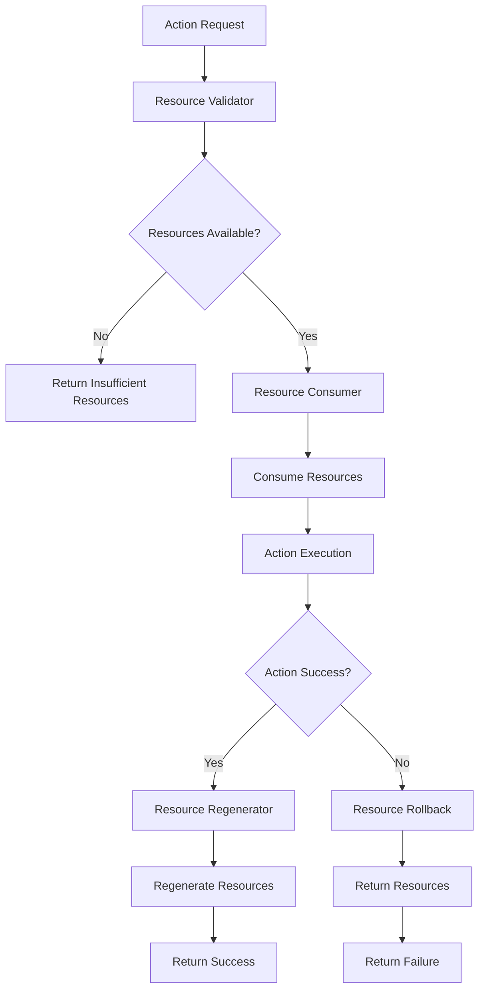

# Resource Management Bridge

## 📋 **Tổng Quan**

Resource Management Bridge là component quan trọng của Action Core, chịu trách nhiệm tích hợp với Resource Manager để quản lý tài nguyên (HP, Mana, Stamina, Qi) cho actions. Bridge này đảm bảo rằng actions có thể consume và regenerate resources một cách hiệu quả và an toàn.

## 🎯 **Vấn Đề Cần Giải Quyết**

### **1. Resource Consumption**
- Actions tiêu tốn **multiple resources** (HP, Mana, Stamina, Qi)
- Cần **validation** cho resource availability
- Cần **atomic consumption** để tránh race conditions
- Cần **rollback mechanism** khi action fails

### **2. Resource Regeneration**
- Actions có thể **regenerate resources** sau khi thực hiện
- Cần **conditional regeneration** dựa trên action success
- Cần **scaling regeneration** dựa trên derived stats
- Cần **resource efficiency** calculations

### **3. Resource Manager Integration**
- Cần **bridge với Resource Manager** để quản lý tài nguyên
- Cần **event system** để notify resource changes
- Cần **caching** để optimize resource access
- Cần **batch processing** cho multiple actions

## 🏗️ **Architecture**

### **Core Components**

```rust
pub struct ResourceManagementBridge {
    // Core components
    resource_validator: ResourceValidator,
    resource_consumer: ResourceConsumer,
    resource_regenerator: ResourceRegenerator,
    resource_manager_client: ResourceManagerClient,
    
    // Performance optimization
    resource_cache: ResourceCache,
    batch_processor: BatchProcessor,
    memory_pool: MemoryPool,
    
    // Configuration
    config: ResourceBridgeConfig,
}
```

### **Resource Management Flow**



## 🔧 **Core Components**

### **1. Resource Validator**

```rust
pub struct ResourceValidator {
    resource_manager_client: ResourceManagerClient,
    validation_rules: HashMap<ResourceType, ValidationRule>,
    cache: ResourceCache,
}

impl ResourceValidator {
    pub async fn validate_requirements(
        &mut self,
        requirements: &[ResourceRequirement],
        actor: &Actor
    ) -> Result<ValidationResult, ResourceError> {
        let mut validation_result = ValidationResult::new();
        
        for requirement in requirements {
            // Get current resource value
            let current_value = self.get_current_resource_value(actor, &requirement.resource_type).await?;
            
            // Calculate required value
            let required_value = self.calculate_required_value(requirement, actor).await?;
            
            // Validate resource availability
            if current_value < required_value {
                validation_result.add_error(ResourceError::InsufficientResource {
                    resource_type: requirement.resource_type.clone(),
                    required: required_value,
                    available: current_value,
                });
            } else {
                validation_result.add_success(requirement.resource_type.clone(), required_value);
            }
        }
        
        Ok(validation_result)
    }
    
    async fn get_current_resource_value(
        &self,
        actor: &Actor,
        resource_type: &ResourceType
    ) -> Result<f64, ResourceError> {
        // Check cache first
        if let Some(cached_value) = self.cache.get(actor.id, resource_type) {
            if cached_value.is_valid() {
                return Ok(cached_value.value);
            }
        }
        
        // Get from Resource Manager
        let value = self.resource_manager_client.get_resource_value(actor, resource_type).await?;
        
        // Update cache
        self.cache.insert(actor.id, resource_type.clone(), value);
        
        Ok(value)
    }
    
    async fn calculate_required_value(
        &self,
        requirement: &ResourceRequirement,
        actor: &Actor
    ) -> Result<f64, ResourceError> {
        let base_value = requirement.base_value;
        
        // Apply scaling
        let scaling_value = if let Some(scaling_stat) = &requirement.scaling_stat {
            let stat_value = self.get_stat_value(actor, scaling_stat).await?;
            stat_value * requirement.scaling_factor
        } else {
            0.0
        };
        
        // Apply conditional modifiers
        let mut final_value = base_value + scaling_value;
        for modifier in &requirement.conditional_modifiers {
            if self.evaluate_condition(&modifier.condition, actor).await? {
                final_value = self.apply_modifier(final_value, modifier)?;
            }
        }
        
        Ok(final_value)
    }
}
```

### **2. Resource Consumer**

```rust
pub struct ResourceConsumer {
    resource_manager_client: ResourceManagerClient,
    consumption_log: ConsumptionLog,
    rollback_manager: RollbackManager,
}

impl ResourceConsumer {
    pub async fn consume_resources(
        &mut self,
        requirements: &[ResourceRequirement],
        actor: &mut Actor,
        action_id: &str
    ) -> Result<ConsumptionResult, ResourceError> {
        let mut consumption_result = ConsumptionResult::new();
        let mut rollback_data = RollbackData::new();
        
        // Start transaction
        let transaction_id = self.resource_manager_client.start_transaction().await?;
        
        for requirement in requirements {
            // Calculate consumption value
            let consumption_value = self.calculate_consumption_value(requirement, actor).await?;
            
            // Consume resource
            let before_value = self.resource_manager_client.get_resource_value(actor, &requirement.resource_type).await?;
            let after_value = self.resource_manager_client.consume_resource(
                actor,
                &requirement.resource_type,
                consumption_value
            ).await?;
            
            // Log consumption
            consumption_result.add_consumption(ConsumptionEntry {
                resource_type: requirement.resource_type.clone(),
                consumed: consumption_value,
                before_value,
                after_value,
            });
            
            // Add to rollback data
            rollback_data.add_rollback(requirement.resource_type.clone(), consumption_value);
        }
        
        // Commit transaction
        self.resource_manager_client.commit_transaction(transaction_id).await?;
        
        // Log consumption
        self.consumption_log.log_consumption(action_id, &consumption_result);
        
        Ok(consumption_result)
    }
    
    pub async fn rollback_consumption(
        &mut self,
        rollback_data: &RollbackData,
        actor: &mut Actor
    ) -> Result<(), ResourceError> {
        // Start transaction
        let transaction_id = self.resource_manager_client.start_transaction().await?;
        
        for (resource_type, amount) in &rollback_data.rollbacks {
            // Restore resource
            self.resource_manager_client.restore_resource(actor, resource_type, *amount).await?;
        }
        
        // Commit transaction
        self.resource_manager_client.commit_transaction(transaction_id).await?;
        
        Ok(())
    }
}
```

### **3. Resource Regenerator**

```rust
pub struct ResourceRegenerator {
    resource_manager_client: ResourceManagerClient,
    regeneration_rules: HashMap<ResourceType, RegenerationRule>,
    efficiency_calculator: EfficiencyCalculator,
}

impl ResourceRegenerator {
    pub async fn regenerate_resources(
        &mut self,
        regeneration_config: &RegenerationConfig,
        actor: &mut Actor,
        action_result: &ActionResult
    ) -> Result<RegenerationResult, ResourceError> {
        let mut regeneration_result = RegenerationResult::new();
        
        // Only regenerate if action was successful
        if !action_result.success {
            return Ok(regeneration_result);
        }
        
        for (resource_type, regen_config) in &regeneration_config.regenerations {
            // Calculate regeneration value
            let regen_value = self.calculate_regeneration_value(regen_config, actor, action_result).await?;
            
            if regen_value > 0.0 {
                // Regenerate resource
                let before_value = self.resource_manager_client.get_resource_value(actor, resource_type).await?;
                let after_value = self.resource_manager_client.regenerate_resource(
                    actor,
                    resource_type,
                    regen_value
                ).await?;
                
                // Log regeneration
                regeneration_result.add_regeneration(RegenerationEntry {
                    resource_type: resource_type.clone(),
                    regenerated: regen_value,
                    before_value,
                    after_value,
                });
            }
        }
        
        Ok(regeneration_result)
    }
    
    async fn calculate_regeneration_value(
        &self,
        regen_config: &ResourceRegenerationConfig,
        actor: &Actor,
        action_result: &ActionResult
    ) -> Result<f64, ResourceError> {
        let base_value = regen_config.base_value;
        
        // Apply efficiency scaling
        let efficiency = self.efficiency_calculator.calculate_efficiency(actor, &regen_config.resource_type).await?;
        let efficiency_multiplier = 1.0 + efficiency;
        
        // Apply conditional modifiers
        let mut final_value = base_value * efficiency_multiplier;
        for modifier in &regen_config.conditional_modifiers {
            if self.evaluate_condition(&modifier.condition, actor, action_result).await? {
                final_value = self.apply_modifier(final_value, modifier)?;
            }
        }
        
        Ok(final_value)
    }
}
```

### **4. Resource Manager Client**

```rust
pub struct ResourceManagerClient {
    client: ResourceManagerServiceClient,
    cache: ResourceCache,
    batch_processor: BatchProcessor,
}

impl ResourceManagerClient {
    pub async fn get_resource_value(
        &self,
        actor: &Actor,
        resource_type: &ResourceType
    ) -> Result<f64, ResourceError> {
        // Check cache first
        if let Some(cached_value) = self.cache.get(actor.id, resource_type) {
            if cached_value.is_valid() {
                return Ok(cached_value.value);
            }
        }
        
        // Get from Resource Manager
        let value = self.client.get_resource_value(actor.id, resource_type).await?;
        
        // Update cache
        self.cache.insert(actor.id, resource_type.clone(), value);
        
        Ok(value)
    }
    
    pub async fn consume_resource(
        &self,
        actor: &mut Actor,
        resource_type: &ResourceType,
        amount: f64
    ) -> Result<f64, ResourceError> {
        // Consume resource
        let new_value = self.client.consume_resource(actor.id, resource_type, amount).await?;
        
        // Update cache
        self.cache.insert(actor.id, resource_type.clone(), new_value);
        
        // Trigger resource change event
        self.trigger_resource_change_event(actor, resource_type, new_value).await?;
        
        Ok(new_value)
    }
    
    pub async fn regenerate_resource(
        &self,
        actor: &mut Actor,
        resource_type: &ResourceType,
        amount: f64
    ) -> Result<f64, ResourceError> {
        // Regenerate resource
        let new_value = self.client.regenerate_resource(actor.id, resource_type, amount).await?;
        
        // Update cache
        self.cache.insert(actor.id, resource_type.clone(), new_value);
        
        // Trigger resource change event
        self.trigger_resource_change_event(actor, resource_type, new_value).await?;
        
        Ok(new_value)
    }
}
```

## 📊 **Data Structures**

### **1. Resource Requirements**

```rust
pub struct ResourceRequirement {
    pub resource_type: ResourceType,
    pub consumption_type: ConsumptionType,
    pub base_value: f64,
    pub scaling_factor: f64,
    pub scaling_stat: Option<String>,
    pub conditional_modifiers: Vec<ConditionalModifier>,
}

pub enum ConsumptionType {
    Fixed(f64),                    // Fixed amount
    Percentage(f64),               // Percentage of max resource
    Scaling(String, f64),          // Scales with stat
    Conditional(Vec<Condition>),   // Conditional consumption
}

pub struct ConditionalModifier {
    pub condition: String,         // "target.hp < 0.5"
    pub modifier: f64,             // 0.5 = 50% reduction
    pub modifier_type: ModifierType,
}

pub enum ModifierType {
    Multiply,      // Multiply base value
    Add,           // Add to base value
    Set,           // Set to specific value
}
```

### **2. Regeneration Configuration**

```rust
pub struct RegenerationConfig {
    pub regenerations: HashMap<ResourceType, ResourceRegenerationConfig>,
}

pub struct ResourceRegenerationConfig {
    pub resource_type: ResourceType,
    pub base_value: f64,
    pub scaling_factor: f64,
    pub scaling_stat: Option<String>,
    pub conditional_modifiers: Vec<ConditionalModifier>,
    pub efficiency_scaling: bool,
}
```

### **3. Consumption and Regeneration Results**

```rust
pub struct ConsumptionResult {
    pub consumptions: Vec<ConsumptionEntry>,
    pub total_consumed: HashMap<ResourceType, f64>,
    pub success: bool,
}

pub struct ConsumptionEntry {
    pub resource_type: ResourceType,
    pub consumed: f64,
    pub before_value: f64,
    pub after_value: f64,
}

pub struct RegenerationResult {
    pub regenerations: Vec<RegenerationEntry>,
    pub total_regenerated: HashMap<ResourceType, f64>,
    pub success: bool,
}

pub struct RegenerationEntry {
    pub resource_type: ResourceType,
    pub regenerated: f64,
    pub before_value: f64,
    pub after_value: f64,
}
```

## 🚀 **Performance Optimization**

### **1. Resource Cache**

```rust
pub struct ResourceCache {
    cache: HashMap<(ActorId, ResourceType), CachedResourceValue>,
    ttl: Duration,
    max_size: usize,
    eviction_policy: EvictionPolicy,
}

pub struct CachedResourceValue {
    pub value: f64,
    pub timestamp: Instant,
    pub ttl: Duration,
}

impl ResourceCache {
    pub fn get(&self, actor_id: ActorId, resource_type: &ResourceType) -> Option<&CachedResourceValue> {
        self.cache.get(&(actor_id, resource_type.clone())).and_then(|cached| {
            if cached.is_valid() {
                Some(cached)
            } else {
                None
            }
        })
    }
    
    pub fn insert(&mut self, actor_id: ActorId, resource_type: ResourceType, value: f64) {
        if self.cache.len() >= self.max_size {
            self.evict_oldest();
        }
        
        let cached = CachedResourceValue {
            value,
            timestamp: Instant::now(),
            ttl: self.ttl,
        };
        
        self.cache.insert((actor_id, resource_type), cached);
    }
}
```

### **2. Batch Processing**

```rust
pub struct BatchProcessor {
    batch_size: usize,
    processing_threads: usize,
    thread_pool: ThreadPool,
}

impl BatchProcessor {
    pub async fn process_resource_batch(
        &self,
        resource_requests: Vec<ResourceRequest>
    ) -> Result<Vec<ResourceResponse>, ResourceError> {
        let chunks = resource_requests.chunks(self.batch_size);
        let mut handles = Vec::new();
        
        for chunk in chunks {
            let chunk = chunk.to_vec();
            let handle = self.thread_pool.spawn(async move {
                self.process_chunk(chunk).await
            });
            handles.push(handle);
        }
        
        let mut results = Vec::new();
        for handle in handles {
            let chunk_results = handle.await??;
            results.extend(chunk_results);
        }
        
        Ok(results)
    }
}
```

## 🧪 **Testing Strategy**

### **Unit Tests**
```rust
#[cfg(test)]
mod tests {
    use super::*;
    
    #[tokio::test]
    async fn test_resource_validation() {
        let mut validator = ResourceValidator::new();
        let requirements = create_test_resource_requirements();
        let actor = create_test_actor();
        
        let result = validator.validate_requirements(&requirements, &actor).await.unwrap();
        assert!(result.is_valid());
    }
    
    #[tokio::test]
    async fn test_resource_consumption() {
        let mut consumer = ResourceConsumer::new();
        let requirements = create_test_resource_requirements();
        let mut actor = create_test_actor();
        
        let result = consumer.consume_resources(&requirements, &mut actor, "test_action").await.unwrap();
        assert!(result.success);
    }
    
    #[tokio::test]
    async fn test_resource_regeneration() {
        let mut regenerator = ResourceRegenerator::new();
        let config = create_test_regeneration_config();
        let mut actor = create_test_actor();
        let action_result = create_test_action_result();
        
        let result = regenerator.regenerate_resources(&config, &mut actor, &action_result).await.unwrap();
        assert!(result.success);
    }
}
```

## 🔗 **Integration Points**

### **Resource Manager Integration**
- **Resource Access**: Get/set resource values
- **Resource Consumption**: Consume resources atomically
- **Resource Regeneration**: Regenerate resources
- **Event System**: Trigger resource change events

### **Element Core Integration**
- **Derived Stats**: Access derived stats for scaling
- **Efficiency Calculations**: Calculate resource efficiency
- **Stat Scaling**: Apply stat scaling to resource operations

### **Action Core Integration**
- **Action Execution**: Provide resource management for actions
- **Action Validation**: Validate resource requirements
- **Action Results**: Handle resource changes from actions

---

**Last Updated**: 2025-01-27  
**Version**: 1.0  
**Status**: Design Phase  
**Maintainer**: Chaos World Team
