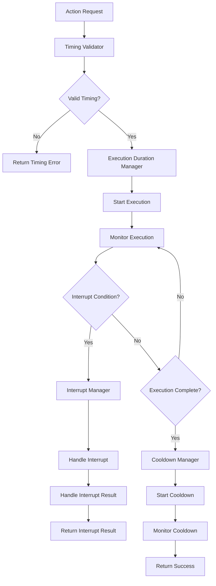

# Action Timing System

## 📋 **Tổng Quan**

Action Timing System là component quan trọng của Action Core, chịu trách nhiệm quản lý thời gian thực hiện (execution duration), cơ chế interrupt và cooldown cho actions. Hệ thống này đảm bảo rằng actions được thực hiện đúng thời gian và có thể bị interrupt theo điều kiện.

## 🎯 **Vấn Đề Cần Giải Quyết**

### **1. Execution Duration Management**
- Actions có **thời gian thực hiện** (execution duration)
- Cần **scaling** dựa trên derived stats (skill_execution_speed)
- Cần **validation** cho duration constraints
- Cần **real-time tracking** của execution progress

### **2. Interrupt Mechanism**
- Actions có thể **bị interrupt** theo điều kiện
- Cần **interrupt types** (hard, soft, conditional)
- Cần **interrupt conditions** (target health, status, environment)
- Cần **interrupt handling** (rollback, cleanup)

### **3. Cooldown Management**
- Actions có **thời gian phục hồi** (cooldown duration)
- Cần **cooldown conditions** (interrupt có tính là chờ phục hồi không)
- Cần **cooldown scaling** dựa trên derived stats (skill_cooldown_reduction)
- Cần **cooldown bypass** conditions

## 🏗️ **Architecture**

### **Core Components**

```rust
pub struct ActionTimingSystem {
    // Core components
    execution_duration_manager: ExecutionDurationManager,
    interrupt_manager: InterruptManager,
    cooldown_manager: CooldownManager,
    timing_validator: TimingValidator,
    
    // Performance optimization
    timing_cache: TimingCache,
    batch_processor: BatchProcessor,
    memory_pool: MemoryPool,
    
    // Configuration
    config: TimingSystemConfig,
}
```

### **Action Timing Flow**



## 🔧 **Core Components**

### **1. Execution Duration Manager**

```rust
pub struct ExecutionDurationManager {
    active_executions: HashMap<ActionId, ActiveExecution>,
    duration_calculator: DurationCalculator,
    scaling_calculator: ScalingCalculator,
    progress_tracker: ProgressTracker,
}

impl ExecutionDurationManager {
    pub async fn start_execution(
        &mut self,
        action_id: ActionId,
        action: &dyn Action,
        actor: &Actor,
        context: &ActionContext
    ) -> Result<ExecutionHandle, TimingError> {
        // Calculate execution duration
        let duration = self.calculate_execution_duration(action, actor, context).await?;
        
        // Create active execution
        let active_execution = ActiveExecution {
            action_id,
            start_time: Instant::now(),
            duration,
            progress: 0.0,
            status: ExecutionStatus::Running,
            interrupt_conditions: action.get_interrupt_conditions().to_vec(),
            context: context.clone(),
        };
        
        // Register execution
        self.active_executions.insert(action_id, active_execution);
        
        // Start progress tracking
        let handle = self.progress_tracker.start_tracking(action_id, duration).await?;
        
        Ok(handle)
    }
    
    pub async fn update_execution(
        &mut self,
        action_id: ActionId,
        delta_time: Duration
    ) -> Result<ExecutionUpdate, TimingError> {
        let execution = self.active_executions.get_mut(&action_id)
            .ok_or_else(|| TimingError::ExecutionNotFound(action_id))?;
        
        // Update progress
        execution.progress = (delta_time.as_millis() as f64 / execution.duration.as_millis() as f64).min(1.0);
        
        // Check if execution is complete
        if execution.progress >= 1.0 {
            execution.status = ExecutionStatus::Completed;
            return Ok(ExecutionUpdate::Completed);
        }
        
        // Check interrupt conditions
        if let Some(interrupt_condition) = self.check_interrupt_conditions(execution).await? {
            execution.status = ExecutionStatus::Interrupted(interrupt_condition);
            return Ok(ExecutionUpdate::Interrupted(interrupt_condition));
        }
        
        Ok(ExecutionUpdate::InProgress(execution.progress))
    }
    
    async fn calculate_execution_duration(
        &self,
        action: &dyn Action,
        actor: &Actor,
        context: &ActionContext
    ) -> Result<Duration, TimingError> {
        let duration_range = action.get_execution_duration();
        let base_duration = duration_range.base_duration;
        
        // Apply scaling based on derived stats
        let scaling_factor = self.scaling_calculator.calculate_execution_scaling(actor, context).await?;
        let scaled_duration = base_duration.mul_f64(scaling_factor);
        
        // Apply bounds
        let final_duration = scaled_duration
            .max(duration_range.min_duration)
            .min(duration_range.max_duration);
        
        Ok(final_duration)
    }
}
```

### **2. Interrupt Manager**

```rust
pub struct InterruptManager {
    interrupt_handlers: HashMap<InterruptType, Box<dyn InterruptHandler>>,
    condition_evaluator: ConditionEvaluator,
    interrupt_log: InterruptLog,
}

impl InterruptManager {
    pub async fn check_interrupt_conditions(
        &self,
        execution: &ActiveExecution
    ) -> Result<Option<InterruptCondition>, TimingError> {
        for condition in &execution.interrupt_conditions {
            if self.condition_evaluator.evaluate_condition(&condition.condition, &execution.context).await? {
                // Check interrupt chance
                if self.roll_interrupt_chance(condition.interrupt_chance) {
                    return Ok(Some(condition.clone()));
                }
            }
        }
        
        Ok(None)
    }
    
    pub async fn handle_interrupt(
        &mut self,
        action_id: ActionId,
        interrupt_condition: InterruptCondition,
        execution: &mut ActiveExecution
    ) -> Result<InterruptResult, TimingError> {
        let interrupt_type = interrupt_condition.interrupt_type;
        
        // Get interrupt handler
        let handler = self.interrupt_handlers.get(&interrupt_type)
            .ok_or_else(|| TimingError::UnknownInterruptType(interrupt_type))?;
        
        // Handle interrupt
        let result = handler.handle_interrupt(action_id, interrupt_condition, execution).await?;
        
        // Log interrupt
        self.interrupt_log.log_interrupt(action_id, interrupt_condition, &result);
        
        Ok(result)
    }
    
    fn roll_interrupt_chance(&self, chance: f64) -> bool {
        let mut rng = thread_rng();
        rng.gen::<f64>() < chance
    }
}

/// Interrupt handler trait
pub trait InterruptHandler: Send + Sync {
    async fn handle_interrupt(
        &self,
        action_id: ActionId,
        condition: InterruptCondition,
        execution: &mut ActiveExecution
    ) -> Result<InterruptResult, TimingError>;
}

/// Hard interrupt handler
pub struct HardInterruptHandler;

impl InterruptHandler for HardInterruptHandler {
    async fn handle_interrupt(
        &self,
        action_id: ActionId,
        condition: InterruptCondition,
        execution: &mut ActiveExecution
    ) -> Result<InterruptResult, TimingError> {
        // Immediate interrupt - stop execution
        execution.status = ExecutionStatus::Interrupted(condition);
        
        Ok(InterruptResult {
            interrupt_type: InterruptType::Hard,
            success: true,
            message: "Action interrupted immediately".to_string(),
            rollback_required: true,
        })
    }
}

/// Soft interrupt handler
pub struct SoftInterruptHandler;

impl InterruptHandler for SoftInterruptHandler {
    async fn handle_interrupt(
        &self,
        action_id: ActionId,
        condition: InterruptCondition,
        execution: &mut ActiveExecution
    ) -> Result<InterruptResult, TimingError> {
        // Graceful interrupt - allow cleanup
        execution.status = ExecutionStatus::Interrupted(condition);
        
        Ok(InterruptResult {
            interrupt_type: InterruptType::Soft,
            success: true,
            message: "Action interrupted gracefully".to_string(),
            rollback_required: false,
        })
    }
}
```

### **3. Cooldown Manager**

```rust
pub struct CooldownManager {
    active_cooldowns: HashMap<ActionId, ActiveCooldown>,
    cooldown_calculator: CooldownCalculator,
    condition_evaluator: ConditionEvaluator,
    cooldown_log: CooldownLog,
}

impl CooldownManager {
    pub async fn start_cooldown(
        &mut self,
        action_id: ActionId,
        action: &dyn Action,
        actor: &Actor,
        context: &ActionContext,
        interrupt_result: Option<InterruptResult>
    ) -> Result<CooldownHandle, TimingError> {
        let cooldown_config = action.get_cooldown_duration();
        
        // Check if interrupt affects cooldown
        let cooldown_duration = if cooldown_config.interrupt_affects_cooldown {
            if let Some(interrupt_result) = interrupt_result {
                self.calculate_interrupted_cooldown(cooldown_config, interrupt_result).await?
            } else {
                self.calculate_normal_cooldown(cooldown_config, actor, context).await?
            }
        } else {
            self.calculate_normal_cooldown(cooldown_config, actor, context).await?
        };
        
        // Create active cooldown
        let active_cooldown = ActiveCooldown {
            action_id,
            start_time: Instant::now(),
            duration: cooldown_duration,
            progress: 0.0,
            status: CooldownStatus::Active,
            conditions: cooldown_config.cooldown_conditions.clone(),
            context: context.clone(),
        };
        
        // Register cooldown
        self.active_cooldowns.insert(action_id, active_cooldown);
        
        // Start cooldown tracking
        let handle = self.start_cooldown_tracking(action_id, cooldown_duration).await?;
        
        Ok(handle)
    }
    
    pub async fn update_cooldown(
        &mut self,
        action_id: ActionId,
        delta_time: Duration
    ) -> Result<CooldownUpdate, TimingError> {
        let cooldown = self.active_cooldowns.get_mut(&action_id)
            .ok_or_else(|| TimingError::CooldownNotFound(action_id))?;
        
        // Update progress
        cooldown.progress = (delta_time.as_millis() as f64 / cooldown.duration.as_millis() as f64).min(1.0);
        
        // Check if cooldown is complete
        if cooldown.progress >= 1.0 {
            cooldown.status = CooldownStatus::Completed;
            return Ok(CooldownUpdate::Completed);
        }
        
        // Check cooldown bypass conditions
        if let Some(bypass_condition) = self.check_bypass_conditions(cooldown).await? {
            cooldown.status = CooldownStatus::Bypassed(bypass_condition);
            return Ok(CooldownUpdate::Bypassed(bypass_condition));
        }
        
        Ok(CooldownUpdate::InProgress(cooldown.progress))
    }
    
    async fn calculate_normal_cooldown(
        &self,
        config: &CooldownConfig,
        actor: &Actor,
        context: &ActionContext
    ) -> Result<Duration, TimingError> {
        let base_cooldown = config.base_cooldown;
        
        // Apply scaling based on derived stats
        let scaling_factor = self.cooldown_calculator.calculate_cooldown_scaling(actor, context).await?;
        let scaled_cooldown = base_cooldown.mul_f64(scaling_factor);
        
        // Apply bounds
        let final_cooldown = scaled_cooldown
            .max(config.min_cooldown)
            .min(config.max_cooldown);
        
        Ok(final_cooldown)
    }
    
    async fn calculate_interrupted_cooldown(
        &self,
        config: &CooldownConfig,
        interrupt_result: InterruptResult
    ) -> Result<Duration, TimingError> {
        let base_cooldown = config.base_cooldown;
        
        // Apply interrupt penalty
        let interrupt_penalty = match interrupt_result.interrupt_type {
            InterruptType::Hard => 0.5,  // 50% cooldown reduction
            InterruptType::Soft => 0.8,  // 20% cooldown reduction
            InterruptType::Conditional => 0.9,  // 10% cooldown reduction
        };
        
        let final_cooldown = base_cooldown.mul_f64(interrupt_penalty);
        
        Ok(final_cooldown)
    }
}
```

## 📊 **Data Structures**

### **1. Execution Duration**

```rust
pub struct DurationRange {
    pub min_duration: Duration,
    pub max_duration: Duration,
    pub base_duration: Duration,
    pub scaling_stats: Vec<String>,
    pub scaling_factor: f64,
}

pub struct ActiveExecution {
    pub action_id: ActionId,
    pub start_time: Instant,
    pub duration: Duration,
    pub progress: f64,
    pub status: ExecutionStatus,
    pub interrupt_conditions: Vec<InterruptCondition>,
    pub context: ActionContext,
}

pub enum ExecutionStatus {
    Running,
    Completed,
    Interrupted(InterruptCondition),
    Failed(String),
}

pub enum ExecutionUpdate {
    InProgress(f64),
    Completed,
    Interrupted(InterruptCondition),
}
```

### **2. Interrupt System**

```rust
pub struct InterruptCondition {
    pub condition: String,         // "target.hp < 0.1"
    pub interrupt_chance: f64,     // 0.8 = 80% chance to interrupt
    pub interrupt_type: InterruptType,
    pub condition_type: InterruptConditionType,
}

pub enum InterruptType {
    Hard,           // Immediate interrupt
    Soft,           // Graceful interrupt
    Conditional,    // Conditional interrupt
}

pub enum InterruptConditionType {
    TargetHealth,
    TargetStatus,
    SelfStatus,
    Environment,
    Custom(String),
}

pub struct InterruptResult {
    pub interrupt_type: InterruptType,
    pub success: bool,
    pub message: String,
    pub rollback_required: bool,
}
```

### **3. Cooldown System**

```rust
pub struct CooldownConfig {
    pub base_cooldown: Duration,
    pub min_cooldown: Duration,
    pub max_cooldown: Duration,
    pub scaling_stats: Vec<String>,
    pub scaling_factor: f64,
    pub cooldown_conditions: Vec<CooldownCondition>,
    pub interrupt_affects_cooldown: bool,
}

pub struct CooldownCondition {
    pub condition: String,         // "target.hp < 0.3"
    pub cooldown_modifier: f64,    // 0.5 = 50% cooldown reduction
    pub condition_type: CooldownConditionType,
}

pub enum CooldownConditionType {
    TargetHealth,
    TargetStatus,
    SelfStatus,
    Environment,
    Custom(String),
}

pub struct ActiveCooldown {
    pub action_id: ActionId,
    pub start_time: Instant,
    pub duration: Duration,
    pub progress: f64,
    pub status: CooldownStatus,
    pub conditions: Vec<CooldownCondition>,
    pub context: ActionContext,
}

pub enum CooldownStatus {
    Active,
    Completed,
    Bypassed(String),
    Failed(String),
}

pub enum CooldownUpdate {
    InProgress(f64),
    Completed,
    Bypassed(String),
}
```

## 🚀 **Performance Optimization**

### **1. Timing Cache**

```rust
pub struct TimingCache {
    execution_cache: HashMap<ActionId, CachedExecution>,
    cooldown_cache: HashMap<ActionId, CachedCooldown>,
    ttl: Duration,
    max_size: usize,
}

pub struct CachedExecution {
    pub duration: Duration,
    pub scaling_factor: f64,
    pub timestamp: Instant,
}

pub struct CachedCooldown {
    pub duration: Duration,
    pub scaling_factor: f64,
    pub timestamp: Instant,
}
```

### **2. Batch Processing**

```rust
pub struct BatchProcessor {
    batch_size: usize,
    processing_threads: usize,
    thread_pool: ThreadPool,
}

impl BatchProcessor {
    pub async fn process_timing_batch(
        &self,
        timing_requests: Vec<TimingRequest>
    ) -> Result<Vec<TimingResponse>, TimingError> {
        let chunks = timing_requests.chunks(self.batch_size);
        let mut handles = Vec::new();
        
        for chunk in chunks {
            let chunk = chunk.to_vec();
            let handle = self.thread_pool.spawn(async move {
                self.process_chunk(chunk).await
            });
            handles.push(handle);
        }
        
        let mut results = Vec::new();
        for handle in handles {
            let chunk_results = handle.await??;
            results.extend(chunk_results);
        }
        
        Ok(results)
    }
}
```

## 🧪 **Testing Strategy**

### **Unit Tests**
```rust
#[cfg(test)]
mod tests {
    use super::*;
    
    #[tokio::test]
    async fn test_execution_duration_calculation() {
        let manager = ExecutionDurationManager::new();
        let action = create_test_action();
        let actor = create_test_actor();
        let context = create_test_action_context();
        
        let duration = manager.calculate_execution_duration(&action, &actor, &context).await.unwrap();
        assert!(duration > Duration::from_millis(0));
    }
    
    #[tokio::test]
    async fn test_interrupt_handling() {
        let mut manager = InterruptManager::new();
        let execution = create_test_active_execution();
        
        let result = manager.handle_interrupt(ActionId::new(), InterruptCondition::new(), &mut execution).await.unwrap();
        assert!(result.success);
    }
    
    #[tokio::test]
    async fn test_cooldown_management() {
        let mut manager = CooldownManager::new();
        let action = create_test_action();
        let actor = create_test_actor();
        let context = create_test_action_context();
        
        let handle = manager.start_cooldown(ActionId::new(), &action, &actor, &context, None).await.unwrap();
        assert!(handle.is_valid());
    }
}
```

## 🔗 **Integration Points**

### **Element Core Integration**
- **Derived Stats**: Access skill_execution_speed, skill_cooldown_reduction
- **Stat Scaling**: Apply stat scaling to timing calculations
- **Stat Validation**: Validate stat requirements for timing

### **Resource Manager Integration**
- **Resource Events**: Handle resource change events
- **Resource Validation**: Validate resource availability during timing
- **Resource Consumption**: Handle resource consumption during execution

### **Action Core Integration**
- **Action Execution**: Provide timing management for actions
- **Action Validation**: Validate timing constraints
- **Action Results**: Handle timing results from actions

---

**Last Updated**: 2025-01-27  
**Version**: 1.0  
**Status**: Design Phase  
**Maintainer**: Chaos World Team
