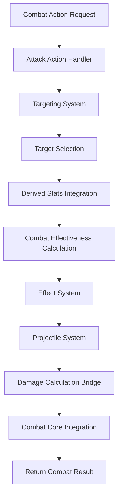

# Combat Action System

## 📋 **Tổng Quan**

Combat Action System là component chuyên biệt của Action Core, tập trung vào việc xử lý các actions trong combat bao gồm attack actions, targeting system, effect system và projectile system. Hệ thống này tích hợp chặt chẽ với Element Core để sử dụng derived stats cho combat effectiveness.

## 🎯 **Vấn Đề Cần Giải Quyết**

### **1. Attack Action Handling**
- **Attack Actions**: Xử lý các action tấn công với attacker là người thực hiện
- **Targeting System**: Xác định target (single, multiple, random, AOE, projectile)
- **Combat Effectiveness**: Ảnh hưởng bởi derived stats từ Element Core
- **Damage Calculation**: Tích hợp với Combat Core cho damage calculation

### **2. Derived Stats Integration**
- **skill_execution_speed**: Ảnh hưởng đến execution duration
- **skill_cooldown_reduction**: Ảnh hưởng đến cooldown duration
- **combat_skill_effectiveness**: Ảnh hưởng đến combat effectiveness
- **skill_effectiveness**: Ảnh hưởng đến skill effectiveness
- **resource_efficiency**: Ảnh hưởng đến resource consumption

### **3. Action Properties Management**
- **Action Category**: Combat action category
- **Action Properties**: Name, ID, target count, area size, duration, cooldown
- **Resource Consumption**: Min/max resource consume list
- **Effect Management**: Effect list với magnitude, trigger chance, conditions

## 🏗️ **Architecture**

### **Core Components**

```rust
pub struct CombatActionSystem {
    // Core components
    attack_action_handler: AttackActionHandler,
    targeting_system: TargetingSystem,
    effect_system: EffectSystem,
    projectile_system: ProjectileSystem,
    
    // Derived stats integration
    stats_integration: DerivedStatsIntegration,
    combat_effectiveness_calculator: CombatEffectivenessCalculator,
    
    // Performance optimization
    combat_cache: CombatCache,
    batch_processor: BatchProcessor,
    memory_pool: MemoryPool,
    
    // Configuration
    config: CombatActionConfig,
}
```

### **Combat Action Flow**



## 🔧 **Core Components**

### **1. Attack Action Handler**

```rust
pub struct AttackActionHandler {
    action_registry: ActionRegistry,
    stats_integration: DerivedStatsIntegration,
    combat_effectiveness_calculator: CombatEffectivenessCalculator,
    damage_calculation_bridge: DamageCalculationBridge,
}

impl AttackActionHandler {
    pub async fn handle_attack_action(
        &mut self,
        action_id: ActionId,
        attacker: &mut Actor,
        target_context: &TargetContext,
        action_context: &ActionContext
    ) -> Result<AttackResult, CombatError> {
        // Get action definition
        let action = self.action_registry.get_action(&action_id)
            .ok_or_else(|| CombatError::ActionNotFound(action_id))?;
        
        // Validate action type
        if !matches!(action.get_type(), ActionType::Attack) {
            return Err(CombatError::InvalidActionType(action_id));
        }
        
        // Get derived stats for combat effectiveness
        let derived_stats = self.stats_integration.get_derived_stats(attacker).await?;
        
        // Calculate combat effectiveness
        let combat_effectiveness = self.combat_effectiveness_calculator.calculate_combat_effectiveness(
            &derived_stats,
            action_context
        ).await?;
        
        // Apply combat effectiveness to action
        let enhanced_action = self.enhance_action_with_effectiveness(action, combat_effectiveness)?;
        
        // Execute attack action
        let attack_result = self.execute_attack_action(enhanced_action, attacker, target_context, action_context).await?;
        
        Ok(attack_result)
    }
    
    async fn execute_attack_action(
        &self,
        action: &dyn Action,
        attacker: &mut Actor,
        target_context: &TargetContext,
        action_context: &ActionContext
    ) -> Result<AttackResult, CombatError> {
        let mut attack_result = AttackResult::new();
        
        // Process each target
        for target in &target_context.targets {
            // Calculate damage for this target
            let damage_result = self.calculate_damage_for_target(action, attacker, target, action_context).await?;
            attack_result.add_damage_result(damage_result);
            
            // Apply effects to target
            let effect_results = self.apply_effects_to_target(action, attacker, target, action_context).await?;
            attack_result.add_effect_results(effect_results);
        }
        
        // Handle projectiles if any
        if let Some(projectile_config) = action.get_projectile_config() {
            let projectile_results = self.handle_projectiles(projectile_config, attacker, target_context, action_context).await?;
            attack_result.add_projectile_results(projectile_results);
        }
        
        // Handle AOE if any
        if let Some(aoe_config) = action.get_aoe_config() {
            let aoe_results = self.handle_aoe(aoe_config, attacker, target_context, action_context).await?;
            attack_result.add_aoe_results(aoe_results);
        }
        
        Ok(attack_result)
    }
}
```

### **2. Targeting System**

```rust
pub struct TargetingSystem {
    target_validator: TargetValidator,
    target_selector: TargetSelector,
    range_calculator: RangeCalculator,
    line_of_sight_calculator: LineOfSightCalculator,
}

impl TargetingSystem {
    pub async fn select_targets(
        &self,
        target_requirements: &TargetRequirements,
        attacker: &Actor,
        context: &ActionContext
    ) -> Result<TargetContext, TargetingError> {
        let mut target_context = TargetContext::new();
        
        match target_requirements.target_type {
            TargetType::None => {
                // No targets required
                return Ok(target_context);
            },
            TargetType::Self => {
                // Self target
                target_context.add_target(attacker.clone());
            },
            TargetType::Single => {
                // Single target selection
                let target = self.select_single_target(target_requirements, attacker, context).await?;
                target_context.add_target(target);
            },
            TargetType::Multiple => {
                // Multiple target selection
                let targets = self.select_multiple_targets(target_requirements, attacker, context).await?;
                for target in targets {
                    target_context.add_target(target);
                }
            },
            TargetType::Random => {
                // Random target selection
                let target = self.select_random_target(target_requirements, attacker, context).await?;
                target_context.add_target(target);
            },
            TargetType::AOE => {
                // AOE target selection
                let targets = self.select_aoe_targets(target_requirements, attacker, context).await?;
                for target in targets {
                    target_context.add_target(target);
                }
            },
            TargetType::MultipleAOE => {
                // Multiple AOE target selection
                let target_groups = self.select_multiple_aoe_targets(target_requirements, attacker, context).await?;
                for group in target_groups {
                    target_context.add_target_group(group);
                }
            },
            TargetType::Projectile => {
                // Projectile target selection
                let target = self.select_projectile_target(target_requirements, attacker, context).await?;
                target_context.add_target(target);
            },
            TargetType::MultipleProjectile => {
                // Multiple projectile target selection
                let targets = self.select_multiple_projectile_targets(target_requirements, attacker, context).await?;
                for target in targets {
                    target_context.add_target(target);
                }
            },
        }
        
        Ok(target_context)
    }
    
    async fn select_single_target(
        &self,
        requirements: &TargetRequirements,
        attacker: &Actor,
        context: &ActionContext
    ) -> Result<Actor, TargetingError> {
        // Get potential targets
        let potential_targets = self.get_potential_targets(attacker, context).await?;
        
        // Apply filters
        let filtered_targets = self.apply_target_filters(potential_targets, &requirements.target_filters).await?;
        
        // Validate range
        let range_validated_targets = self.validate_range(filtered_targets, requirements, attacker).await?;
        
        // Select best target
        let best_target = self.select_best_target(range_validated_targets, attacker, context).await?;
        
        Ok(best_target)
    }
    
    async fn select_multiple_targets(
        &self,
        requirements: &TargetRequirements,
        attacker: &Actor,
        context: &ActionContext
    ) -> Result<Vec<Actor>, TargetingError> {
        // Get potential targets
        let potential_targets = self.get_potential_targets(attacker, context).await?;
        
        // Apply filters
        let filtered_targets = self.apply_target_filters(potential_targets, &requirements.target_filters).await?;
        
        // Validate range
        let range_validated_targets = self.validate_range(filtered_targets, requirements, attacker).await?;
        
        // Select multiple targets
        let selected_targets = self.select_multiple_targets_from_pool(
            range_validated_targets,
            requirements.target_count,
            attacker,
            context
        ).await?;
        
        Ok(selected_targets)
    }
}
```

### **3. Effect System**

```rust
pub struct EffectSystem {
    effect_handlers: HashMap<EffectType, Box<dyn EffectHandler>>,
    effect_calculator: EffectCalculator,
    condition_evaluator: ConditionEvaluator,
    effect_log: EffectLog,
}

impl EffectSystem {
    pub async fn apply_effects(
        &mut self,
        effects: &[ActionEffect],
        attacker: &Actor,
        target: &mut Actor,
        context: &ActionContext
    ) -> Result<Vec<EffectResult>, EffectError> {
        let mut effect_results = Vec::new();
        
        for effect in effects {
            // Check trigger chance
            if !self.roll_trigger_chance(effect.trigger_chance) {
                continue;
            }
            
            // Evaluate conditions
            if !self.evaluate_effect_conditions(effect, attacker, target, context).await? {
                continue;
            }
            
            // Calculate effect magnitude
            let magnitude = self.calculate_effect_magnitude(effect, attacker, target, context).await?;
            
            // Apply effect
            let effect_result = self.apply_effect(effect, magnitude, attacker, target, context).await?;
            effect_results.push(effect_result);
        }
        
        Ok(effect_results)
    }
    
    async fn apply_effect(
        &self,
        effect: &ActionEffect,
        magnitude: f64,
        attacker: &Actor,
        target: &mut Actor,
        context: &ActionContext
    ) -> Result<EffectResult, EffectError> {
        let handler = self.effect_handlers.get(&effect.effect_type)
            .ok_or_else(|| EffectError::UnknownEffectType(effect.effect_type.clone()))?;
        
        let effect_result = handler.apply_effect(effect, magnitude, attacker, target, context).await?;
        
        // Log effect application
        self.effect_log.log_effect_application(effect, magnitude, &effect_result);
        
        Ok(effect_result)
    }
}

/// Effect handler trait
pub trait EffectHandler: Send + Sync {
    async fn apply_effect(
        &self,
        effect: &ActionEffect,
        magnitude: f64,
        attacker: &Actor,
        target: &mut Actor,
        context: &ActionContext
    ) -> Result<EffectResult, EffectError>;
}

/// Damage effect handler
pub struct DamageEffectHandler {
    damage_calculation_bridge: DamageCalculationBridge,
}

impl EffectHandler for DamageEffectHandler {
    async fn apply_effect(
        &self,
        effect: &ActionEffect,
        magnitude: f64,
        attacker: &Actor,
        target: &mut Actor,
        context: &ActionContext
    ) -> Result<EffectResult, EffectError> {
        // Extract damage data
        let damage_data = match &effect.effect_data {
            EffectData::Damage { damage_type, damage_element, can_crit, can_penetrate } => {
                DamageData {
                    damage_type: damage_type.clone(),
                    damage_element: damage_element.clone(),
                    can_crit: *can_crit,
                    can_penetrate: *can_penetrate,
                }
            },
            _ => return Err(EffectError::InvalidEffectData),
        };
        
        // Calculate damage
        let damage_result = self.damage_calculation_bridge.calculate_damage(
            attacker,
            target,
            magnitude,
            &damage_data,
            context
        ).await?;
        
        // Apply damage to target
        target.take_damage(damage_result.total_damage);
        
        Ok(EffectResult {
            effect_type: effect.effect_type.clone(),
            magnitude,
            success: true,
            message: format!("Applied {} damage", damage_result.total_damage),
            additional_data: Some(damage_result),
        })
    }
}
```

### **4. Projectile System**

```rust
pub struct ProjectileSystem {
    projectile_handlers: HashMap<String, Box<dyn ProjectileHandler>>,
    projectile_calculator: ProjectileCalculator,
    collision_detector: CollisionDetector,
    projectile_log: ProjectileLog,
}

impl ProjectileSystem {
    pub async fn handle_projectiles(
        &mut self,
        projectile_config: &ProjectileConfig,
        attacker: &Actor,
        target_context: &TargetContext,
        action_context: &ActionContext
    ) -> Result<Vec<ProjectileResult>, ProjectileError> {
        let mut projectile_results = Vec::new();
        
        for projectile_data in &projectile_config.projectiles {
            // Create projectile
            let projectile = self.create_projectile(projectile_data, attacker, action_context).await?;
            
            // Launch projectile
            let launch_result = self.launch_projectile(projectile, target_context, action_context).await?;
            projectile_results.push(launch_result);
        }
        
        Ok(projectile_results)
    }
    
    async fn create_projectile(
        &self,
        projectile_data: &ProjectileData,
        attacker: &Actor,
        action_context: &ActionContext
    ) -> Result<Projectile, ProjectileError> {
        let projectile = Projectile {
            id: ProjectileId::new(),
            projectile_type: projectile_data.projectile_type.clone(),
            caster_id: attacker.id,
            position: attacker.position,
            velocity: projectile_data.velocity,
            acceleration: projectile_data.acceleration,
            max_speed: projectile_data.max_speed,
            lifetime: projectile_data.lifetime,
            collision_radius: projectile_data.collision_radius,
            penetration_count: projectile_data.penetration_count,
            bounce_count: projectile_data.bounce_count,
            homing_strength: projectile_data.homing_strength,
            damage: projectile_data.damage,
            effects: projectile_data.effects.clone(),
        };
        
        Ok(projectile)
    }
    
    async fn launch_projectile(
        &mut self,
        mut projectile: Projectile,
        target_context: &TargetContext,
        action_context: &ActionContext
    ) -> Result<ProjectileResult, ProjectileError> {
        // Set target if homing
        if projectile.homing_strength > 0.0 {
            if let Some(target) = target_context.get_primary_target() {
                projectile.set_target(target.id);
            }
        }
        
        // Launch projectile
        let launch_result = self.launch_projectile_physics(projectile, action_context).await?;
        
        // Log projectile launch
        self.projectile_log.log_projectile_launch(&launch_result);
        
        Ok(launch_result)
    }
}
```

## 📊 **Data Structures**

### **1. Attack Action Data**

```rust
pub struct AttackActionData {
    pub action_id: String,
    pub action_name: String,
    pub action_category: ActionCategory,
    pub target_requirements: TargetRequirements,
    pub projectile_config: Option<ProjectileConfig>,
    pub aoe_config: Option<AOEConfig>,
    pub execution_duration: DurationRange,
    pub cooldown_duration: CooldownConfig,
    pub resource_consumption: Vec<ResourceRequirement>,
    pub effects: Vec<ActionEffect>,
    pub combat_effectiveness_scaling: Vec<String>,
}

pub struct ProjectileConfig {
    pub projectiles: Vec<ProjectileData>,
    pub launch_delay: Duration,
    pub launch_interval: Duration,
    pub launch_count: u32,
}

pub struct ProjectileData {
    pub projectile_type: String,
    pub velocity: f64,
    pub acceleration: f64,
    pub max_speed: f64,
    pub lifetime: Duration,
    pub collision_radius: f64,
    pub penetration_count: u32,
    pub bounce_count: u32,
    pub homing_strength: f64,
    pub damage: f64,
    pub effects: Vec<ActionEffect>,
}

pub struct AOEConfig {
    pub area_size: f64,
    pub area_shape: AOEShape,
    pub area_duration: Duration,
    pub area_damage: f64,
    pub area_effects: Vec<ActionEffect>,
}

pub enum AOEShape {
    Circle,
    Rectangle,
    Line,
    Cone,
    Custom(String),
}
```

### **2. Combat Effectiveness**

```rust
pub struct CombatEffectiveness {
    pub skill_execution_speed: f64,
    pub skill_cooldown_reduction: f64,
    pub combat_skill_effectiveness: f64,
    pub skill_effectiveness: f64,
    pub resource_efficiency: f64,
    pub overall_effectiveness: f64,
}

pub struct CombatEffectivenessCalculator {
    stats_integration: DerivedStatsIntegration,
    scaling_rules: HashMap<String, ScalingRule>,
}

impl CombatEffectivenessCalculator {
    pub async fn calculate_combat_effectiveness(
        &self,
        derived_stats: &DerivedStatsSnapshot,
        context: &ActionContext
    ) -> Result<CombatEffectiveness, CombatError> {
        let skill_execution_speed = derived_stats.get_stat("skill_execution_speed").unwrap_or(1.0);
        let skill_cooldown_reduction = derived_stats.get_stat("skill_cooldown_reduction").unwrap_or(1.0);
        let combat_skill_effectiveness = derived_stats.get_stat("combat_skill_effectiveness").unwrap_or(1.0);
        let skill_effectiveness = derived_stats.get_stat("skill_effectiveness").unwrap_or(1.0);
        let resource_efficiency = derived_stats.get_stat("resource_efficiency").unwrap_or(1.0);
        
        // Calculate overall effectiveness
        let overall_effectiveness = (skill_execution_speed + skill_cooldown_reduction + 
                                   combat_skill_effectiveness + skill_effectiveness + 
                                   resource_efficiency) / 5.0;
        
        Ok(CombatEffectiveness {
            skill_execution_speed,
            skill_cooldown_reduction,
            combat_skill_effectiveness,
            skill_effectiveness,
            resource_efficiency,
            overall_effectiveness,
        })
    }
}
```

## 🚀 **Performance Optimization**

### **1. Combat Cache**

```rust
pub struct CombatCache {
    effectiveness_cache: HashMap<ActorId, CachedCombatEffectiveness>,
    targeting_cache: HashMap<TargetingKey, CachedTargetingResult>,
    effect_cache: HashMap<EffectKey, CachedEffectResult>,
    ttl: Duration,
    max_size: usize,
}

pub struct CachedCombatEffectiveness {
    pub effectiveness: CombatEffectiveness,
    pub timestamp: Instant,
    pub ttl: Duration,
}

pub struct CachedTargetingResult {
    pub targets: Vec<Actor>,
    pub timestamp: Instant,
    pub ttl: Duration,
}

pub struct CachedEffectResult {
    pub effect_result: EffectResult,
    pub timestamp: Instant,
    pub ttl: Duration,
}
```

### **2. Batch Processing**

```rust
pub struct BatchProcessor {
    batch_size: usize,
    processing_threads: usize,
    thread_pool: ThreadPool,
}

impl BatchProcessor {
    pub async fn process_combat_batch(
        &self,
        combat_requests: Vec<CombatRequest>
    ) -> Result<Vec<CombatResponse>, CombatError> {
        let chunks = combat_requests.chunks(self.batch_size);
        let mut handles = Vec::new();
        
        for chunk in chunks {
            let chunk = chunk.to_vec();
            let handle = self.thread_pool.spawn(async move {
                self.process_chunk(chunk).await
            });
            handles.push(handle);
        }
        
        let mut results = Vec::new();
        for handle in handles {
            let chunk_results = handle.await??;
            results.extend(chunk_results);
        }
        
        Ok(results)
    }
}
```

## 🧪 **Testing Strategy**

### **Unit Tests**
```rust
#[cfg(test)]
mod tests {
    use super::*;
    
    #[tokio::test]
    async fn test_attack_action_handling() {
        let mut handler = AttackActionHandler::new();
        let action_id = ActionId::new();
        let mut attacker = create_test_actor();
        let target_context = create_test_target_context();
        let action_context = create_test_action_context();
        
        let result = handler.handle_attack_action(action_id, &mut attacker, &target_context, &action_context).await.unwrap();
        assert!(result.success);
    }
    
    #[tokio::test]
    async fn test_targeting_system() {
        let system = TargetingSystem::new();
        let requirements = create_test_target_requirements();
        let attacker = create_test_actor();
        let context = create_test_action_context();
        
        let targets = system.select_targets(&requirements, &attacker, &context).await.unwrap();
        assert!(!targets.targets.is_empty());
    }
    
    #[tokio::test]
    async fn test_effect_system() {
        let mut system = EffectSystem::new();
        let effects = create_test_effects();
        let attacker = create_test_actor();
        let mut target = create_test_actor();
        let context = create_test_action_context();
        
        let results = system.apply_effects(&effects, &attacker, &mut target, &context).await.unwrap();
        assert!(!results.is_empty());
    }
}
```

## 🔗 **Integration Points**

### **Element Core Integration**
- **Derived Stats**: Access combat-related derived stats
- **Stat Scaling**: Apply stat scaling to combat effectiveness
- **Stat Validation**: Validate stat requirements for combat

### **Combat Core Integration**
- **Damage Calculation**: Provide damage input for combat
- **Status Effects**: Handle status effect application
- **Resource Management**: Handle resource consumption

### **Action Core Integration**
- **Action Execution**: Provide combat action execution
- **Action Validation**: Validate combat action requirements
- **Action Results**: Handle combat action results

---

**Last Updated**: 2025-01-27  
**Version**: 1.0  
**Status**: Design Phase  
**Maintainer**: Chaos World Team
