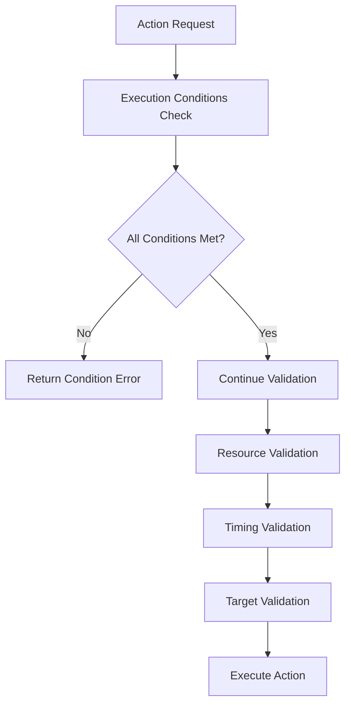

# Execution Conditions Integration

## 📋 **Tổng Quan**

Execution Conditions Integration là component bổ sung cho Action Core, tích hợp execution conditions vào Action Execution Engine để kiểm soát khi nào actions có thể được thực hiện. Hệ thống này đảm bảo rằng actions chỉ được thực hiện khi thỏa mãn các điều kiện cụ thể.

## 🎯 **Vấn Đề Cần Giải Quyết**

### **1. Action Execution Control**
- **Conditional Execution**: Actions chỉ được thực hiện khi thỏa mãn điều kiện
- **Real-time Validation**: Kiểm tra điều kiện trong thời gian thực
- **Error Handling**: Xử lý lỗi khi điều kiện không thỏa mãn
- **Performance**: Tối ưu hóa việc kiểm tra điều kiện

### **2. Condition Types Support**
- **Health Conditions**: "self.hp < 0.5" (dưới 50% HP)
- **Resource Conditions**: "self.mana > 100"
- **Status Conditions**: "self.has_status('berserk')"
- **Environment Conditions**: "environment.is_night"
- **Custom Conditions**: Điều kiện tùy chỉnh

### **3. Integration Points**
- **Action Execution Engine**: Tích hợp vào validation pipeline
- **Action Validator**: Kiểm tra điều kiện trước khi thực hiện
- **Action Context**: Cung cấp context cho việc đánh giá điều kiện

## 🏗️ **Architecture**

### **Core Components**

```rust
pub struct ExecutionConditionsIntegration {
    // Core components
    execution_condition_validator: ExecutionConditionValidator,
    condition_evaluator: ConditionEvaluator,
    condition_cache: ConditionCache,
    
    // Performance optimization
    hot_path_optimizer: HotPathOptimizer,
    batch_processor: BatchProcessor,
    
    // Configuration
    config: ExecutionConditionsConfig,
}
```

### **Integration Flow**



## 🔧 **Core Components**

### **1. Execution Condition Validator Integration**

```rust
pub struct ActionValidator {
    action_registry: ActionRegistry,
    validation_rules: HashMap<String, ValidationRule>,
    resource_validator: ResourceValidator,
    timing_validator: TimingValidator,
    execution_condition_validator: ExecutionConditionValidator,
}

impl ActionValidator {
    pub async fn validate_action(
        &self,
        action: &dyn Action,
        actor: &Actor,
        context: &ActionContext
    ) -> Result<ValidationResult, ActionError> {
        let mut validation_result = ValidationResult::new();
        
        // Validate execution conditions first
        let execution_condition_result = self.execution_condition_validator.check_execution_conditions(
            action.get_execution_conditions(),
            actor,
            context
        ).await?;
        
        if !execution_condition_result.can_execute {
            validation_result.add_error(ActionError::ExecutionConditionsNotMet(
                execution_condition_result.get_error_messages()
            ));
            return Ok(validation_result);
        }
        
        // Validate resource requirements
        let resource_validation = self.resource_validator.validate_requirements(
            action.get_resource_requirements(),
            actor
        ).await?;
        
        if !resource_validation.is_valid() {
            validation_result.add_error(ActionError::InsufficientResources);
        }
        
        // Validate timing constraints
        let timing_validation = self.timing_validator.validate_timing(
            action.get_execution_duration(),
            action.get_cooldown_duration()
        )?;
        
        if !timing_validation.is_valid() {
            validation_result.add_error(ActionError::InvalidTiming);
        }
        
        // Validate target requirements
        let target_validation = self.target_validator.validate_targets(
            action.get_target_requirements(),
            context
        )?;
        
        if !target_validation.is_valid() {
            validation_result.add_error(ActionError::InvalidTargets);
        }
        
        Ok(validation_result)
    }
}
```

### **2. Action Execution Engine Integration**

```rust
pub struct ActionExecutionEngine {
    // Existing components
    action_scheduler: ActionScheduler,
    action_validator: ActionValidator,
    action_executor: ActionExecutor,
    stats_aggregator: StatsAggregator,
    
    // New execution conditions integration
    execution_conditions_integration: ExecutionConditionsIntegration,
}

impl ActionExecutionEngine {
    pub async fn execute_action(
        &mut self,
        request: &ActionRequest
    ) -> Result<ActionResult, ActionError> {
        // Get action from registry
        let action = self.action_registry.get_action(&request.action_id)
            .ok_or_else(|| ActionError::ActionNotFound(request.action_id.clone()))?;
        
        // Validate action with execution conditions
        let validation_result = self.action_validator.validate_action(
            action,
            &request.context.actor,
            &request.context
        ).await?;
        
        if !validation_result.is_valid() {
            return Err(ActionError::ValidationFailed(validation_result.get_errors()));
        }
        
        // Execute action
        let execution_result = self.action_executor.execute_action(
            action,
            &mut request.context.clone(),
            &validation_result
        ).await?;
        
        Ok(execution_result)
    }
    
    pub async fn check_execution_conditions(
        &self,
        action_id: &str,
        actor: &Actor,
        context: &ActionContext
    ) -> Result<ExecutionConditionResult, ActionError> {
        let action = self.action_registry.get_action(action_id)
            .ok_or_else(|| ActionError::ActionNotFound(action_id.to_string()))?;
        
        self.execution_conditions_integration.check_execution_conditions(
            action.get_execution_conditions(),
            actor,
            context
        ).await
    }
}
```

### **3. Condition Evaluator**

```rust
pub struct ConditionEvaluator {
    condition_parsers: HashMap<ExecutionConditionType, Box<dyn ConditionParser>>,
    condition_cache: ConditionCache,
    stats_integration: DerivedStatsIntegration,
}

impl ConditionEvaluator {
    pub async fn evaluate_condition(
        &self,
        condition: &ExecutionCondition,
        actor: &Actor,
        context: &ActionContext
    ) -> Result<bool, ActionError> {
        // Check cache first
        if let Some(cached_result) = self.condition_cache.get(condition, actor, context) {
            if cached_result.is_valid() {
                return Ok(cached_result.result);
            }
        }
        
        // Get parser for condition type
        let parser = self.condition_parsers.get(&condition.condition_type)
            .ok_or_else(|| ActionError::UnknownConditionType(condition.condition_type.clone()))?;
        
        // Parse and evaluate condition
        let result = parser.evaluate(condition, actor, context).await?;
        
        // Cache result
        self.condition_cache.insert(condition, actor, context, result);
        
        Ok(result)
    }
    
    pub async fn evaluate_custom_condition(
        &self,
        condition: &str,
        custom_type: &str,
        actor: &Actor,
        context: &ActionContext
    ) -> Result<bool, ActionError> {
        // Delegate to custom condition evaluator
        match custom_type {
            "element_mastery" => self.evaluate_element_mastery_condition(condition, actor, context).await,
            "skill_combination" => self.evaluate_skill_combination_condition(condition, actor, context).await,
            "environmental_bonus" => self.evaluate_environmental_bonus_condition(condition, actor, context).await,
            _ => Err(ActionError::UnknownCustomConditionType(custom_type.to_string())),
        }
    }
    
    async fn evaluate_element_mastery_condition(
        &self,
        condition: &str,
        actor: &Actor,
        context: &ActionContext
    ) -> Result<bool, ActionError> {
        // Parse condition like "element_mastery.fire >= 50"
        if let Some((element, threshold)) = self.extract_element_mastery_threshold(condition) {
            let mastery_level = self.stats_integration.get_element_mastery(actor, &element).await?;
            Ok(mastery_level >= threshold)
        } else {
            Err(ActionError::InvalidCondition(condition.to_string()))
        }
    }
    
    async fn evaluate_skill_combination_condition(
        &self,
        condition: &str,
        actor: &Actor,
        context: &ActionContext
    ) -> Result<bool, ActionError> {
        // Parse condition like "skill_combination.has_skills(['fireball', 'ice_shield'])"
        if let Some(required_skills) = self.extract_required_skills(condition) {
            let has_all_skills = required_skills.iter().all(|skill| actor.has_skill(skill));
            Ok(has_all_skills)
        } else {
            Err(ActionError::InvalidCondition(condition.to_string()))
        }
    }
    
    async fn evaluate_environmental_bonus_condition(
        &self,
        condition: &str,
        actor: &Actor,
        context: &ActionContext
    ) -> Result<bool, ActionError> {
        // Parse condition like "environmental_bonus.fire > 1.5"
        if let Some((element, threshold)) = self.extract_environmental_bonus_threshold(condition) {
            let bonus = context.environment.get_element_bonus(&element);
            Ok(bonus > threshold)
        } else {
            Err(ActionError::InvalidCondition(condition.to_string()))
        }
    }
}
```

### **4. Condition Parser Trait**

```rust
pub trait ConditionParser: Send + Sync {
    async fn evaluate(
        &self,
        condition: &ExecutionCondition,
        actor: &Actor,
        context: &ActionContext
    ) -> Result<bool, ActionError>;
}

/// Health condition parser
pub struct HealthConditionParser;

impl ConditionParser for HealthConditionParser {
    async fn evaluate(
        &self,
        condition: &ExecutionCondition,
        actor: &Actor,
        _context: &ActionContext
    ) -> Result<bool, ActionError> {
        let current_hp = actor.get_health_percentage();
        self.evaluate_comparison(&condition.condition, current_hp)
    }
    
    fn evaluate_comparison(&self, condition: &str, value: f64) -> Result<bool, ActionError> {
        if let Some(threshold) = self.extract_threshold(condition) {
            if condition.contains("<") {
                Ok(value < threshold)
            } else if condition.contains(">") {
                Ok(value > threshold)
            } else if condition.contains("<=") {
                Ok(value <= threshold)
            } else if condition.contains(">=") {
                Ok(value >= threshold)
            } else if condition.contains("==") {
                Ok((value - threshold).abs() < f64::EPSILON)
            } else {
                Err(ActionError::InvalidCondition(condition.to_string()))
            }
        } else {
            Err(ActionError::InvalidCondition(condition.to_string()))
        }
    }
}

/// Status condition parser
pub struct StatusConditionParser;

impl ConditionParser for StatusConditionParser {
    async fn evaluate(
        &self,
        condition: &ExecutionCondition,
        actor: &Actor,
        _context: &ActionContext
    ) -> Result<bool, ActionError> {
        if let Some(status_name) = self.extract_status_name(&condition.condition) {
            Ok(actor.has_status(&status_name))
        } else {
            Err(ActionError::InvalidCondition(condition.condition.clone()))
        }
    }
}
```

## 📊 **Data Structures**

### **1. Execution Condition Result**

```rust
pub struct ExecutionConditionResult {
    pub passed_conditions: Vec<ExecutionCondition>,
    pub failed_conditions: Vec<(ExecutionCondition, String)>,
    pub can_execute: bool,
    pub execution_time: Duration,
    pub cache_hits: u32,
    pub cache_misses: u32,
}

impl ExecutionConditionResult {
    pub fn new() -> Self {
        Self {
            passed_conditions: Vec::new(),
            failed_conditions: Vec::new(),
            can_execute: true,
            execution_time: Duration::from_millis(0),
            cache_hits: 0,
            cache_misses: 0,
        }
    }
    
    pub fn add_passed_condition(&mut self, condition: ExecutionCondition) {
        self.passed_conditions.push(condition);
    }
    
    pub fn add_failed_condition(&mut self, condition: ExecutionCondition, error_message: String) {
        self.failed_conditions.push((condition, error_message));
        self.can_execute = false;
    }
    
    pub fn get_error_messages(&self) -> Vec<String> {
        self.failed_conditions.iter().map(|(_, msg)| msg.clone()).collect()
    }
    
    pub fn get_success_rate(&self) -> f64 {
        let total_conditions = self.passed_conditions.len() + self.failed_conditions.len();
        if total_conditions == 0 {
            1.0
        } else {
            self.passed_conditions.len() as f64 / total_conditions as f64
        }
    }
}
```

### **2. Condition Cache**

```rust
pub struct ConditionCache {
    cache: HashMap<ConditionCacheKey, CachedConditionResult>,
    ttl: Duration,
    max_size: usize,
    eviction_policy: EvictionPolicy,
}

pub struct ConditionCacheKey {
    pub condition_id: String,
    pub actor_id: ActorId,
    pub context_hash: u64,
}

pub struct CachedConditionResult {
    pub result: bool,
    pub timestamp: Instant,
    pub ttl: Duration,
}

impl ConditionCache {
    pub fn get(
        &self,
        condition: &ExecutionCondition,
        actor: &Actor,
        context: &ActionContext
    ) -> Option<&CachedConditionResult> {
        let key = self.create_cache_key(condition, actor, context);
        self.cache.get(&key).and_then(|cached| {
            if cached.is_valid() {
                Some(cached)
            } else {
                None
            }
        })
    }
    
    pub fn insert(
        &mut self,
        condition: &ExecutionCondition,
        actor: &Actor,
        context: &ActionContext,
        result: bool
    ) {
        if self.cache.len() >= self.max_size {
            self.evict_oldest();
        }
        
        let key = self.create_cache_key(condition, actor, context);
        let cached = CachedConditionResult {
            result,
            timestamp: Instant::now(),
            ttl: self.ttl,
        };
        
        self.cache.insert(key, cached);
    }
    
    fn create_cache_key(
        &self,
        condition: &ExecutionCondition,
        actor: &Actor,
        context: &ActionContext
    ) -> ConditionCacheKey {
        let context_hash = self.hash_context(context);
        ConditionCacheKey {
            condition_id: condition.condition.clone(),
            actor_id: actor.id,
            context_hash,
        }
    }
}
```

## 🚀 **Performance Optimization**

### **1. Hot Path Optimization**

```rust
pub struct HotPathOptimizer {
    hot_conditions: HashSet<String>,
    optimization_rules: HashMap<String, OptimizationRule>,
}

impl HotPathOptimizer {
    pub fn optimize_condition_evaluation(
        &self,
        conditions: &[ExecutionCondition],
        actor: &Actor,
        context: &ActionContext
    ) -> Vec<ExecutionCondition> {
        let mut optimized_conditions = Vec::new();
        
        for condition in conditions {
            if self.is_hot_condition(condition) {
                // Apply hot path optimization
                if let Some(optimized) = self.apply_hot_path_optimization(condition, actor, context) {
                    optimized_conditions.push(optimized);
                }
            } else {
                optimized_conditions.push(condition.clone());
            }
        }
        
        optimized_conditions
    }
    
    fn is_hot_condition(&self, condition: &ExecutionCondition) -> bool {
        self.hot_conditions.contains(&condition.condition)
    }
    
    fn apply_hot_path_optimization(
        &self,
        condition: &ExecutionCondition,
        actor: &Actor,
        context: &ActionContext
    ) -> Option<ExecutionCondition> {
        // Apply specific optimizations for hot conditions
        match condition.condition_type {
            ExecutionConditionType::SelfHealth => {
                // Pre-calculate health percentage
                let health_percentage = actor.get_health_percentage();
                Some(ExecutionCondition {
                    condition: format!("self.hp < {}", health_percentage),
                    condition_type: condition.condition_type.clone(),
                    required: condition.required,
                    error_message: condition.error_message.clone(),
                    condition_value: Some(health_percentage),
                })
            },
            _ => None,
        }
    }
}
```

### **2. Batch Processing**

```rust
pub struct BatchProcessor {
    batch_size: usize,
    processing_threads: usize,
    thread_pool: ThreadPool,
}

impl BatchProcessor {
    pub async fn process_condition_batch(
        &self,
        condition_requests: Vec<ConditionRequest>
    ) -> Result<Vec<ConditionResponse>, ActionError> {
        let chunks = condition_requests.chunks(self.batch_size);
        let mut handles = Vec::new();
        
        for chunk in chunks {
            let chunk = chunk.to_vec();
            let handle = self.thread_pool.spawn(async move {
                self.process_chunk(chunk).await
            });
            handles.push(handle);
        }
        
        let mut results = Vec::new();
        for handle in handles {
            let chunk_results = handle.await??;
            results.extend(chunk_results);
        }
        
        Ok(results)
    }
}
```

## 🧪 **Testing Strategy**

### **Unit Tests**
```rust
#[cfg(test)]
mod tests {
    use super::*;
    
    #[tokio::test]
    async fn test_execution_condition_validation() {
        let validator = ExecutionConditionValidator::new();
        let conditions = create_test_execution_conditions();
        let actor = create_test_actor();
        let context = create_test_action_context();
        
        let result = validator.check_execution_conditions(&conditions, &actor, &context).await.unwrap();
        assert!(result.can_execute);
    }
    
    #[tokio::test]
    async fn test_health_condition_evaluation() {
        let evaluator = ConditionEvaluator::new();
        let condition = create_test_health_condition();
        let actor = create_test_actor();
        let context = create_test_action_context();
        
        let result = evaluator.evaluate_condition(&condition, &actor, &context).await.unwrap();
        assert!(result);
    }
    
    #[tokio::test]
    async fn test_status_condition_evaluation() {
        let evaluator = ConditionEvaluator::new();
        let condition = create_test_status_condition();
        let actor = create_test_actor();
        let context = create_test_action_context();
        
        let result = evaluator.evaluate_condition(&condition, &actor, &context).await.unwrap();
        assert!(result);
    }
}
```

## 🔗 **Integration Points**

### **Action Execution Engine Integration**
- **Validation Pipeline**: Tích hợp vào validation pipeline
- **Error Handling**: Xử lý lỗi execution conditions
- **Performance**: Tối ưu hóa performance

### **Action Validator Integration**
- **Condition Validation**: Kiểm tra điều kiện trước khi thực hiện
- **Error Messages**: Cung cấp thông báo lỗi chi tiết
- **Validation Result**: Kết quả validation bao gồm execution conditions

### **Action Context Integration**
- **Context Data**: Cung cấp context cho việc đánh giá điều kiện
- **Environment Data**: Dữ liệu môi trường cho environmental conditions
- **Actor Data**: Dữ liệu actor cho self conditions

---

**Last Updated**: 2025-01-27  
**Version**: 1.0  
**Status**: Design Phase  
**Maintainer**: Chaos World Team
