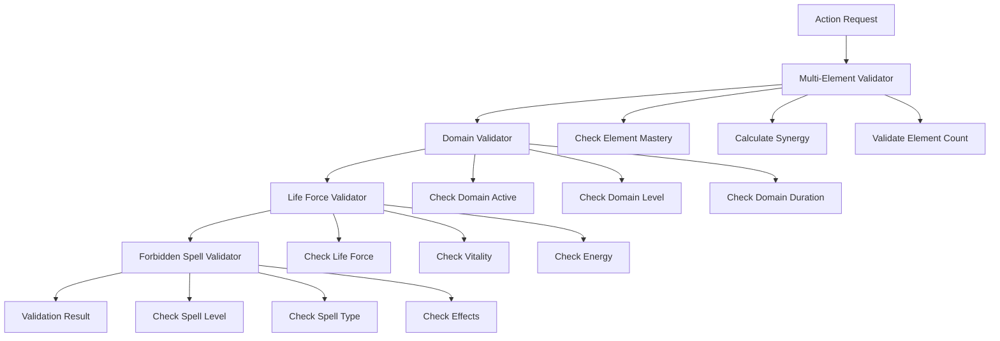
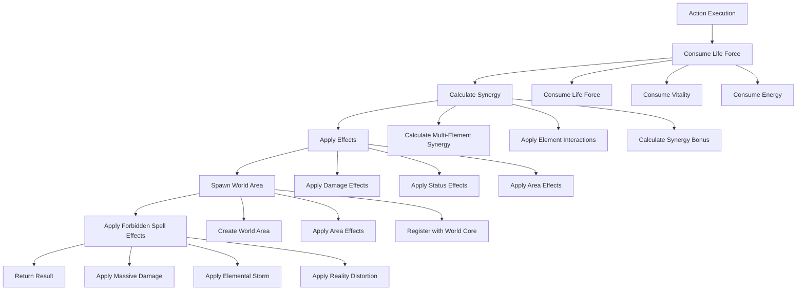

# Multi-Element Forbidden Spell Implementation Guide

## 📋 **Tổng Quan**

Document này mô tả chi tiết các thiết bị cần thiết để implement cấm chú ma pháp đa thuộc tính trong Action Core system. Dựa trên yêu cầu từ Toàn Chức Pháp Sư, hệ thống cần support:

- **Multi-Element Requirements**: 3-8+ elements cùng lúc
- **Domain Activation**: Kích hoạt lĩnh vực nguyên tố
- **Life Force Consumption**: Thọ nguyên, sinh mệnh, sinh lực
- **World Area Spawning**: Tạo khu vực tàn phá
- **Forbidden Spell Effects**: Sát thương diện rộng, bão nguyên tố

## 🎯 **Yêu Cầu Cấm Chú Ma Pháp**

### **1. Multi-Element System**
- **Required Elements**: 3-8 elements bắt buộc
- **Optional Elements**: Elements tùy chọn
- **Element Synergy**: Tính toán synergy giữa các elements
- **Mastery Requirements**: Yêu cầu tinh thông cho mỗi element

### **2. Domain Activation**
- **Domain Element**: Phải kích hoạt lĩnh vực của 1 element
- **Domain Level**: Yêu cầu cấp độ domain
- **Domain Duration**: Thời gian domain còn lại
- **Domain Effects**: Buff/debuff từ domain

### **3. Life Force Consumption**
- **Life Force**: Thọ nguyên (100)
- **Vitality**: Sinh mệnh (80)
- **Energy**: Sinh lực (120)
- **Recovery**: Tốc độ phục hồi

### **4. World Area Spawning**
- **Area Type**: Khu vực tàn phá
- **Area Size**: Bán kính 100m
- **Area Duration**: 1 giờ
- **Area Effects**: Continuous damage, status effects

## 🔧 **Thiết Bị Cần Thiết**

### **1. Multi-Element Action Validator**

```rust
pub struct MultiElementActionValidator {
    synergy_calculator: MultiElementSynergyCalculator,
    domain_validator: DomainActivationValidator,
    life_force_validator: LifeForceValidator,
    element_core_client: ElementCoreClient,
}
```

**Chức năng:**
- Validate multi-element requirements
- Check element mastery levels
- Validate domain activation
- Check life force availability

### **2. Multi-Element Synergy Calculator**

```rust
pub struct MultiElementSynergyCalculator {
    element_core_client: ElementCoreClient,
    synergy_configs: HashMap<String, ElementSynergyConfig>,
    element_interactions: HashMap<String, ElementInteraction>,
}
```

**Chức năng:**
- Calculate synergy between elements
- Support multiple synergy types (Additive, Multiplicative, Harmonic, Geometric)
- Apply element interactions
- Cache synergy calculations

### **3. Domain Activation Validator**

```rust
pub struct DomainActivationValidator {
    domain_registry: DomainRegistry,
    element_core_client: ElementCoreClient,
}
```

**Chức năng:**
- Validate domain activation
- Check domain level requirements
- Check domain duration
- Validate domain effects

### **4. Life Force Management System**

```rust
pub struct LifeForceValidator {
    life_force_registry: LifeForceRegistry,
    recovery_calculator: LifeForceRecoveryCalculator,
}

pub struct LifeForceConsumer {
    life_force_registry: LifeForceRegistry,
    consumption_tracker: ConsumptionTracker,
}

pub struct LifeForceRegenerator {
    recovery_calculator: LifeForceRecoveryCalculator,
    recovery_conditions: Vec<RecoveryCondition>,
}
```

**Chức năng:**
- Validate life force consumption
- Consume life force resources
- Regenerate life force over time
- Track consumption patterns

### **5. World Area Spawning System**

```rust
pub struct WorldAreaSpawner {
    world_core_integration: WorldCoreIntegration,
    area_registry: AreaRegistry,
    area_manager: AreaManager,
}
```

**Chức năng:**
- Spawn world areas
- Manage area lifecycle
- Apply area effects
- Integrate with World Core

### **6. Forbidden Spell Support**

```rust
pub struct ForbiddenSpellValidator {
    forbidden_spell_registry: ForbiddenSpellRegistry,
    spell_level_validator: SpellLevelValidator,
    multi_element_validator: MultiElementActionValidator,
}

pub struct ForbiddenSpellEffectManager {
    effect_registry: ForbiddenSpellEffectRegistry,
    effect_calculator: ForbiddenSpellEffectCalculator,
}
```

**Chức năng:**
- Validate forbidden spell requirements
- Apply forbidden spell effects
- Manage spell levels
- Handle complex effects

## 🏗️ **Architecture Integration**

### **Enhanced Action Definition System**

```rust
pub struct ActionDefinitionSystem {
    // Core components
    action_interface: ActionInterface,
    action_builder: ActionBuilder,
    action_validator: ActionValidator,
    action_registry: ActionRegistry,
    
    // Resource management
    resource_validator: ResourceValidator,
    resource_consumer: ResourceConsumer,
    resource_regenerator: ResourceRegenerator,
    
    // Timing management
    execution_duration_manager: ExecutionDurationManager,
    interrupt_manager: InterruptManager,
    cooldown_manager: CooldownManager,
    
    // Multi-element support (NEW)
    multi_element_validator: MultiElementActionValidator,
    element_synergy_calculator: MultiElementSynergyCalculator,
    domain_activation_validator: DomainActivationValidator,
    
    // Life force management (NEW)
    life_force_validator: LifeForceValidator,
    life_force_consumer: LifeForceConsumer,
    life_force_regenerator: LifeForceRegenerator,
    
    // World area spawning (NEW)
    world_area_spawner: WorldAreaSpawner,
    world_core_integration: WorldCoreIntegration,
    
    // Forbidden spell support (NEW)
    forbidden_spell_validator: ForbiddenSpellValidator,
    forbidden_spell_effects: ForbiddenSpellEffectManager,
    
    // Configuration
    config: ActionDefinitionConfig,
}
```

### **Enhanced Action Interface**

```rust
pub trait Action {
    // Existing methods...
    fn get_metadata(&self) -> &ActionMetadata;
    fn get_category(&self) -> ActionCategory;
    fn get_type(&self) -> ActionType;
    fn get_resource_requirements(&self) -> &[ResourceRequirement];
    fn get_execution_duration(&self) -> DurationRange;
    fn get_cooldown_duration(&self) -> CooldownConfig;
    fn get_interrupt_conditions(&self) -> &[InterruptCondition];
    fn get_execution_conditions(&self) -> &[ExecutionCondition];
    fn get_target_requirements(&self) -> &TargetRequirements;
    fn get_effects(&self) -> &[ActionEffect];
    
    // Multi-element support (NEW)
    fn get_multi_element_requirement(&self) -> Option<&MultiElementRequirement>;
    fn get_domain_activation_requirement(&self) -> Option<&DomainActivationRequirement>;
    fn get_life_force_consumption(&self) -> Option<&LifeForceConsumption>;
    fn get_world_area_spawning(&self) -> Option<&WorldAreaSpawningEffect>;
    fn get_forbidden_spell_metadata(&self) -> Option<&ForbiddenSpellMetadata>;
    
    // Validation and execution
    fn validate(&self, context: &ActionContext) -> ValidationResult;
    fn execute(&self, context: &mut ActionContext) -> ActionResult;
}
```

## 📊 **Data Structures**

### **Multi-Element Requirement**

```rust
pub struct MultiElementRequirement {
    pub required_elements: Vec<ElementRequirement>,
    pub element_synergy: ElementSynergyConfig,
    pub synergy_bonus: f64,
    pub synergy_formula: String,
    pub min_elements: u32,
    pub max_elements: u32,
}

pub struct ElementRequirement {
    pub element_name: String,
    pub min_mastery: f64,
    pub max_mastery: f64,
    pub weight: f64,
    pub required: bool,
}

pub struct ElementSynergyConfig {
    pub synergy_type: ElementSynergyType,
    pub synergy_formula: String,
    pub synergy_bonus: f64,
    pub synergy_penalty: f64,
    pub synergy_threshold: f64,
}

pub enum ElementSynergyType {
    Additive,      // Cộng dồn
    Multiplicative, // Nhân với nhau
    Harmonic,      // Trung bình điều hòa
    Geometric,     // Trung bình hình học
    Custom(String),
}
```

### **Domain Activation Requirement**

```rust
pub struct DomainActivationRequirement {
    pub domain_element: String,
    pub domain_level: u32,
    pub domain_duration: Duration,
    pub domain_effects: Vec<DomainEffect>,
    pub domain_radius: f64,
    pub domain_power: f64,
}

pub struct DomainEffect {
    pub effect_type: DomainEffectType,
    pub magnitude: f64,
    pub duration: Duration,
    pub target_type: DomainTargetType,
}

pub enum DomainEffectType {
    Buff,
    Debuff,
    Damage,
    Heal,
    StatusEffect,
    ResourceModification,
}

pub enum DomainTargetType {
    Self,
    Allies,
    Enemies,
    All,
    Custom(String),
}
```

### **Life Force Consumption**

```rust
pub struct LifeForceConsumption {
    pub life_force_amount: f64,
    pub vitality_amount: f64,
    pub energy_amount: f64,
    pub consumption_formula: String,
    pub recovery_rate: f64,
    pub recovery_conditions: Vec<RecoveryCondition>,
}

pub struct RecoveryCondition {
    pub condition: String,
    pub recovery_rate: f64,
    pub condition_type: RecoveryConditionType,
}

pub enum RecoveryConditionType {
    Time,
    Meditation,
    Rest,
    Consumable,
    Custom(String),
}
```

### **World Area Spawning**

```rust
pub struct WorldAreaSpawningEffect {
    pub area_id: String,
    pub area_type: WorldAreaType,
    pub area_size: f64,
    pub area_duration: Duration,
    pub area_effects: Vec<WorldAreaEffect>,
    pub world_core_integration: WorldCoreIntegration,
    pub spawn_conditions: Vec<SpawnCondition>,
}

pub enum WorldAreaType {
    DestructionZone,      // Khu vực tàn phá
    ElementalField,       // Trường nguyên tố
    ForbiddenZone,        // Vùng cấm
    SacredGround,         // Đất thánh
    Custom(String),
}

pub struct WorldAreaEffect {
    pub effect_type: WorldAreaEffectType,
    pub magnitude: f64,
    pub duration: Duration,
    pub target_type: WorldAreaTargetType,
    pub area_modifier: f64,
}

pub enum WorldAreaEffectType {
    ContinuousDamage,
    StatusEffect,
    ResourceDrain,
    StatModification,
    MovementRestriction,
    Custom(String),
}

pub enum WorldAreaTargetType {
    All,
    Enemies,
    Allies,
    Self,
    Custom(String),
}
```

### **Forbidden Spell Metadata**

```rust
pub struct ForbiddenSpellMetadata {
    pub spell_level: ForbiddenSpellLevel,
    pub spell_type: ForbiddenSpellType,
    pub multi_element_requirement: MultiElementRequirement,
    pub domain_activation_requirement: Option<DomainActivationRequirement>,
    pub life_force_consumption: Option<LifeForceConsumption>,
    pub world_area_spawning: Option<WorldAreaSpawningEffect>,
    pub forbidden_spell_effects: Vec<ForbiddenSpellEffect>,
}

pub enum ForbiddenSpellLevel {
    Level1,  // Cấm chú cấp 1
    Level2,  // Cấm chú cấp 2
    Level3,  // Cấm chú cấp 3
    Level4,  // Cấm chú cấp 4
    Level5,  // Cấm chú cấp 5
}

pub enum ForbiddenSpellType {
    Destruction,     // Hủy diệt
    Control,         // Khống chế
    Summoning,       // Triệu hồi
    Transformation,  // Biến hóa
    Custom(String),
}

pub struct ForbiddenSpellEffect {
    pub effect_type: ForbiddenSpellEffectType,
    pub magnitude: f64,
    pub duration: Duration,
    pub target_type: ForbiddenSpellTargetType,
    pub element_combination: Vec<String>,
    pub synergy_multiplier: f64,
}

pub enum ForbiddenSpellEffectType {
    MassiveDamage,      // Sát thương diện rộng
    ElementalStorm,     // Bão nguyên tố
    RealityDistortion,  // Bóp méo thực tại
    TimeManipulation,   // Thao tác thời gian
    SpaceManipulation,  // Thao tác không gian
    Custom(String),
}

pub enum ForbiddenSpellTargetType {
    AllEnemies,         // Tất cả kẻ thù
    AllAllies,          // Tất cả đồng minh
    All,                // Tất cả
    Area,               // Khu vực
    World,              // Toàn thế giới
    Custom(String),
}
```

## 🔄 **Implementation Flow**

### **1. Action Validation Flow**



### **2. Action Execution Flow**



## 🧪 **Testing Strategy**

### **Unit Tests**

```rust
#[cfg(test)]
mod tests {
    use super::*;
    
    #[test]
    fn test_multi_element_validation() {
        let validator = MultiElementActionValidator::new();
        let requirement = create_test_multi_element_requirement();
        let actor = create_test_actor();
        
        let result = validator.validate_multi_element_requirements(&requirement, &actor);
        assert!(result.is_ok());
    }
    
    #[test]
    fn test_domain_activation_validation() {
        let validator = DomainActivationValidator::new();
        let requirement = create_test_domain_requirement();
        let actor = create_test_actor_with_domain();
        
        let result = validator.validate_domain_activation(&requirement, &actor);
        assert!(result.is_ok());
    }
    
    #[test]
    fn test_life_force_consumption() {
        let consumer = LifeForceConsumer::new();
        let consumption = create_test_life_force_consumption();
        let mut actor = create_test_actor();
        
        let result = consumer.consume_life_force(&consumption, &mut actor);
        assert!(result.is_ok());
    }
    
    #[test]
    fn test_world_area_spawning() {
        let spawner = WorldAreaSpawner::new();
        let effect = create_test_world_area_effect();
        let position = Position::new(0.0, 0.0, 0.0);
        let caster = create_test_actor();
        
        let result = spawner.spawn_world_area(&effect, position, &caster);
        assert!(result.is_ok());
    }
    
    #[test]
    fn test_forbidden_spell_validation() {
        let validator = ForbiddenSpellValidator::new();
        let spell = create_test_forbidden_spell();
        let actor = create_test_actor();
        
        let result = validator.validate_forbidden_spell(&spell, &actor);
        assert!(result.is_ok());
    }
}
```

### **Integration Tests**

```rust
#[cfg(test)]
mod integration_tests {
    use super::*;
    
    #[tokio::test]
    async fn test_elemental_destruction_forbidden_spell() {
        let action_system = ActionDefinitionSystem::new();
        let forbidden_spell = ElementalDestructionForbiddenSpell::new();
        let actor = create_test_actor_with_requirements();
        let context = create_test_action_context();
        
        // Validate action
        let validation_result = forbidden_spell.validate(&context);
        assert!(validation_result.success);
        
        // Execute action
        let mut context = create_test_action_context();
        let execution_result = forbidden_spell.execute(&mut context);
        assert!(execution_result.success);
        
        // Check world area spawned
        let world_areas = action_system.get_world_areas().await;
        assert!(!world_areas.is_empty());
    }
    
    #[tokio::test]
    async fn test_multi_element_synergy_calculation() {
        let calculator = MultiElementSynergyCalculator::new();
        let elements = vec![
            ElementRequirement {
                element_name: "fire".to_string(),
                min_mastery: 60.0,
                max_mastery: 100.0,
                weight: 1.0,
                required: true,
            },
            ElementRequirement {
                element_name: "water".to_string(),
                min_mastery: 60.0,
                max_mastery: 100.0,
                weight: 1.0,
                required: true,
            },
            ElementRequirement {
                element_name: "earth".to_string(),
                min_mastery: 50.0,
                max_mastery: 100.0,
                weight: 0.8,
                required: true,
            },
        ];
        let actor = create_test_actor();
        
        let result = calculator.calculate_multi_element_synergy(&elements, &actor).await;
        assert!(result.is_ok());
        
        let synergy_result = result.unwrap();
        assert!(synergy_result.total_synergy > 0.0);
    }
}
```

### **Performance Tests**

```rust
#[cfg(test)]
mod performance_tests {
    use super::*;
    use std::time::Instant;
    
    #[tokio::test]
    async fn test_synergy_calculation_performance() {
        let calculator = MultiElementSynergyCalculator::new();
        let elements = create_test_elements();
        let actor = create_test_actor();
        
        let start = Instant::now();
        
        for _ in 0..1000 {
            let _ = calculator.calculate_multi_element_synergy(&elements, &actor).await;
        }
        
        let duration = start.elapsed();
        assert!(duration.as_millis() < 100); // Should complete in < 100ms
    }
    
    #[tokio::test]
    async fn test_world_area_spawning_performance() {
        let spawner = WorldAreaSpawner::new();
        let effect = create_test_world_area_effect();
        let position = Position::new(0.0, 0.0, 0.0);
        let caster = create_test_actor();
        
        let start = Instant::now();
        
        for _ in 0..100 {
            let _ = spawner.spawn_world_area(&effect, position, &caster).await;
        }
        
        let duration = start.elapsed();
        assert!(duration.as_millis() < 50); // Should complete in < 50ms
    }
}
```

## 📈 **Performance Considerations**

### **Caching Strategy**

```rust
pub struct MultiElementSynergyCache {
    cache: HashMap<String, MultiElementSynergyResult>,
    cache_ttl: Duration,
    max_cache_size: usize,
}

impl MultiElementSynergyCache {
    pub fn get_synergy(&self, key: &str) -> Option<&MultiElementSynergyResult> {
        self.cache.get(key)
    }
    
    pub fn set_synergy(&mut self, key: String, result: MultiElementSynergyResult) {
        if self.cache.len() >= self.max_cache_size {
            self.evict_oldest();
        }
        self.cache.insert(key, result);
    }
    
    fn evict_oldest(&mut self) {
        // Implement LRU eviction
    }
}
```

### **Batch Processing**

```rust
pub struct MultiElementBatchProcessor {
    batch_size: usize,
    processing_queue: Vec<MultiElementRequest>,
}

impl MultiElementBatchProcessor {
    pub async fn process_batch(&mut self) -> Result<Vec<MultiElementResult>, ActionError> {
        let mut results = Vec::new();
        
        for batch in self.processing_queue.chunks(self.batch_size) {
            let batch_results = self.process_batch_chunk(batch).await?;
            results.extend(batch_results);
        }
        
        self.processing_queue.clear();
        Ok(results)
    }
    
    async fn process_batch_chunk(&self, batch: &[MultiElementRequest]) -> Result<Vec<MultiElementResult>, ActionError> {
        // Process batch in parallel
        let futures: Vec<_> = batch.iter()
            .map(|request| self.process_single_request(request))
            .collect();
        
        let results = futures::future::join_all(futures).await;
        results.into_iter().collect()
    }
}
```

### **Memory Management**

```rust
pub struct MultiElementMemoryPool {
    synergy_result_pool: Vec<MultiElementSynergyResult>,
    element_requirement_pool: Vec<ElementRequirement>,
    world_area_pool: Vec<WorldArea>,
}

impl MultiElementMemoryPool {
    pub fn get_synergy_result(&mut self) -> MultiElementSynergyResult {
        self.synergy_result_pool.pop().unwrap_or_else(MultiElementSynergyResult::new)
    }
    
    pub fn return_synergy_result(&mut self, mut result: MultiElementSynergyResult) {
        result.reset();
        self.synergy_result_pool.push(result);
    }
    
    pub fn get_element_requirement(&mut self) -> ElementRequirement {
        self.element_requirement_pool.pop().unwrap_or_else(ElementRequirement::new)
    }
    
    pub fn return_element_requirement(&mut self, mut req: ElementRequirement) {
        req.reset();
        self.element_requirement_pool.push(req);
    }
}
```

## 🔗 **Integration Points**

### **Element Core Integration**

```rust
pub struct ElementCoreIntegration {
    element_core_client: ElementCoreClient,
    element_mastery_cache: HashMap<String, f64>,
    element_interaction_cache: HashMap<String, ElementInteraction>,
}

impl ElementCoreIntegration {
    pub async fn get_element_mastery(&mut self, actor: &Actor, element: &str) -> Result<f64, ActionError> {
        let cache_key = format!("{}:{}", actor.id(), element);
        
        if let Some(&mastery) = self.element_mastery_cache.get(&cache_key) {
            return Ok(mastery);
        }
        
        let mastery = self.element_core_client.get_element_mastery(actor, element).await?;
        self.element_mastery_cache.insert(cache_key, mastery);
        
        Ok(mastery)
    }
    
    pub async fn get_element_interaction(&mut self, element1: &str, element2: &str) -> Result<ElementInteraction, ActionError> {
        let cache_key = format!("{}:{}", element1, element2);
        
        if let Some(interaction) = self.element_interaction_cache.get(&cache_key) {
            return Ok(interaction.clone());
        }
        
        let interaction = self.element_core_client.get_element_interaction(element1, element2).await?;
        self.element_interaction_cache.insert(cache_key, interaction.clone());
        
        Ok(interaction)
    }
}
```

### **World Core Integration**

```rust
pub struct WorldCoreIntegration {
    world_core_client: WorldCoreClient,
    area_registry: AreaRegistry,
    area_manager: AreaManager,
}

impl WorldCoreIntegration {
    pub async fn spawn_area(&self, area: WorldArea) -> Result<WorldAreaId, ActionError> {
        let area_id = self.world_core_client.spawn_area(area).await?;
        self.area_registry.register_area(area_id, &area)?;
        Ok(area_id)
    }
    
    pub async fn update_area_effects(&self, area_id: WorldAreaId, effects: Vec<WorldAreaEffect>) -> Result<(), ActionError> {
        self.area_manager.update_area_effects(area_id, effects).await?;
        Ok(())
    }
    
    pub async fn remove_area(&self, area_id: WorldAreaId) -> Result<(), ActionError> {
        self.area_manager.remove_area(area_id).await?;
        self.area_registry.unregister_area(area_id)?;
        Ok(())
    }
}
```

### **Combat Core Integration**

```rust
pub struct CombatCoreIntegration {
    combat_core_client: CombatCoreClient,
    damage_calculator: DamageCalculator,
    status_effect_manager: StatusEffectManager,
}

impl CombatCoreIntegration {
    pub async fn calculate_multi_element_damage(
        &self,
        base_damage: f64,
        synergy_bonus: f64,
        element_combinations: Vec<String>,
        target: &Actor
    ) -> Result<f64, ActionError> {
        let mut total_damage = base_damage;
        
        for element_combination in element_combinations {
            let element_damage = self.combat_core_client.calculate_element_damage(
                &element_combination,
                base_damage,
                target
            ).await?;
            
            total_damage += element_damage;
        }
        
        total_damage *= (1.0 + synergy_bonus);
        Ok(total_damage)
    }
    
    pub async fn apply_forbidden_spell_effects(
        &self,
        effects: Vec<ForbiddenSpellEffect>,
        targets: Vec<Actor>,
        caster: &Actor
    ) -> Result<Vec<EffectResult>, ActionError> {
        let mut results = Vec::new();
        
        for effect in effects {
            let effect_result = self.status_effect_manager.apply_forbidden_spell_effect(
                &effect,
                &targets,
                caster
            ).await?;
            
            results.push(effect_result);
        }
        
        Ok(results)
    }
}
```

## 🚀 **Deployment Strategy**

### **Phase 1: Core Implementation (2-3 tuần)**
1. **MultiElementRequirement** struct và validation
2. **MultiElementSynergyCalculator** với các loại synergy
3. **DomainActivationRequirement** và validator
4. **LifeForceConsumption** và management system

### **Phase 2: World Integration (2-3 tuần)**
1. **WorldAreaSpawningEffect** và spawner
2. **WorldCoreIntegration** interface
3. **ForbiddenSpellMetadata** và validator
4. **ForbiddenSpellEffectManager**

### **Phase 3: Performance & Testing (1-2 tuần)**
1. **Caching system** cho synergy calculations
2. **Batch processing** cho multi-element actions
3. **Comprehensive testing** cho tất cả components
4. **Documentation** và examples

### **Phase 4: Integration & Deployment (1 tuần)**
1. **Element Core integration**
2. **World Core integration**
3. **Combat Core integration**
4. **Production deployment**

## 📋 **Checklist Implementation**

### **Core Components**
- [ ] MultiElementActionValidator
- [ ] MultiElementSynergyCalculator
- [ ] DomainActivationValidator
- [ ] LifeForceValidator
- [ ] LifeForceConsumer
- [ ] LifeForceRegenerator
- [ ] WorldAreaSpawner
- [ ] ForbiddenSpellValidator
- [ ] ForbiddenSpellEffectManager

### **Data Structures**
- [ ] MultiElementRequirement
- [ ] ElementRequirement
- [ ] ElementSynergyConfig
- [ ] DomainActivationRequirement
- [ ] LifeForceConsumption
- [ ] WorldAreaSpawningEffect
- [ ] ForbiddenSpellMetadata
- [ ] ForbiddenSpellEffect

### **Integration Points**
- [ ] Element Core Integration
- [ ] World Core Integration
- [ ] Combat Core Integration
- [ ] Resource Manager Integration

### **Testing**
- [ ] Unit Tests
- [ ] Integration Tests
- [ ] Performance Tests
- [ ] Load Tests

### **Documentation**
- [ ] API Documentation
- [ ] Usage Examples
- [ ] Configuration Guide
- [ ] Troubleshooting Guide

---

**Last Updated**: 2025-01-27  
**Version**: 1.0  
**Status**: Implementation Ready  
**Maintainer**: Chaos World Team
