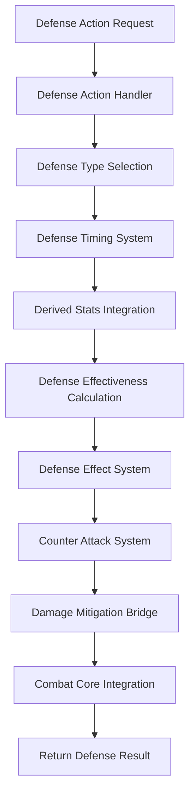

# Defense Action System

## 📋 **Tổng Quan**

Defense Action System là component chuyên biệt của Action Core, tập trung vào việc xử lý các actions phòng thủ trong combat bao gồm blocking, parrying, dodging, shielding, counter-attacking và defensive buffs. Hệ thống này tích hợp chặt chẽ với Element Core để sử dụng derived stats cho defensive effectiveness.

## 🎯 **Vấn Đề Cần Giải Quyết**

### **1. Defense Action Handling**
- **Defense Actions**: Xử lý các action phòng thủ với defender là người thực hiện
- **Defense Types**: Block, Parry, Dodge, Shield, Counter-attack, Defensive Buff
- **Defense Effectiveness**: Ảnh hưởng bởi derived stats từ Element Core
- **Damage Mitigation**: Tích hợp với Combat Core cho damage reduction

### **2. Derived Stats Integration**
- **parry_rate**: Ảnh hưởng đến khả năng parry
- **block_rate**: Ảnh hưởng đến khả năng block
- **dodge_rate**: Ảnh hưởng đến khả năng dodge
- **defense_point**: Ảnh hưởng đến defensive power
- **status_resistance**: Ảnh hưởng đến khả năng kháng status effects

### **3. Defense Mechanics**
- **Defense Timing**: Thời gian thực hiện defense action
- **Defense Duration**: Thời gian hiệu lực của defense
- **Defense Cooldown**: Thời gian phục hồi defense action
- **Defense Resource**: Tài nguyên cần thiết cho defense

## 🏗️ **Architecture**

### **Core Components**

```rust
pub struct DefenseActionSystem {
    // Core components
    defense_action_handler: DefenseActionHandler,
    defense_timing_system: DefenseTimingSystem,
    defense_effect_system: DefenseEffectSystem,
    counter_attack_system: CounterAttackSystem,
    
    // Derived stats integration
    stats_integration: DerivedStatsIntegration,
    defense_effectiveness_calculator: DefenseEffectivenessCalculator,
    
    // Performance optimization
    defense_cache: DefenseCache,
    batch_processor: BatchProcessor,
    memory_pool: MemoryPool,
    
    // Configuration
    config: DefenseActionConfig,
}
```

### **Defense Action Flow**



## 🔧 **Core Components**

### **1. Defense Action Handler**

```rust
pub struct DefenseActionHandler {
    action_registry: ActionRegistry,
    stats_integration: DerivedStatsIntegration,
    defense_effectiveness_calculator: DefenseEffectivenessCalculator,
    damage_mitigation_bridge: DamageMitigationBridge,
}

impl DefenseActionHandler {
    pub async fn handle_defense_action(
        &mut self,
        action_id: ActionId,
        defender: &mut Actor,
        incoming_attack: &IncomingAttack,
        action_context: &ActionContext
    ) -> Result<DefenseResult, DefenseError> {
        // Get action definition
        let action = self.action_registry.get_action(&action_id)
            .ok_or_else(|| DefenseError::ActionNotFound(action_id))?;
        
        // Validate action type
        if !matches!(action.get_type(), ActionType::Defense) {
            return Err(DefenseError::InvalidActionType(action_id));
        }
        
        // Get derived stats for defense effectiveness
        let derived_stats = self.stats_integration.get_derived_stats(defender).await?;
        
        // Calculate defense effectiveness
        let defense_effectiveness = self.defense_effectiveness_calculator
            .calculate_defense_effectiveness(&action, &derived_stats, incoming_attack).await?;
        
        // Execute defense action
        let defense_result = self.execute_defense_action(
            &action,
            defender,
            incoming_attack,
            &defense_effectiveness,
            action_context
        ).await?;
        
        Ok(defense_result)
    }
    
    async fn execute_defense_action(
        &self,
        action: &dyn Action,
        defender: &mut Actor,
        incoming_attack: &IncomingAttack,
        effectiveness: &DefenseEffectiveness,
        context: &ActionContext
    ) -> Result<DefenseResult, DefenseError> {
        let mut defense_result = DefenseResult::new();
        
        // Calculate defense success chance
        let success_chance = self.calculate_defense_success_chance(
            action,
            effectiveness,
            incoming_attack
        ).await?;
        
        // Roll for defense success
        let defense_success = self.roll_defense_success(success_chance);
        
        if defense_success {
            // Apply defense effects
            self.apply_defense_effects(action, defender, incoming_attack, effectiveness).await?;
            
            // Calculate damage mitigation
            let damage_mitigation = self.calculate_damage_mitigation(
                action,
                effectiveness,
                incoming_attack
            ).await?;
            
            // Apply damage mitigation
            defense_result.damage_mitigation = damage_mitigation;
            defense_result.defense_success = true;
            
            // Check for counter-attack opportunity
            if self.can_counter_attack(action, effectiveness, incoming_attack).await? {
                let counter_attack = self.generate_counter_attack(
                    action,
                    defender,
                    incoming_attack,
                    effectiveness
                ).await?;
                
                defense_result.counter_attack = Some(counter_attack);
            }
        } else {
            defense_result.defense_success = false;
            defense_result.defense_failure_reason = Some(DefenseFailureReason::Missed);
        }
        
        Ok(defense_result)
    }
}
```

### **2. Defense Timing System**

```rust
pub struct DefenseTimingSystem {
    timing_calculator: DefenseTimingCalculator,
    timing_validator: DefenseTimingValidator,
    timing_cache: DefenseTimingCache,
}

impl DefenseTimingSystem {
    pub async fn calculate_defense_timing(
        &self,
        action: &dyn Action,
        defender: &Actor,
        incoming_attack: &IncomingAttack
    ) -> Result<DefenseTiming, DefenseError> {
        // Get action timing requirements
        let execution_duration = action.get_execution_duration();
        let cooldown_duration = action.get_cooldown_duration();
        
        // Calculate defense timing based on incoming attack
        let defense_timing = self.timing_calculator.calculate_defense_timing(
            execution_duration,
            cooldown_duration,
            incoming_attack,
            defender
        ).await?;
        
        // Validate timing constraints
        self.timing_validator.validate_defense_timing(&defense_timing)?;
        
        Ok(defense_timing)
    }
}

pub struct DefenseTiming {
    pub execution_duration: Duration,
    pub cooldown_duration: Duration,
    pub defense_window: Duration,
    pub counter_attack_window: Duration,
    pub timing_bonus: f64,
}

pub struct DefenseTimingCalculator {
    stats_integration: DerivedStatsIntegration,
    timing_config: DefenseTimingConfig,
}

impl DefenseTimingCalculator {
    pub async fn calculate_defense_timing(
        &self,
        execution_duration: DurationRange,
        cooldown_duration: CooldownConfig,
        incoming_attack: &IncomingAttack,
        defender: &Actor
    ) -> Result<DefenseTiming, DefenseError> {
        // Get derived stats
        let derived_stats = self.stats_integration.get_derived_stats(defender).await?;
        
        // Calculate execution duration with stats
        let execution_duration = self.calculate_execution_duration(
            execution_duration,
            &derived_stats
        ).await?;
        
        // Calculate cooldown duration with stats
        let cooldown_duration = self.calculate_cooldown_duration(
            cooldown_duration,
            &derived_stats
        ).await?;
        
        // Calculate defense window based on incoming attack
        let defense_window = self.calculate_defense_window(
            incoming_attack,
            &derived_stats
        ).await?;
        
        // Calculate counter-attack window
        let counter_attack_window = self.calculate_counter_attack_window(
            incoming_attack,
            &derived_stats
        ).await?;
        
        // Calculate timing bonus
        let timing_bonus = self.calculate_timing_bonus(
            &derived_stats,
            incoming_attack
        ).await?;
        
        Ok(DefenseTiming {
            execution_duration,
            cooldown_duration,
            defense_window,
            counter_attack_window,
            timing_bonus,
        })
    }
}
```

### **3. Defense Effect System**

```rust
pub struct DefenseEffectSystem {
    effect_registry: DefenseEffectRegistry,
    effect_calculator: DefenseEffectCalculator,
    effect_applier: DefenseEffectApplier,
}

impl DefenseEffectSystem {
    pub async fn apply_defense_effects(
        &self,
        action: &dyn Action,
        defender: &mut Actor,
        incoming_attack: &IncomingAttack,
        effectiveness: &DefenseEffectiveness
    ) -> Result<Vec<DefenseEffectResult>, DefenseError> {
        let mut results = Vec::new();
        
        // Get defense effects from action
        let defense_effects = action.get_defense_effects();
        
        for effect in defense_effects {
            let effect_result = self.apply_defense_effect(
                effect,
                defender,
                incoming_attack,
                effectiveness
            ).await?;
            
            results.push(effect_result);
        }
        
        Ok(results)
    }
    
    async fn apply_defense_effect(
        &self,
        effect: &DefenseEffect,
        defender: &mut Actor,
        incoming_attack: &IncomingAttack,
        effectiveness: &DefenseEffectiveness
    ) -> Result<DefenseEffectResult, DefenseError> {
        match effect.effect_type {
            DefenseEffectType::Block => {
                self.apply_block_effect(effect, defender, incoming_attack, effectiveness).await
            },
            DefenseEffectType::Parry => {
                self.apply_parry_effect(effect, defender, incoming_attack, effectiveness).await
            },
            DefenseEffectType::Dodge => {
                self.apply_dodge_effect(effect, defender, incoming_attack, effectiveness).await
            },
            DefenseEffectType::Shield => {
                self.apply_shield_effect(effect, defender, incoming_attack, effectiveness).await
            },
            DefenseEffectType::DefensiveBuff => {
                self.apply_defensive_buff_effect(effect, defender, incoming_attack, effectiveness).await
            },
            DefenseEffectType::CounterAttack => {
                self.apply_counter_attack_effect(effect, defender, incoming_attack, effectiveness).await
            },
        }
    }
}

pub struct DefenseEffect {
    pub effect_id: String,
    pub effect_type: DefenseEffectType,
    pub magnitude: f64,
    pub duration: Duration,
    pub trigger_chance: f64,
    pub conditions: Vec<DefenseEffectCondition>,
}

pub enum DefenseEffectType {
    Block,          // Chặn đòn
    Parry,          // Gạt đòn
    Dodge,          // Né đòn
    Shield,         // Khiên phòng thủ
    DefensiveBuff,  // Buff phòng thủ
    CounterAttack,  // Phản công
}

pub struct DefenseEffectCondition {
    pub condition: String,
    pub condition_type: DefenseEffectConditionType,
    pub condition_value: f64,
}

pub enum DefenseEffectConditionType {
    IncomingDamageType,
    IncomingElementType,
    DefenderHealth,
    DefenderStatus,
    Timing,
    Custom(String),
}
```

### **4. Counter Attack System**

```rust
pub struct CounterAttackSystem {
    counter_attack_generator: CounterAttackGenerator,
    counter_attack_calculator: CounterAttackCalculator,
    counter_attack_validator: CounterAttackValidator,
}

impl CounterAttackSystem {
    pub async fn generate_counter_attack(
        &self,
        defense_action: &dyn Action,
        defender: &Actor,
        incoming_attack: &IncomingAttack,
        effectiveness: &DefenseEffectiveness
    ) -> Result<CounterAttack, DefenseError> {
        // Check if counter-attack is possible
        if !self.can_counter_attack(defense_action, effectiveness, incoming_attack).await? {
            return Err(DefenseError::CounterAttackNotPossible);
        }
        
        // Generate counter-attack based on defense action
        let counter_attack = self.counter_attack_generator.generate_counter_attack(
            defense_action,
            defender,
            incoming_attack,
            effectiveness
        ).await?;
        
        // Calculate counter-attack effectiveness
        let counter_effectiveness = self.counter_attack_calculator
            .calculate_counter_attack_effectiveness(
                &counter_attack,
                defender,
                incoming_attack,
                effectiveness
            ).await?;
        
        // Validate counter-attack
        self.counter_attack_validator.validate_counter_attack(
            &counter_attack,
            &counter_effectiveness
        )?;
        
        Ok(counter_attack)
    }
    
    async fn can_counter_attack(
        &self,
        defense_action: &dyn Action,
        effectiveness: &DefenseEffectiveness,
        incoming_attack: &IncomingAttack
    ) -> Result<bool, DefenseError> {
        // Check if defense action allows counter-attack
        if !defense_action.allows_counter_attack() {
            return Ok(false);
        }
        
        // Check if effectiveness is high enough
        if effectiveness.counter_attack_chance < 0.3 {
            return Ok(false);
        }
        
        // Check if incoming attack is counter-attackable
        if !incoming_attack.is_counter_attackable() {
            return Ok(false);
        }
        
        Ok(true)
    }
}

pub struct CounterAttack {
    pub attack_id: String,
    pub attack_type: CounterAttackType,
    pub base_damage: f64,
    pub damage_multiplier: f64,
    pub element_type: String,
    pub target: AttackTarget,
    pub timing: CounterAttackTiming,
}

pub enum CounterAttackType {
    Immediate,      // Phản công ngay lập tức
    Delayed,        // Phản công có độ trễ
    Conditional,    // Phản công có điều kiện
    Combo,          // Phản công combo
}

pub struct CounterAttackTiming {
    pub execution_duration: Duration,
    pub cooldown_duration: Duration,
    pub timing_bonus: f64,
    pub timing_penalty: f64,
}
```

## 🛡️ **Defense Action Types**

### **1. Block Actions**

```rust
pub struct BlockAction {
    metadata: ActionMetadata,
    block_properties: BlockProperties,
    resource_requirements: Vec<ResourceRequirement>,
    execution_conditions: Vec<ExecutionCondition>,
    target_requirements: TargetRequirements,
    effects: Vec<ActionEffect>,
}

pub struct BlockProperties {
    pub block_rate: f64,
    pub block_strength: f64,
    pub block_break: f64,
    pub block_shred: f64,
    pub block_duration: Duration,
    pub block_cooldown: Duration,
    pub block_resource_cost: f64,
}

impl Action for BlockAction {
    fn get_metadata(&self) -> &ActionMetadata {
        &self.metadata
    }
    
    fn get_category(&self) -> ActionCategory {
        ActionCategory::Combat
    }
    
    fn get_type(&self) -> ActionType {
        ActionType::Defense
    }
    
    fn get_resource_requirements(&self) -> &[ResourceRequirement] {
        &self.resource_requirements
    }
    
    fn get_execution_duration(&self) -> DurationRange {
        DurationRange {
            min: Duration::from_millis(100),
            max: Duration::from_millis(500),
            base: Duration::from_millis(300),
        }
    }
    
    fn get_cooldown_duration(&self) -> CooldownConfig {
        CooldownConfig {
            min: Duration::from_millis(1000),
            max: Duration::from_millis(3000),
            base: Duration::from_millis(2000),
            cooldown_conditions: vec![],
            interrupt_affects_cooldown: false,
        }
    }
    
    fn get_interrupt_conditions(&self) -> &[InterruptCondition] {
        &[]
    }
    
    fn get_execution_conditions(&self) -> &[ExecutionCondition] {
        &self.execution_conditions
    }
    
    fn get_target_requirements(&self) -> &TargetRequirements {
        &self.target_requirements
    }
    
    fn get_effects(&self) -> &[ActionEffect] {
        &self.effects
    }
    
    fn validate(&self, context: &ActionContext) -> ValidationResult {
        let mut result = ValidationResult::new();
        
        // Validate block-specific conditions
        if context.defender.get_health_percentage() < 0.1 {
            result.add_error(ActionError::HealthTooLow);
        }
        
        // Validate resource requirements
        for requirement in &self.resource_requirements {
            if !self.validate_resource_requirement(requirement, context) {
                result.add_error(ActionError::InsufficientResource(
                    requirement.resource_type.clone()
                ));
            }
        }
        
        result
    }
    
    fn execute(&self, context: &mut ActionContext) -> ActionResult {
        let mut result = ActionResult::new();
        
        // Consume resources
        self.consume_resources(context)?;
        
        // Calculate block effectiveness
        let block_effectiveness = self.calculate_block_effectiveness(context)?;
        
        // Apply block effects
        self.apply_block_effects(context, &block_effectiveness)?;
        
        result.success = true;
        result.defense_result = Some(DefenseResult {
            defense_type: DefenseType::Block,
            defense_success: true,
            damage_mitigation: block_effectiveness.damage_mitigation,
            counter_attack: None,
            defense_failure_reason: None,
        });
        
        Ok(result)
    }
}
```

### **2. Parry Actions**

```rust
pub struct ParryAction {
    metadata: ActionMetadata,
    parry_properties: ParryProperties,
    resource_requirements: Vec<ResourceRequirement>,
    execution_conditions: Vec<ExecutionCondition>,
    target_requirements: TargetRequirements,
    effects: Vec<ActionEffect>,
}

pub struct ParryProperties {
    pub parry_rate: f64,
    pub parry_strength: f64,
    pub parry_break: f64,
    pub parry_shred: f64,
    pub parry_duration: Duration,
    pub parry_cooldown: Duration,
    pub parry_resource_cost: f64,
    pub counter_attack_chance: f64,
}

impl Action for ParryAction {
    fn get_metadata(&self) -> &ActionMetadata {
        &self.metadata
    }
    
    fn get_category(&self) -> ActionCategory {
        ActionCategory::Combat
    }
    
    fn get_type(&self) -> ActionType {
        ActionType::Defense
    }
    
    fn get_resource_requirements(&self) -> &[ResourceRequirement] {
        &self.resource_requirements
    }
    
    fn get_execution_duration(&self) -> DurationRange {
        DurationRange {
            min: Duration::from_millis(50),
            max: Duration::from_millis(200),
            base: Duration::from_millis(100),
        }
    }
    
    fn get_cooldown_duration(&self) -> CooldownConfig {
        CooldownConfig {
            min: Duration::from_millis(500),
            max: Duration::from_millis(1500),
            base: Duration::from_millis(1000),
            cooldown_conditions: vec![],
            interrupt_affects_cooldown: false,
        }
    }
    
    fn get_interrupt_conditions(&self) -> &[InterruptCondition] {
        &[]
    }
    
    fn get_execution_conditions(&self) -> &[ExecutionCondition] {
        &self.execution_conditions
    }
    
    fn get_target_requirements(&self) -> &TargetRequirements {
        &self.target_requirements
    }
    
    fn get_effects(&self) -> &[ActionEffect] {
        &self.effects
    }
    
    fn validate(&self, context: &ActionContext) -> ValidationResult {
        let mut result = ValidationResult::new();
        
        // Validate parry-specific conditions
        if context.defender.get_health_percentage() < 0.05 {
            result.add_error(ActionError::HealthTooLow);
        }
        
        // Validate timing requirements
        if !self.validate_timing_requirements(context) {
            result.add_error(ActionError::TimingRequirementNotMet);
        }
        
        result
    }
    
    fn execute(&self, context: &mut ActionContext) -> ActionResult {
        let mut result = ActionResult::new();
        
        // Consume resources
        self.consume_resources(context)?;
        
        // Calculate parry effectiveness
        let parry_effectiveness = self.calculate_parry_effectiveness(context)?;
        
        // Apply parry effects
        self.apply_parry_effects(context, &parry_effectiveness)?;
        
        // Check for counter-attack opportunity
        if self.can_counter_attack(&parry_effectiveness) {
            let counter_attack = self.generate_counter_attack(context, &parry_effectiveness)?;
            result.counter_attack = Some(counter_attack);
        }
        
        result.success = true;
        result.defense_result = Some(DefenseResult {
            defense_type: DefenseType::Parry,
            defense_success: true,
            damage_mitigation: parry_effectiveness.damage_mitigation,
            counter_attack: result.counter_attack.clone(),
            defense_failure_reason: None,
        });
        
        Ok(result)
    }
}
```

### **3. Dodge Actions**

```rust
pub struct DodgeAction {
    metadata: ActionMetadata,
    dodge_properties: DodgeProperties,
    resource_requirements: Vec<ResourceRequirement>,
    execution_conditions: Vec<ExecutionCondition>,
    target_requirements: TargetRequirements,
    effects: Vec<ActionEffect>,
}

pub struct DodgeProperties {
    pub dodge_rate: f64,
    pub dodge_distance: f64,
    pub dodge_duration: Duration,
    pub dodge_cooldown: Duration,
    pub dodge_resource_cost: f64,
    pub dodge_speed_multiplier: f64,
}

impl Action for DodgeAction {
    fn get_metadata(&self) -> &ActionMetadata {
        &self.metadata
    }
    
    fn get_category(&self) -> ActionCategory {
        ActionCategory::Combat
    }
    
    fn get_type(&self) -> ActionType {
        ActionType::Defense
    }
    
    fn get_resource_requirements(&self) -> &[ResourceRequirement] {
        &self.resource_requirements
    }
    
    fn get_execution_duration(&self) -> DurationRange {
        DurationRange {
            min: Duration::from_millis(200),
            max: Duration::from_millis(800),
            base: Duration::from_millis(400),
        }
    }
    
    fn get_cooldown_duration(&self) -> CooldownConfig {
        CooldownConfig {
            min: Duration::from_millis(2000),
            max: Duration::from_millis(5000),
            base: Duration::from_millis(3000),
            cooldown_conditions: vec![],
            interrupt_affects_cooldown: false,
        }
    }
    
    fn get_interrupt_conditions(&self) -> &[InterruptCondition] {
        &[]
    }
    
    fn get_execution_conditions(&self) -> &[ExecutionCondition] {
        &self.execution_conditions
    }
    
    fn get_target_requirements(&self) -> &TargetRequirements {
        &self.target_requirements
    }
    
    fn get_effects(&self) -> &[ActionEffect] {
        &self.effects
    }
    
    fn validate(&self, context: &ActionContext) -> ValidationResult {
        let mut result = ValidationResult::new();
        
        // Validate dodge-specific conditions
        if context.defender.get_health_percentage() < 0.2 {
            result.add_error(ActionError::HealthTooLow);
        }
        
        // Validate movement requirements
        if !self.validate_movement_requirements(context) {
            result.add_error(ActionError::MovementRequirementNotMet);
        }
        
        result
    }
    
    fn execute(&self, context: &mut ActionContext) -> ActionResult {
        let mut result = ActionResult::new();
        
        // Consume resources
        self.consume_resources(context)?;
        
        // Calculate dodge effectiveness
        let dodge_effectiveness = self.calculate_dodge_effectiveness(context)?;
        
        // Apply dodge effects
        self.apply_dodge_effects(context, &dodge_effectiveness)?;
        
        // Move defender
        self.move_defender(context, &dodge_effectiveness)?;
        
        result.success = true;
        result.defense_result = Some(DefenseResult {
            defense_type: DefenseType::Dodge,
            defense_success: true,
            damage_mitigation: 1.0, // Complete avoidance
            counter_attack: None,
            defense_failure_reason: None,
        });
        
        Ok(result)
    }
}
```

### **4. Shield Actions**

```rust
pub struct ShieldAction {
    metadata: ActionMetadata,
    shield_properties: ShieldProperties,
    resource_requirements: Vec<ResourceRequirement>,
    execution_conditions: Vec<ExecutionCondition>,
    target_requirements: TargetRequirements,
    effects: Vec<ActionEffect>,
}

pub struct ShieldProperties {
    pub shield_strength: f64,
    pub shield_durability: f64,
    pub shield_absorption: f64,
    pub shield_duration: Duration,
    pub shield_cooldown: Duration,
    pub shield_resource_cost: f64,
    pub shield_element_resistance: HashMap<String, f64>,
}

impl Action for ShieldAction {
    fn get_metadata(&self) -> &ActionMetadata {
        &self.metadata
    }
    
    fn get_category(&self) -> ActionCategory {
        ActionCategory::Combat
    }
    
    fn get_type(&self) -> ActionType {
        ActionType::Defense
    }
    
    fn get_resource_requirements(&self) -> &[ResourceRequirement] {
        &self.resource_requirements
    }
    
    fn get_execution_duration(&self) -> DurationRange {
        DurationRange {
            min: Duration::from_millis(500),
            max: Duration::from_millis(2000),
            base: Duration::from_millis(1000),
        }
    }
    
    fn get_cooldown_duration(&self) -> CooldownConfig {
        CooldownConfig {
            min: Duration::from_millis(5000),
            max: Duration::from_millis(15000),
            base: Duration::from_millis(10000),
            cooldown_conditions: vec![],
            interrupt_affects_cooldown: false,
        }
    }
    
    fn get_interrupt_conditions(&self) -> &[InterruptCondition] {
        &[]
    }
    
    fn get_execution_conditions(&self) -> &[ExecutionCondition] {
        &self.execution_conditions
    }
    
    fn get_target_requirements(&self) -> &TargetRequirements {
        &self.target_requirements
    }
    
    fn get_effects(&self) -> &[ActionEffect] {
        &self.effects
    }
    
    fn validate(&self, context: &ActionContext) -> ValidationResult {
        let mut result = ValidationResult::new();
        
        // Validate shield-specific conditions
        if context.defender.get_health_percentage() < 0.3 {
            result.add_error(ActionError::HealthTooLow);
        }
        
        // Validate shield availability
        if !self.validate_shield_availability(context) {
            result.add_error(ActionError::ShieldNotAvailable);
        }
        
        result
    }
    
    fn execute(&self, context: &mut ActionContext) -> ActionResult {
        let mut result = ActionResult::new();
        
        // Consume resources
        self.consume_resources(context)?;
        
        // Calculate shield effectiveness
        let shield_effectiveness = self.calculate_shield_effectiveness(context)?;
        
        // Apply shield effects
        self.apply_shield_effects(context, &shield_effectiveness)?;
        
        // Activate shield
        self.activate_shield(context, &shield_effectiveness)?;
        
        result.success = true;
        result.defense_result = Some(DefenseResult {
            defense_type: DefenseType::Shield,
            defense_success: true,
            damage_mitigation: shield_effectiveness.damage_mitigation,
            counter_attack: None,
            defense_failure_reason: None,
        });
        
        Ok(result)
    }
}
```

## 🎯 **Defense Action Ideas**

### **1. Basic Defense Actions**

#### **A. Block Actions**
- **Basic Block**: Chặn đòn cơ bản, giảm 50% damage
- **Heavy Block**: Chặn đòn nặng, giảm 80% damage nhưng chậm
- **Elemental Block**: Chặn đòn nguyên tố, giảm damage nguyên tố
- **Counter Block**: Chặn đòn và phản công ngay lập tức

#### **B. Parry Actions**
- **Basic Parry**: Gạt đòn cơ bản, giảm 70% damage
- **Precise Parry**: Gạt đòn chính xác, giảm 90% damage
- **Elemental Parry**: Gạt đòn nguyên tố, giảm damage nguyên tố
- **Counter Parry**: Gạt đòn và phản công với bonus damage

#### **C. Dodge Actions**
- **Basic Dodge**: Né đòn cơ bản, tránh hoàn toàn damage
- **Quick Dodge**: Né đòn nhanh, tránh damage và tăng tốc độ
- **Elemental Dodge**: Né đòn nguyên tố, tránh damage nguyên tố
- **Counter Dodge**: Né đòn và phản công từ phía sau

### **2. Advanced Defense Actions**

#### **A. Shield Actions**
- **Elemental Shield**: Khiên nguyên tố, giảm damage nguyên tố
- **Reflective Shield**: Khiên phản xạ, phản xạ damage về attacker
- **Absorptive Shield**: Khiên hấp thụ, hấp thụ damage thành HP
- **Explosive Shield**: Khiên nổ, nổ khi bị phá vỡ

#### **B. Defensive Buff Actions**
- **Defense Boost**: Tăng defense tạm thời
- **Elemental Resistance**: Tăng kháng nguyên tố
- **Status Immunity**: Miễn nhiễm status effects
- **Damage Reflection**: Phản xạ damage về attacker

#### **C. Counter Attack Actions**
- **Immediate Counter**: Phản công ngay lập tức
- **Delayed Counter**: Phản công có độ trễ
- **Elemental Counter**: Phản công nguyên tố
- **Combo Counter**: Phản công combo

### **3. Specialized Defense Actions**

#### **A. Element-Specific Defense**
- **Fire Defense**: Phòng thủ chuyên biệt cho hỏa
- **Water Defense**: Phòng thủ chuyên biệt cho thủy
- **Earth Defense**: Phòng thủ chuyên biệt cho thổ
- **Wood Defense**: Phòng thủ chuyên biệt cho mộc
- **Metal Defense**: Phòng thủ chuyên biệt cho kim

#### **B. Class-Specific Defense**
- **Warrior Defense**: Phòng thủ cho chiến binh
- **Mage Defense**: Phòng thủ cho pháp sư
- **Archer Defense**: Phòng thủ cho cung thủ
- **Assassin Defense**: Phòng thủ cho sát thủ

#### **C. Cultivation-Specific Defense**
- **Qi Defense**: Phòng thủ bằng linh khí
- **Spiritual Defense**: Phòng thủ bằng tinh thần
- **Physical Defense**: Phòng thủ bằng thể chất
- **Mental Defense**: Phòng thủ bằng tinh thần

## 🔧 **Implementation Strategy**

### **Phase 1: Basic Defense Actions (2-3 tuần)**
1. **Block Actions**: Basic, Heavy, Elemental, Counter
2. **Parry Actions**: Basic, Precise, Elemental, Counter
3. **Dodge Actions**: Basic, Quick, Elemental, Counter

### **Phase 2: Advanced Defense Actions (2-3 tuần)**
1. **Shield Actions**: Elemental, Reflective, Absorptive, Explosive
2. **Defensive Buff Actions**: Defense Boost, Elemental Resistance, Status Immunity
3. **Counter Attack Actions**: Immediate, Delayed, Elemental, Combo

### **Phase 3: Specialized Defense Actions (2-3 tuần)**
1. **Element-Specific Defense**: Fire, Water, Earth, Wood, Metal
2. **Class-Specific Defense**: Warrior, Mage, Archer, Assassin
3. **Cultivation-Specific Defense**: Qi, Spiritual, Physical, Mental

### **Phase 4: Integration & Testing (1-2 tuần)**
1. **Combat Core Integration**: Damage mitigation, counter-attack system
2. **Element Core Integration**: Elemental defense, resistance calculations
3. **Performance Testing**: Defense action performance, timing accuracy
4. **Balance Testing**: Defense effectiveness, counter-attack balance

## 📊 **Performance Considerations**

### **Defense Timing Accuracy**
- **Precise Timing**: Defense actions cần timing chính xác
- **Timing Windows**: Defense windows cần được tính toán chính xác
- **Latency Compensation**: Bù trừ latency cho defense actions

### **Counter-Attack System**
- **Counter-Attack Generation**: Tạo counter-attack nhanh chóng
- **Counter-Attack Validation**: Validate counter-attack effectiveness
- **Counter-Attack Execution**: Execute counter-attack với timing chính xác

### **Defense Effectiveness**
- **Defense Calculation**: Tính toán defense effectiveness real-time
- **Damage Mitigation**: Tính toán damage mitigation chính xác
- **Status Effect Resistance**: Tính toán status effect resistance

## 🧪 **Testing Strategy**

### **Unit Tests**
- **Defense Action Validation**: Test defense action validation
- **Defense Timing**: Test defense timing calculations
- **Defense Effectiveness**: Test defense effectiveness calculations
- **Counter-Attack System**: Test counter-attack generation và execution

### **Integration Tests**
- **Combat Core Integration**: Test defense integration với Combat Core
- **Element Core Integration**: Test elemental defense integration
- **Action Core Integration**: Test defense action integration

### **Performance Tests**
- **Defense Timing**: Test defense timing accuracy
- **Counter-Attack Performance**: Test counter-attack generation performance
- **Defense Calculation Performance**: Test defense calculation performance

---

**Last Updated**: 2025-01-27  
**Version**: 1.0  
**Status**: Design Phase  
**Maintainer**: Chaos World Team
