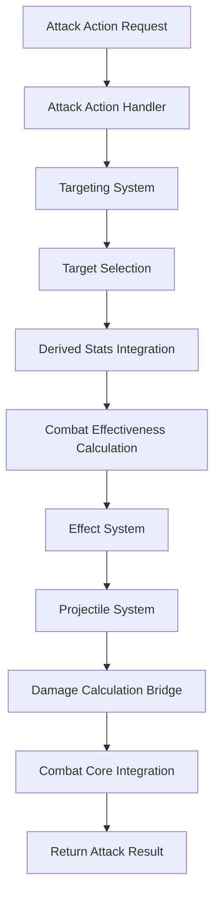
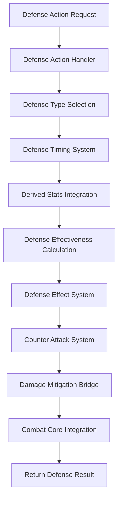

# Attack vs Defense Action Comparison

## 📋 **Tổng Quan**

Document này so sánh chi tiết giữa Attack Action System và Defense Action System, chỉ ra những điểm tương đồng và khác biệt trong thiết kế, implementation và gameplay mechanics.

## 🔄 **Nguyên Lý Cơ Bản - Tương Đồng**

### **1. Core Architecture**

#### **A. System Structure**
```rust
// Attack Action System
pub struct CombatActionSystem {
    attack_action_handler: AttackActionHandler,
    targeting_system: TargetingSystem,
    effect_system: EffectSystem,
    projectile_system: ProjectileSystem,
    stats_integration: DerivedStatsIntegration,
    combat_effectiveness_calculator: CombatEffectivenessCalculator,
    combat_cache: CombatCache,
    batch_processor: BatchProcessor,
    memory_pool: MemoryPool,
    config: CombatActionConfig,
}

// Defense Action System
pub struct DefenseActionSystem {
    defense_action_handler: DefenseActionHandler,
    defense_timing_system: DefenseTimingSystem,
    defense_effect_system: DefenseEffectSystem,
    counter_attack_system: CounterAttackSystem,
    stats_integration: DerivedStatsIntegration,
    defense_effectiveness_calculator: DefenseEffectivenessCalculator,
    defense_cache: DefenseCache,
    batch_processor: BatchProcessor,
    memory_pool: MemoryPool,
    config: DefenseActionConfig,
}
```

#### **B. Action Handler Pattern**
```rust
// Attack Action Handler
impl AttackActionHandler {
    pub async fn handle_attack_action(
        &mut self,
        action_id: ActionId,
        attacker: &mut Actor,
        target_context: &TargetContext,
        action_context: &ActionContext
    ) -> Result<AttackResult, CombatError>
}

// Defense Action Handler
impl DefenseActionHandler {
    pub async fn handle_defense_action(
        &mut self,
        action_id: ActionId,
        defender: &mut Actor,
        incoming_attack: &IncomingAttack,
        action_context: &ActionContext
    ) -> Result<DefenseResult, DefenseError>
}
```

### **2. Action Flow Pattern**

#### **A. Attack Action Flow**


#### **B. Defense Action Flow**


### **3. Derived Stats Integration**

#### **A. Common Derived Stats**
```rust
// Both systems use the same derived stats
pub struct DerivedStatsSnapshot {
    pub element_derived_stats: ElementDerivedStats,
    pub combat_derived_stats: CombatDerivedStats,
    pub resource_stats: ResourceStats,
}

// Common stats used by both systems
pub struct ElementDerivedStats {
    pub skill_execution_speed: f64,
    pub skill_cooldown_reduction: f64,
    pub skill_effectiveness: f64,
    pub resource_efficiency: f64,
    pub resource_regeneration: f64,
    // ... other stats
}
```

#### **B. Effectiveness Calculation Pattern**
```rust
// Attack Effectiveness
fn calculate_attack_effectiveness(
    action: &dyn Action,
    attacker: &Actor,
    target: &Actor,
    derived_stats: &DerivedStatsSnapshot
) -> Result<AttackEffectiveness, CombatError>

// Defense Effectiveness
fn calculate_defense_effectiveness(
    action: &dyn Action,
    defender: &Actor,
    incoming_attack: &IncomingAttack,
    derived_stats: &DerivedStatsSnapshot
) -> Result<DefenseEffectiveness, DefenseError>
```

### **4. Action Definition System**

#### **A. Common Action Interface**
```rust
// Both systems implement the same Action trait
pub trait Action {
    fn get_metadata(&self) -> &ActionMetadata;
    fn get_category(&self) -> ActionCategory;
    fn get_type(&self) -> ActionType;
    fn get_resource_requirements(&self) -> &[ResourceRequirement];
    fn get_execution_duration(&self) -> DurationRange;
    fn get_cooldown_duration(&self) -> CooldownConfig;
    fn get_interrupt_conditions(&self) -> &[InterruptCondition];
    fn get_execution_conditions(&self) -> &[ExecutionCondition];
    fn get_target_requirements(&self) -> &TargetRequirements;
    fn get_effects(&self) -> &[ActionEffect];
    fn validate(&self, context: &ActionContext) -> ValidationResult;
    fn execute(&self, context: &mut ActionContext) -> ActionResult;
}
```

#### **B. Action Categories**
```rust
pub enum ActionType {
    Attack,    // Used by Attack Action System
    Defense,   // Used by Defense Action System
    Support,   // Used by both systems
    Movement,  // Used by both systems
    // ... other types
}
```

### **5. Resource Management**

#### **A. Resource Consumption Pattern**
```rust
// Both systems consume resources the same way
fn consume_resources(
    &self,
    context: &mut ActionContext
) -> Result<(), ActionError> {
    for requirement in &self.resource_requirements {
        let current_value = context.actor.get_resource(&requirement.resource_type)?;
        let required_value = requirement.calculate_required_value(context)?;
        
        if current_value < required_value {
            return Err(ActionError::InsufficientResource(
                requirement.resource_type.clone()
            ));
        }
        
        context.actor.consume_resource(
            &requirement.resource_type,
            required_value
        )?;
    }
    Ok(())
}
```

#### **B. Resource Efficiency**
```rust
// Both systems use resource efficiency the same way
fn calculate_resource_cost(
    base_cost: f64,
    element_mastery: f64,
    resource_efficiency: f64
) -> f64 {
    let mastery_bonus = element_mastery * 0.0003; // 0.03% per mastery point
    let efficiency_bonus = resource_efficiency * 0.1; // 10% per efficiency
    
    base_cost * (1.0 - (mastery_bonus + efficiency_bonus).min(0.3)) // Max 30% reduction
}
```

### **6. Timing System**

#### **A. Execution Duration**
```rust
// Both systems calculate execution duration the same way
fn calculate_execution_duration(
    base_duration: DurationRange,
    element_mastery: f64,
    skill_execution_speed: f64
) -> Duration {
    let mastery_bonus = element_mastery * 0.001; // 0.1% per mastery point
    let speed_bonus = skill_execution_speed * 0.1; // 10% per speed
    
    let total_bonus = mastery_bonus + speed_bonus;
    let duration_multiplier = 1.0 - total_bonus.min(0.5); // Max 50% reduction
    
    base_duration.base * duration_multiplier
}
```

#### **B. Cooldown Duration**
```rust
// Both systems calculate cooldown duration the same way
fn calculate_cooldown_duration(
    base_cooldown: CooldownConfig,
    element_mastery: f64,
    skill_cooldown_reduction: f64
) -> Duration {
    let mastery_bonus = element_mastery * 0.0005; // 0.05% per mastery point
    let reduction_bonus = skill_cooldown_reduction * 0.1; // 10% per reduction
    
    let total_bonus = mastery_bonus + reduction_bonus;
    let cooldown_multiplier = 1.0 - total_bonus.min(0.5); // Max 50% reduction
    
    base_cooldown.base * cooldown_multiplier
}
```

## ⚔️ **Khác Biệt Chính - Attack vs Defense**

### **1. Action Purpose**

#### **A. Attack Actions**
- **Mục đích**: Gây damage cho target
- **Target**: Enemy actors
- **Result**: Damage, status effects, debuffs
- **Timing**: Proactive (player initiates)

#### **B. Defense Actions**
- **Mục đích**: Giảm damage từ incoming attack
- **Target**: Self (defender)
- **Result**: Damage mitigation, status resistance, counter-attack
- **Timing**: Reactive (player responds to incoming attack)

### **2. Targeting System**

#### **A. Attack Targeting**
```rust
pub struct AttackTargeting {
    pub target_type: TargetType,
    pub target_count: u32,
    pub target_selection: TargetSelection,
    pub area_size: Option<f64>,
    pub projectile_config: Option<ProjectileConfig>,
}

pub enum TargetType {
    Single,     // Single target
    Multiple,   // Multiple targets
    AOE,        // Area of effect
    Projectile, // Projectile attack
    Random,     // Random target selection
}
```

#### **B. Defense Targeting**
```rust
pub struct DefenseTargeting {
    pub defense_type: DefenseType,
    pub defense_scope: DefenseScope,
    pub incoming_attack: IncomingAttack,
    pub defense_timing: DefenseTiming,
}

pub enum DefenseType {
    Block,    // Block incoming attack
    Parry,    // Parry incoming attack
    Dodge,    // Dodge incoming attack
    Shield,   // Shield against incoming attack
}
```

### **3. Effectiveness Calculation**

#### **A. Attack Effectiveness**
```rust
pub struct AttackEffectiveness {
    pub base_damage: f64,
    pub critical_chance: f64,
    pub critical_damage: f64,
    pub accuracy: f64,
    pub penetration: f64,
    pub status_probability: f64,
    pub status_intensity: f64,
    pub resource_efficiency: f64,
}
```

#### **B. Defense Effectiveness**
```rust
pub struct DefenseEffectiveness {
    pub base_effectiveness: f64,
    pub parry_rate: f64,
    pub block_rate: f64,
    pub dodge_rate: f64,
    pub damage_mitigation: f64,
    pub status_resistance: f64,
    pub counter_attack_chance: f64,
    pub resource_efficiency: f64,
}
```

### **4. Result Processing**

#### **A. Attack Result**
```rust
pub struct AttackResult {
    pub success: bool,
    pub damage_dealt: f64,
    pub critical_hit: bool,
    pub status_effects_applied: Vec<StatusEffect>,
    pub resource_consumed: HashMap<String, f64>,
    pub target_effects: Vec<TargetEffect>,
    pub attack_failure_reason: Option<AttackFailureReason>,
}
```

#### **B. Defense Result**
```rust
pub struct DefenseResult {
    pub defense_success: bool,
    pub damage_mitigation: f64,
    pub status_resistance: f64,
    pub counter_attack: Option<CounterAttack>,
    pub resource_consumed: HashMap<String, f64>,
    pub defense_effects: Vec<DefenseEffect>,
    pub defense_failure_reason: Option<DefenseFailureReason>,
}
```

### **5. Specialized Systems**

#### **A. Attack Specialized Systems**
- **Targeting System**: Target selection, area targeting, projectile system
- **Damage Calculation Bridge**: Damage calculation, critical hits, status effects
- **Projectile System**: Projectile physics, trajectory, impact

#### **B. Defense Specialized Systems**
- **Defense Timing System**: Defense windows, timing bonuses, timing penalties
- **Counter Attack System**: Counter-attack generation, timing, effectiveness
- **Damage Mitigation Bridge**: Damage reduction, status resistance, reflection

### **6. Derived Stats Usage**

#### **A. Attack Stats Focus**
```rust
// Attack actions primarily use these stats
pub struct AttackDerivedStats {
    pub power_point: f64,           // Attack power
    pub crit_rate: f64,             // Critical hit chance
    pub crit_damage: f64,           // Critical hit damage
    pub accurate_rate: f64,         // Accuracy
    pub element_penetration: f64,   // Element penetration
    pub status_probability: f64,    // Status effect chance
    pub status_intensity: f64,      // Status effect intensity
    pub skill_effectiveness: f64,   // Skill effectiveness
}
```

#### **B. Defense Stats Focus**
```rust
// Defense actions primarily use these stats
pub struct DefenseDerivedStats {
    pub defense_point: f64,         // Defense power
    pub parry_rate: f64,            // Parry chance
    pub block_rate: f64,            // Block chance
    pub dodge_rate: f64,            // Dodge chance
    pub element_absorption: f64,    // Element absorption
    pub status_resistance: f64,     // Status resistance
    pub status_duration_reduction: f64, // Status duration reduction
    pub resource_efficiency: f64,   // Resource efficiency
}
```

## 🔧 **Implementation Similarities**

### **1. Common Patterns**

#### **A. Action Handler Pattern**
```rust
// Both systems follow the same handler pattern
impl ActionHandler {
    async fn handle_action(
        &mut self,
        action_id: ActionId,
        actor: &mut Actor,
        context: &ActionContext
    ) -> Result<ActionResult, ActionError> {
        // 1. Get action definition
        // 2. Validate action type
        // 3. Get derived stats
        // 4. Calculate effectiveness
        // 5. Execute action
        // 6. Return result
    }
}
```

#### **B. Effectiveness Calculator Pattern**
```rust
// Both systems use the same effectiveness calculation pattern
impl EffectivenessCalculator {
    async fn calculate_effectiveness(
        &self,
        action: &dyn Action,
        actor: &Actor,
        context: &ActionContext,
        derived_stats: &DerivedStatsSnapshot
    ) -> Result<Effectiveness, ActionError> {
        // 1. Get base effectiveness
        // 2. Apply element mastery bonuses
        // 3. Apply derived stats bonuses
        // 4. Apply context bonuses
        // 5. Apply penalties
        // 6. Return final effectiveness
    }
}
```

#### **C. Resource Management Pattern**
```rust
// Both systems use the same resource management pattern
impl ResourceManager {
    async fn consume_resources(
        &self,
        actor: &mut Actor,
        requirements: &[ResourceRequirement],
        efficiency: f64
    ) -> Result<(), ResourceError> {
        // 1. Calculate required resources
        // 2. Apply efficiency bonuses
        // 3. Validate resource availability
        // 4. Consume resources
        // 5. Update actor state
    }
}
```

### **2. Common Components**

#### **A. Stats Integration**
```rust
// Both systems use the same stats integration
pub struct DerivedStatsIntegration {
    element_core_client: ElementCoreClient,
    combat_core_client: CombatCoreClient,
    resource_manager_client: ResourceManagerClient,
    stats_cache: StatsCache,
}
```

#### **B. Performance Optimization**
```rust
// Both systems use the same performance optimization
pub struct PerformanceOptimizer {
    hot_path_cache: HotPathCache,
    batch_processor: BatchProcessor,
    memory_pool: MemoryPool,
    performance_monitor: PerformanceMonitor,
}
```

#### **C. Configuration Management**
```rust
// Both systems use the same configuration management
pub struct ActionConfig {
    action_registry: ActionRegistry,
    derived_stats_config: DerivedStatsConfig,
    performance_config: PerformanceConfig,
    balance_config: BalanceConfig,
}
```

## 🎯 **Gameplay Implications**

### **1. Strategic Depth**

#### **A. Attack Strategy**
- **Element Selection**: Choose elements that counter target's weaknesses
- **Timing**: Time attacks for maximum effectiveness
- **Resource Management**: Balance resource consumption with effectiveness
- **Target Selection**: Choose optimal targets for maximum impact

#### **B. Defense Strategy**
- **Defense Type Selection**: Choose appropriate defense type for incoming attack
- **Timing**: Time defense actions for maximum effectiveness
- **Resource Management**: Balance resource consumption with defense needs
- **Counter-Attack Opportunities**: Identify and exploit counter-attack chances

### **2. Player Skill Expression**

#### **A. Attack Skill**
- **Aim**: Target selection and accuracy
- **Timing**: Attack timing and rhythm
- **Resource Management**: Efficient resource usage
- **Element Mastery**: Understanding element interactions

#### **B. Defense Skill**
- **Reaction Time**: Quick response to incoming attacks
- **Timing**: Precise defense timing
- **Resource Management**: Efficient resource usage
- **Element Mastery**: Understanding element resistances

### **3. Balance Considerations**

#### **A. Attack Balance**
- **Damage Output**: Not too high to make defense meaningless
- **Resource Cost**: High enough to prevent spam
- **Cooldown**: Balanced to prevent spam
- **Accuracy**: Not too high to make defense impossible

#### **B. Defense Balance**
- **Success Rate**: Not too high to make attack meaningless
- **Resource Cost**: High enough to prevent spam
- **Cooldown**: Balanced to prevent spam
- **Counter-Attack**: Not too powerful to discourage attacking

## 📊 **Performance Comparison**

### **1. Computational Complexity**

#### **A. Attack Actions**
- **Targeting**: O(n) where n is number of potential targets
- **Damage Calculation**: O(1) per target
- **Status Effects**: O(m) where m is number of status effects
- **Projectile Physics**: O(1) per projectile

#### **B. Defense Actions**
- **Defense Calculation**: O(1) per incoming attack
- **Damage Mitigation**: O(1) per incoming attack
- **Status Resistance**: O(m) where m is number of status effects
- **Counter-Attack**: O(1) per counter-attack opportunity

### **2. Memory Usage**

#### **A. Attack Actions**
- **Target Cache**: O(n) where n is number of targets
- **Projectile Cache**: O(p) where p is number of projectiles
- **Effect Cache**: O(e) where e is number of effects

#### **B. Defense Actions**
- **Defense Cache**: O(1) per defender
- **Counter-Attack Cache**: O(c) where c is number of counter-attacks
- **Status Resistance Cache**: O(s) where s is number of status types

## 🔗 **Integration Points**

### **1. Shared Components**

#### **A. Action Core**
- **Action Registry**: Both systems use the same action registry
- **Action Definition System**: Both systems use the same action definition system
- **Resource Management**: Both systems use the same resource management
- **Timing System**: Both systems use the same timing system

#### **B. Element Core**
- **Element Mastery**: Both systems use element mastery for bonuses
- **Element Interactions**: Both systems use element interactions
- **Derived Stats**: Both systems use the same derived stats system
- **Status Effects**: Both systems use the same status effect system

#### **C. Combat Core**
- **Damage Calculation**: Attack system calculates damage, defense system mitigates it
- **Status Effects**: Attack system applies status effects, defense system resists them
- **Critical Hits**: Attack system calculates critical hits, defense system resists them
- **Element Interactions**: Both systems use element interactions

### **2. Data Flow**

#### **A. Attack → Defense Flow**
```
Attack Action → Damage Calculation → Incoming Attack → Defense Action → Damage Mitigation
```

#### **B. Defense → Counter-Attack Flow**
```
Defense Action → Counter-Attack Generation → Attack Action → Damage Calculation
```

## 🧪 **Testing Strategy**

### **1. Unit Tests**

#### **A. Common Tests**
- **Action Validation**: Both systems test action validation
- **Resource Management**: Both systems test resource management
- **Timing System**: Both systems test timing system
- **Derived Stats Integration**: Both systems test derived stats integration

#### **B. Specialized Tests**
- **Attack Tests**: Target selection, damage calculation, status effects
- **Defense Tests**: Defense calculation, damage mitigation, counter-attacks

### **2. Integration Tests**

#### **A. System Integration**
- **Action Core Integration**: Both systems test action core integration
- **Element Core Integration**: Both systems test element core integration
- **Combat Core Integration**: Both systems test combat core integration

#### **B. Cross-System Tests**
- **Attack vs Defense**: Test attack and defense interactions
- **Counter-Attack System**: Test counter-attack generation and execution
- **Status Effect System**: Test status effect application and resistance

### **3. Performance Tests**

#### **A. Common Performance Tests**
- **Action Execution Performance**: Both systems test action execution performance
- **Resource Management Performance**: Both systems test resource management performance
- **Derived Stats Performance**: Both systems test derived stats performance

#### **B. Specialized Performance Tests**
- **Attack Performance**: Target selection performance, damage calculation performance
- **Defense Performance**: Defense calculation performance, counter-attack performance

## 📝 **Kết Luận**

### **1. Tương Đồng**
- **Core Architecture**: Cùng pattern và structure
- **Action Definition System**: Cùng interface và implementation
- **Resource Management**: Cùng resource management system
- **Derived Stats Integration**: Cùng derived stats system
- **Performance Optimization**: Cùng performance optimization strategies

### **2. Khác Biệt**
- **Purpose**: Attack gây damage, Defense giảm damage
- **Targeting**: Attack target enemies, Defense target self
- **Timing**: Attack proactive, Defense reactive
- **Specialized Systems**: Attack có targeting system, Defense có timing system
- **Result Processing**: Attack tạo damage, Defense tạo mitigation

### **3. Lợi Ích**
- **Code Reuse**: Tối đa hóa code reuse giữa hai systems
- **Consistency**: Đảm bảo consistency trong gameplay
- **Maintainability**: Dễ maintain và extend
- **Performance**: Tối ưu performance cho cả hai systems
- **Balance**: Dễ balance giữa attack và defense

---

**Last Updated**: 2025-01-27  
**Version**: 1.0  
**Status**: Design Phase  
**Maintainer**: Chaos World Team
