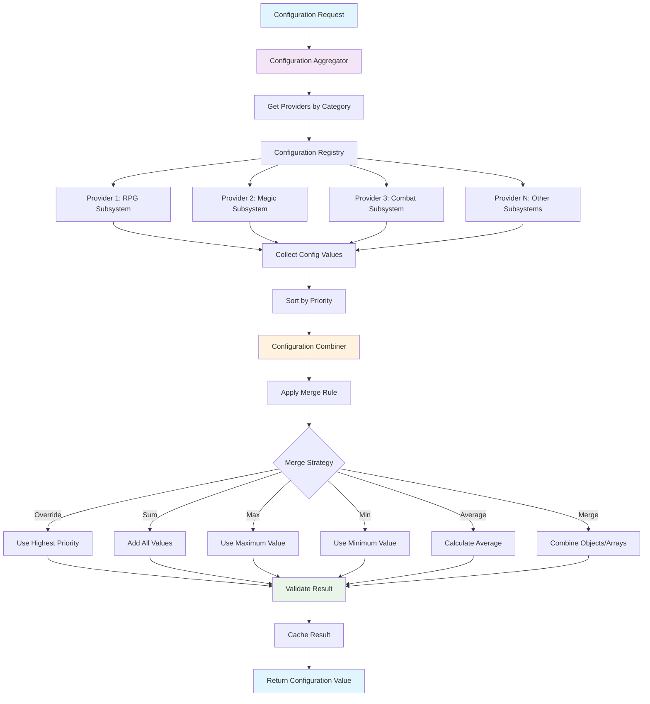
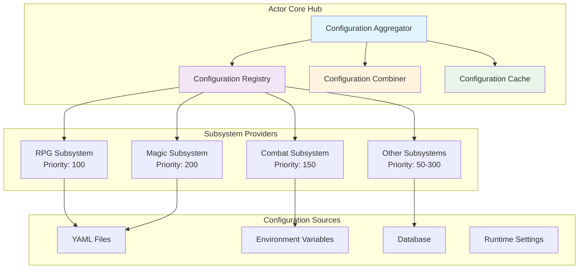
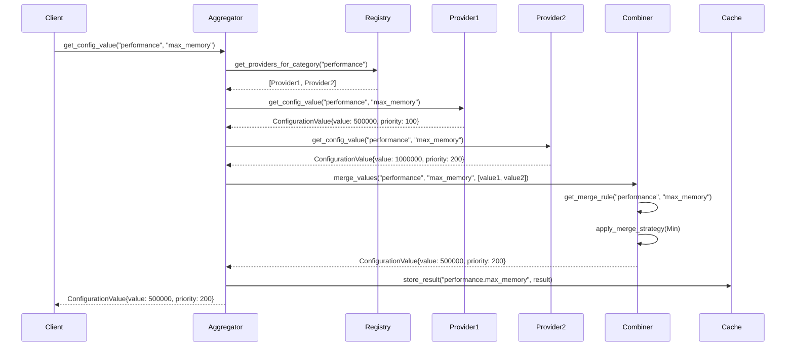
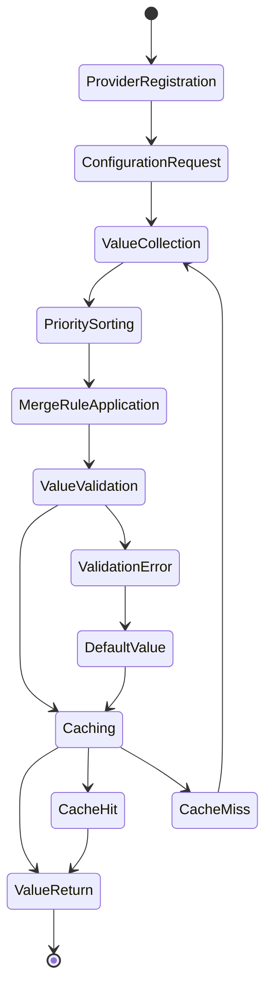
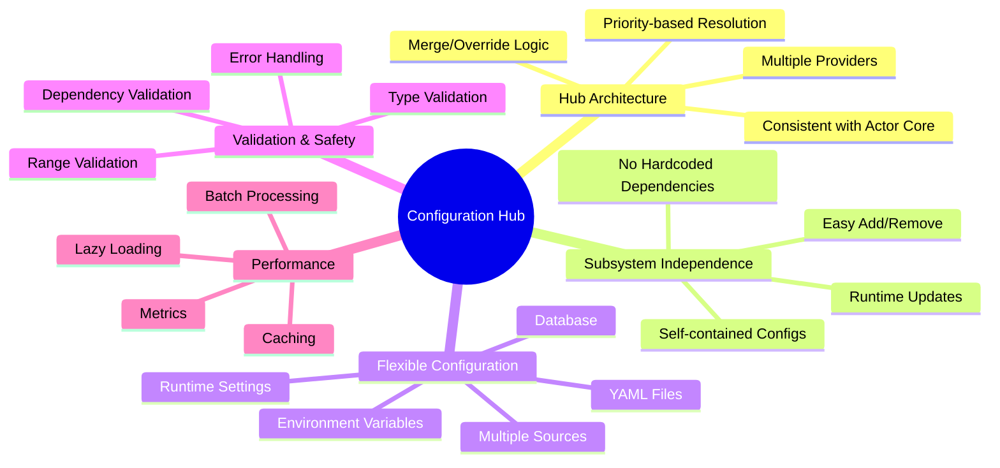
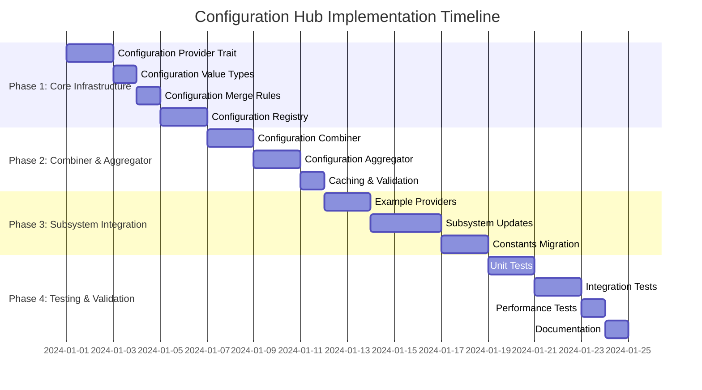

# Configuration Hub Flow Diagram

## 🔄 **Configuration Resolution Flow**

## 🏗️ **Configuration Hub Architecture**

## 🔄 **Configuration Merge Process**

## 📊 **Configuration Value Lifecycle**

## 🎯 **Key Benefits Visualization**

## 🔧 **Implementation Phases**

This configuration hub architecture perfectly follows the Actor Core pattern, allowing multiple subsystems to register configurations with the same merge/override/aggregate logic used for stats and resources. The system is designed to be:

- **🔗 Consistent**: Same patterns as existing Actor Core systems
- **🔄 Flexible**: Multiple providers, priority-based resolution
- **⚡ Performant**: Caching, lazy loading, batch processing
- **🛡️ Safe**: Validation, error handling, fallback values
- **🔧 Extensible**: Easy to add new providers and merge strategies
