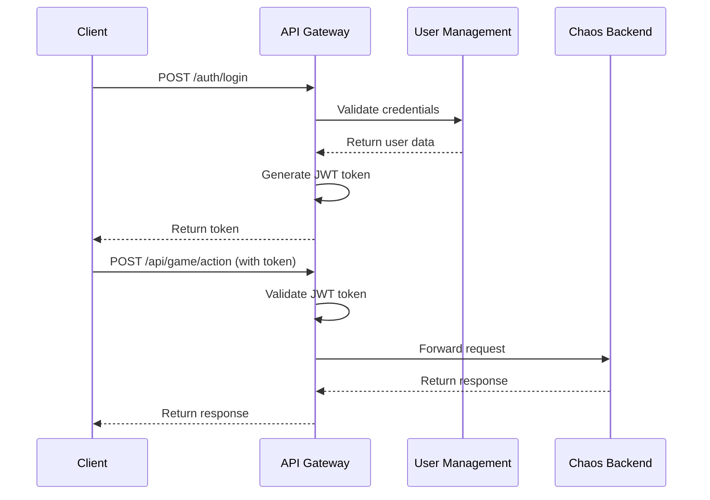

# API Gateway - Chaos World

## 📋 Overview

API Gateway là entry point duy nhất cho tất cả client requests, đảm nhiệm routing, authentication, rate limiting, và protocol translation.

## 🎯 Responsibilities

### Core Functions
- **Request Routing**: Route requests đến đúng service
- **Authentication**: Validate JWT tokens
- **Authorization**: Check permissions
- **Rate Limiting**: Prevent abuse và spam
- **Load Balancing**: Distribute traffic
- **Protocol Translation**: HTTP ↔ gRPC ↔ WebSocket

### Performance Requirements
- **Latency**: < 10ms cho routing
- **Throughput**: 50,000+ RPS
- **Availability**: 99.9% uptime
- **Concurrency**: Handle 10,000+ concurrent connections

## 🏗️ Architecture

### Technology Stack
```yaml
Language: Rust
Framework: Axum
Protocols: HTTP/2, WebSocket, gRPC
Caching: Redis
Load Balancing: Round-robin, Least connections
```

### Core Components
```rust
pub struct ApiGateway {
    // HTTP server
    http_server: HttpServer,
    
    // WebSocket server
    websocket_server: WebSocketServer,
    
    // gRPC clients
    chaos_backend_client: ChaosBackendClient,
    user_management_client: UserManagementClient,
    payment_service_client: PaymentServiceClient,
    
    // Middleware
    auth_middleware: AuthMiddleware,
    rate_limiter: RateLimiter,
    cache: RedisCache,
    
    // Configuration
    config: GatewayConfig,
}
```

## 🔌 API Endpoints

### Authentication Endpoints
```yaml
POST /auth/login:
  Description: User login
  Request: { username, password }
  Response: { token, user_id, expires_at }
  
POST /auth/register:
  Description: User registration
  Request: { username, email, password }
  Response: { token, user_id }
  
POST /auth/refresh:
  Description: Refresh JWT token
  Request: { refresh_token }
  Response: { token, expires_at }
  
POST /auth/logout:
  Description: User logout
  Request: { token }
  Response: { success: true }
```

### Game Endpoints
```yaml
POST /api/game/action:
  Description: Process game action
  Request: { action, target, position, timestamp }
  Response: { success, data, cooldown }
  
GET /api/game/state:
  Description: Get game state
  Request: { user_id }
  Response: { actors, world_state, events }
  
WebSocket /api/game/events:
  Description: Real-time game events
  Events: player_action, world_update, combat_event
```

### Shop Endpoints
```yaml
GET /api/shop/items:
  Description: Get available items
  Response: { items: [...] }
  
POST /api/shop/purchase:
  Description: Purchase item
  Request: { item_id, quantity }
  Response: { success, transaction_id }
  
GET /api/shop/history:
  Description: Get purchase history
  Response: { transactions: [...] }
```

### User Endpoints
```yaml
GET /api/user/profile:
  Description: Get user profile
  Response: { user_id, username, level, stats }
  
PUT /api/user/profile:
  Description: Update user profile
  Request: { display_name, preferences }
  Response: { success: true }
  
GET /api/user/actors:
  Description: Get user's actors
  Response: { actors: [...] }
```

## 🔐 Security

### Authentication Flow


### JWT Token Structure
```json
{
  "header": {
    "alg": "HS256",
    "typ": "JWT"
  },
  "payload": {
    "user_id": "player_123",
    "username": "player_name",
    "roles": ["player"],
    "permissions": ["game:action", "shop:purchase"],
    "iat": 1640995200,
    "exp": 1640998800
  }
}
```

### Rate Limiting
```yaml
Per User Limits:
  - Login attempts: 5/minute
  - Game actions: 100/minute
  - Shop purchases: 10/minute
  - API calls: 1000/hour

Per IP Limits:
  - Total requests: 10,000/hour
  - Concurrent connections: 100
  - WebSocket connections: 50
```

## 🚀 Load Balancing

### Strategies
```yaml
Round Robin:
  - Equal distribution
  - Simple implementation
  - Good for stateless services

Least Connections:
  - Route to least busy server
  - Better for stateful services
  - More complex implementation

Weighted Round Robin:
  - Different weights per server
  - Handle different server capacities
  - Dynamic weight adjustment
```

### Health Checks
```yaml
HTTP Health Checks:
  - GET /health
  - Response: { status: "healthy", timestamp: "..." }
  - Interval: 30 seconds
  - Timeout: 5 seconds

gRPC Health Checks:
  - HealthCheck service
  - Response: SERVING, NOT_SERVING
  - Interval: 30 seconds
  - Timeout: 5 seconds
```

## 📊 Monitoring

### Metrics
```yaml
Request Metrics:
  - Total requests per second
  - Response time percentiles
  - Error rate by endpoint
  - Status code distribution

System Metrics:
  - CPU usage
  - Memory usage
  - Network I/O
  - Connection count

Business Metrics:
  - Active users
  - Login success rate
  - Purchase conversion rate
  - Game action frequency
```

### Logging
```yaml
Structured Logging:
  - JSON format
  - Correlation IDs
  - Request tracing
  - Error context

Log Levels:
  - DEBUG: Detailed debugging info
  - INFO: General information
  - WARN: Warning messages
  - ERROR: Error conditions
  - FATAL: Critical errors
```

### Alerting
```yaml
Critical Alerts:
  - Service down
  - High error rate (>5%)
  - High response time (>1s)
  - Memory usage (>90%)

Warning Alerts:
  - High CPU usage (>80%)
  - High connection count (>80%)
  - Rate limit exceeded
  - Authentication failures
```

## 🔧 Configuration

### Environment Variables
```yaml
# Server Configuration
GATEWAY_PORT=8080
GATEWAY_HOST=0.0.0.0
GATEWAY_WORKERS=4

# Service URLs
CHAOS_BACKEND_URL=grpc://chaos-backend:9090
USER_MANAGEMENT_URL=grpc://user-management:9091
PAYMENT_SERVICE_URL=grpc://payment-service:9092

# Redis Configuration
REDIS_URL=redis://redis:6379
REDIS_PASSWORD=secret

# JWT Configuration
JWT_SECRET=your-secret-key
JWT_EXPIRY=3600

# Rate Limiting
RATE_LIMIT_REQUESTS=1000
RATE_LIMIT_WINDOW=3600
```

### Configuration File
```yaml
# gateway-config.yaml
server:
  port: 8080
  host: "0.0.0.0"
  workers: 4
  max_connections: 10000

services:
  chaos_backend:
    url: "grpc://chaos-backend:9090"
    timeout: "5s"
    retries: 3
  
  user_management:
    url: "grpc://user-management:9091"
    timeout: "3s"
    retries: 3
  
  payment_service:
    url: "grpc://payment-service:9092"
    timeout: "10s"
    retries: 3

security:
  jwt_secret: "your-secret-key"
  jwt_expiry: 3600
  rate_limit:
    requests: 1000
    window: 3600

caching:
  redis_url: "redis://redis:6379"
  ttl: 3600
  max_connections: 100
```

## 🧪 Testing

### Unit Tests
```rust
#[cfg(test)]
mod tests {
    use super::*;
    
    #[tokio::test]
    async fn test_authentication() {
        // Test JWT token validation
    }
    
    #[tokio::test]
    async fn test_rate_limiting() {
        // Test rate limiting logic
    }
    
    #[tokio::test]
    async fn test_routing() {
        // Test request routing
    }
}
```

### Integration Tests
```rust
#[tokio::test]
async fn test_login_flow() {
    // Test complete login flow
    let client = reqwest::Client::new();
    let response = client
        .post("http://localhost:8080/auth/login")
        .json(&LoginRequest {
            username: "test_user",
            password: "test_password",
        })
        .send()
        .await
        .unwrap();
    
    assert_eq!(response.status(), 200);
}
```

### Load Tests
```yaml
# k6 load test
import http from 'k6/http';
import { check } from 'k6';

export let options = {
  stages: [
    { duration: '2m', target: 100 },
    { duration: '5m', target: 100 },
    { duration: '2m', target: 200 },
    { duration: '5m', target: 200 },
    { duration: '2m', target: 0 },
  ],
};

export default function() {
  let response = http.get('http://localhost:8080/api/game/state');
  check(response, {
    'status is 200': (r) => r.status === 200,
    'response time < 100ms': (r) => r.timings.duration < 100,
  });
}
```

## 🚀 Deployment

### Docker
```dockerfile
FROM rust:1.70 as builder
WORKDIR /app
COPY . .
RUN cargo build --release

FROM debian:bullseye-slim
RUN apt-get update && apt-get install -y ca-certificates
COPY --from=builder /app/target/release/api-gateway /usr/local/bin/
EXPOSE 8080
CMD ["api-gateway"]
```

### Kubernetes
```yaml
apiVersion: apps/v1
kind: Deployment
metadata:
  name: api-gateway
spec:
  replicas: 3
  selector:
    matchLabels:
      app: api-gateway
  template:
    metadata:
      labels:
        app: api-gateway
    spec:
      containers:
      - name: api-gateway
        image: api-gateway:latest
        ports:
        - containerPort: 8080
        env:
        - name: GATEWAY_PORT
          value: "8080"
        - name: CHAOS_BACKEND_URL
          value: "grpc://chaos-backend:9090"
        resources:
          requests:
            memory: "256Mi"
            cpu: "250m"
          limits:
            memory: "512Mi"
            cpu: "500m"
```

### Helm Chart
```yaml
# values.yaml
replicaCount: 3

image:
  repository: api-gateway
  tag: latest
  pullPolicy: IfNotPresent

service:
  type: ClusterIP
  port: 8080

ingress:
  enabled: true
  hosts:
    - host: api.chaos-world.com
      paths:
        - path: /
          pathType: Prefix
  tls:
    - secretName: api-gateway-tls
      hosts:
        - api.chaos-world.com

resources:
  limits:
    cpu: 500m
    memory: 512Mi
  requests:
    cpu: 250m
    memory: 256Mi
```

## 📚 API Documentation

### OpenAPI Specification
```yaml
openapi: 3.0.0
info:
  title: Chaos World API
  version: 1.0.0
  description: API Gateway for Chaos World MMORPG

servers:
  - url: https://api.chaos-world.com
    description: Production server
  - url: https://staging-api.chaos-world.com
    description: Staging server

paths:
  /auth/login:
    post:
      summary: User login
      requestBody:
        required: true
        content:
          application/json:
            schema:
              type: object
              properties:
                username:
                  type: string
                password:
                  type: string
      responses:
        '200':
          description: Login successful
          content:
            application/json:
              schema:
                type: object
                properties:
                  token:
                    type: string
                  user_id:
                    type: string
                  expires_at:
                    type: string
                    format: date-time
```

## 🔗 Related Services

- [Chaos Backend](./chaos-backend/README.md) - Game Logic Core
- [User Management](./user-management/README.md) - Authentication Service
- [Payment Service](./payment-service/README.md) - Transaction Service
- [Microservices Architecture](./microservices-architecture/README.md) - Overall Architecture
