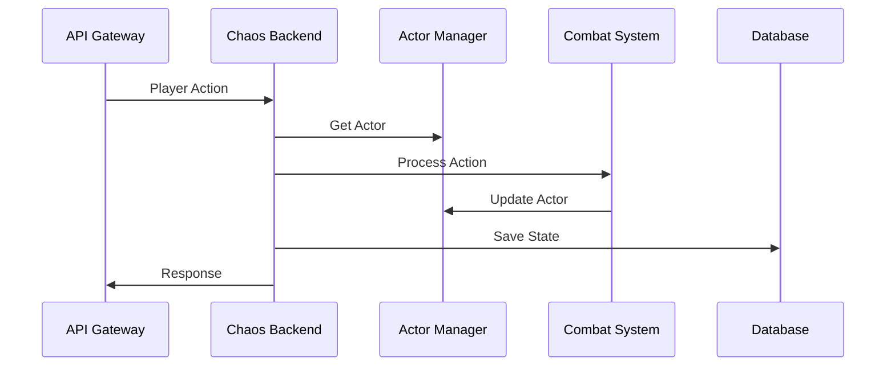

# Chaos Backend - Game Logic Core

## 📋 Overview

Chaos Backend là **Game Logic Core** - trái tim của hệ thống game, xử lý tất cả game logic real-time với performance cao nhất.

## 🎯 Responsibilities

### Core Functions
- **Actor Management**: Quản lý tất cả actors (players, NPCs, monsters)
- **Combat System**: Xử lý combat logic, damage calculation
- **World Simulation**: Mô phỏng thế giới game, environment
- **Resource Management**: Quản lý tài nguyên, stats, buffs/debuffs
- **Real-time Processing**: Xử lý real-time với latency < 1ms

### Performance Requirements
- **Latency**: < 1ms cho game actions
- **Throughput**: 10,000+ TPS
- **Memory**: Shared memory access cho performance
- **Concurrency**: Multi-threaded với shared state

## 🏗️ Architecture

### Single Process Design
```yaml
Why Single Process:
  - Shared memory access
  - Zero-copy operations
  - Low latency communication
  - Cache-friendly data structures
  - Real-time performance
```

### Core Components
```rust
pub struct ChaosBackend {
    actor_manager: Arc<ActorManager>,
    combat_system: Arc<CombatSystem>,
    world_simulator: Arc<WorldSimulator>,
    resource_manager: Arc<ResourceManager>,
    event_bus: Arc<EventBus>,
}
```

## 🔌 Communication

### Input Sources
- **API Gateway**: HTTP/WebSocket requests
- **gRPC Services**: Inter-service communication
- **Event Streams**: Kafka/Redis events

### Output Destinations
- **Microservices**: User, Payment, Anti-Cheat, Analytics
- **Databases**: MongoDB (game state)
- **Event Bus**: Real-time events

## 📊 Data Flow

### Player Action Flow


## 🗄️ Database Schema

### MongoDB Collections
```yaml
chaos_game:
  actors:           # Actor state và stats
  world_state:      # World state và environment
  combat_logs:      # Combat events và history
  player_actions:   # Player action history
  guilds:           # Guild data
  events:           # Game events

actor_core_config:
  configuration:    # Game configuration
  templates:        # Item/spell templates
  definitions:      # Game definitions
```

## ⚡ Performance Optimization

### Memory Management
- **Shared Memory**: Actors trong memory
- **Zero-Copy**: Direct memory access
- **Cache-Friendly**: Sequential data structures
- **Memory Pools**: Pre-allocated objects

### Concurrency
- **Multi-Threading**: Parallel processing
- **Lock-Free**: Atomic operations
- **Actor Model**: Message passing
- **Async/Await**: Non-blocking I/O

## 🔧 Configuration

### Runtime Configuration
```yaml
server:
  port: 8080
  max_connections: 1000
  tick_rate: 60
  enable_metrics: true

database:
  mongodb_connection: "mongodb://localhost:27017"
  chaos_game_db: "chaos_game"
  config_db: "actor_core_config"

performance:
  max_actors: 10000
  world_size: 10000
  cache_ttl: 3600
```

## 🚀 Deployment

### Development
```bash
cargo run --features mongodb-storage
```

### Production
```bash
cargo build --release --features mongodb-storage
./target/release/chaos-backend
```

### Docker
```dockerfile
FROM rust:1.70
WORKDIR /app
COPY . .
RUN cargo build --release --features mongodb-storage
CMD ["./target/release/chaos-backend"]
```

## 📈 Monitoring

### Metrics
- **Performance**: TPS, latency, memory usage
- **Game State**: Active actors, world state
- **System Health**: CPU, memory, database connections

### Logging
- **Structured Logging**: JSON format
- **Log Levels**: DEBUG, INFO, WARN, ERROR
- **Correlation IDs**: Request tracing

## 🔒 Security

### Input Validation
- **Action Validation**: Validate all player actions
- **Rate Limiting**: Prevent spam/abuse
- **Sanitization**: Clean input data

### Anti-Cheat Integration
- **Behavior Analysis**: Send actions to anti-cheat service
- **Validation**: Verify action legitimacy
- **Blocking**: Block suspicious actions

## 📚 API Reference

### gRPC Services
```protobuf
service GameLogicService {
  rpc ProcessAction(ActionRequest) returns (ActionResponse);
  rpc GetGameState(StateRequest) returns (StateResponse);
  rpc SubscribeEvents(EventRequest) returns (stream GameEvent);
}

service ActorService {
  rpc GetActor(ActorRequest) returns (ActorResponse);
  rpc UpdateActor(ActorUpdate) returns (ActorResponse);
  rpc CreateActor(ActorCreate) returns (ActorResponse);
}
```

### WebSocket Events
```json
{
  "type": "player_action",
  "data": {
    "user_id": "player_123",
    "action": "fireball",
    "target": "enemy_456",
    "timestamp": 1640995200000
  }
}
```

## 🧪 Testing

### Unit Tests
```bash
cargo test
```

### Integration Tests
```bash
cargo test --test integration
```

### Performance Tests
```bash
cargo test --test performance
```

## 📖 Development Guide

### Adding New Features
1. **Design**: Plan the feature architecture
2. **Implement**: Code the feature
3. **Test**: Write comprehensive tests
4. **Document**: Update documentation
5. **Review**: Code review process

### Code Style
- **Rust Best Practices**: Follow Rust conventions
- **Performance First**: Optimize for performance
- **Error Handling**: Proper error handling
- **Documentation**: Document public APIs

## 🔗 Related Services

- **API Gateway**: Entry point for all requests
- **User Management**: Authentication and authorization
- **Payment Service**: Transaction processing
- **Anti-Cheat Service**: Security and fraud detection
- **Analytics Service**: Data collection and analysis
