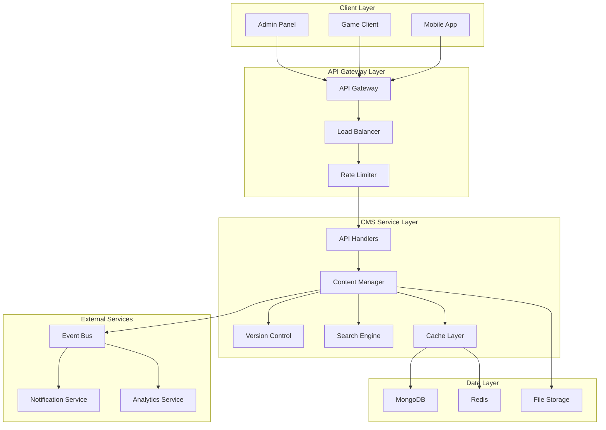
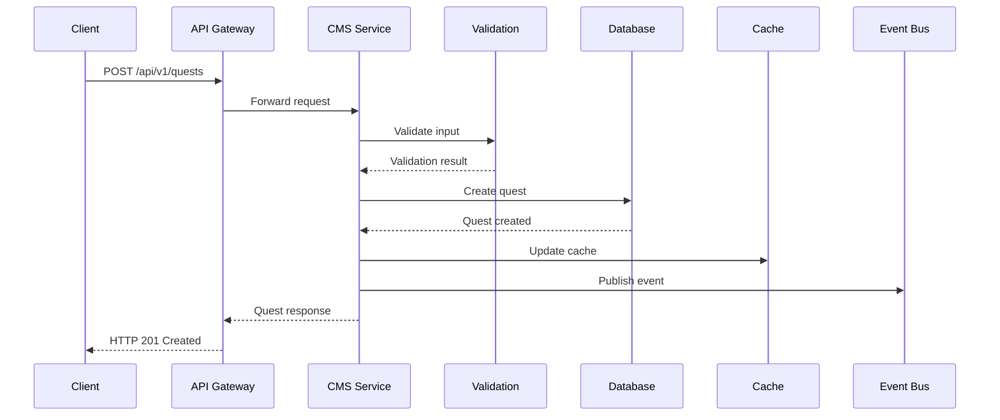
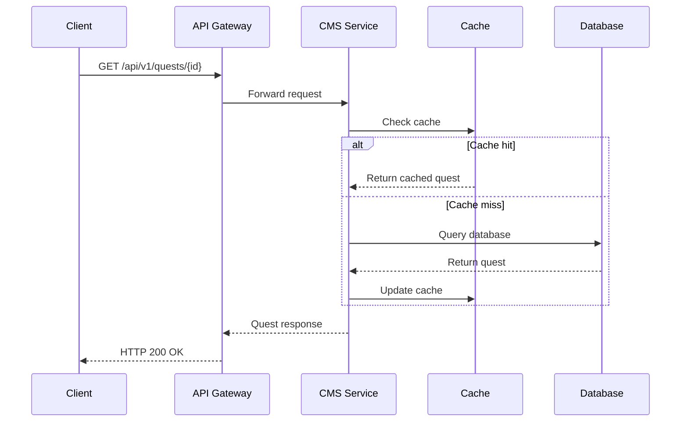
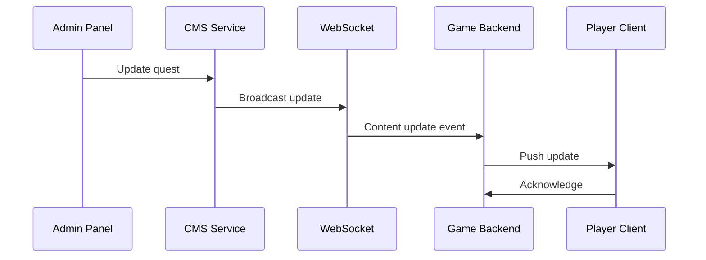
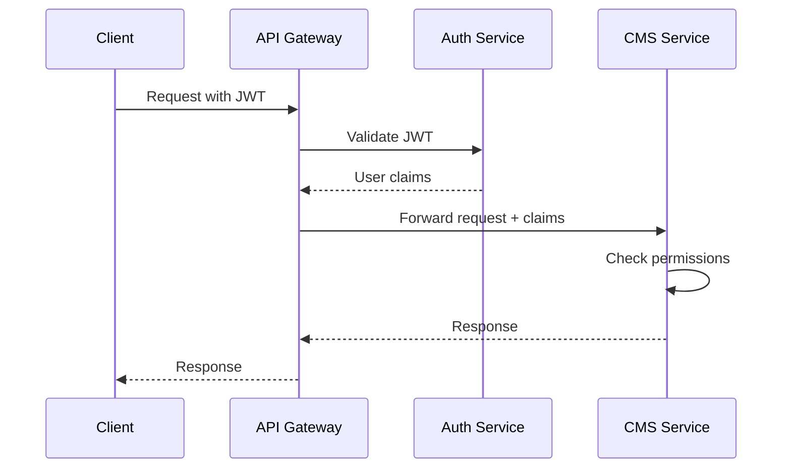

# CMS Service Architecture

## Overview

The Content Management Service (CMS) is designed as a microservice within the Chaos World ecosystem, responsible for managing all game content including quests, NPCs, items, locations, and other dynamic content. This document outlines the architectural decisions, design patterns, and technical implementation details.

## Table of Contents

- [System Architecture](#system-architecture)
- [Component Design](#component-design)
- [Data Flow](#data-flow)
- [Technology Stack](#technology-stack)
- [Design Patterns](#design-patterns)
- [Scalability Considerations](#scalability-considerations)
- [Security Architecture](#security-architecture)
- [Performance Architecture](#performance-architecture)
- [Monitoring and Observability](#monitoring-and-observability)

## System Architecture

### High-Level Architecture



### Service Boundaries

The CMS service is designed with clear boundaries and responsibilities:

**Core Responsibilities:**
- Content CRUD operations
- Content versioning and history
- Content search and discovery
- Content validation and integrity
- Content publishing and deployment

**Non-Responsibilities:**
- User authentication (delegated to Auth Service)
- Game logic execution (delegated to Game Backend)
- Real-time game state (delegated to Game Backend)
- Payment processing (delegated to Payment Service)

## Component Design

### 1. API Layer

```rust
// src/api/mod.rs
pub mod handlers;
pub mod middleware;
pub mod routes;
pub mod validation;

// Request/Response flow
Client Request → Middleware → Handler → Service → Repository → Database
                ↓
Client Response ← Serializer ← Service ← Repository ← Database
```

**Key Components:**
- **Handlers**: HTTP request/response handling
- **Middleware**: Authentication, logging, rate limiting
- **Validation**: Input validation and sanitization
- **Serialization**: JSON/XML response formatting

### 2. Business Logic Layer

```rust
// src/services/mod.rs
pub mod content_manager;
pub mod version_control;
pub mod search_service;
pub mod validation_service;
pub mod sync_service;
```

**Content Manager Service:**
```rust
pub struct ContentManager {
    quest_service: QuestService,
    npc_service: NPCService,
    item_service: ItemService,
    location_service: LocationService,
    cache: Arc<ContentCache>,
    event_publisher: Arc<EventPublisher>,
}

impl ContentManager {
    pub async fn create_quest(&self, quest: CreateQuestRequest) -> Result<Quest, CMSError> {
        // 1. Validate input
        self.validation_service.validate_quest(&quest)?;
        
        // 2. Check permissions
        self.auth_service.check_permission("content.quest.create")?;
        
        // 3. Create quest
        let quest = self.quest_service.create(quest).await?;
        
        // 4. Update cache
        self.cache.set_quest(quest.id.clone(), quest.clone()).await;
        
        // 5. Publish event
        self.event_publisher.publish_quest_created(&quest).await?;
        
        Ok(quest)
    }
}
```

### 3. Data Access Layer

```rust
// src/repositories/mod.rs
pub mod quest_repository;
pub mod npc_repository;
pub mod item_repository;
pub mod location_repository;
pub mod version_repository;

// Repository pattern with trait abstraction
#[async_trait]
pub trait ContentRepository<T> {
    async fn create(&self, content: &T) -> Result<T, RepositoryError>;
    async fn get_by_id(&self, id: &str) -> Result<Option<T>, RepositoryError>;
    async fn update(&self, id: &str, content: &T) -> Result<T, RepositoryError>;
    async fn delete(&self, id: &str) -> Result<(), RepositoryError>;
    async fn list(&self, filters: &ContentFilters) -> Result<PaginatedResult<T>, RepositoryError>;
}
```

### 4. Caching Layer

```rust
// src/cache/mod.rs
pub mod redis_cache;
pub mod memory_cache;
pub mod cache_manager;

pub struct CacheManager {
    redis: Arc<RedisCache>,
    memory: Arc<MemoryCache>,
    strategy: CacheStrategy,
}

impl CacheManager {
    pub async fn get<T>(&self, key: &str) -> Result<Option<T>, CacheError>
    where
        T: DeserializeOwned,
    {
        // L1: Memory cache
        if let Some(value) = self.memory.get(key).await? {
            return Ok(Some(value));
        }
        
        // L2: Redis cache
        if let Some(value) = self.redis.get(key).await? {
            // Populate memory cache
            self.memory.set(key, value.clone()).await?;
            return Ok(Some(value));
        }
        
        Ok(None)
    }
}
```

## Data Flow

### 1. Content Creation Flow



### 2. Content Retrieval Flow



### 3. Real-time Update Flow



## Technology Stack

### Backend Technologies

**Core Framework:**
- **Rust**: Primary programming language
- **Axum**: Web framework for HTTP API
- **Tokio**: Async runtime
- **Serde**: Serialization/deserialization

**Database Technologies:**
- **MongoDB**: Primary database for content storage
- **Redis**: Caching and session storage
- **File System**: Static asset storage

**Message Queue:**
- **Redis Pub/Sub**: Event broadcasting
- **Kafka** (optional): High-throughput event streaming

**Search Engine:**
- **MongoDB Text Search**: Basic full-text search
- **Elasticsearch** (optional): Advanced search capabilities

### Frontend Technologies

**Admin Panel:**
- **React**: UI framework
- **TypeScript**: Type safety
- **Axios**: HTTP client
- **Socket.IO**: Real-time updates

**Game Integration:**
- **gRPC**: High-performance RPC
- **WebSocket**: Real-time communication
- **JSON**: REST API communication

## Design Patterns

### 1. Repository Pattern

```rust
// Abstract data access
#[async_trait]
pub trait QuestRepository {
    async fn create(&self, quest: &Quest) -> Result<Quest, RepositoryError>;
    async fn get_by_id(&self, id: &str) -> Result<Option<Quest>, RepositoryError>;
    async fn update(&self, id: &str, quest: &Quest) -> Result<Quest, RepositoryError>;
    async fn delete(&self, id: &str) -> Result<(), RepositoryError>;
    async fn list(&self, filters: &QuestFilters) -> Result<PaginatedResult<Quest>, RepositoryError>;
}

// MongoDB implementation
pub struct MongoQuestRepository {
    collection: Collection<Quest>,
}

#[async_trait]
impl QuestRepository for MongoQuestRepository {
    async fn create(&self, quest: &Quest) -> Result<Quest, RepositoryError> {
        let result = self.collection.insert_one(quest, None).await?;
        Ok(quest.clone())
    }
    
    // ... other implementations
}
```

### 2. Service Layer Pattern

```rust
// Business logic encapsulation
pub struct QuestService {
    repository: Arc<dyn QuestRepository>,
    validator: Arc<QuestValidator>,
    cache: Arc<ContentCache>,
    event_publisher: Arc<EventPublisher>,
}

impl QuestService {
    pub async fn create_quest(&self, request: CreateQuestRequest) -> Result<Quest, CMSError> {
        // 1. Validate business rules
        self.validator.validate_create_request(&request)?;
        
        // 2. Create quest entity
        let quest = Quest::from(request);
        
        // 3. Persist to database
        let quest = self.repository.create(&quest).await?;
        
        // 4. Update cache
        self.cache.set_quest(quest.id.clone(), quest.clone()).await;
        
        // 5. Publish event
        self.event_publisher.publish_quest_created(&quest).await?;
        
        Ok(quest)
    }
}
```

### 3. Observer Pattern

```rust
// Event-driven architecture
pub trait EventObserver {
    async fn on_event(&self, event: &Event) -> Result<(), ObserverError>;
}

pub struct EventPublisher {
    observers: Vec<Arc<dyn EventObserver>>,
}

impl EventPublisher {
    pub async fn publish(&self, event: &Event) -> Result<(), PublisherError> {
        for observer in &self.observers {
            if let Err(e) = observer.on_event(event).await {
                log::error!("Observer error: {}", e);
            }
        }
        Ok(())
    }
}
```

### 4. Strategy Pattern

```rust
// Configurable content validation
pub trait ValidationStrategy {
    fn validate(&self, content: &dyn Content) -> Result<(), ValidationError>;
}

pub struct QuestValidationStrategy;
pub struct NPCValidationStrategy;
pub struct ItemValidationStrategy;

pub struct ContentValidator {
    strategies: HashMap<String, Box<dyn ValidationStrategy>>,
}

impl ContentValidator {
    pub fn validate(&self, content: &dyn Content) -> Result<(), ValidationError> {
        let content_type = content.get_type();
        if let Some(strategy) = self.strategies.get(content_type) {
            strategy.validate(content)
        } else {
            Err(ValidationError::UnknownContentType(content_type.to_string()))
        }
    }
}
```

## Scalability Considerations

### 1. Horizontal Scaling

**Stateless Design:**
- No server-side session storage
- All state stored in external services (Redis, MongoDB)
- Load balancer can distribute requests to any instance

**Database Sharding:**
```rust
// Sharding strategy based on content type
pub struct ShardingStrategy {
    quest_shard: String,
    npc_shard: String,
    item_shard: String,
    location_shard: String,
}

impl ShardingStrategy {
    pub fn get_shard_for_content(&self, content_type: &str) -> &str {
        match content_type {
            "quest" => &self.quest_shard,
            "npc" => &self.npc_shard,
            "item" => &self.item_shard,
            "location" => &self.location_shard,
            _ => &self.quest_shard, // Default shard
        }
    }
}
```

### 2. Caching Strategy

**Multi-Level Caching:**
```rust
pub struct CacheHierarchy {
    l1_memory: Arc<MemoryCache>,    // Fastest, smallest
    l2_redis: Arc<RedisCache>,      // Fast, medium size
    l3_database: Arc<Database>,     // Slowest, largest
}

impl CacheHierarchy {
    pub async fn get<T>(&self, key: &str) -> Result<Option<T>, CacheError> {
        // L1: Memory cache (microseconds)
        if let Some(value) = self.l1_memory.get(key).await? {
            return Ok(Some(value));
        }
        
        // L2: Redis cache (milliseconds)
        if let Some(value) = self.l2_redis.get(key).await? {
            self.l1_memory.set(key, value.clone()).await?;
            return Ok(Some(value));
        }
        
        // L3: Database (tens of milliseconds)
        if let Some(value) = self.l3_database.get(key).await? {
            self.l2_redis.set(key, value.clone()).await?;
            self.l1_memory.set(key, value.clone()).await?;
            return Ok(Some(value));
        }
        
        Ok(None)
    }
}
```

### 3. Event-Driven Scaling

**Asynchronous Processing:**
```rust
pub struct AsyncContentProcessor {
    task_queue: Arc<Mutex<VecDeque<ContentTask>>>,
    worker_pool: ThreadPool,
}

impl AsyncContentProcessor {
    pub async fn process_content_update(&self, content: Content) -> Result<(), ProcessingError> {
        let task = ContentTask::Update(content);
        self.task_queue.lock().unwrap().push_back(task);
        
        // Process asynchronously
        let queue = self.task_queue.clone();
        self.worker_pool.spawn(async move {
            while let Some(task) = queue.lock().unwrap().pop_front() {
                Self::execute_task(task).await;
            }
        });
        
        Ok(())
    }
}
```

## Security Architecture

### 1. Authentication Flow



### 2. Authorization Model

```rust
// Role-Based Access Control (RBAC)
pub struct Permission {
    pub resource: String,    // content.quest, content.npc, etc.
    pub action: String,      // create, read, update, delete
    pub conditions: Vec<String>, // level > 10, faction = "guard"
}

pub struct Role {
    pub name: String,
    pub permissions: Vec<Permission>,
}

pub struct User {
    pub id: String,
    pub roles: Vec<Role>,
    pub attributes: HashMap<String, String>,
}

impl User {
    pub fn has_permission(&self, resource: &str, action: &str) -> bool {
        self.roles.iter().any(|role| {
            role.permissions.iter().any(|perm| {
                perm.resource == resource && perm.action == action
            })
        })
    }
}
```

### 3. Data Encryption

```rust
// Encryption at rest and in transit
pub struct EncryptionService {
    key: [u8; 32],
}

impl EncryptionService {
    pub fn encrypt_sensitive_data(&self, data: &str) -> Result<String, EncryptionError> {
        use aes_gcm::{Aes256Gcm, Key, Nonce};
        use aes_gcm::aead::{Aead, NewAead};
        
        let key = Key::from_slice(&self.key);
        let cipher = Aes256Gcm::new(key);
        let nonce = Nonce::from_slice(b"unique nonce");
        
        let ciphertext = cipher.encrypt(nonce, data.as_bytes())
            .map_err(|_| EncryptionError::EncryptionFailed)?;
        
        Ok(base64::encode(ciphertext))
    }
}
```

## Performance Architecture

### 1. Database Optimization

**Indexing Strategy:**
```javascript
// MongoDB indexes for optimal query performance
db.quests.createIndex({ "status": 1, "type": 1 })
db.quests.createIndex({ "level_required": 1 })
db.quests.createIndex({ "location": 1 })
db.quests.createIndex({ "title": "text", "description": "text" })

db.npcs.createIndex({ "type": 1, "location": 1 })
db.npcs.createIndex({ "level": 1 })
db.npcs.createIndex({ "name": "text", "description": "text" })

db.items.createIndex({ "type": 1, "rarity": 1 })
db.items.createIndex({ "level_required": 1 })
db.items.createIndex({ "name": "text", "description": "text" })
```

**Connection Pooling:**
```rust
pub struct DatabasePool {
    client: MongoClient,
    max_connections: u32,
    min_connections: u32,
}

impl DatabasePool {
    pub async fn new(uri: &str) -> Result<Self, DatabaseError> {
        let mut options = ClientOptions::parse(uri).await?;
        options.max_pool_size = Some(100);
        options.min_pool_size = Some(10);
        options.max_idle_time = Some(Duration::from_secs(600));
        options.server_selection_timeout = Some(Duration::from_secs(5));
        
        let client = MongoClient::with_options(options)?;
        Ok(Self {
            client,
            max_connections: 100,
            min_connections: 10,
        })
    }
}
```

### 2. Caching Architecture

**Cache Invalidation Strategy:**
```rust
pub struct CacheInvalidationStrategy {
    ttl: Duration,
    max_size: usize,
    eviction_policy: EvictionPolicy,
}

impl CacheInvalidationStrategy {
    pub fn should_invalidate(&self, key: &str, last_updated: DateTime<Utc>) -> bool {
        let age = Utc::now() - last_updated;
        age > self.ttl
    }
    
    pub fn get_eviction_candidates(&self, cache: &HashMap<String, CachedItem>) -> Vec<String> {
        match self.eviction_policy {
            EvictionPolicy::LRU => {
                // Return least recently used items
                todo!("Implement LRU eviction")
            }
            EvictionPolicy::TTL => {
                // Return expired items
                cache.iter()
                    .filter(|(_, item)| self.should_invalidate(item.key, item.last_updated))
                    .map(|(key, _)| key.clone())
                    .collect()
            }
        }
    }
}
```

### 3. API Performance

**Response Compression:**
```rust
use axum::{
    extract::Request,
    middleware::Next,
    response::Response,
    http::HeaderValue,
};

pub async fn compression_middleware(
    request: Request,
    next: Next,
) -> Result<Response, StatusCode> {
    let mut response = next.run(request).await;
    
    // Add compression headers
    response.headers_mut().insert(
        "content-encoding",
        HeaderValue::from_static("gzip"),
    );
    
    Ok(response)
}
```

**Pagination Optimization:**
```rust
pub struct PaginationOptimizer {
    default_page_size: usize,
    max_page_size: usize,
}

impl PaginationOptimizer {
    pub fn optimize_query(&self, query: &mut Query) {
        // Add limit and skip for pagination
        query.limit(self.default_page_size as i64);
        
        // Add sort for consistent pagination
        query.sort(doc! { "created_at": -1 });
    }
}
```

## Monitoring and Observability

### 1. Metrics Collection

```rust
use prometheus::{Counter, Histogram, Registry};

pub struct MetricsCollector {
    requests_total: Counter,
    request_duration: Histogram,
    cache_hits: Counter,
    cache_misses: Counter,
    database_queries: Counter,
    errors_total: Counter,
}

impl MetricsCollector {
    pub fn new(registry: &Registry) -> Self {
        let requests_total = Counter::new(
            "cms_requests_total",
            "Total number of requests"
        ).unwrap();
        
        let request_duration = Histogram::new(
            "cms_request_duration_seconds",
            "Request duration in seconds"
        ).unwrap();
        
        // ... other metrics
        
        registry.register(Box::new(requests_total.clone())).unwrap();
        registry.register(Box::new(request_duration.clone())).unwrap();
        
        Self {
            requests_total,
            request_duration,
            // ... other fields
        }
    }
}
```

### 2. Distributed Tracing

```rust
use tracing::{info_span, Instrument};

pub async fn handle_quest_request(
    request: CreateQuestRequest,
) -> Result<Quest, CMSError> {
    let span = info_span!("create_quest", quest_id = %request.id);
    
    async move {
        // Business logic here
        let quest = quest_service.create(request).await?;
        Ok(quest)
    }
    .instrument(span)
    .await
}
```

### 3. Health Checks

```rust
pub struct HealthChecker {
    database: Arc<MongoDatabase>,
    cache: Arc<RedisCache>,
    file_storage: Arc<FileStorage>,
}

impl HealthChecker {
    pub async fn check_health(&self) -> HealthStatus {
        let mut status = HealthStatus::healthy();
        
        // Check database
        if let Err(e) = self.database.ping().await {
            status.add_issue("database", format!("Database unreachable: {}", e));
        }
        
        // Check cache
        if let Err(e) = self.cache.ping().await {
            status.add_issue("cache", format!("Cache unreachable: {}", e));
        }
        
        // Check file storage
        if let Err(e) = self.file_storage.check_health().await {
            status.add_issue("storage", format!("Storage unreachable: {}", e));
        }
        
        status
    }
}
```

This architecture document provides a comprehensive overview of the CMS service design, covering all major architectural aspects from high-level system design to low-level implementation details. The architecture is designed to be scalable, maintainable, and performant while following modern microservices best practices.
