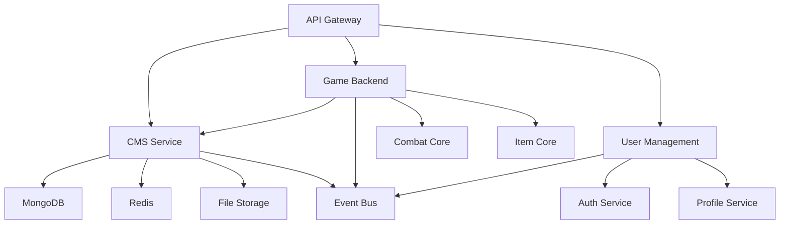

# CMS Service Integration Guide

## Overview

This guide covers how to integrate the CMS service with other services in the Chaos World ecosystem, including the game backend, API gateway, and admin panel.

## Table of Contents

- [Service Architecture](#service-architecture)
- [API Gateway Integration](#api-gateway-integration)
- [Game Backend Integration](#game-backend-integration)
- [Admin Panel Integration](#admin-panel-integration)
- [Real-time Updates](#real-time-updates)
- [Event-Driven Architecture](#event-driven-architecture)
- [Data Synchronization](#data-synchronization)
- [Authentication & Authorization](#authentication--authorization)
- [Error Handling](#error-handling)
- [Performance Considerations](#performance-considerations)

## Service Architecture

### High-Level Architecture

```
┌─────────────────────────────────────────────────────────────────┐
│                    Chaos World Ecosystem                        │
├─────────────────────────────────────────────────────────────────┤
│  ┌─────────────┐  ┌─────────────┐  ┌─────────────┐            │
│  │    Admin    │  │    Game     │  │    Mobile   │            │
│  │    Panel    │  │   Client    │  │    App      │            │
│  └─────────────┘  └─────────────┘  └─────────────┘            │
│         │                │                │                   │
│  ┌─────────────────────────────────────────────────────────────┐ │
│  │                    API Gateway                             │ │
│  │  ┌─────────────┐  ┌─────────────┐  ┌─────────────┐        │ │
│  │  │   Auth      │  │   Rate      │  │   Load      │        │ │
│  │  │  Service    │  │  Limiting   │  │  Balancing  │        │ │
│  │  └─────────────┘  └─────────────┘  └─────────────┘        │ │
│  └─────────────────────────────────────────────────────────────┘ │
│         │                │                │                   │
│  ┌─────────────┐  ┌─────────────┐  ┌─────────────┐            │
│  │    User     │  │     CMS     │  │    Game     │            │
│  │ Management  │  │   Service   │  │   Backend   │            │
│  └─────────────┘  └─────────────┘  └─────────────┘            │
│         │                │                │                   │
│  ┌─────────────┐  ┌─────────────┐  ┌─────────────┐            │
│  │  MongoDB    │  │    Redis    │  │   File      │            │
│  │  Database   │  │    Cache    │  │  Storage    │            │
│  └─────────────┘  └─────────────┘  └─────────────┘            │
└─────────────────────────────────────────────────────────────────┘
```

### Service Dependencies



## API Gateway Integration

### 1. Route Configuration

```yaml
# api-gateway/routes/cms.yaml
routes:
  - name: cms-service
    path: /api/v1/cms
    service: cms-service
    methods: [GET, POST, PUT, DELETE, PATCH]
    middleware:
      - auth
      - rate-limit
      - cors
    health_check:
      path: /health
      interval: 30s
      timeout: 5s
    retry:
      attempts: 3
      backoff: exponential
    circuit_breaker:
      failure_threshold: 5
      timeout: 30s
```

### 2. Load Balancing

```yaml
# api-gateway/load-balancer.yaml
upstreams:
  cms-service:
    servers:
      - url: "http://cms-service-1:8080"
        weight: 1
        health_check: true
      - url: "http://cms-service-2:8080"
        weight: 1
        health_check: true
      - url: "http://cms-service-3:8080"
        weight: 1
        health_check: true
    strategy: round_robin
    health_check:
      path: /health
      interval: 10s
      timeout: 3s
      healthy_threshold: 2
      unhealthy_threshold: 3
```

### 3. Rate Limiting

```yaml
# api-gateway/rate-limits.yaml
rate_limits:
  cms-service:
    rules:
      - name: authenticated_users
        key: "user_id"
        limit: 1000
        window: "1h"
        conditions:
          - "auth.authenticated == true"
      - name: anonymous_users
        key: "ip"
        limit: 100
        window: "1h"
        conditions:
          - "auth.authenticated == false"
      - name: bulk_operations
        key: "user_id"
        limit: 10
        window: "1h"
        conditions:
          - "request.path matches '/bulk/'"
```

### 4. Authentication Middleware

```rust
// api-gateway/middleware/auth.rs
use axum::{
    extract::Request,
    middleware::Next,
    response::Response,
    http::StatusCode,
};

pub async fn auth_middleware(
    mut request: Request,
    next: Next,
) -> Result<Response, StatusCode> {
    let auth_header = request
        .headers()
        .get("authorization")
        .and_then(|h| h.to_str().ok());
    
    match auth_header {
        Some(header) if header.starts_with("Bearer ") => {
            let token = &header[7..];
            if validate_jwt_token(token).await {
                // Add user info to request extensions
                request.extensions_mut().insert(UserInfo {
                    user_id: extract_user_id(token),
                    role: extract_user_role(token),
                });
                Ok(next.run(request).await)
            } else {
                Err(StatusCode::UNAUTHORIZED)
            }
        }
        _ => Err(StatusCode::UNAUTHORIZED),
    }
}
```

## Game Backend Integration

### 1. Content Loading

```rust
// game-backend/src/content/loader.rs
use reqwest::Client;
use serde::{Deserialize, Serialize};

pub struct ContentLoader {
    client: Client,
    cms_base_url: String,
    cache: Arc<Mutex<HashMap<String, CachedContent>>>,
}

impl ContentLoader {
    pub async fn load_quest(&self, quest_id: &str) -> Result<Quest, ContentError> {
        // Check cache first
        if let Some(cached) = self.cache.lock().unwrap().get(quest_id) {
            if !cached.is_expired() {
                return Ok(cached.data.clone());
            }
        }
        
        // Load from CMS service
        let quest = self.client
            .get(&format!("{}/api/v1/quests/{}", self.cms_base_url, quest_id))
            .header("Authorization", format!("Bearer {}", self.auth_token))
            .send()
            .await?
            .json::<Quest>()
            .await?;
        
        // Cache the result
        self.cache.lock().unwrap().insert(
            quest_id.to_string(),
            CachedContent::new(quest.clone(), Duration::from_secs(300))
        );
        
        Ok(quest)
    }
    
    pub async fn load_npcs_for_location(&self, location_id: &str) -> Result<Vec<NPC>, ContentError> {
        let npcs = self.client
            .get(&format!("{}/api/v1/npcs", self.cms_base_url))
            .query(&[("location", location_id)])
            .header("Authorization", format!("Bearer {}", self.auth_token))
            .send()
            .await?
            .json::<PaginatedResponse<NPC>>()
            .await?;
        
        Ok(npcs.data)
    }
    
    pub async fn load_items_by_type(&self, item_type: &str) -> Result<Vec<Item>, ContentError> {
        let items = self.client
            .get(&format!("{}/api/v1/items", self.cms_base_url))
            .query(&[("type", item_type)])
            .header("Authorization", format!("Bearer {}", self.auth_token))
            .send()
            .await?
            .json::<PaginatedResponse<Item>>()
            .await?;
        
        Ok(items.data)
    }
}
```

### 2. Real-time Content Updates

```rust
// game-backend/src/content/updater.rs
use tokio::sync::mpsc;
use serde_json::Value;

pub struct ContentUpdater {
    content_loader: Arc<ContentLoader>,
    update_receiver: mpsc::UnboundedReceiver<ContentUpdate>,
}

impl ContentUpdater {
    pub async fn start(&mut self) {
        while let Some(update) = self.update_receiver.recv().await {
            match update.content_type.as_str() {
                "quest" => self.handle_quest_update(update).await,
                "npc" => self.handle_npc_update(update).await,
                "item" => self.handle_item_update(update).await,
                "location" => self.handle_location_update(update).await,
                _ => log::warn!("Unknown content type: {}", update.content_type),
            }
        }
    }
    
    async fn handle_quest_update(&self, update: ContentUpdate) {
        match update.action.as_str() {
            "created" | "updated" => {
                // Invalidate cache and reload
                self.content_loader.invalidate_cache(&update.content_id);
                if let Ok(quest) = self.content_loader.load_quest(&update.content_id).await {
                    self.notify_players_about_quest_update(quest).await;
                }
            }
            "deleted" => {
                // Remove from cache and notify players
                self.content_loader.invalidate_cache(&update.content_id);
                self.notify_players_about_quest_deletion(&update.content_id).await;
            }
            _ => {}
        }
    }
}
```

### 3. Content Validation

```rust
// game-backend/src/content/validator.rs
pub struct ContentValidator;

impl ContentValidator {
    pub fn validate_quest(&self, quest: &Quest) -> Result<(), ValidationError> {
        // Validate quest structure
        if quest.title.is_empty() {
            return Err(ValidationError::new("Quest title cannot be empty"));
        }
        
        if quest.objectives.is_empty() {
            return Err(ValidationError::new("Quest must have at least one objective"));
        }
        
        // Validate objectives
        for objective in &quest.objectives {
            self.validate_objective(objective)?;
        }
        
        // Validate rewards
        self.validate_rewards(&quest.rewards)?;
        
        Ok(())
    }
    
    pub fn validate_npc(&self, npc: &NPC) -> Result<(), ValidationError> {
        if npc.name.is_empty() {
            return Err(ValidationError::new("NPC name cannot be empty"));
        }
        
        if npc.level < 1 || npc.level > 100 {
            return Err(ValidationError::new("NPC level must be between 1 and 100"));
        }
        
        // Validate dialogue tree
        if let Some(dialogue) = &npc.dialogue_tree {
            self.validate_dialogue_tree(dialogue)?;
        }
        
        Ok(())
    }
}
```

## Admin Panel Integration

### 1. Content Management Interface

```typescript
// admin-panel/src/services/cms.ts
export class CMSService {
  private baseUrl: string;
  private authToken: string;
  
  constructor(baseUrl: string, authToken: string) {
    this.baseUrl = baseUrl;
    this.authToken = authToken;
  }
  
  async getQuests(page: number = 1, limit: number = 20): Promise<PaginatedResponse<Quest>> {
    const response = await fetch(`${this.baseUrl}/api/v1/quests?page=${page}&limit=${limit}`, {
      headers: {
        'Authorization': `Bearer ${this.authToken}`,
        'Content-Type': 'application/json',
      },
    });
    
    if (!response.ok) {
      throw new Error(`Failed to fetch quests: ${response.statusText}`);
    }
    
    return response.json();
  }
  
  async createQuest(quest: CreateQuestRequest): Promise<Quest> {
    const response = await fetch(`${this.baseUrl}/api/v1/quests`, {
      method: 'POST',
      headers: {
        'Authorization': `Bearer ${this.authToken}`,
        'Content-Type': 'application/json',
      },
      body: JSON.stringify(quest),
    });
    
    if (!response.ok) {
      throw new Error(`Failed to create quest: ${response.statusText}`);
    }
    
    return response.json();
  }
  
  async updateQuest(id: string, quest: UpdateQuestRequest): Promise<Quest> {
    const response = await fetch(`${this.baseUrl}/api/v1/quests/${id}`, {
      method: 'PUT',
      headers: {
        'Authorization': `Bearer ${this.authToken}`,
        'Content-Type': 'application/json',
      },
      body: JSON.stringify(quest),
    });
    
    if (!response.ok) {
      throw new Error(`Failed to update quest: ${response.statusText}`);
    }
    
    return response.json();
  }
  
  async deleteQuest(id: string): Promise<void> {
    const response = await fetch(`${this.baseUrl}/api/v1/quests/${id}`, {
      method: 'DELETE',
      headers: {
        'Authorization': `Bearer ${this.authToken}`,
      },
    });
    
    if (!response.ok) {
      throw new Error(`Failed to delete quest: ${response.statusText}`);
    }
  }
}
```

### 2. Real-time Updates

```typescript
// admin-panel/src/hooks/useRealtimeUpdates.ts
import { useEffect, useState } from 'react';
import { io, Socket } from 'socket.io-client';

export function useRealtimeUpdates() {
  const [socket, setSocket] = useState<Socket | null>(null);
  const [isConnected, setIsConnected] = useState(false);
  
  useEffect(() => {
    const newSocket = io(process.env.REACT_APP_CMS_WS_URL!, {
      auth: {
        token: localStorage.getItem('auth_token'),
      },
    });
    
    newSocket.on('connect', () => {
      setIsConnected(true);
      console.log('Connected to CMS service');
    });
    
    newSocket.on('disconnect', () => {
      setIsConnected(false);
      console.log('Disconnected from CMS service');
    });
    
    newSocket.on('content_updated', (data: ContentUpdateEvent) => {
      console.log('Content updated:', data);
      // Handle content update
      handleContentUpdate(data);
    });
    
    newSocket.on('content_deleted', (data: ContentDeleteEvent) => {
      console.log('Content deleted:', data);
      // Handle content deletion
      handleContentDeletion(data);
    });
    
    setSocket(newSocket);
    
    return () => {
      newSocket.close();
    };
  }, []);
  
  return { socket, isConnected };
}
```

### 3. File Upload

```typescript
// admin-panel/src/components/FileUpload.tsx
import React, { useState } from 'react';

interface FileUploadProps {
  onUpload: (file: File) => Promise<string>;
  accept?: string;
  maxSize?: number;
}

export const FileUpload: React.FC<FileUploadProps> = ({ 
  onUpload, 
  accept = '*/*', 
  maxSize = 10 * 1024 * 1024 // 10MB
}) => {
  const [uploading, setUploading] = useState(false);
  const [progress, setProgress] = useState(0);
  
  const handleFileSelect = async (event: React.ChangeEvent<HTMLInputElement>) => {
    const file = event.target.files?.[0];
    if (!file) return;
    
    if (file.size > maxSize) {
      alert(`File size must be less than ${maxSize / 1024 / 1024}MB`);
      return;
    }
    
    setUploading(true);
    setProgress(0);
    
    try {
      const fileId = await onUpload(file);
      console.log('File uploaded successfully:', fileId);
    } catch (error) {
      console.error('Upload failed:', error);
      alert('Upload failed. Please try again.');
    } finally {
      setUploading(false);
      setProgress(0);
    }
  };
  
  return (
    <div className="file-upload">
      <input
        type="file"
        accept={accept}
        onChange={handleFileSelect}
        disabled={uploading}
      />
      {uploading && (
        <div className="upload-progress">
          <div className="progress-bar" style={{ width: `${progress}%` }} />
          <span>Uploading... {progress}%</span>
        </div>
      )}
    </div>
  );
};
```

## Real-time Updates

### 1. WebSocket Implementation

```rust
// cms-service/src/websocket.rs
use axum::{
    extract::{ws::WebSocket, WebSocketUpgrade},
    response::Response,
};
use tokio::sync::broadcast;

pub struct WebSocketManager {
    tx: broadcast::Sender<ContentUpdateEvent>,
}

impl WebSocketManager {
    pub fn new() -> Self {
        let (tx, _) = broadcast::channel(1000);
        Self { tx }
    }
    
    pub async fn handle_websocket(
        ws: WebSocketUpgrade,
        user_id: String,
    ) -> Response {
        ws.on_upgrade(|socket| Self::handle_socket(socket, user_id))
    }
    
    async fn handle_socket(socket: WebSocket, user_id: String) {
        let mut rx = self.tx.subscribe();
        
        // Send initial connection confirmation
        if let Err(e) = socket.send(ws::Message::Text(
            serde_json::json!({
                "type": "connected",
                "user_id": user_id
            }).to_string()
        )).await {
            log::error!("Failed to send connection confirmation: {}", e);
            return;
        }
        
        // Listen for content updates
        while let Ok(event) = rx.recv().await {
            if let Err(e) = socket.send(ws::Message::Text(
                serde_json::to_string(&event).unwrap()
            )).await {
                log::error!("Failed to send update: {}", e);
                break;
            }
        }
    }
    
    pub fn broadcast_update(&self, event: ContentUpdateEvent) {
        let _ = self.tx.send(event);
    }
}
```

### 2. Event Types

```rust
// cms-service/src/events.rs
use serde::{Deserialize, Serialize};

#[derive(Debug, Clone, Serialize, Deserialize)]
pub struct ContentUpdateEvent {
    pub content_type: String,
    pub content_id: String,
    pub action: String, // created, updated, deleted
    pub data: Option<serde_json::Value>,
    pub timestamp: chrono::DateTime<chrono::Utc>,
}

#[derive(Debug, Clone, Serialize, Deserialize)]
pub struct ContentDeleteEvent {
    pub content_type: String,
    pub content_id: String,
    pub timestamp: chrono::DateTime<chrono::Utc>,
}
```

## Event-Driven Architecture

### 1. Event Bus Integration

```rust
// cms-service/src/event_bus.rs
use async_trait::async_trait;
use serde::{Deserialize, Serialize};

#[async_trait]
pub trait EventBus {
    async fn publish(&self, event: &Event) -> Result<(), EventBusError>;
    async fn subscribe(&self, topic: &str) -> Result<EventStream, EventBusError>;
}

#[derive(Debug, Clone, Serialize, Deserialize)]
pub struct Event {
    pub id: String,
    pub topic: String,
    pub data: serde_json::Value,
    pub timestamp: chrono::DateTime<chrono::Utc>,
    pub source: String,
}

pub struct ContentEventPublisher {
    event_bus: Arc<dyn EventBus>,
}

impl ContentEventPublisher {
    pub async fn publish_quest_created(&self, quest: &Quest) -> Result<(), EventBusError> {
        let event = Event {
            id: uuid::Uuid::new_v4().to_string(),
            topic: "content.quest.created".to_string(),
            data: serde_json::to_value(quest)?,
            timestamp: chrono::Utc::now(),
            source: "cms-service".to_string(),
        };
        
        self.event_bus.publish(&event).await
    }
    
    pub async fn publish_quest_updated(&self, quest: &Quest) -> Result<(), EventBusError> {
        let event = Event {
            id: uuid::Uuid::new_v4().to_string(),
            topic: "content.quest.updated".to_string(),
            data: serde_json::to_value(quest)?,
            timestamp: chrono::Utc::now(),
            source: "cms-service".to_string(),
        };
        
        self.event_bus.publish(&event).await
    }
}
```

### 2. Event Handlers

```rust
// game-backend/src/event_handlers.rs
use async_trait::async_trait;

pub struct ContentEventHandler {
    content_loader: Arc<ContentLoader>,
    cache: Arc<Mutex<HashMap<String, CachedContent>>>,
}

#[async_trait]
impl EventHandler for ContentEventHandler {
    async fn handle(&self, event: &Event) -> Result<(), EventHandlerError> {
        match event.topic.as_str() {
            "content.quest.created" | "content.quest.updated" => {
                let quest: Quest = serde_json::from_value(event.data.clone())?;
                self.handle_quest_update(quest).await?;
            }
            "content.quest.deleted" => {
                let quest_id = event.data["id"].as_str().unwrap();
                self.handle_quest_deletion(quest_id).await?;
            }
            "content.npc.created" | "content.npc.updated" => {
                let npc: NPC = serde_json::from_value(event.data.clone())?;
                self.handle_npc_update(npc).await?;
            }
            _ => {
                log::warn!("Unknown event topic: {}", event.topic);
            }
        }
        
        Ok(())
    }
}
```

## Data Synchronization

### 1. Content Sync Service

```rust
// cms-service/src/sync.rs
pub struct ContentSyncService {
    game_backend_client: GameBackendClient,
    sync_queue: Arc<Mutex<VecDeque<SyncTask>>>,
}

impl ContentSyncService {
    pub async fn sync_content_to_game_backend(&self, content: &Content) -> Result<(), SyncError> {
        let sync_task = SyncTask {
            content_type: content.get_type(),
            content_id: content.get_id(),
            action: SyncAction::Update,
            data: serde_json::to_value(content)?,
            timestamp: chrono::Utc::now(),
        };
        
        self.sync_queue.lock().unwrap().push_back(sync_task);
        self.process_sync_queue().await
    }
    
    async fn process_sync_queue(&self) -> Result<(), SyncError> {
        while let Some(task) = self.sync_queue.lock().unwrap().pop_front() {
            match task.action {
                SyncAction::Update => {
                    self.game_backend_client.update_content(&task).await?;
                }
                SyncAction::Delete => {
                    self.game_backend_client.delete_content(&task).await?;
                }
            }
        }
        
        Ok(())
    }
}
```

### 2. Conflict Resolution

```rust
// cms-service/src/conflict_resolver.rs
pub struct ConflictResolver {
    version_store: Arc<VersionStore>,
}

impl ConflictResolver {
    pub async fn resolve_conflict(
        &self,
        local_content: &Content,
        remote_content: &Content,
    ) -> Result<Content, ConflictResolutionError> {
        // Get version history
        let local_version = self.version_store.get_version(&local_content.id).await?;
        let remote_version = self.version_store.get_version(&remote_content.id).await?;
        
        // Determine resolution strategy
        let strategy = self.determine_strategy(local_version, remote_version);
        
        match strategy {
            ConflictStrategy::UseLocal => Ok(local_content.clone()),
            ConflictStrategy::UseRemote => Ok(remote_content.clone()),
            ConflictStrategy::Merge => self.merge_content(local_content, remote_content).await,
            ConflictStrategy::Manual => Err(ConflictResolutionError::ManualResolutionRequired),
        }
    }
    
    async fn merge_content(
        &self,
        local: &Content,
        remote: &Content,
    ) -> Result<Content, ConflictResolutionError> {
        // Implement content merging logic
        // This would depend on the specific content type
        todo!("Implement content merging")
    }
}
```

## Authentication & Authorization

### 1. JWT Token Validation

```rust
// cms-service/src/auth.rs
use jsonwebtoken::{decode, DecodingKey, Validation, Algorithm};

pub struct AuthService {
    jwt_secret: String,
}

impl AuthService {
    pub fn validate_token(&self, token: &str) -> Result<UserClaims, AuthError> {
        let token_data = decode::<UserClaims>(
            token,
            &DecodingKey::from_secret(self.jwt_secret.as_ref()),
            &Validation::new(Algorithm::HS256),
        )?;
        
        Ok(token_data.claims)
    }
    
    pub fn has_permission(&self, claims: &UserClaims, permission: &str) -> bool {
        claims.permissions.contains(permission)
    }
    
    pub fn can_access_content(&self, claims: &UserClaims, content: &Content) -> bool {
        // Check if user has permission to access this content
        match content.get_type() {
            "quest" => self.has_permission(claims, "content.quest.read"),
            "npc" => self.has_permission(claims, "content.npc.read"),
            "item" => self.has_permission(claims, "content.item.read"),
            _ => false,
        }
    }
}

#[derive(Debug, Serialize, Deserialize)]
pub struct UserClaims {
    pub user_id: String,
    pub username: String,
    pub role: String,
    pub permissions: Vec<String>,
    pub exp: usize,
}
```

### 2. Role-Based Access Control

```rust
// cms-service/src/rbac.rs
pub struct RBACService {
    role_permissions: HashMap<String, Vec<String>>,
}

impl RBACService {
    pub fn new() -> Self {
        let mut role_permissions = HashMap::new();
        
        // Admin permissions
        role_permissions.insert("admin".to_string(), vec![
            "content.*".to_string(),
            "user.*".to_string(),
            "system.*".to_string(),
        ]);
        
        // Content editor permissions
        role_permissions.insert("content_editor".to_string(), vec![
            "content.quest.*".to_string(),
            "content.npc.*".to_string(),
            "content.item.*".to_string(),
            "content.location.*".to_string(),
        ]);
        
        // Content viewer permissions
        role_permissions.insert("content_viewer".to_string(), vec![
            "content.quest.read".to_string(),
            "content.npc.read".to_string(),
            "content.item.read".to_string(),
            "content.location.read".to_string(),
        ]);
        
        Self { role_permissions }
    }
    
    pub fn has_permission(&self, role: &str, permission: &str) -> bool {
        if let Some(permissions) = self.role_permissions.get(role) {
            permissions.iter().any(|p| {
                if p.ends_with("*") {
                    permission.starts_with(&p[..p.len() - 1])
                } else {
                    p == permission
                }
            })
        } else {
            false
        }
    }
}
```

## Error Handling

### 1. Error Types

```rust
// cms-service/src/errors.rs
use thiserror::Error;

#[derive(Error, Debug)]
pub enum CMSError {
    #[error("Database error: {0}")]
    Database(#[from] mongodb::error::Error),
    
    #[error("Cache error: {0}")]
    Cache(#[from] redis::RedisError),
    
    #[error("Validation error: {0}")]
    Validation(String),
    
    #[error("Authentication error: {0}")]
    Authentication(String),
    
    #[error("Authorization error: {0}")]
    Authorization(String),
    
    #[error("Content not found: {0}")]
    ContentNotFound(String),
    
    #[error("Conflict error: {0}")]
    Conflict(String),
    
    #[error("External service error: {0}")]
    ExternalService(String),
    
    #[error("Internal error: {0}")]
    Internal(String),
}

impl CMSError {
    pub fn status_code(&self) -> StatusCode {
        match self {
            CMSError::Validation(_) => StatusCode::BAD_REQUEST,
            CMSError::Authentication(_) => StatusCode::UNAUTHORIZED,
            CMSError::Authorization(_) => StatusCode::FORBIDDEN,
            CMSError::ContentNotFound(_) => StatusCode::NOT_FOUND,
            CMSError::Conflict(_) => StatusCode::CONFLICT,
            CMSError::ExternalService(_) => StatusCode::BAD_GATEWAY,
            _ => StatusCode::INTERNAL_SERVER_ERROR,
        }
    }
}
```

### 2. Error Response Format

```rust
// cms-service/src/error_handler.rs
use axum::{
    response::{IntoResponse, Response},
    http::StatusCode,
    Json,
};

#[derive(Serialize)]
pub struct ErrorResponse {
    pub error: ErrorDetail,
    pub timestamp: chrono::DateTime<chrono::Utc>,
    pub request_id: String,
}

#[derive(Serialize)]
pub struct ErrorDetail {
    pub code: String,
    pub message: String,
    pub details: Option<serde_json::Value>,
}

impl IntoResponse for CMSError {
    fn into_response(self) -> Response {
        let status = self.status_code();
        let error_response = ErrorResponse {
            error: ErrorDetail {
                code: self.error_code(),
                message: self.to_string(),
                details: self.details(),
            },
            timestamp: chrono::Utc::now(),
            request_id: uuid::Uuid::new_v4().to_string(),
        };
        
        (status, Json(error_response)).into_response()
    }
}
```

## Performance Considerations

### 1. Caching Strategy

```rust
// cms-service/src/cache.rs
use moka::future::Cache;

pub struct ContentCache {
    quest_cache: Cache<String, Quest>,
    npc_cache: Cache<String, NPC>,
    item_cache: Cache<String, Item>,
    location_cache: Cache<String, Location>,
}

impl ContentCache {
    pub fn new() -> Self {
        Self {
            quest_cache: Cache::builder()
                .max_capacity(1000)
                .time_to_live(Duration::from_secs(300))
                .build(),
            npc_cache: Cache::builder()
                .max_capacity(2000)
                .time_to_live(Duration::from_secs(600))
                .build(),
            item_cache: Cache::builder()
                .max_capacity(5000)
                .time_to_live(Duration::from_secs(1800))
                .build(),
            location_cache: Cache::builder()
                .max_capacity(500)
                .time_to_live(Duration::from_secs(3600))
                .build(),
        }
    }
    
    pub async fn get_quest(&self, id: &str) -> Option<Quest> {
        self.quest_cache.get(id).await
    }
    
    pub async fn set_quest(&self, id: String, quest: Quest) {
        self.quest_cache.insert(id, quest).await;
    }
    
    pub async fn invalidate_quest(&self, id: &str) {
        self.quest_cache.invalidate(id).await;
    }
}
```

### 2. Database Optimization

```rust
// cms-service/src/database/optimizer.rs
pub struct DatabaseOptimizer {
    mongodb: MongoDatabase,
}

impl DatabaseOptimizer {
    pub async fn create_indexes(&self) -> Result<(), DatabaseError> {
        // Quest indexes
        self.mongodb
            .collection::<Quest>("quests")
            .create_index(
                IndexModel::builder()
                    .keys(doc! { "status": 1, "type": 1 })
                    .build(),
                None,
            )
            .await?;
        
        // NPC indexes
        self.mongodb
            .collection::<NPC>("npcs")
            .create_index(
                IndexModel::builder()
                    .keys(doc! { "type": 1, "location": 1 })
                    .build(),
                None,
            )
            .await?;
        
        // Text search indexes
        self.mongodb
            .collection::<Quest>("quests")
            .create_index(
                IndexModel::builder()
                    .keys(doc! { "title": "text", "description": "text" })
                    .build(),
                None,
            )
            .await?;
        
        Ok(())
    }
}
```

### 3. Connection Pooling

```rust
// cms-service/src/database/pool.rs
use mongodb::Client;

pub struct DatabasePool {
    client: Client,
    max_connections: u32,
}

impl DatabasePool {
    pub async fn new(uri: &str, max_connections: u32) -> Result<Self, DatabaseError> {
        let mut options = ClientOptions::parse(uri).await?;
        options.max_pool_size = Some(max_connections);
        options.min_pool_size = Some(10);
        options.max_idle_time = Some(Duration::from_secs(600));
        
        let client = Client::with_options(options)?;
        
        Ok(Self {
            client,
            max_connections,
        })
    }
}
```

This integration guide provides comprehensive coverage of how to integrate the CMS service with other components in the Chaos World ecosystem. The examples show real-world patterns for API integration, real-time updates, event-driven architecture, and performance optimization.
