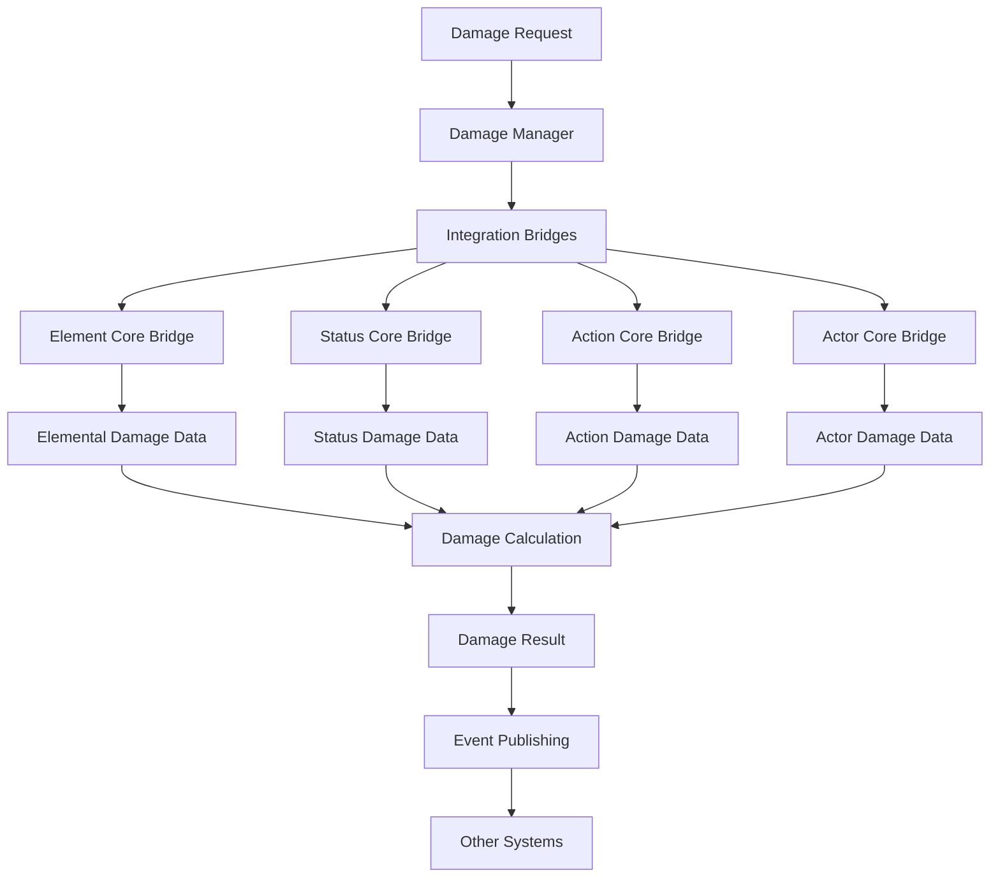

# Damage Manager Integration Design

## 📋 **Tổng Quan**

Document này mô tả chi tiết cách Damage Manager tích hợp với các hệ thống khác trong Chaos World MMORPG, bao gồm Element Core, Status Core, Action Core, và Actor Core.

## 🎯 **Integration Principles**

### **1. Seamless Integration**
- **Non-Breaking Changes**: Không làm thay đổi existing APIs
- **Backward Compatibility**: Tương thích với existing systems
- **Performance Neutral**: Không ảnh hưởng đến performance hiện tại
- **Gradual Migration**: Dễ dàng migrate từ old system

### **2. Configuration-Driven**
- **No Hard Coding**: Tất cả integration được config qua YAML
- **Dynamic Loading**: Load integration configs dynamically
- **Hot Reload**: Update integration configs without restart
- **Validation**: Validate integration configs before loading

### **3. Event-Driven Architecture**
- **Event Publishing**: Publish events khi có damage changes
- **Event Subscribing**: Subscribe to events từ other systems
- **Event Processing**: Process events asynchronously
- **Event Caching**: Cache events for performance

## 🏗️ **Integration Architecture**

### **Core Integration Components**

```
Damage Manager Integration
├── Integration Bridges
│   ├── ElementCoreBridge
│   ├── StatusCoreBridge
│   ├── ActionCoreBridge
│   └── ActorCoreBridge
├── Event System
│   ├── EventPublisher
│   ├── EventSubscriber
│   ├── EventProcessor
│   └── EventCache
├── Configuration System
│   ├── IntegrationConfigLoader
│   ├── IntegrationConfigValidator
│   └── IntegrationConfigCache
└── Performance Layer
    ├── IntegrationMetrics
    ├── IntegrationProfiler
    └── IntegrationOptimizer
```

### **Integration Flow**



## 🔧 **Integration Bridges**

### **1. Element Core Bridge**

```rust
/// Element Core Bridge
pub struct ElementCoreBridge {
    element_core: Arc<dyn ElementCoreInterface>,
    damage_manager: Arc<dyn DamageManagerInterface>,
    integration_config: ElementCoreIntegrationConfig,
}

impl ElementCoreBridge {
    /// Get elemental damage modifiers
    pub async fn get_elemental_damage_modifiers(
        &self,
        actor_id: &str,
        element_id: &str,
        damage_type: &str
    ) -> Result<Vec<DamageModifier>, IntegrationError> {
        // Get element mastery data
        let mastery_data = self.element_core.get_element_mastery_data(actor_id, element_id).await?;
        
        // Get element definition
        let element_def = self.element_core.get_element_definition(element_id).await?;
        
        // Create damage modifiers
        let mut modifiers = Vec::new();
        
        // Mastery bonus modifier
        if mastery_data.mastery_level > 0 {
            let mastery_bonus = self.calculate_mastery_bonus(&mastery_data, &element_def);
            modifiers.push(DamageModifier {
                modifier_type: DamageModifierType::Multiplier,
                value: 1.0 + mastery_bonus,
                source: format!("element_mastery_{}", element_id),
                condition: None,
                properties: HashMap::new(),
            });
        }
        
        // Element resistance modifier
        if mastery_data.resistance > 0.0 {
            modifiers.push(DamageModifier {
                modifier_type: DamageModifierType::Resistance,
                value: mastery_data.resistance,
                source: format!("element_resistance_{}", element_id),
                condition: None,
                properties: HashMap::new(),
            });
        }
        
        // Element interaction modifier
        let interaction_modifier = self.calculate_element_interaction_modifier(
            actor_id,
            element_id,
            damage_type
        ).await?;
        
        if let Some(interaction) = interaction_modifier {
            modifiers.push(interaction);
        }
        
        Ok(modifiers)
    }
    
    /// Get elemental damage data
    pub async fn get_elemental_damage_data(
        &self,
        actor_id: &str,
        element_id: &str,
        damage_type: &str
    ) -> Result<ElementDamageData, IntegrationError> {
        // Get element mastery data
        let mastery_data = self.element_core.get_element_mastery_data(actor_id, element_id).await?;
        
        // Get element definition
        let element_def = self.element_core.get_element_definition(element_id).await?;
        
        // Calculate base damage
        let base_damage = self.calculate_elemental_base_damage(
            &mastery_data,
            &element_def,
            damage_type
        ).await?;
        
        // Calculate power scale
        let power_scale = self.calculate_elemental_power_scale(
            &mastery_data,
            &element_def
        ).await?;
        
        // Create element damage data
        Ok(ElementDamageData {
            element_id: element_id.to_string(),
            base_damage,
            power_scale,
            mastery_level: mastery_data.mastery_level,
            mastery_tier: mastery_data.mastery_tier,
            realm: mastery_data.realm,
            stage: mastery_data.stage,
            power_tier: mastery_data.power_tier,
            resistance: mastery_data.resistance,
            properties: element_def.properties,
        })
    }
    
    /// Check elemental damage immunity
    pub async fn check_elemental_damage_immunity(
        &self,
        actor_id: &str,
        element_id: &str,
        damage_type: &str
    ) -> Result<bool, IntegrationError> {
        // Check element mastery immunity
        let mastery_data = self.element_core.get_element_mastery_data(actor_id, element_id).await?;
        
        if mastery_data.immunity > 0.0 {
            return Ok(true);
        }
        
        // Check element interaction immunity
        let interaction_immunity = self.check_element_interaction_immunity(
            actor_id,
            element_id,
            damage_type
        ).await?;
        
        Ok(interaction_immunity)
    }
}
```

### **2. Status Core Bridge**

```rust
/// Status Core Bridge
pub struct StatusCoreBridge {
    status_core: Arc<dyn StatusCoreInterface>,
    damage_manager: Arc<dyn DamageManagerInterface>,
    integration_config: StatusCoreIntegrationConfig,
}

impl StatusCoreBridge {
    /// Get status damage modifiers
    pub async fn get_status_damage_modifiers(
        &self,
        actor_id: &str,
        damage_type: &str
    ) -> Result<Vec<DamageModifier>, IntegrationError> {
        // Get active status effects
        let status_effects = self.status_core.get_actor_status_effects(actor_id).await?;
        
        let mut modifiers = Vec::new();
        
        // Process each status effect
        for effect in status_effects {
            if effect.requires_damage_calculation {
                // Create damage modifier from status effect
                let modifier = DamageModifier {
                    modifier_type: DamageModifierType::Multiplier,
                    value: effect.magnitude,
                    source: format!("status_effect_{}", effect.effect_id),
                    condition: None,
                    properties: effect.properties,
                };
                modifiers.push(modifier);
            }
        }
        
        // Get status effect damage modifiers
        let status_modifiers = self.status_core.get_damage_modifiers(actor_id, damage_type).await?;
        modifiers.extend(status_modifiers);
        
        Ok(modifiers)
    }
    
    /// Get status damage data
    pub async fn get_status_damage_data(
        &self,
        actor_id: &str,
        damage_type: &str
    ) -> Result<StatusDamageData, IntegrationError> {
        // Get active status effects
        let status_effects = self.status_core.get_actor_status_effects(actor_id).await?;
        
        // Calculate total status damage
        let mut total_damage = 0.0;
        let mut total_intensity = 0.0;
        let mut total_duration = 0.0;
        
        for effect in &status_effects {
            if effect.requires_damage_calculation {
                total_damage += effect.magnitude;
                total_intensity += effect.intensity;
                total_duration += effect.duration;
            }
        }
        
        // Create status damage data
        Ok(StatusDamageData {
            actor_id: actor_id.to_string(),
            total_damage,
            total_intensity,
            total_duration,
            status_effects: status_effects.into_iter()
                .filter(|e| e.requires_damage_calculation)
                .collect(),
        })
    }
    
    /// Check status damage immunity
    pub async fn check_status_damage_immunity(
        &self,
        actor_id: &str,
        damage_type: &str
    ) -> Result<bool, IntegrationError> {
        // Check status effect immunity
        let immunity = self.status_core.check_damage_immunity(actor_id, damage_type).await?;
        Ok(immunity)
    }
}
```

### **3. Action Core Bridge**

```rust
/// Action Core Bridge
pub struct ActionCoreBridge {
    action_core: Arc<dyn ActionCoreInterface>,
    damage_manager: Arc<dyn DamageManagerInterface>,
    integration_config: ActionCoreIntegrationConfig,
}

impl ActionCoreBridge {
    /// Get action damage modifiers
    pub async fn get_action_damage_modifiers(
        &self,
        actor_id: &str,
        action_id: &str,
        damage_type: &str
    ) -> Result<Vec<DamageModifier>, IntegrationError> {
        // Get action definition
        let action_def = self.action_core.get_action_definition(action_id).await?;
        
        let mut modifiers = Vec::new();
        
        // Action effectiveness modifier
        if let Some(effectiveness) = action_def.properties.get("effectiveness") {
            if let Some(eff_value) = effectiveness.as_f64() {
                modifiers.push(DamageModifier {
                    modifier_type: DamageModifierType::Multiplier,
                    value: eff_value,
                    source: format!("action_effectiveness_{}", action_id),
                    condition: None,
                    properties: HashMap::new(),
                });
            }
        }
        
        // Action cooldown modifier
        if let Some(cooldown_reduction) = action_def.properties.get("cooldown_reduction") {
            if let Some(cd_value) = cooldown_reduction.as_f64() {
                modifiers.push(DamageModifier {
                    modifier_type: DamageModifierType::Multiplier,
                    value: 1.0 + cd_value,
                    source: format!("action_cooldown_{}", action_id),
                    condition: None,
                    properties: HashMap::new(),
                });
            }
        }
        
        // Action skill bonus modifier
        if let Some(skill_bonus) = action_def.properties.get("skill_bonus") {
            if let Some(sb_value) = skill_bonus.as_f64() {
                modifiers.push(DamageModifier {
                    modifier_type: DamageModifierType::Multiplier,
                    value: 1.0 + sb_value,
                    source: format!("action_skill_bonus_{}", action_id),
                    condition: None,
                    properties: HashMap::new(),
                });
            }
        }
        
        Ok(modifiers)
    }
    
    /// Get action damage data
    pub async fn get_action_damage_data(
        &self,
        actor_id: &str,
        action_id: &str,
        damage_type: &str
    ) -> Result<ActionDamageData, IntegrationError> {
        // Get action definition
        let action_def = self.action_core.get_action_definition(action_id).await?;
        
        // Get action execution data
        let execution_data = self.action_core.get_action_execution_data(actor_id, action_id).await?;
        
        // Calculate base damage from action
        let base_damage = self.calculate_action_base_damage(
            &action_def,
            &execution_data,
            damage_type
        ).await?;
        
        // Calculate action effectiveness
        let effectiveness = self.calculate_action_effectiveness(
            &action_def,
            &execution_data
        ).await?;
        
        // Create action damage data
        Ok(ActionDamageData {
            action_id: action_id.to_string(),
            base_damage,
            effectiveness,
            execution_duration: execution_data.execution_duration,
            cooldown_duration: execution_data.cooldown_duration,
            resource_cost: execution_data.resource_cost,
            properties: action_def.properties,
        })
    }
    
    /// Check action damage immunity
    pub async fn check_action_damage_immunity(
        &self,
        actor_id: &str,
        action_id: &str,
        damage_type: &str
    ) -> Result<bool, IntegrationError> {
        // Check action immunity
        let immunity = self.action_core.check_damage_immunity(actor_id, action_id, damage_type).await?;
        Ok(immunity)
    }
}
```

### **4. Actor Core Bridge**

```rust
/// Actor Core Bridge
pub struct ActorCoreBridge {
    actor_core: Arc<dyn ActorCoreInterface>,
    damage_manager: Arc<dyn DamageManagerInterface>,
    integration_config: ActorCoreIntegrationConfig,
}

impl ActorCoreBridge {
    /// Get actor damage modifiers
    pub async fn get_actor_damage_modifiers(
        &self,
        actor_id: &str,
        damage_type: &str
    ) -> Result<Vec<DamageModifier>, IntegrationError> {
        // Get actor derived stats
        let derived_stats = self.actor_core.get_derived_stats(actor_id).await?;
        
        let mut modifiers = Vec::new();
        
        // Get damage-related stats
        if let Some(attack_bonus) = derived_stats.get("attack_bonus") {
            modifiers.push(DamageModifier {
                modifier_type: DamageModifierType::Addition,
                value: *attack_bonus,
                source: "actor_attack_bonus".to_string(),
                condition: None,
                properties: HashMap::new(),
            });
        }
        
        if let Some(defense_bonus) = derived_stats.get("defense_bonus") {
            modifiers.push(DamageModifier {
                modifier_type: DamageModifierType::Resistance,
                value: *defense_bonus,
                source: "actor_defense_bonus".to_string(),
                condition: None,
                properties: HashMap::new(),
            });
        }
        
        if let Some(critical_chance) = derived_stats.get("critical_chance") {
            modifiers.push(DamageModifier {
                modifier_type: DamageModifierType::Custom("critical_hit".to_string()),
                value: *critical_chance,
                source: "actor_critical_chance".to_string(),
                condition: None,
                properties: HashMap::new(),
            });
        }
        
        Ok(modifiers)
    }
    
    /// Get actor damage data
    pub async fn get_actor_damage_data(
        &self,
        actor_id: &str,
        damage_type: &str
    ) -> Result<ActorDamageData, IntegrationError> {
        // Get actor derived stats
        let derived_stats = self.actor_core.get_derived_stats(actor_id).await?;
        
        // Get actor level
        let level = self.actor_core.get_actor_level(actor_id).await?;
        
        // Get actor class
        let class = self.actor_core.get_actor_class(actor_id).await?;
        
        // Calculate base damage from stats
        let base_damage = self.calculate_actor_base_damage(
            &derived_stats,
            level,
            &class,
            damage_type
        ).await?;
        
        // Create actor damage data
        Ok(ActorDamageData {
            actor_id: actor_id.to_string(),
            level,
            class,
            base_damage,
            derived_stats,
            properties: HashMap::new(),
        })
    }
    
    /// Check actor damage immunity
    pub async fn check_actor_damage_immunity(
        &self,
        actor_id: &str,
        damage_type: &str
    ) -> Result<bool, IntegrationError> {
        // Check actor immunity
        let immunity = self.actor_core.check_damage_immunity(actor_id, damage_type).await?;
        Ok(immunity)
    }
}
```

## 🔄 **Event System Integration**

### **Event Publishing**

```rust
/// Event Publisher
pub struct EventPublisher {
    event_queue: Arc<Mutex<VecDeque<DamageEvent>>>,
    event_subscribers: HashMap<String, Vec<Box<dyn EventSubscriber>>>,
    integration_config: EventIntegrationConfig,
}

impl EventPublisher {
    /// Publish damage event
    pub async fn publish_damage_event(
        &self,
        event: DamageEvent
    ) -> Result<(), IntegrationError> {
        // Add to event queue
        {
            let mut queue = self.event_queue.lock().unwrap();
            queue.push_back(event.clone());
        }
        
        // Notify subscribers
        self.notify_subscribers(&event).await?;
        
        Ok(())
    }
    
    /// Notify subscribers
    async fn notify_subscribers(
        &self,
        event: &DamageEvent
    ) -> Result<(), IntegrationError> {
        let subscribers = self.event_subscribers.get(&event.event_type.to_string())
            .cloned()
            .unwrap_or_default();
        
        for subscriber in subscribers {
            if let Err(e) = subscriber.handle_event(event).await {
                tracing::error!("Error notifying event subscriber: {}", e);
            }
        }
        
        Ok(())
    }
}
```

### **Event Subscribing**

```rust
/// Event Subscriber
pub trait EventSubscriber: Send + Sync {
    async fn handle_event(&self, event: &DamageEvent) -> Result<(), IntegrationError>;
    fn get_subscribed_event_types(&self) -> Vec<DamageEventType>;
}

/// Element Core Event Subscriber
pub struct ElementCoreEventSubscriber {
    element_core: Arc<dyn ElementCoreInterface>,
}

#[async_trait]
impl EventSubscriber for ElementCoreEventSubscriber {
    async fn handle_event(&self, event: &DamageEvent) -> Result<(), IntegrationError> {
        match event.event_type {
            DamageEventType::DamageApplied => {
                // Update element mastery based on damage
                self.update_element_mastery_from_damage(event).await?;
            },
            DamageEventType::DamageBlocked => {
                // Update element resistance based on blocked damage
                self.update_element_resistance_from_damage(event).await?;
            },
            _ => {
                // Handle other event types
            },
        }
        
        Ok(())
    }
    
    fn get_subscribed_event_types(&self) -> Vec<DamageEventType> {
        vec![
            DamageEventType::DamageApplied,
            DamageEventType::DamageBlocked,
            DamageEventType::DamageAbsorbed,
        ]
    }
}
```

## 📊 **Integration Performance**

### **Performance Metrics**

```rust
/// Integration Metrics
pub struct IntegrationMetrics {
    // Bridge performance
    element_core_bridge_calls: AtomicU64,
    status_core_bridge_calls: AtomicU64,
    action_core_bridge_calls: AtomicU64,
    actor_core_bridge_calls: AtomicU64,
    
    // Bridge latency
    element_core_bridge_latency: AtomicU64,
    status_core_bridge_latency: AtomicU64,
    action_core_bridge_latency: AtomicU64,
    actor_core_bridge_latency: AtomicU64,
    
    // Event performance
    events_published: AtomicU64,
    events_processed: AtomicU64,
    event_queue_size: AtomicU64,
    
    // Error rates
    integration_errors: AtomicU64,
    bridge_errors: AtomicU64,
    event_errors: AtomicU64,
}

impl IntegrationMetrics {
    /// Record bridge call
    pub fn record_bridge_call(&self, bridge_type: BridgeType, latency_ms: u64) {
        match bridge_type {
            BridgeType::ElementCore => {
                self.element_core_bridge_calls.fetch_add(1, Ordering::Relaxed);
                self.element_core_bridge_latency.fetch_add(latency_ms, Ordering::Relaxed);
            },
            BridgeType::StatusCore => {
                self.status_core_bridge_calls.fetch_add(1, Ordering::Relaxed);
                self.status_core_bridge_latency.fetch_add(latency_ms, Ordering::Relaxed);
            },
            BridgeType::ActionCore => {
                self.action_core_bridge_calls.fetch_add(1, Ordering::Relaxed);
                self.action_core_bridge_latency.fetch_add(latency_ms, Ordering::Relaxed);
            },
            BridgeType::ActorCore => {
                self.actor_core_bridge_calls.fetch_add(1, Ordering::Relaxed);
                self.actor_core_bridge_latency.fetch_add(latency_ms, Ordering::Relaxed);
            },
        }
    }
    
    /// Record event
    pub fn record_event_published(&self) {
        self.events_published.fetch_add(1, Ordering::Relaxed);
    }
    
    /// Record event processed
    pub fn record_event_processed(&self) {
        self.events_processed.fetch_add(1, Ordering::Relaxed);
    }
    
    /// Record error
    pub fn record_integration_error(&self, error_type: IntegrationErrorType) {
        match error_type {
            IntegrationErrorType::BridgeError => {
                self.bridge_errors.fetch_add(1, Ordering::Relaxed);
            },
            IntegrationErrorType::EventError => {
                self.event_errors.fetch_add(1, Ordering::Relaxed);
            },
            _ => {
                self.integration_errors.fetch_add(1, Ordering::Relaxed);
            },
        }
    }
}
```

## 🧪 **Integration Testing**

### **Unit Testing**

```rust
#[cfg(test)]
mod integration_tests {
    use super::*;
    
    #[tokio::test]
    async fn test_element_core_bridge_integration() {
        // Create mock element core
        let mock_element_core = MockElementCore::new();
        
        // Create bridge
        let bridge = ElementCoreBridge::new(
            Arc::new(mock_element_core),
            Arc::new(mock_damage_manager),
            ElementCoreIntegrationConfig::default(),
        );
        
        // Test getting damage modifiers
        let modifiers = bridge.get_elemental_damage_modifiers(
            "actor_123",
            "fire",
            "hp"
        ).await.unwrap();
        
        assert!(!modifiers.is_empty());
        assert_eq!(modifiers[0].source, "element_mastery_fire");
    }
    
    #[tokio::test]
    async fn test_status_core_bridge_integration() {
        // Create mock status core
        let mock_status_core = MockStatusCore::new();
        
        // Create bridge
        let bridge = StatusCoreBridge::new(
            Arc::new(mock_status_core),
            Arc::new(mock_damage_manager),
            StatusCoreIntegrationConfig::default(),
        );
        
        // Test getting damage modifiers
        let modifiers = bridge.get_status_damage_modifiers(
            "actor_123",
            "hp"
        ).await.unwrap();
        
        assert!(!modifiers.is_empty());
    }
}
```

### **Integration Testing**

```rust
#[cfg(test)]
mod integration_tests {
    use super::*;
    
    #[tokio::test]
    async fn test_full_damage_manager_integration() {
        // Create all bridges
        let element_bridge = ElementCoreBridge::new(/* ... */);
        let status_bridge = StatusCoreBridge::new(/* ... */);
        let action_bridge = ActionCoreBridge::new(/* ... */);
        let actor_bridge = ActorCoreBridge::new(/* ... */);
        
        // Create damage manager with bridges
        let damage_manager = DamageManager::new()
            .with_element_bridge(element_bridge)
            .with_status_bridge(status_bridge)
            .with_action_bridge(action_bridge)
            .with_actor_bridge(actor_bridge)
            .build();
        
        // Test damage calculation with all integrations
        let damage_request = DamageRequest {
            actor_id: "actor_123".to_string(),
            damage_type: DamageType::HP,
            base_damage: 100.0,
            damage_source: DamageSource::Elemental,
            element_id: Some("fire".to_string()),
            source_id: None,
            modifiers: Vec::new(),
            properties: HashMap::new(),
            context: DamageContext::default(),
        };
        
        let result = damage_manager.apply_damage(damage_request).await.unwrap();
        
        assert!(result.damage_applied > 0.0);
        assert!(!result.modifiers_applied.is_empty());
    }
}
```

## 📝 **Configuration Examples**

### **Integration Configuration**

```yaml
# integration_config.yaml
version: 1.0
integration:
  element_core:
    enabled: true
    timeout_ms: 5000
    retry_attempts: 3
    retry_delay_ms: 1000
    cache_enabled: true
    cache_ttl_seconds: 300
  
  status_core:
    enabled: true
    timeout_ms: 3000
    retry_attempts: 2
    retry_delay_ms: 500
    cache_enabled: true
    cache_ttl_seconds: 180
  
  action_core:
    enabled: true
    timeout_ms: 4000
    retry_attempts: 3
    retry_delay_ms: 750
    cache_enabled: true
    cache_ttl_seconds: 240
  
  actor_core:
    enabled: true
    timeout_ms: 2000
    retry_attempts: 2
    retry_delay_ms: 250
    cache_enabled: true
    cache_ttl_seconds: 120

events:
  enabled: true
  max_queue_size: 10000
  processing_timeout_ms: 1000
  batch_size: 100
  batch_timeout_ms: 500

performance:
  max_concurrent_integrations: 100
  integration_timeout_ms: 10000
  enable_metrics: true
  enable_profiling: false
```

## 💡 **Benefits**

### **1. Seamless Integration**
- **Non-Breaking**: Không làm thay đổi existing systems
- **Backward Compatible**: Tương thích với existing APIs
- **Performance Neutral**: Không ảnh hưởng đến performance
- **Easy Migration**: Dễ dàng migrate từ old system

### **2. Configuration-Driven**
- **Flexible**: Dễ dàng configure integration behavior
- **Hot Reload**: Update configs without restart
- **Validation**: Validate configs before loading
- **Type Safe**: Strong typing cho configs

### **3. Event-Driven**
- **Loose Coupling**: Systems không tightly coupled
- **Scalable**: Dễ dàng scale individual systems
- **Maintainable**: Dễ dàng maintain và debug
- **Extensible**: Dễ dàng thêm new integrations

### **4. Performance Optimized**
- **Caching**: Intelligent caching system
- **Batch Processing**: Process multiple requests together
- **Async Processing**: Non-blocking operations
- **Metrics**: Comprehensive performance metrics

---

**Last Updated**: 2025-01-27  
**Version**: 1.0  
**Status**: Design Complete  
**Maintainer**: Chaos World Team
