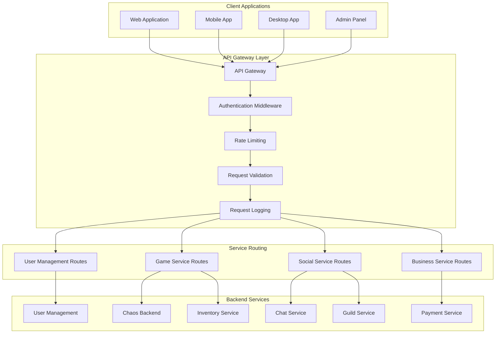
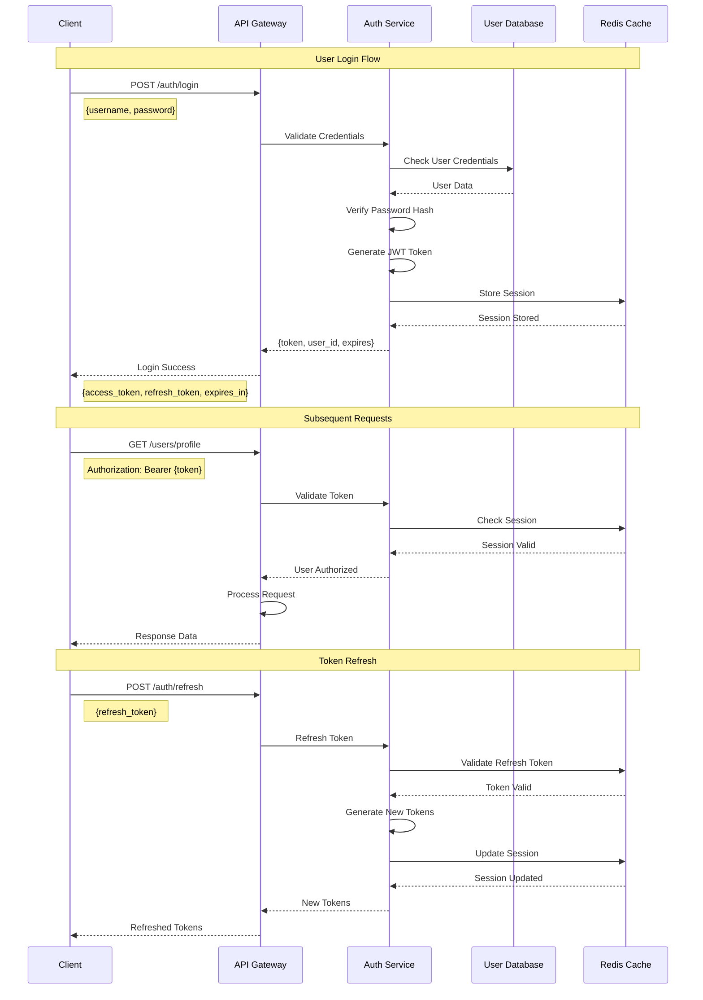
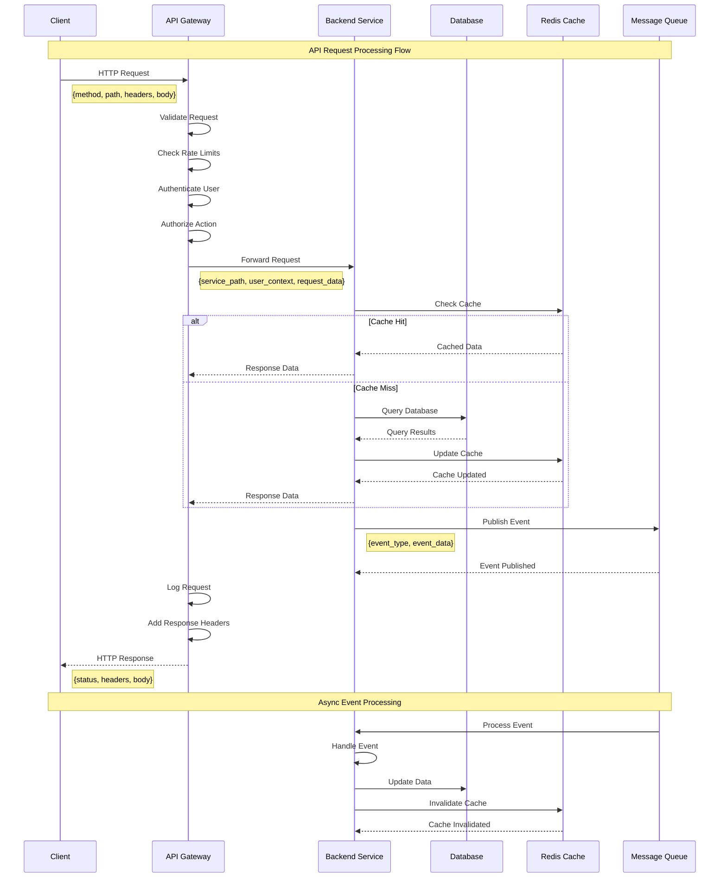
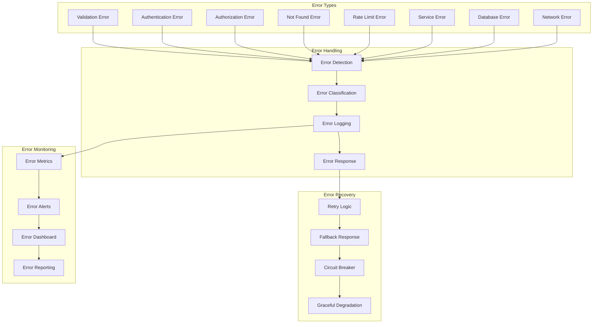
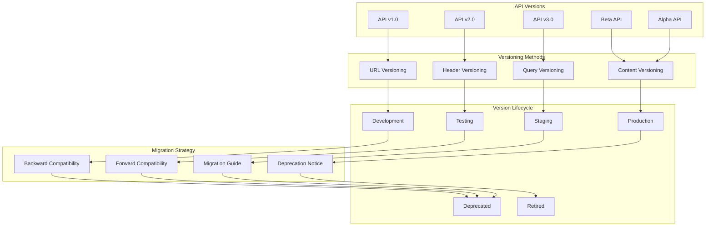
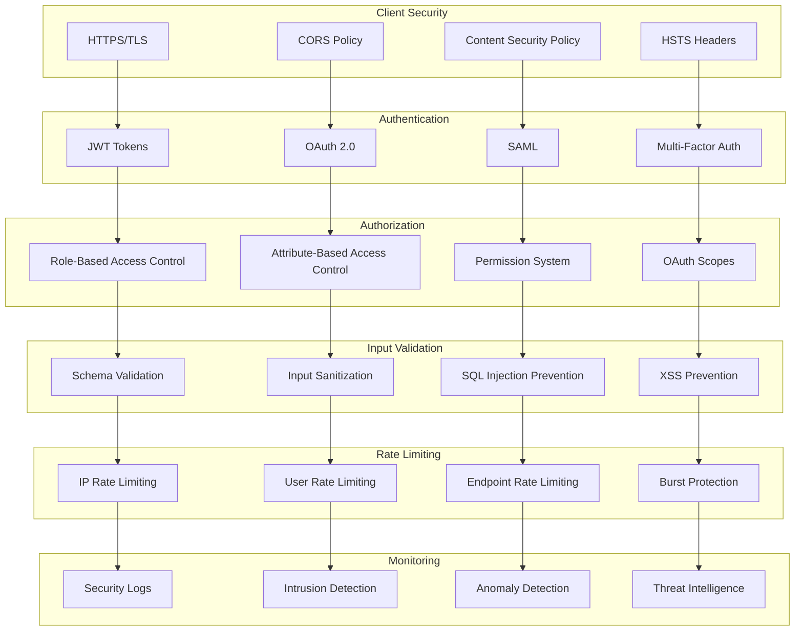
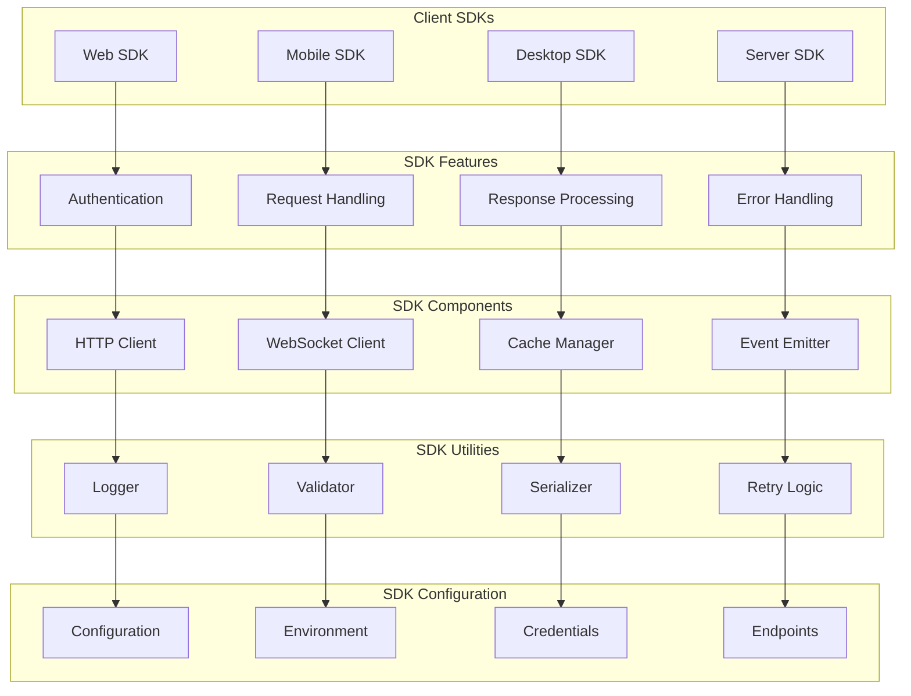
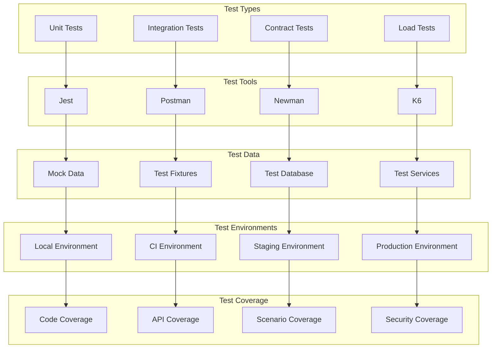

# API Documentation Diagrams

## 🔌 API Gateway Architecture

## 📊 API Endpoint Structure

```mermaid
graph TB
    subgraph "API Gateway Endpoints"
        AuthEndpoints["/auth/*"]
        UserEndpoints["/users/*"]
        GameEndpoints["/game/*"]
        SocialEndpoints["/social/*"]
        BusinessEndpoints["/business/*"]
    end
    
    subgraph "Authentication Endpoints"
        Login["POST /auth/login"]
        Register["POST /auth/register"]
        Refresh["POST /auth/refresh"]
        Logout["POST /auth/logout"]
        ForgotPassword["POST /auth/forgot-password"]
        ResetPassword["POST /auth/reset-password"]
    end
    
    subgraph "User Management Endpoints"
        GetProfile["GET /users/profile"]
        UpdateProfile["PUT /users/profile"]
        GetSettings["GET /users/settings"]
        UpdateSettings["PUT /users/settings"]
        GetFriends["GET /users/friends"]
        AddFriend["POST /users/friends"]
    end
    
    subgraph "Game Service Endpoints"
        GetActor["GET /game/actor"]
        UpdateActor["PUT /game/actor"]
        UseSkill["POST /game/skills/use"]
        MoveActor["POST /game/actor/move"]
        GetInventory["GET /game/inventory"]
        UseItem["POST /game/inventory/use"]
    end
    
    subgraph "Social Service Endpoints"
        SendMessage["POST /social/chat/send"]
        GetMessages["GET /social/chat/messages"]
        JoinGuild["POST /social/guild/join"]
        LeaveGuild["POST /social/guild/leave"]
        CreateGuild["POST /social/guild/create"]
        GetGuilds["GET /social/guilds"]
    end
    
    subgraph "Business Service Endpoints"
        GetProducts["GET /business/products"]
        PurchaseItem["POST /business/purchase"]
        GetOrders["GET /business/orders"]
        RequestRefund["POST /business/refund"]
        GetWallet["GET /business/wallet"]
        AddFunds["POST /business/wallet/add"]
    end
    
    AuthEndpoints --> Login
    AuthEndpoints --> Register
    AuthEndpoints --> Refresh
    AuthEndpoints --> Logout
    AuthEndpoints --> ForgotPassword
    AuthEndpoints --> ResetPassword
    
    UserEndpoints --> GetProfile
    UserEndpoints --> UpdateProfile
    UserEndpoints --> GetSettings
    UserEndpoints --> UpdateSettings
    UserEndpoints --> GetFriends
    UserEndpoints --> AddFriend
    
    GameEndpoints --> GetActor
    GameEndpoints --> UpdateActor
    GameEndpoints --> UseSkill
    GameEndpoints --> MoveActor
    GameEndpoints --> GetInventory
    GameEndpoints --> UseItem
    
    SocialEndpoints --> SendMessage
    SocialEndpoints --> GetMessages
    SocialEndpoints --> JoinGuild
    SocialEndpoints --> LeaveGuild
    SocialEndpoints --> CreateGuild
    SocialEndpoints --> GetGuilds
    
    BusinessEndpoints --> GetProducts
    BusinessEndpoints --> PurchaseItem
    BusinessEndpoints --> GetOrders
    BusinessEndpoints --> RequestRefund
    BusinessEndpoints --> GetWallet
    BusinessEndpoints --> AddFunds
```

## 🔐 Authentication Flow

## 📝 API Request/Response Flow

## 🚨 Error Handling Flow

## 📊 API Performance Monitoring

```mermaid
graph TB
    subgraph "Performance Metrics"
        ResponseTime[Response Time]
        Throughput[Throughput]
        ErrorRate[Error Rate]
        Availability[Availability]
    end
    
    subgraph "Request Metrics"
        RequestCount[Request Count]
        RequestSize[Request Size]
        ResponseSize[Response Size]
        CacheHitRate[Cache Hit Rate]
    end
    
    subgraph "User Metrics"
        ActiveUsers[Active Users]
        ConcurrentUsers[Concurrent Users]
        UserSessions[User Sessions]
        UserEngagement[User Engagement]
    end
    
    subgraph "System Metrics"
        CPUUsage[CPU Usage]
        MemoryUsage[Memory Usage]
        DiskUsage[Disk Usage]
        NetworkUsage[Network Usage]
    end
    
    subgraph "Business Metrics"
        Revenue[Revenue]
        Conversions[Conversions]
        Retention[User Retention]
        Churn[User Churn]
    end
    
    subgraph "Monitoring Tools"
        Prometheus[Prometheus]
        Grafana[Grafana]
        Jaeger[Jaeger]
        ELK[ELK Stack]
    end
    
    subgraph "Alerting"
        ThresholdAlerts[Threshold Alerts]
        AnomalyAlerts[Anomaly Alerts]
        BusinessAlerts[Business Alerts]
        SecurityAlerts[Security Alerts]
    end
    
    ResponseTime --> Prometheus
    Throughput --> Prometheus
    ErrorRate --> Prometheus
    Availability --> Prometheus
    
    RequestCount --> Prometheus
    RequestSize --> Prometheus
    ResponseSize --> Prometheus
    CacheHitRate --> Prometheus
    
    ActiveUsers --> Prometheus
    ConcurrentUsers --> Prometheus
    UserSessions --> Prometheus
    UserEngagement --> Prometheus
    
    CPUUsage --> Prometheus
    MemoryUsage --> Prometheus
    DiskUsage --> Prometheus
    NetworkUsage --> Prometheus
    
    Revenue --> Prometheus
    Conversions --> Prometheus
    Retention --> Prometheus
    Churn --> Prometheus
    
    Prometheus --> Grafana
    Prometheus --> Jaeger
    Prometheus --> ELK
    
    Grafana --> ThresholdAlerts
    Jaeger --> AnomalyAlerts
    ELK --> BusinessAlerts
    Prometheus --> SecurityAlerts
```

## 🔄 API Versioning Strategy

## 🛡️ API Security Architecture

## 📱 API Client SDK Architecture

## 🔍 API Testing Strategy

