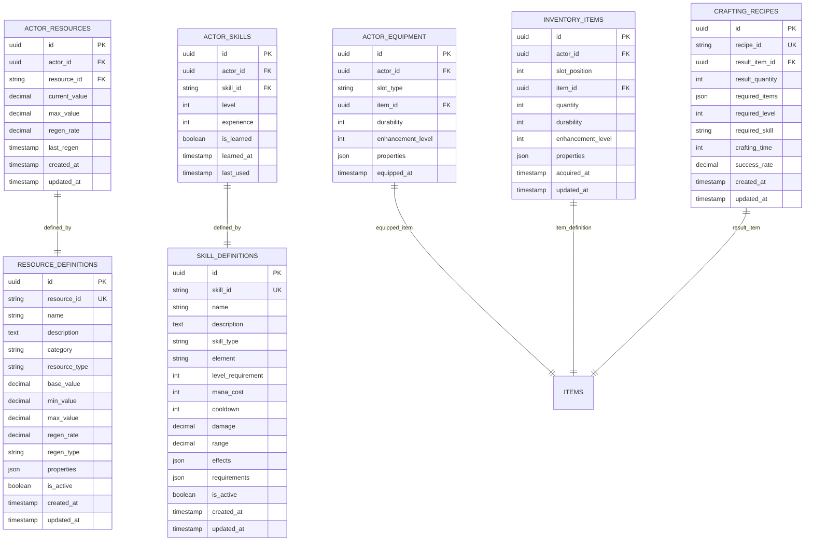
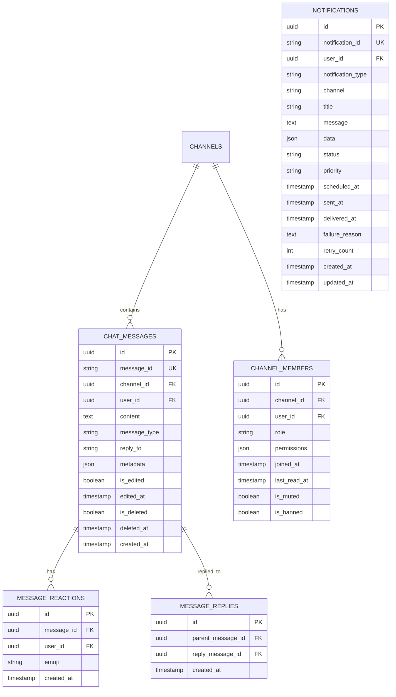
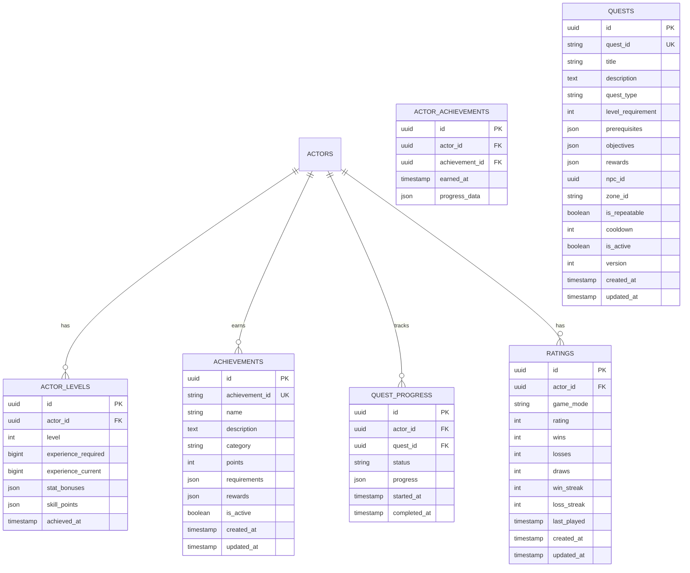
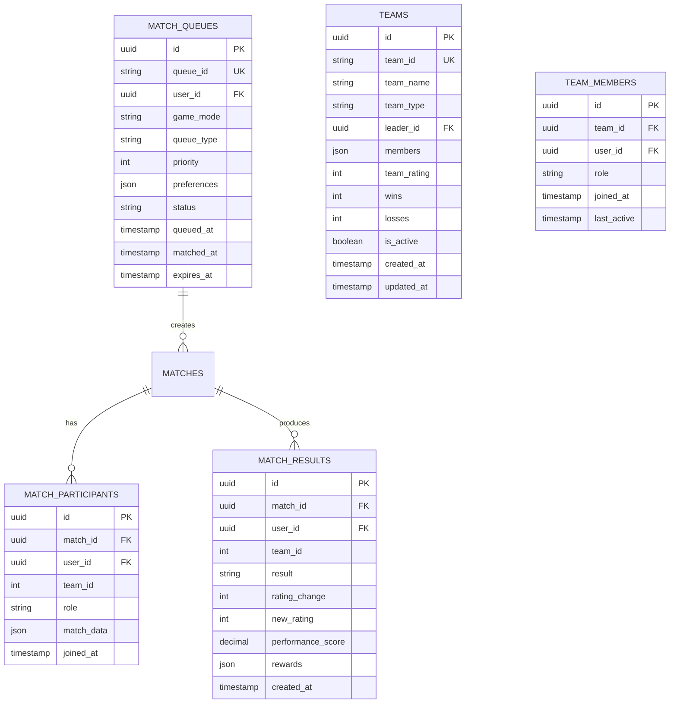
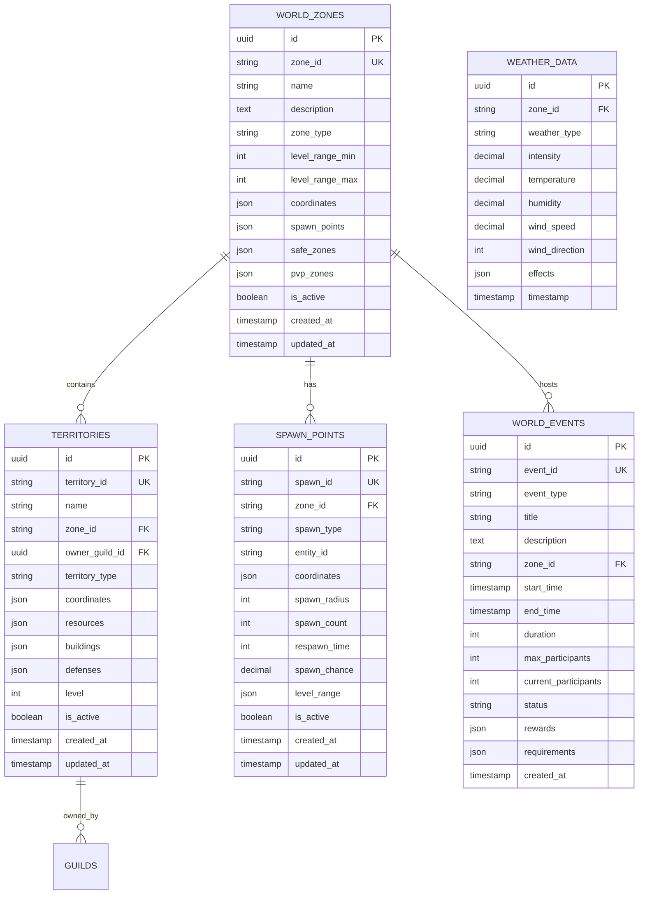
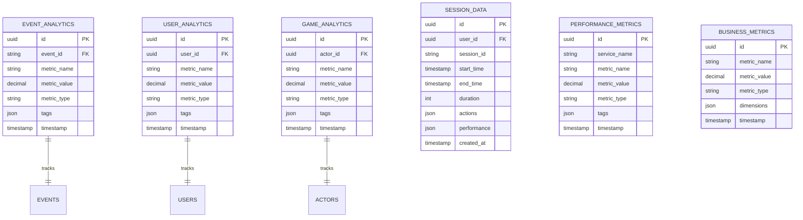
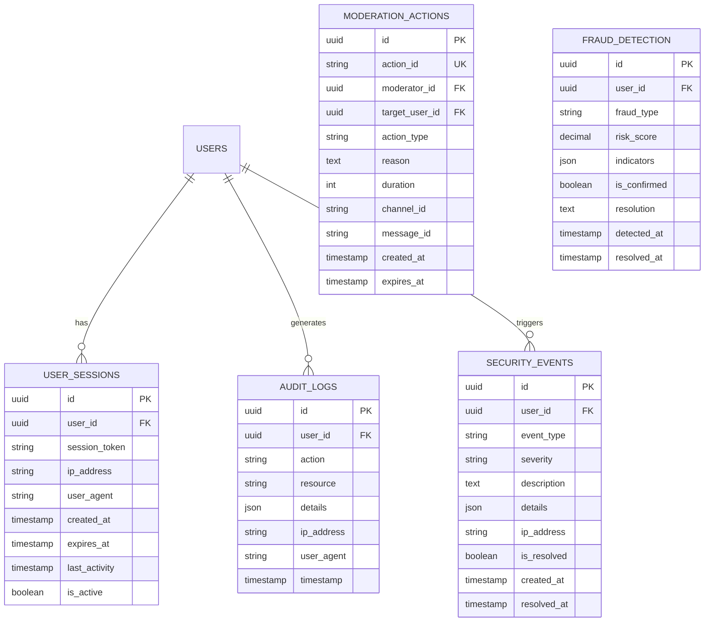

# Database Schema Diagrams

## 🗄️ Core Database Schema

```mermaid
erDiagram
    USERS ||--o{ ACTORS : "has"
    USERS ||--o{ USER_PREFERENCES : "has"
    USERS ||--o{ PAYMENT_TRANSACTIONS : "makes"
    USERS ||--o{ CHAT_MESSAGES : "sends"
    USERS ||--o{ EVENT_PARTICIPATIONS : "participates"
    
    ACTORS ||--o{ ACTOR_RESOURCES : "has"
    ACTORS ||--o{ ACTOR_SKILLS : "learns"
    ACTORS ||--o{ ACTOR_EQUIPMENT : "wears"
    ACTORS ||--o{ INVENTORY_ITEMS : "owns"
    ACTORS ||--o{ GUILD_MEMBERS : "member_of"
    
    GUILDS ||--o{ GUILD_MEMBERS : "contains"
    GUILDS ||--o{ GUILD_STORAGE : "owns"
    GUILDS ||--o{ TERRITORIES : "controls"
    GUILDS ||--o{ GUILD_ACTIVITIES : "hosts"
    
    ITEMS ||--o{ INVENTORY_ITEMS : "instance_of"
    ITEMS ||--o{ CRAFTING_RECIPES : "used_in"
    ITEMS ||--o{ EVENT_REWARDS : "rewarded_as"
    
    EVENTS ||--o{ EVENT_PARTICIPATIONS : "has"
    EVENTS ||--o{ EVENT_REWARDS : "gives"
    EVENTS ||--o{ EVENT_SCHEDULES : "scheduled_by"
    
    CHANNELS ||--o{ CHAT_MESSAGES : "contains"
    CHANNELS ||--o{ CHANNEL_MEMBERS : "has"
    
    MATCHES ||--o{ MATCH_PARTICIPANTS : "has"
    MATCHES ||--o{ MATCH_RESULTS : "produces"
    
    USERS {
        uuid id PK
        string username UK
        string email UK
        string password_hash
        string status
        timestamp created_at
        timestamp last_login
        json preferences
    }
    
    ACTORS {
        uuid id PK
        uuid user_id FK
        string name
        int level
        bigint experience
        json stats
        json position
        timestamp created_at
        timestamp last_active
    }
    
    GUILDS {
        uuid id PK
        string guild_id UK
        string name
        text description
        string emblem_url
        int level
        bigint experience
        int max_members
        bigint treasury
        string status
        timestamp created_at
        timestamp updated_at
    }
    
    ITEMS {
        uuid id PK
        string item_id UK
        string name
        text description
        string item_type
        string rarity
        int level_requirement
        int value
        int stack_size
        json properties
        json requirements
        json effects
        boolean is_active
        int version
        timestamp created_at
        timestamp updated_at
    }
    
    EVENTS {
        uuid id PK
        string event_id UK
        string name
        text description
        string event_type
        string category
        string status
        timestamp start_time
        timestamp end_time
        int duration
        int max_participants
        int current_participants
        json requirements
        json rewards
        json settings
        uuid created_by
        timestamp created_at
        timestamp updated_at
    }
    
    CHANNELS {
        uuid id PK
        string channel_id UK
        string name
        text description
        string channel_type
        uuid owner_id
        uuid guild_id
        boolean is_active
        int max_members
        json permissions
        timestamp created_at
        timestamp updated_at
    }
    
    MATCHES {
        uuid id PK
        string match_id UK
        string game_mode
        string match_type
        json participants
        json match_data
        string status
        timestamp started_at
        timestamp ended_at
        int duration
        int winner_team
        timestamp created_at
    }
```

## 🎮 Game Data Schema

## 💬 Communication Schema

## 🏆 Progression Schema

## 🎯 Matchmaking Schema

## 🌍 World Schema

## 📊 Analytics Schema

## 🔐 Security Schema

