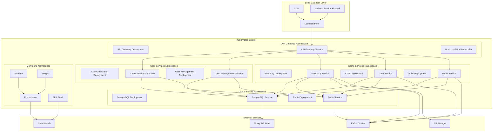
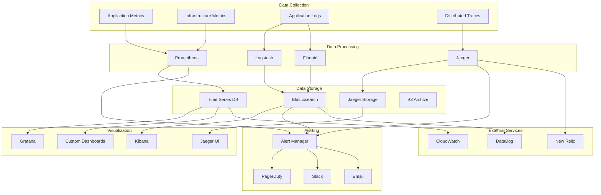
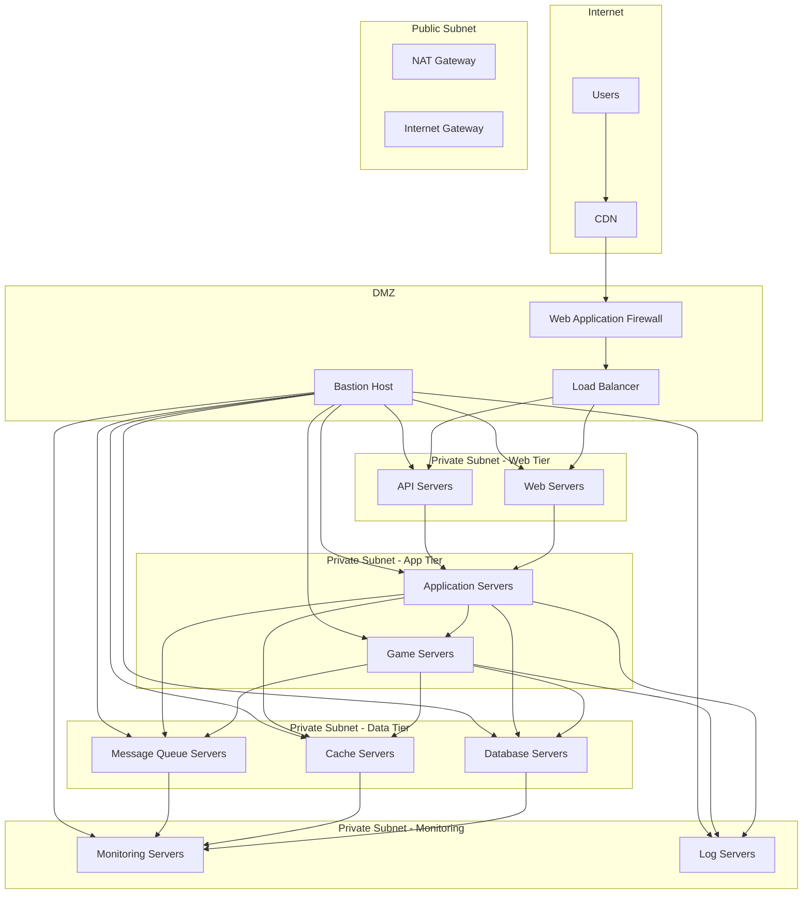
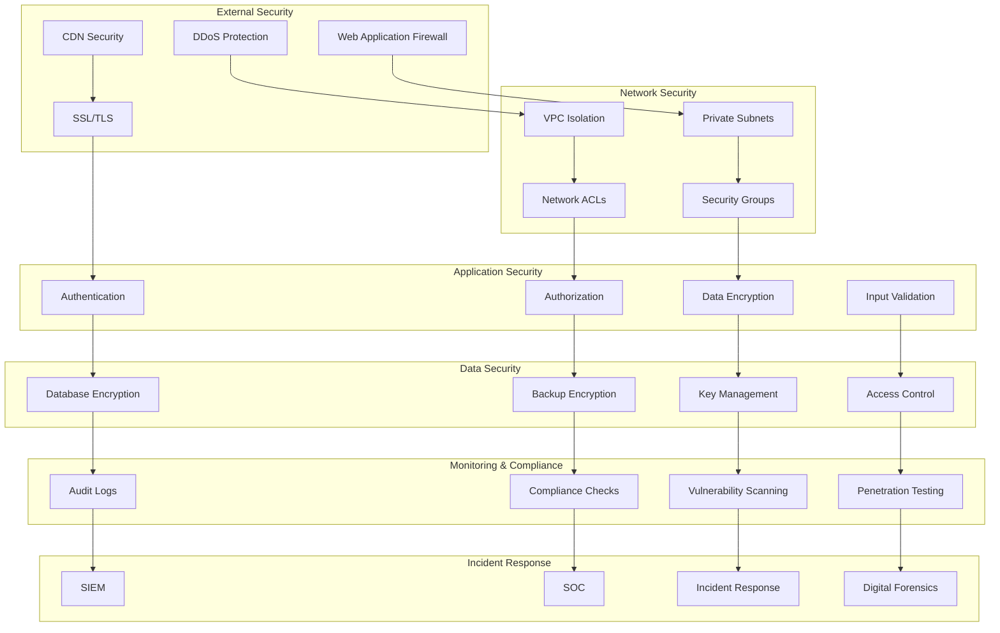
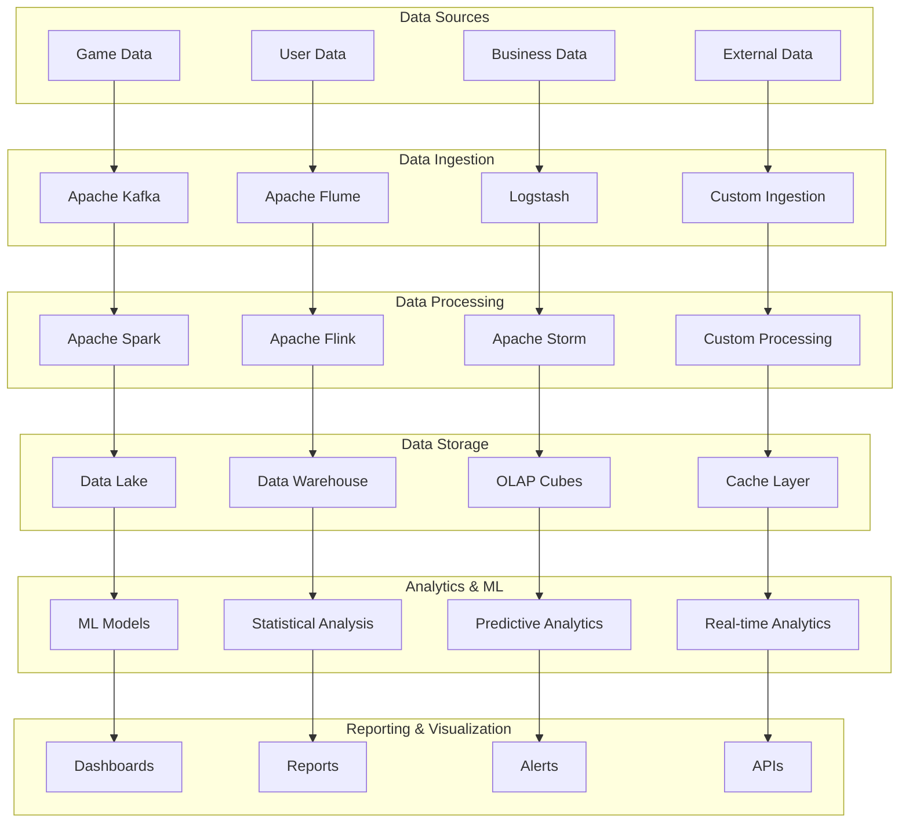
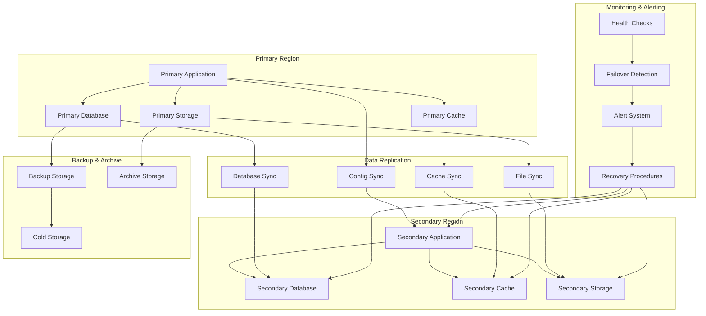

# Deployment & Monitoring Diagrams

## 🚀 Kubernetes Deployment Architecture



## 📊 Monitoring Stack Architecture



## 🔄 CI/CD Pipeline

```mermaid
graph LR
    subgraph "Source Control"
        Git[Git Repository]
        PR[Pull Request]
        Main[Main Branch]
    end
    
    subgraph "Build & Test"
        Build[Build Stage]
        UnitTest[Unit Tests]
        IntegrationTest[Integration Tests]
        SecurityScan[Security Scan]
        CodeQuality[Code Quality Check]
    end
    
    subgraph "Package & Deploy"
        DockerBuild[Docker Build]
        ImageRegistry[Image Registry]
        HelmChart[Helm Charts]
        K8sDeploy[Kubernetes Deploy]
    end
    
    subgraph "Environments"
        Dev[Development]
        Staging[Staging]
        Prod[Production]
    end
    
    subgraph "Monitoring"
        HealthCheck[Health Check]
        SmokeTest[Smoke Tests]
        Monitoring[Monitoring]
        Alerting[Alerting]
    end
    
    Git --> PR
    PR --> Main
    Main --> Build
    
    Build --> UnitTest
    UnitTest --> IntegrationTest
    IntegrationTest --> SecurityScan
    SecurityScan --> CodeQuality
    
    CodeQuality --> DockerBuild
    DockerBuild --> ImageRegistry
    ImageRegistry --> HelmChart
    HelmChart --> K8sDeploy
    
    K8sDeploy --> Dev
    Dev --> Staging
    Staging --> Prod
    
    Prod --> HealthCheck
    HealthCheck --> SmokeTest
    SmokeTest --> Monitoring
    Monitoring --> Alerting
```

## 🌐 Network Architecture



## 📈 Performance Monitoring

```mermaid
graph TB
    subgraph "Application Layer"
        ResponseTime[Response Time]
        Throughput[Throughput]
        ErrorRate[Error Rate]
        Availability[Availability]
    end
    
    subgraph "Infrastructure Layer"
        CPU[CPU Usage]
        Memory[Memory Usage]
        Disk[Disk Usage]
        Network[Network Usage]
    end
    
    subgraph "Database Layer"
        QueryTime[Query Time]
        ConnectionPool[Connection Pool]
        LockWait[Lock Wait Time]
        CacheHit[Cache Hit Rate]
    end
    
    subgraph "Business Layer"
        ActiveUsers[Active Users]
        Revenue[Revenue]
        Conversions[Conversions]
        Retention[User Retention]
    end
    
    subgraph "Alerting Rules"
        ThresholdAlerts[Threshold Alerts]
        AnomalyAlerts[Anomaly Detection]
        BusinessAlerts[Business Alerts]
        SecurityAlerts[Security Alerts]
    end
    
    subgraph "Dashboards"
        RealTimeDash[Real-time Dashboard]
        HistoricalDash[Historical Dashboard]
        BusinessDash[Business Dashboard]
        TechnicalDash[Technical Dashboard]
    end
    
    ResponseTime --> ThresholdAlerts
    Throughput --> AnomalyAlerts
    ErrorRate --> ThresholdAlerts
    Availability --> ThresholdAlerts
    
    CPU --> ThresholdAlerts
    Memory --> ThresholdAlerts
    Disk --> ThresholdAlerts
    Network --> AnomalyAlerts
    
    QueryTime --> ThresholdAlerts
    ConnectionPool --> ThresholdAlerts
    LockWait --> ThresholdAlerts
    CacheHit --> AnomalyAlerts
    
    ActiveUsers --> BusinessAlerts
    Revenue --> BusinessAlerts
    Conversions --> BusinessAlerts
    Retention --> BusinessAlerts
    
    ThresholdAlerts --> RealTimeDash
    AnomalyAlerts --> HistoricalDash
    BusinessAlerts --> BusinessDash
    SecurityAlerts --> TechnicalDash
```



## 🔐 Security Architecture



## 📊 Business Intelligence Architecture



## 🔄 Disaster Recovery Architecture


