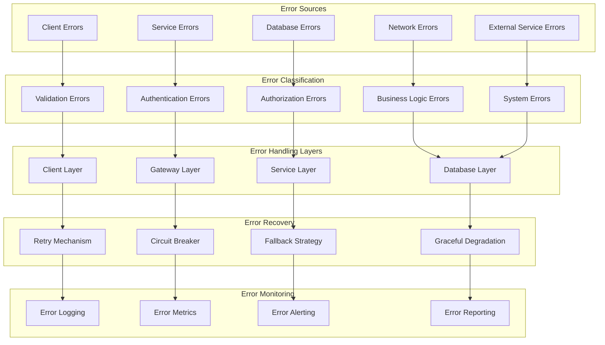
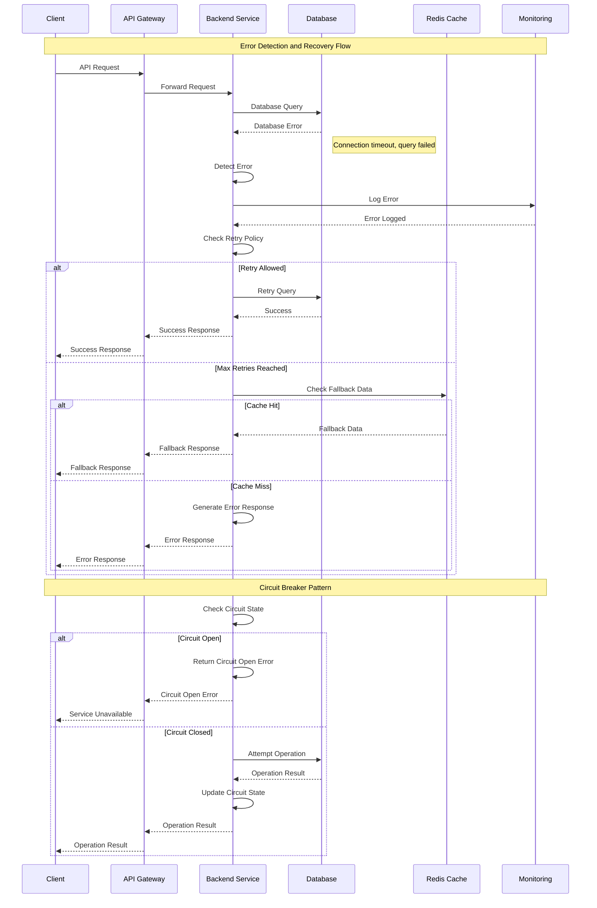
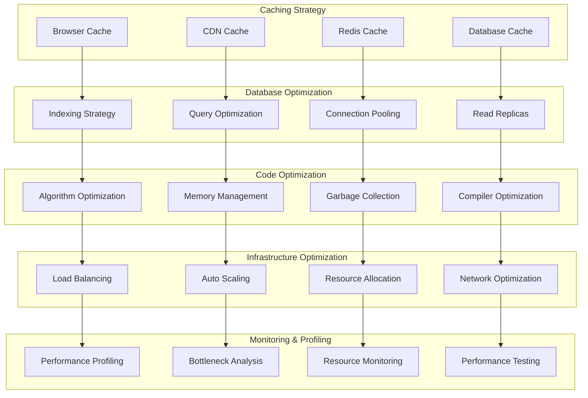
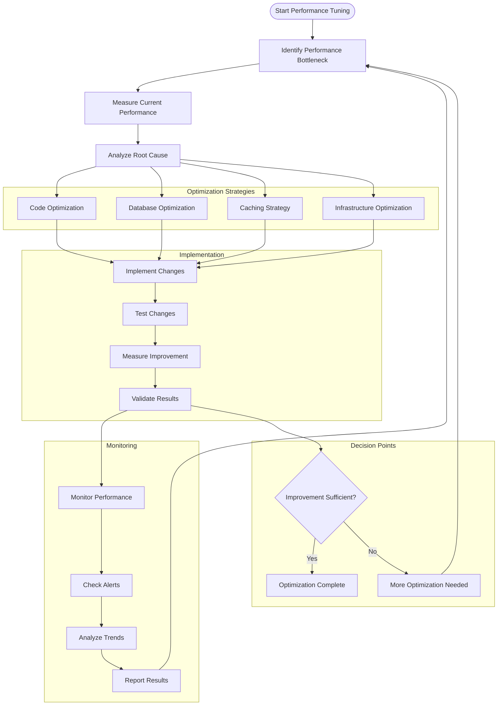
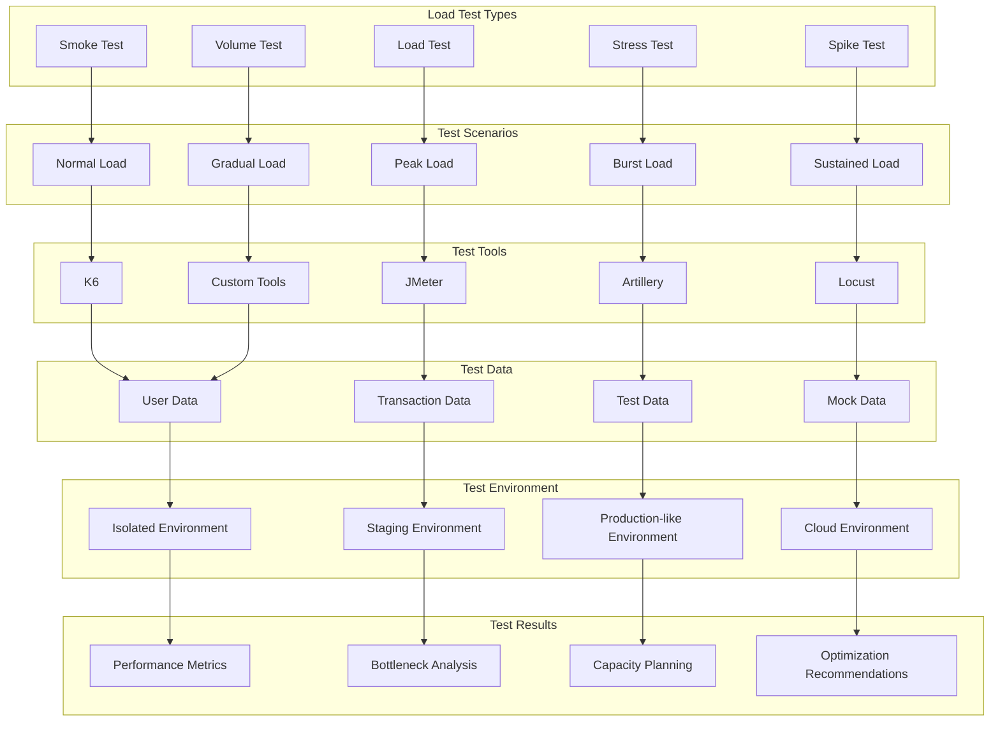
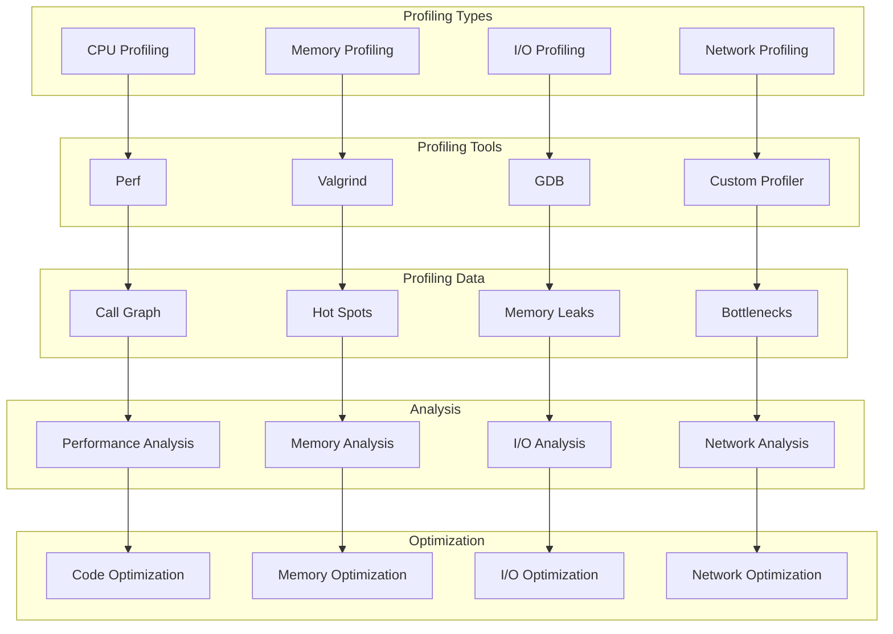
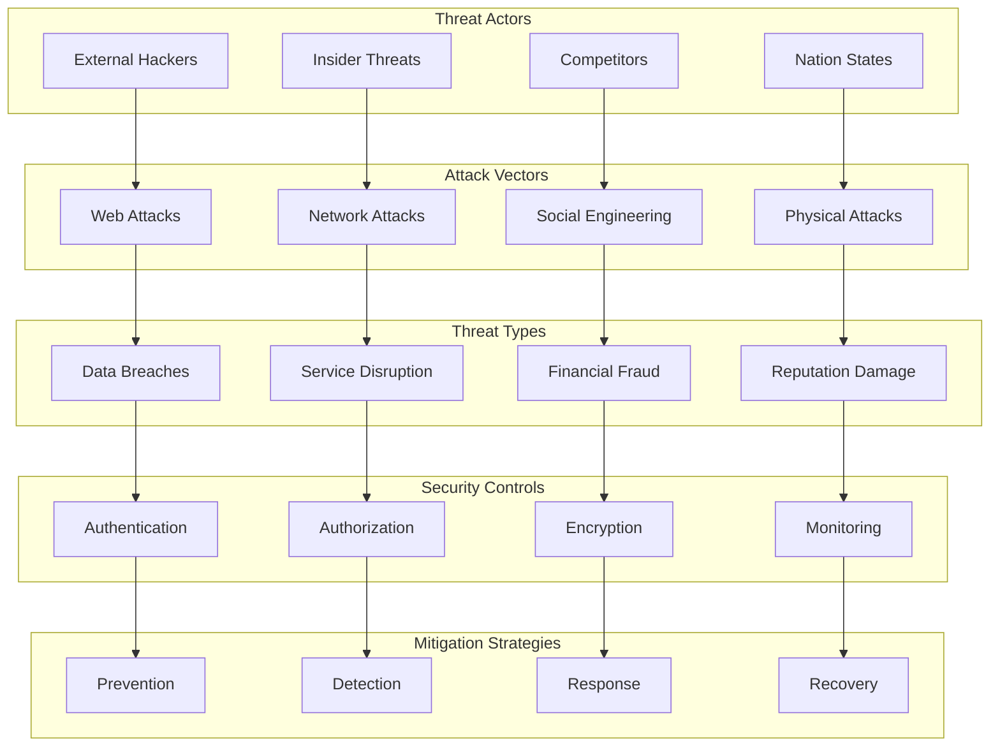
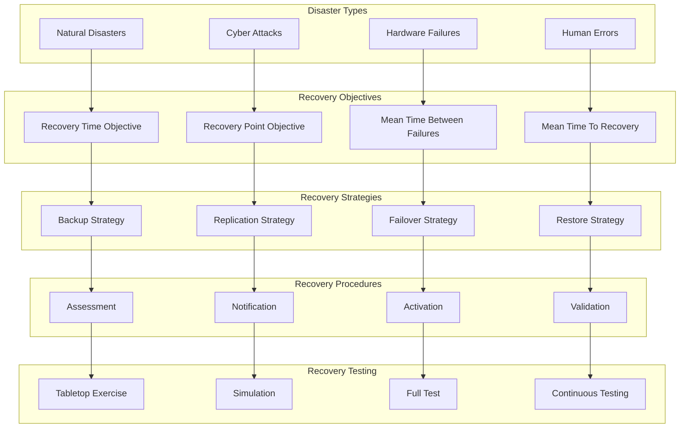

# Error Handling & Performance Optimization Diagrams

## 🚨 Error Handling Architecture

## 🔄 Error Recovery Flow

## ⚡ Performance Optimization Strategies

## 🚀 Performance Monitoring Dashboard

```mermaid
graph TB
    subgraph "Real-time Metrics"
        ResponseTime[Response Time]
        Throughput[Throughput]
        ErrorRate[Error Rate]
        ActiveUsers[Active Users]
    end
    
    subgraph "System Metrics"
        CPUUsage[CPU Usage]
        MemoryUsage[Memory Usage]
        DiskIO[Disk I/O]
        NetworkIO[Network I/O]
    end
    
    subgraph "Application Metrics"
        RequestCount[Request Count]
        CacheHitRate[Cache Hit Rate]
        DatabaseConnections[Database Connections]
        QueueDepth[Queue Depth]
    end
    
    subgraph "Business Metrics"
        Revenue[Revenue]
        Conversions[Conversions]
        UserEngagement[User Engagement]
        FeatureUsage[Feature Usage]
    end
    
    subgraph "Alerting"
        ThresholdAlerts[Threshold Alerts]
        AnomalyAlerts[Anomaly Alerts]
        TrendAlerts[Trend Alerts]
        CapacityAlerts[Capacity Alerts]
    end
    
    subgraph "Visualization"
        RealTimeDash[Real-time Dashboard]
        HistoricalDash[Historical Dashboard]
        TrendDash[Trend Dashboard]
        ComparisonDash[Comparison Dashboard]
    end
    
    ResponseTime --> ThresholdAlerts
    Throughput --> AnomalyAlerts
    ErrorRate --> TrendAlerts
    ActiveUsers --> CapacityAlerts
    
    CPUUsage --> ThresholdAlerts
    MemoryUsage --> AnomalyAlerts
    DiskIO --> TrendAlerts
    NetworkIO --> CapacityAlerts
    
    RequestCount --> ThresholdAlerts
    CacheHitRate --> AnomalyAlerts
    DatabaseConnections --> TrendAlerts
    QueueDepth --> CapacityAlerts
    
    Revenue --> ThresholdAlerts
    Conversions --> AnomalyAlerts
    UserEngagement --> TrendAlerts
    FeatureUsage --> CapacityAlerts
    
    ThresholdAlerts --> RealTimeDash
    AnomalyAlerts --> HistoricalDash
    TrendAlerts --> TrendDash
    CapacityAlerts --> ComparisonDash
```

## 🔧 Performance Tuning Process

## 📊 Load Testing Strategy

## 🔍 Performance Profiling

## 🛡️ Security Threat Model

## 🔄 Disaster Recovery Plan

