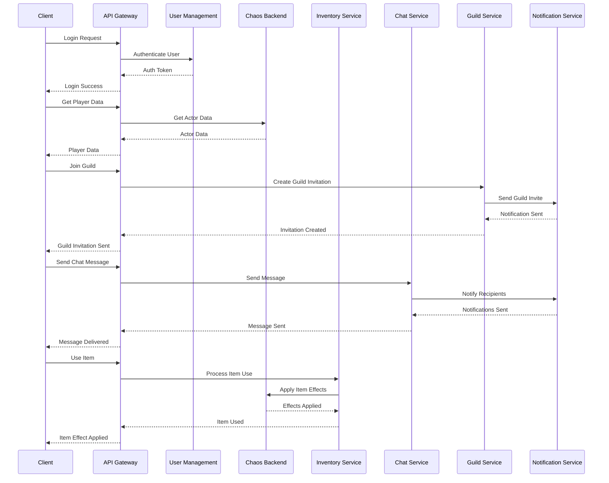
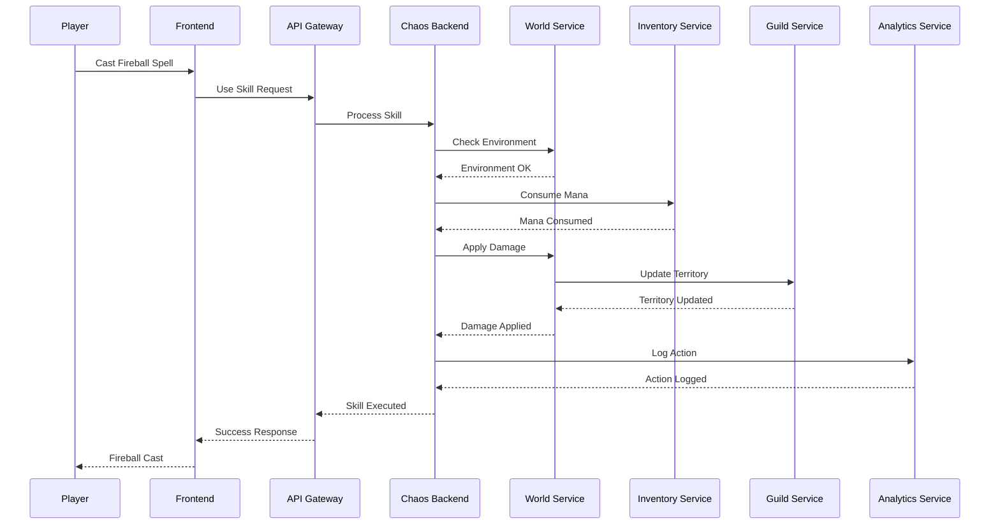
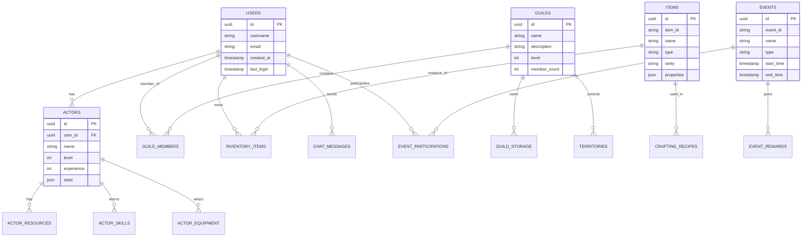
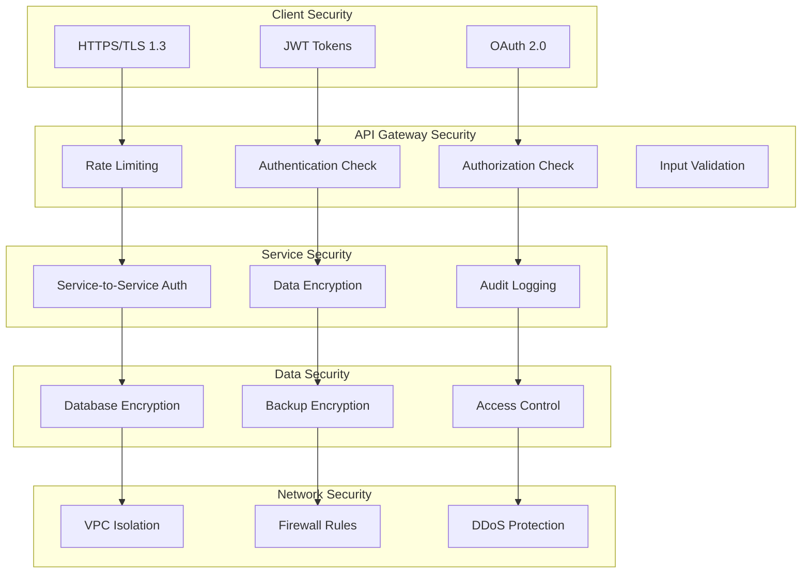
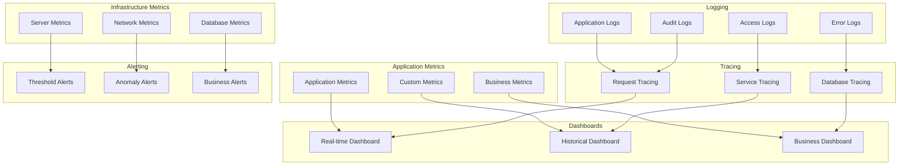
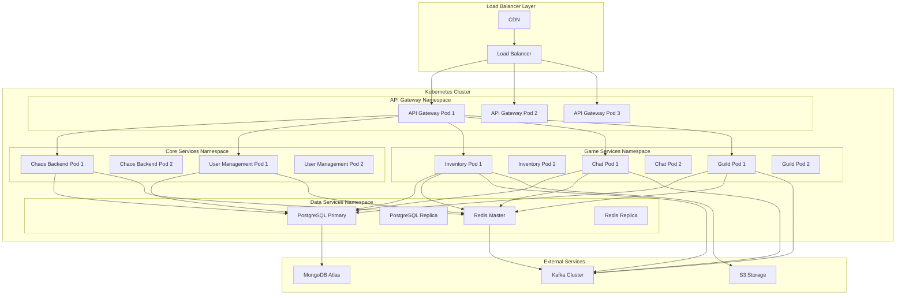
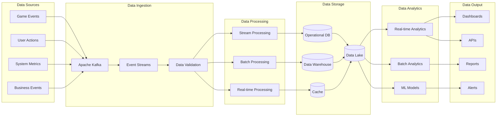

# Microservices Architecture Diagrams

## 🏗️ Overall Architecture

```mermaid
graph TB
    subgraph "Client Layer"
        Web[Web Client]
        Mobile[Mobile App]
        Desktop[Desktop App]
    end
    
    subgraph "API Gateway Layer"
        Gateway[API Gateway]
        LoadBalancer[Load Balancer]
    end
    
    subgraph "Core Game Services"
        ChaosBackend[Chaos Backend<br/>Game Logic Core]
        ActorCore[Actor Core<br/>Library]
    end
    
    subgraph "User & Authentication Services"
        UserMgmt[User Management]
        Notification[Notification Service]
    end
    
    subgraph "Game Feature Services"
        Inventory[Inventory Service]
        Chat[Chat Service]
        Guild[Guild Service]
        World[World Service]
        Matchmaking[Matchmaking Service]
        Event[Event Service]
    end
    
    subgraph "Content & Analytics Services"
        ContentMgmt[Content Management]
        Analytics[Analytics Service]
    end
    
    subgraph "Business & Security Services"
        Payment[Payment Service]
        AntiCheat[Anti-Cheat Service]
    end
    
    subgraph "Data Layer"
        PostgreSQL[(PostgreSQL)]
        Redis[(Redis Cache)]
        MongoDB[(MongoDB)]
        Kafka[(Apache Kafka)]
    end
    
    Web --> Gateway
    Mobile --> Gateway
    Desktop --> Gateway
    
    Gateway --> LoadBalancer
    LoadBalancer --> ChaosBackend
    LoadBalancer --> UserMgmt
    LoadBalancer --> Inventory
    LoadBalancer --> Chat
    LoadBalancer --> Guild
    LoadBalancer --> World
    LoadBalancer --> Matchmaking
    LoadBalancer --> Event
    LoadBalancer --> ContentMgmt
    LoadBalancer --> Analytics
    LoadBalancer --> Payment
    LoadBalancer --> AntiCheat
    LoadBalancer --> Notification
    
    ChaosBackend --> ActorCore
    ChaosBackend --> PostgreSQL
    ChaosBackend --> Redis
    
    UserMgmt --> PostgreSQL
    UserMgmt --> Redis
    
    Inventory --> PostgreSQL
    Inventory --> Redis
    Inventory --> Kafka
    
    Chat --> PostgreSQL
    Chat --> Redis
    Chat --> Kafka
    
    Guild --> PostgreSQL
    Guild --> Redis
    Guild --> Kafka
    
    World --> PostgreSQL
    World --> Redis
    World --> Kafka
    
    Matchmaking --> PostgreSQL
    Matchmaking --> Redis
    Matchmaking --> Kafka
    
    Event --> PostgreSQL
    Event --> Redis
    Event --> Kafka
    
    ContentMgmt --> PostgreSQL
    ContentMgmt --> Redis
    ContentMgmt --> MongoDB
    
    Analytics --> PostgreSQL
    Analytics --> MongoDB
    Analytics --> Kafka
    
    Payment --> PostgreSQL
    Payment --> Redis
    Payment --> Kafka
    
    AntiCheat --> PostgreSQL
    AntiCheat --> Redis
    AntiCheat --> Kafka
    
    Notification --> PostgreSQL
    Notification --> Redis
    Notification --> Kafka
```

## 🔄 Service Communication Flow

## 🎮 Game Action Flow

## 🗄️ Database Architecture

## 🔐 Security Architecture

## 📊 Monitoring & Observability

## 🚀 Deployment Architecture

## 🔄 Data Flow Architecture

