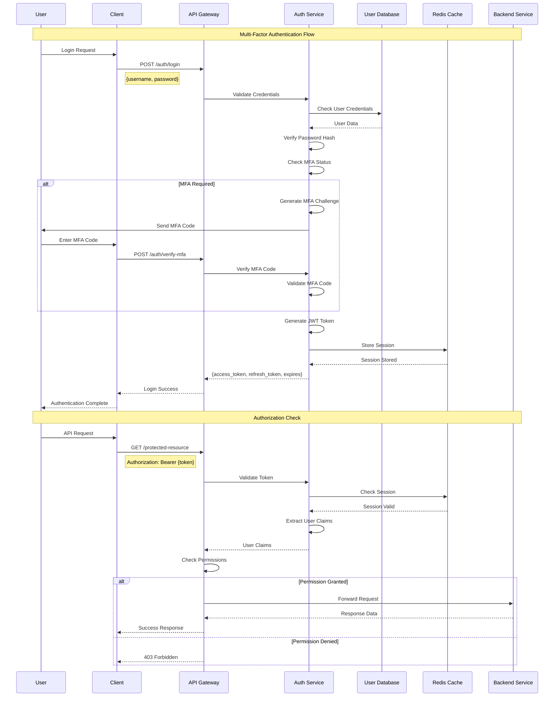
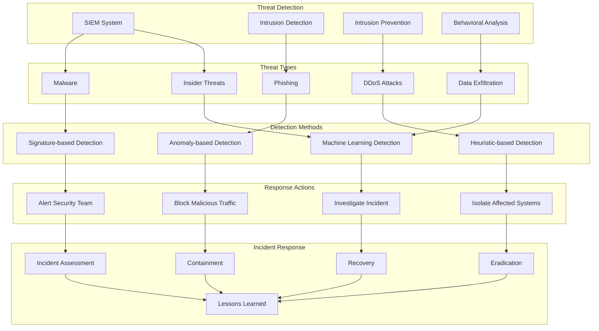
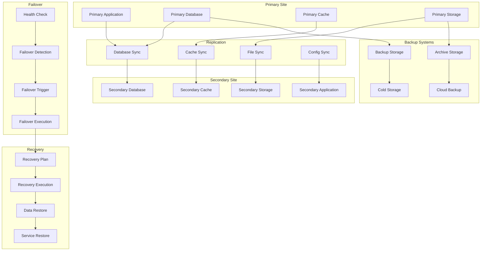
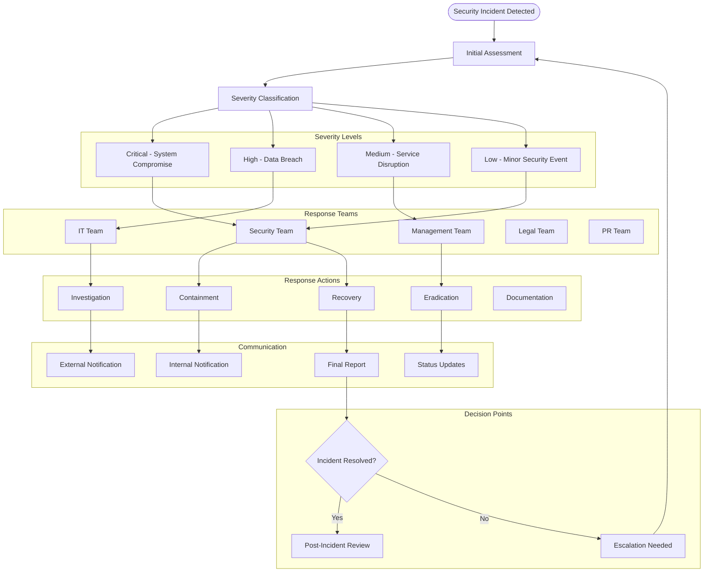
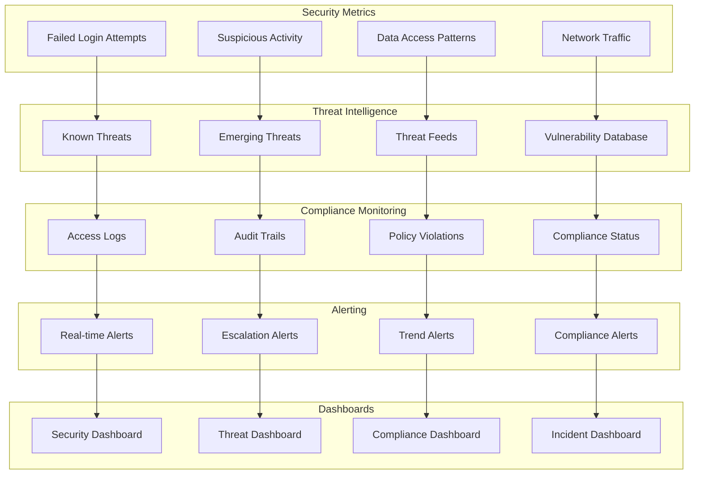
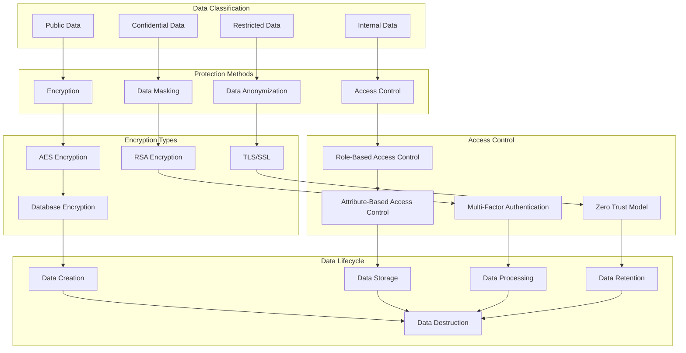
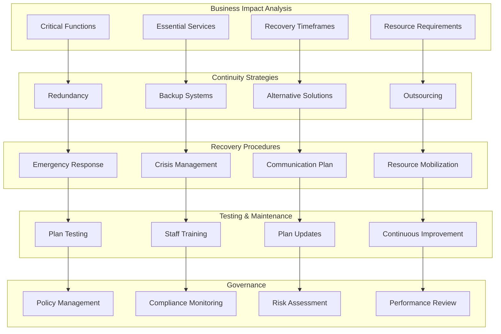
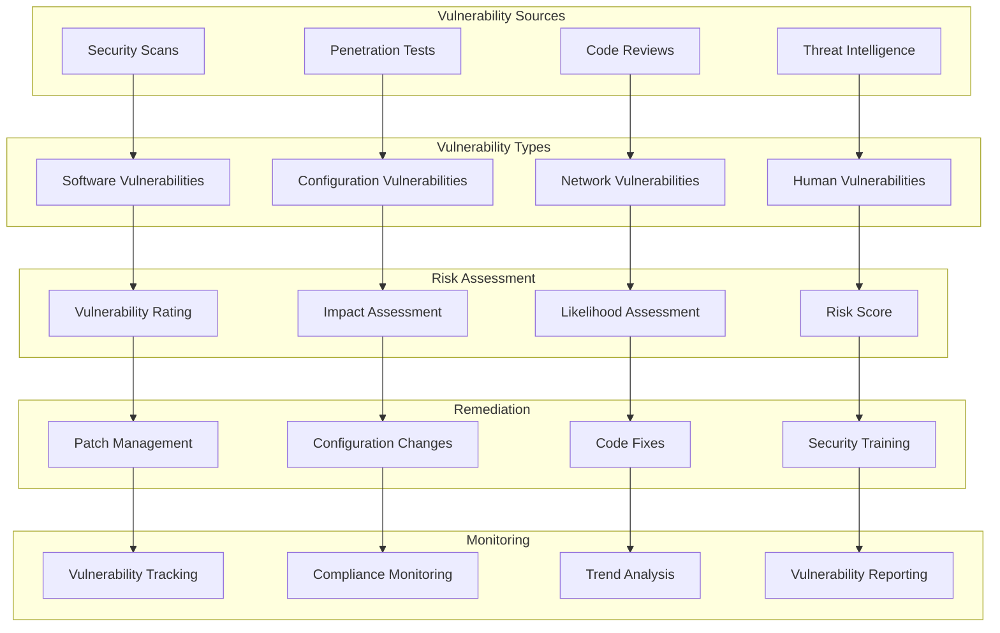

```mermaid
graph TB
    subgraph "Security Layers"
        PerimeterSecurity[Perimeter Security]
        NetworkSecurity[Network Security]
        ApplicationSecurity[Application Security]
        DataSecurity[Data Security]
        EndpointSecurity[Endpoint Security]
    end
    
    subgraph "Perimeter Security"
        DDoSProtection[DDoS Protection]
        WAF[Web Application Firewall]
        CDN[CDN Security]
        LoadBalancer[Load Balancer Security]
    end
    
    subgraph "Network Security"
        VPC[VPC Isolation]
        Subnets[Private Subnets]
        NACL[Network ACLs]
        SecurityGroups[Security Groups]
        VPN[VPN Access]
    end
    
    subgraph "Application Security"
        Authentication[Authentication]
        Authorization[Authorization]
        InputValidation[Input Validation]
        OutputEncoding[Output Encoding]
        SessionManagement[Session Management]
    end
    
    subgraph "Data Security"
        EncryptionAtRest[Encryption at Rest]
        EncryptionInTransit[Encryption in Transit]
        KeyManagement[Key Management]
        DataClassification[Data Classification]
        AccessControl[Access Control]
    end
    
    subgraph "Endpoint Security"
        DeviceManagement[Device Management]
        PatchManagement[Patch Management]
        Antivirus[Antivirus]
        Firewall[Host Firewall]
        Monitoring[Endpoint Monitoring]
    end
    
    PerimeterSecurity --> DDoSProtection
    PerimeterSecurity --> WAF
    PerimeterSecurity --> CDN
    PerimeterSecurity --> LoadBalancer
    
    NetworkSecurity --> VPC
    NetworkSecurity --> Subnets
    NetworkSecurity --> NACL
    NetworkSecurity --> SecurityGroups
    NetworkSecurity --> VPN
    
    ApplicationSecurity --> Authentication
    ApplicationSecurity --> Authorization
    ApplicationSecurity --> InputValidation
    ApplicationSecurity --> OutputEncoding
    ApplicationSecurity --> SessionManagement
    
    DataSecurity --> EncryptionAtRest
    DataSecurity --> EncryptionInTransit
    DataSecurity --> KeyManagement
    DataSecurity --> DataClassification
    DataSecurity --> AccessControl
    
    EndpointSecurity --> DeviceManagement
    EndpointSecurity --> PatchManagement
    EndpointSecurity --> Antivirus
    EndpointSecurity --> Firewall
    EndpointSecurity --> Monitoring
```

# Security & Disaster Recovery Diagrams

## 🛡️ Security Architecture Overview

## 🔐 Authentication & Authorization Flow

## 🚨 Threat Detection & Response

## 🔄 Disaster Recovery Architecture

## 🚨 Incident Response Plan

## 🔍 Security Monitoring Dashboard

## 🔐 Data Protection Strategy

## 🚨 Business Continuity Plan

## 🔍 Vulnerability Management

