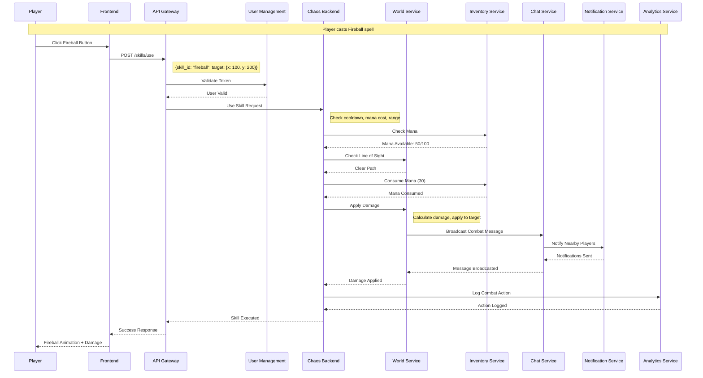
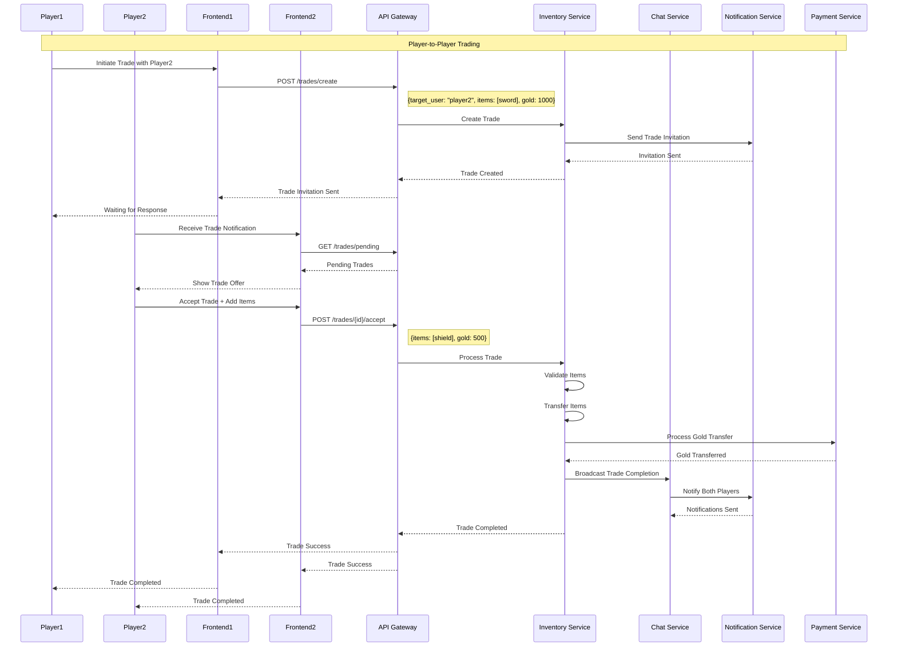
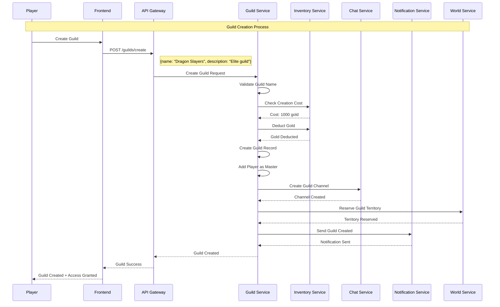
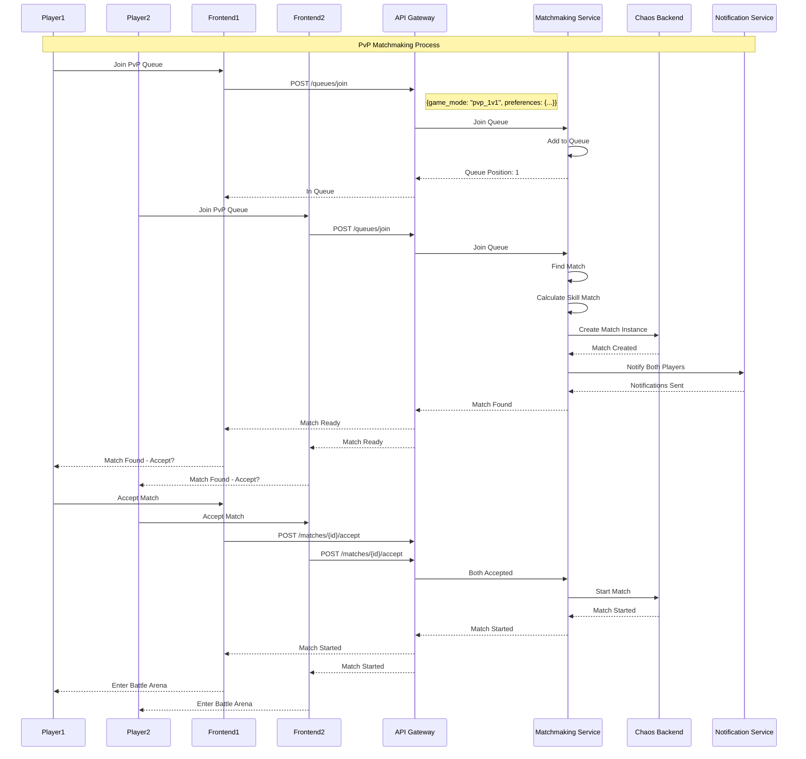
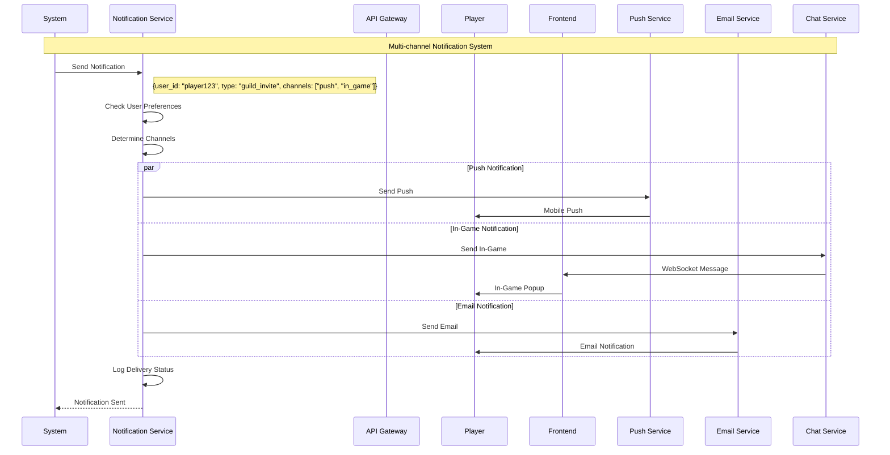
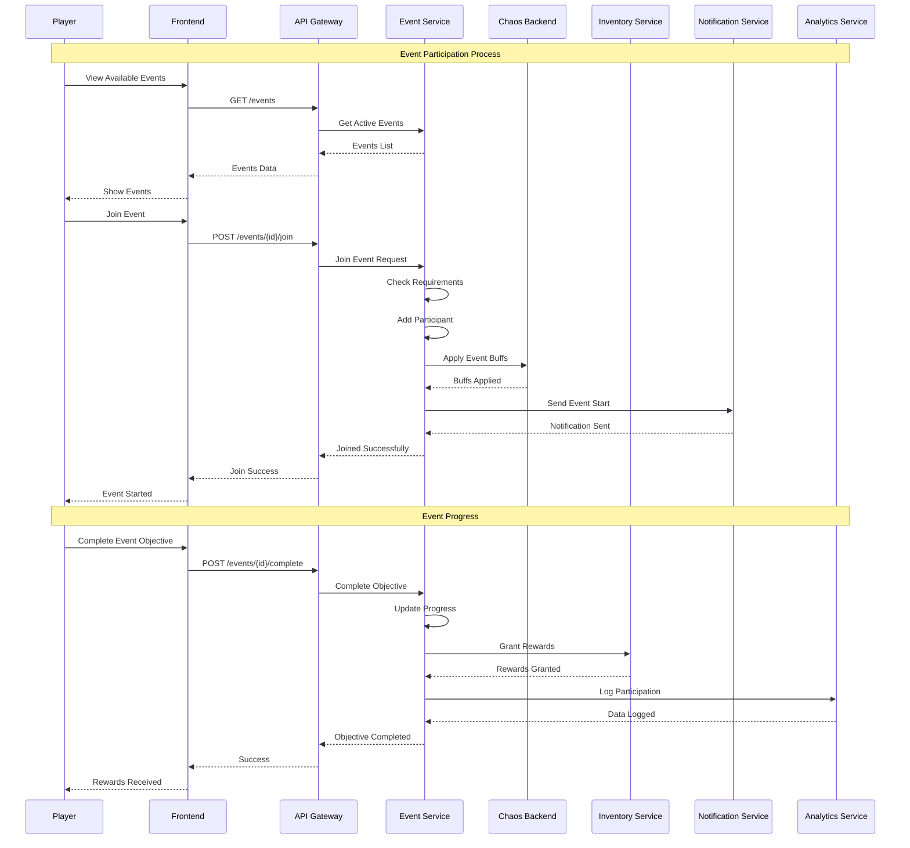
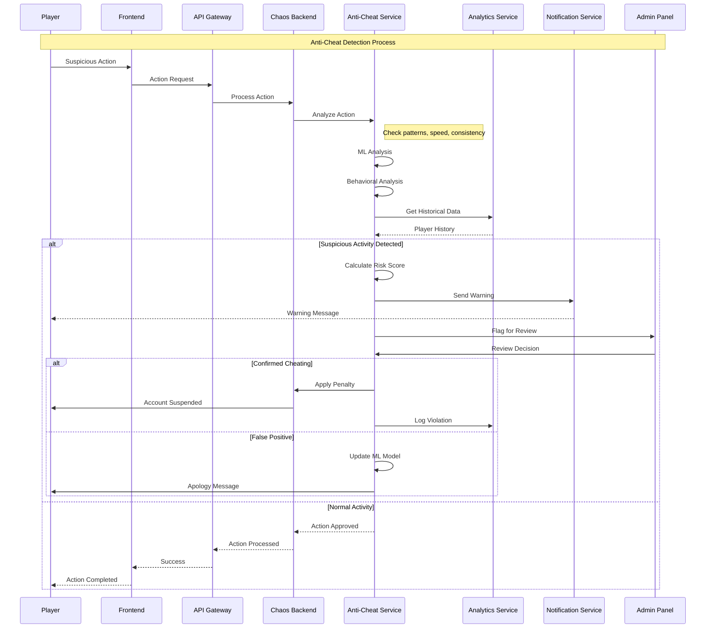
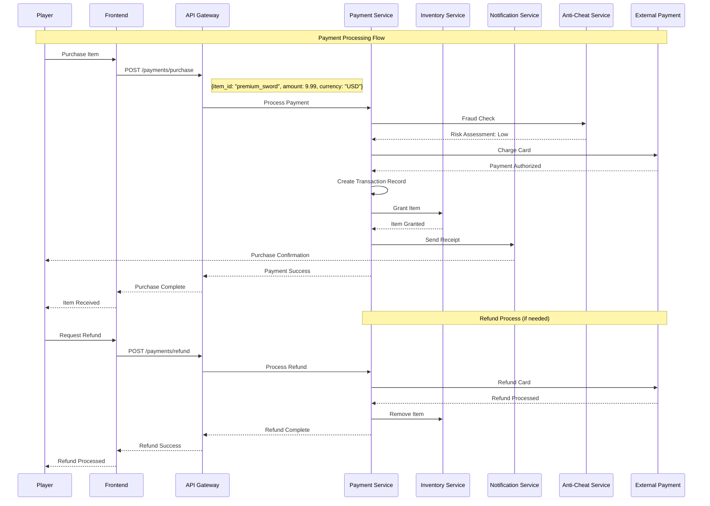

# Service Flow Diagrams

## 🎮 Player Action Flow - Fireball Spell

## 🛒 Trading Flow

## 👥 Guild Creation Flow

## 🎯 Matchmaking Flow

## 📱 Notification Flow

## 🎉 Event Participation Flow

## 🔍 Anti-Cheat Detection Flow

## 💰 Payment Processing Flow

