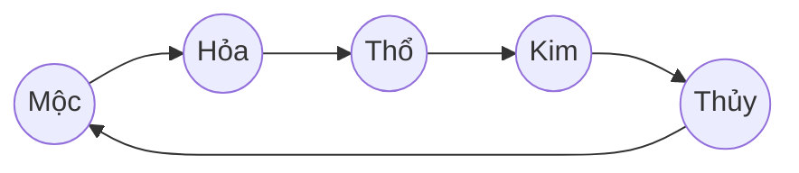
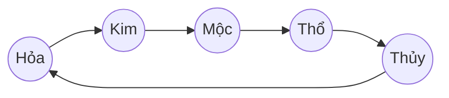

# Tổng hợp Ngũ Hành (Five Elements) – So sánh và sơ đồ

> Mục tiêu: Bảng so sánh đầy đủ 5 hệ (Hỏa/Thủy/Mộc/Kim/Thổ) và sơ đồ Tương Sinh – Tương Khắc, tham chiếu tới cấu hình trung tâm và tài liệu phần tử chi tiết. Tất cả tuân theo nguyên tắc không hard cap và mô hình đối trọng (yin–yang counterbalance).

## Bảng so sánh (VI)

| Nguyên tố | Vai trò/đặc trưng | Trạng thái nền (status) | Same-element (↔) | Neutral-by-element | Tương Sinh (attacker → defender) | Tương Khắc (attacker → defender) |
|---|---|---|---|---|---|---|
| Hỏa (Fire) | Sát thương cao, bùng nổ | Burning (DoT) | `heat_resonance`, `ember_shield`, `overheat` | `burning_fallback` | Fire → Earth | Fire → Metal |
| Thủy (Water) | Kiểm soát, làm chậm, ổn định | Soaked (control slow/accuracy) | `flow_resonance`, `aqua_veil` | `soaked_fallback` | Water → Wood | Water → Fire |
| Mộc (Wood) | Tăng trưởng, duy trì | Entangled (slow) | `growth_resonance`, `bark_ward` | `entangle_fallback` | Wood → Fire | Wood → Earth |
| Kim (Metal) | Sắc bén, kỷ luật, chống chịu | Brittle (giảm phòng thủ) | `temper_resonance` | `brittle_fallback` | Metal → Water | Metal → Wood |
| Thổ (Earth) | Ổn định, kiềm chế, công thủ | Quagmire (slow + accuracy) | `stone_resonance` | `quagmire_fallback` | Earth → Metal | Earth → Water |

Ghi chú:
- Same-element/Neutral-by-element được định nghĩa trong YAML của từng nguyên tố (ví dụ: `elements/configs/fire_element.yaml`).
- Các hiệu ứng chéo nguyên tố (cross-element) nằm ở `configs/interaction_config.yaml` và tham chiếu `configs/status_pool.yaml` bằng `pool_id`.

## Sơ đồ Tương Sinh (Generating)

## Sơ đồ Tương Khắc (Overcoming)

## Tham chiếu
- Cấu hình trung tâm:
  - `docs/element-core/configs/interaction_config.yaml`
  - `docs/element-core/configs/status_pool.yaml`
  - `docs/element-core/configs/probability_config.yaml`
- Tài liệu phần tử:
  - Hỏa: `docs/element-core/elements/fire_element.md`
  - Thủy: `docs/element-core/elements/water_element.md`
  - Mộc: `docs/element-core/elements/wood_element.md`
  - Kim: `docs/element-core/elements/metal_element.md`
  - Thổ: `docs/element-core/elements/earth_element.md`

## Kiểm chứng nhanh
- Kiểm tra cặp Tương Sinh/Khắc có đúng theo sơ đồ và `pairs` trong `interaction_config.yaml`.
- Golden vectors cho từng nguyên tố tồn tại trong `elements/golden_vectors/` và phạm vi xác suất hợp lý.
- Same/Neutral by element tham chiếu `status_pool.yaml` qua `pool_id` và dùng probability engine.

