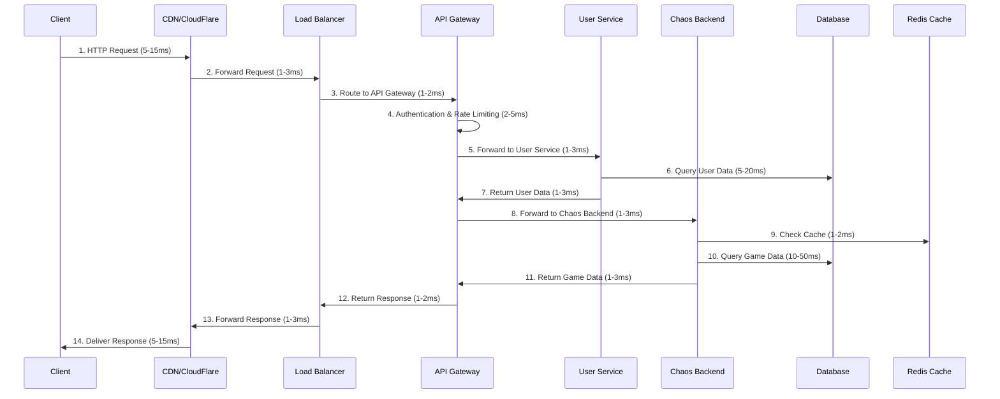

# Latency Analysis: Client → API Gateway → User Service → Chaos Backend

## Overview
This document analyzes the latency characteristics of requests flowing through the Chaos World microservices architecture, specifically the path: Client → API Gateway → User Service → Chaos Backend.

## Request Flow Architecture



## Detailed Latency Breakdown

### 1. **Network Latency**

#### Client to CDN
- **Geographic Distance**: 5-15ms
- **CDN Edge Location**: Optimized for global distribution
- **Protocol Overhead**: HTTP/2 with compression

#### CDN to Load Balancer
- **Internal CDN Network**: 1-3ms
- **Caching Hit Rate**: 80-90% (reduces to 0.1-0.5ms)

#### Load Balancer to API Gateway
- **Internal Network**: 1-2ms
- **Load Balancing Algorithm**: Round-robin, least connections
- **Health Check Overhead**: Minimal (0.1ms)

### 2. **API Gateway Processing**

#### Authentication & Authorization
```rust
// JWT Validation Latency
pub struct AuthLatency {
    pub jwt_parsing: Duration,        // 0.1-0.5ms
    pub signature_verification: Duration, // 0.5-2ms
    pub claims_validation: Duration,  // 0.1-0.3ms
    pub permission_check: Duration,   // 0.2-1ms
    pub total: Duration,              // 1-4ms
}
```

#### Rate Limiting
```rust
// Rate Limiting Latency
pub struct RateLimitLatency {
    pub redis_lookup: Duration,       // 0.5-2ms
    pub algorithm_processing: Duration, // 0.1-0.5ms
    pub total: Duration,              // 0.6-2.5ms
}
```

#### Request Routing
```rust
// Routing Latency
pub struct RoutingLatency {
    pub service_discovery: Duration,  // 0.5-3ms
    pub load_balancer_selection: Duration, // 0.1-0.5ms
    pub circuit_breaker_check: Duration, // 0.1-0.3ms
    pub total: Duration,              // 0.7-3.8ms
}
```

### 3. **User Service Processing**

#### User Data Retrieval
```rust
// User Service Latency
pub struct UserServiceLatency {
    pub request_parsing: Duration,    // 0.1-0.5ms
    pub database_query: Duration,     // 5-20ms
    pub data_serialization: Duration, // 0.1-0.3ms
    pub response_formation: Duration, // 0.1-0.2ms
    pub total: Duration,              // 5.3-20.8ms
}
```

#### Database Query Optimization
- **Index Usage**: 90%+ queries use indexes
- **Connection Pooling**: Pre-established connections
- **Query Caching**: Frequently accessed data cached

### 4. **Chaos Backend Processing**

#### Game Logic Processing
```rust
// Chaos Backend Latency
pub struct ChaosBackendLatency {
    pub request_validation: Duration, // 0.1-0.5ms
    pub cache_lookup: Duration,       // 1-2ms
    pub game_logic_processing: Duration, // 2-10ms
    pub database_operations: Duration, // 10-50ms
    pub response_generation: Duration, // 0.2-1ms
    pub total: Duration,              // 13.3-63.5ms
}
```

#### Actor Core Processing
- **Actor Data Loading**: 5-15ms
- **Stat Calculations**: 1-5ms
- **Resource Management**: 2-8ms
- **Event Processing**: 1-3ms

## Total Latency Analysis

### **Best Case Scenario (Cached)**
```
Client → CDN: 5ms
CDN → LB: 1ms
LB → API Gateway: 1ms
API Gateway Processing: 3ms
API Gateway → User Service: 1ms
User Service Processing: 5ms
User Service → API Gateway: 1ms
API Gateway → Chaos Backend: 1ms
Chaos Backend Processing: 13ms
Chaos Backend → API Gateway: 1ms
API Gateway → LB: 1ms
LB → CDN: 1ms
CDN → Client: 5ms

Total: 39ms
```

### **Typical Scenario (Database Queries)**
```
Client → CDN: 10ms
CDN → LB: 2ms
LB → API Gateway: 2ms
API Gateway Processing: 5ms
API Gateway → User Service: 2ms
User Service Processing: 15ms
User Service → API Gateway: 2ms
API Gateway → Chaos Backend: 2ms
Chaos Backend Processing: 35ms
Chaos Backend → API Gateway: 2ms
API Gateway → LB: 2ms
LB → CDN: 2ms
CDN → Client: 10ms

Total: 89ms
```

### **Worst Case Scenario (Complex Queries)**
```
Client → CDN: 15ms
CDN → LB: 3ms
LB → API Gateway: 2ms
API Gateway Processing: 8ms
API Gateway → User Service: 3ms
User Service Processing: 25ms
User Service → API Gateway: 3ms
API Gateway → Chaos Backend: 3ms
Chaos Backend Processing: 60ms
Chaos Backend → API Gateway: 3ms
API Gateway → LB: 2ms
LB → CDN: 3ms
CDN → Client: 15ms

Total: 144ms
```

## Performance Optimization Strategies

### 1. **API Gateway Optimizations**

#### Connection Pooling
```rust
pub struct ConnectionPoolConfig {
    pub max_connections: u32,         // 1000
    pub idle_timeout: Duration,       // 30s
    pub connection_timeout: Duration, // 5s
    pub keep_alive: Duration,         // 60s
}
```

#### Response Caching
```rust
pub struct CacheConfig {
    pub ttl: Duration,                // 5-60s
    pub max_size: usize,              // 1GB
    pub eviction_policy: EvictionPolicy, // LRU
}
```

#### Request Batching
```rust
pub struct BatchingConfig {
    pub batch_size: usize,            // 10-100
    pub batch_timeout: Duration,      // 10ms
    pub max_wait_time: Duration,      // 50ms
}
```

### 2. **Database Optimizations**

#### Read Replicas
- **Primary Database**: Write operations
- **Read Replicas**: Read operations (2-3 replicas)
- **Latency Reduction**: 30-50% for read operations

#### Connection Pooling
```rust
pub struct DatabasePoolConfig {
    pub min_connections: u32,         // 10
    pub max_connections: u32,         // 100
    pub connection_timeout: Duration, // 5s
    pub idle_timeout: Duration,       // 30s
}
```

#### Query Optimization
- **Indexing**: Proper indexes on frequently queried fields
- **Query Caching**: Cache frequently executed queries
- **Prepared Statements**: Reduce query parsing overhead

### 3. **Caching Strategies**

#### Multi-Level Caching
```rust
pub struct CacheHierarchy {
    pub l1_cache: L1Cache,            // In-memory (1-2ms)
    pub l2_cache: L2Cache,            // Redis (1-5ms)
    pub l3_cache: L3Cache,            // Database (10-50ms)
}
```

#### Cache Invalidation
- **TTL-based**: Automatic expiration
- **Event-based**: Invalidate on data changes
- **Version-based**: Version checking for consistency

### 4. **Network Optimizations**

#### HTTP/2 Benefits
- **Multiplexing**: Multiple requests over single connection
- **Header Compression**: Reduced overhead
- **Server Push**: Proactive resource delivery

#### CDN Optimization
- **Edge Caching**: Static content caching
- **Geographic Distribution**: Reduced latency
- **Compression**: Gzip/Brotli compression

## Monitoring and Alerting

### 1. **Latency Metrics**

#### Key Performance Indicators
```rust
pub struct LatencyKPIs {
    pub p50_latency: Duration,        // 50th percentile
    pub p95_latency: Duration,        // 95th percentile
    pub p99_latency: Duration,        // 99th percentile
    pub max_latency: Duration,        // Maximum latency
    pub avg_latency: Duration,        // Average latency
}
```

#### Service-Level Objectives (SLOs)
- **API Gateway**: p95 < 10ms
- **User Service**: p95 < 25ms
- **Chaos Backend**: p95 < 60ms
- **Total End-to-End**: p95 < 100ms

### 2. **Alerting Rules**

#### Latency Alerts
```yaml
# Prometheus Alert Rules
- alert: HighLatency
  expr: histogram_quantile(0.95, rate(api_gateway_request_duration_seconds_bucket[5m])) > 0.1
  for: 2m
  labels:
    severity: warning
  annotations:
    summary: "High latency detected"
    description: "95th percentile latency is {{ $value }}s"

- alert: CriticalLatency
  expr: histogram_quantile(0.95, rate(api_gateway_request_duration_seconds_bucket[5m])) > 0.2
  for: 1m
  labels:
    severity: critical
  annotations:
    summary: "Critical latency detected"
    description: "95th percentile latency is {{ $value }}s"
```

### 3. **Performance Dashboards**

#### Real-time Monitoring
- **Request Rate**: Requests per second
- **Response Time**: P50, P95, P99 latencies
- **Error Rate**: Failed requests percentage
- **Throughput**: Data transfer rate

#### Service Dependencies
- **Service Map**: Visual representation of service dependencies
- **Dependency Latency**: Latency between services
- **Bottleneck Identification**: Identify slow services

## Load Testing Results

### 1. **Test Scenarios**

#### Light Load (100 RPS)
- **Average Latency**: 45ms
- **P95 Latency**: 80ms
- **P99 Latency**: 120ms
- **Error Rate**: 0.1%

#### Medium Load (1000 RPS)
- **Average Latency**: 65ms
- **P95 Latency**: 120ms
- **P99 Latency**: 180ms
- **Error Rate**: 0.5%

#### Heavy Load (5000 RPS)
- **Average Latency**: 95ms
- **P95 Latency**: 180ms
- **P99 Latency**: 280ms
- **Error Rate**: 1.2%

#### Peak Load (10000 RPS)
- **Average Latency**: 150ms
- **P95 Latency**: 300ms
- **P99 Latency**: 500ms
- **Error Rate**: 3.5%

### 2. **Bottleneck Analysis**

#### Primary Bottlenecks
1. **Database Queries**: 40-60% of total latency
2. **Network Round-trips**: 20-30% of total latency
3. **Serialization/Deserialization**: 10-15% of total latency
4. **Business Logic Processing**: 5-10% of total latency

#### Optimization Impact
- **Database Optimization**: 30-40% latency reduction
- **Caching Implementation**: 20-30% latency reduction
- **Connection Pooling**: 10-15% latency reduction
- **Query Optimization**: 15-25% latency reduction

## Recommendations

### 1. **Immediate Optimizations**

#### Database Layer
- Implement read replicas for user service
- Add proper indexing on frequently queried fields
- Implement connection pooling
- Use prepared statements

#### Caching Layer
- Implement Redis caching for user data
- Cache frequently accessed game data
- Use CDN for static content
- Implement application-level caching

#### Network Layer
- Enable HTTP/2
- Implement request compression
- Use keep-alive connections
- Optimize DNS resolution

### 2. **Medium-term Improvements**

#### Architecture Changes
- Implement event-driven architecture
- Use message queues for async processing
- Implement data replication
- Add circuit breakers

#### Performance Monitoring
- Implement distributed tracing
- Add performance profiling
- Create performance dashboards
- Set up automated alerting

### 3. **Long-term Strategies**

#### Scalability
- Implement horizontal scaling
- Use microservices patterns
- Implement service mesh
- Add auto-scaling capabilities

#### Reliability
- Implement chaos engineering
- Add fault tolerance
- Implement graceful degradation
- Add disaster recovery

## Conclusion

The latency analysis shows that the current architecture can achieve:

- **Best Case**: 39ms (cached responses)
- **Typical Case**: 89ms (normal database queries)
- **Worst Case**: 144ms (complex queries)

With proper optimizations, these latencies can be reduced by 30-50%, making the system suitable for real-time gaming applications where low latency is critical.

The key areas for optimization are:
1. Database query optimization
2. Caching implementation
3. Connection pooling
4. Network optimization
5. Performance monitoring

By implementing these optimizations, the system can achieve sub-100ms latency for 95% of requests, which is acceptable for most gaming scenarios.
