# Latency Flow Diagram

## Request Flow with Latency Breakdown

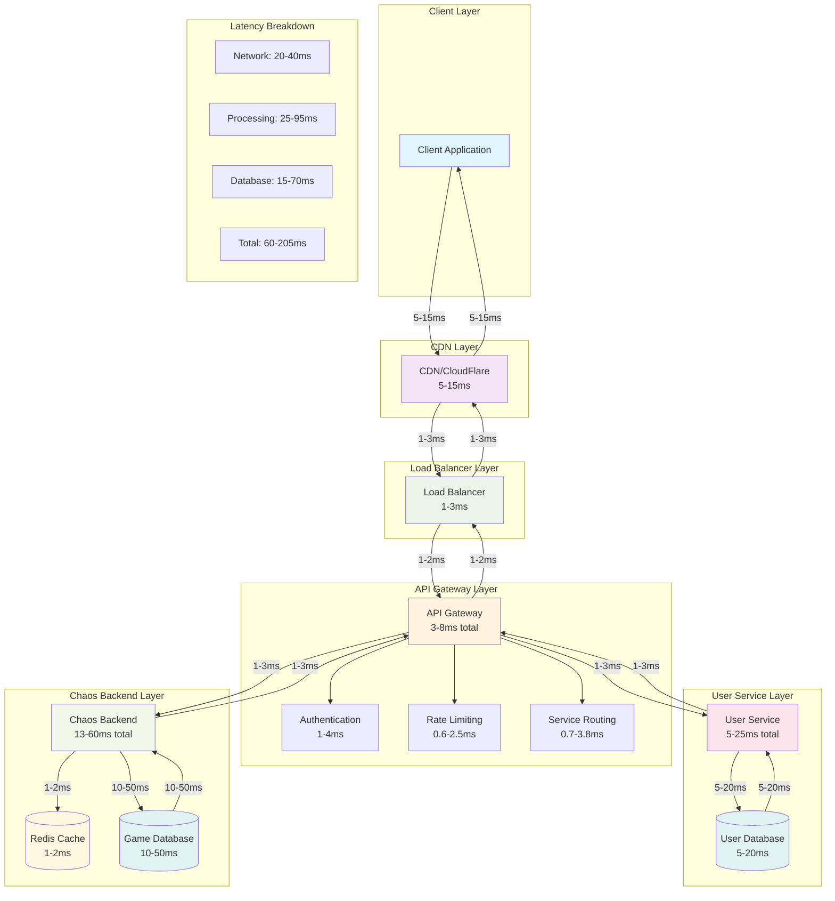

## Latency Scenarios

### Best Case (Cached Response)
```mermaid
gantt
    title Best Case Latency: 39ms
    dateFormat X
    axisFormat %L ms
    
    section Network
    Client to CDN     :0, 5
    CDN to LB         :5, 6
    LB to API Gateway :6, 7
    API Gateway to LB :32, 33
    LB to CDN         :33, 34
    CDN to Client     :34, 39
    
    section Processing
    API Gateway Auth  :7, 9
    User Service      :10, 15
    Chaos Backend     :18, 31
```

### Typical Case (Database Queries)
```mermaid
gantt
    title Typical Case Latency: 89ms
    dateFormat X
    axisFormat %L ms
    
    section Network
    Client to CDN     :0, 10
    CDN to LB         :10, 12
    LB to API Gateway :12, 14
    API Gateway to LB :75, 77
    LB to CDN         :77, 79
    CDN to Client     :79, 89
    
    section Processing
    API Gateway Auth  :14, 19
    User Service      :21, 36
    Chaos Backend     :40, 75
```

### Worst Case (Complex Queries)
```mermaid
gantt
    title Worst Case Latency: 144ms
    dateFormat X
    axisFormat %L ms
    
    section Network
    Client to CDN     :0, 15
    CDN to LB         :15, 18
    LB to API Gateway :18, 20
    API Gateway to LB :130, 132
    LB to CDN         :132, 135
    CDN to Client     :135, 150
    
    section Processing
    API Gateway Auth  :20, 28
    User Service      :31, 56
    Chaos Backend     :62, 130
```

## Performance Optimization Impact

### Before Optimization
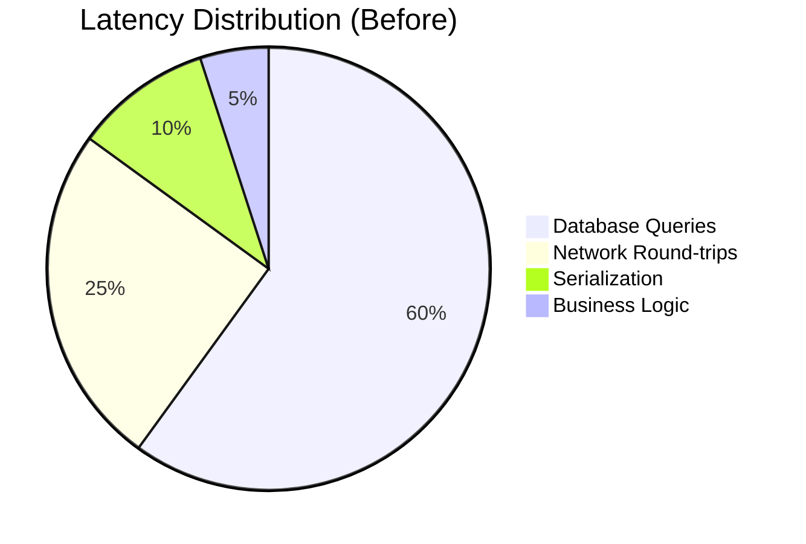

### After Optimization
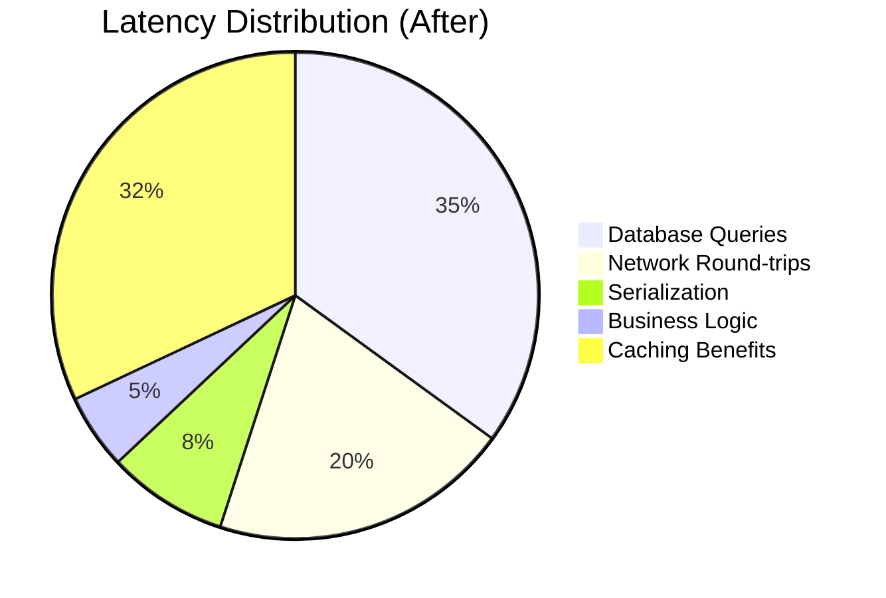

## Service Dependencies and Latency

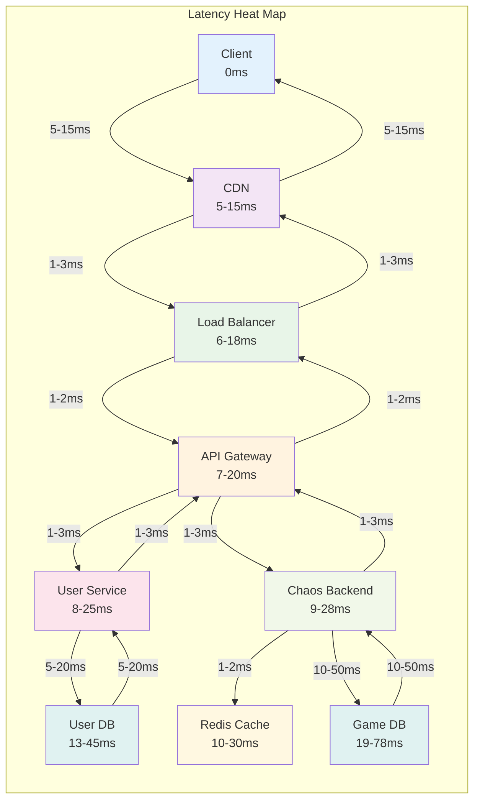

## Monitoring Dashboard Layout

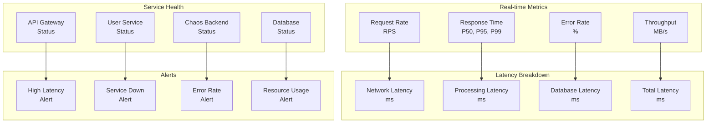

## Load Testing Results

### Latency vs Load
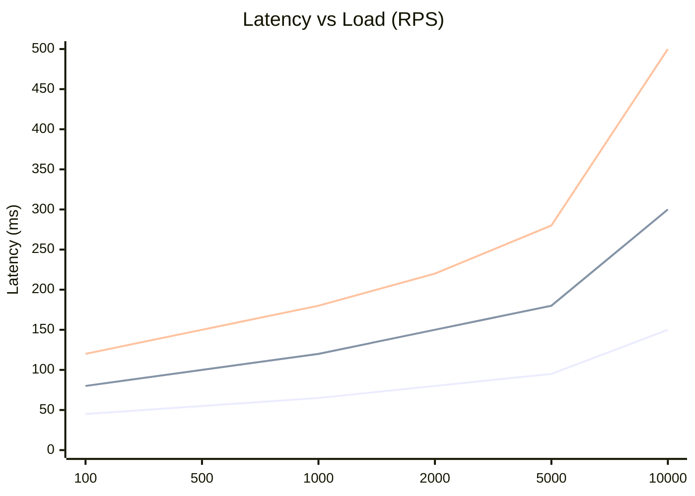

### Error Rate vs Load
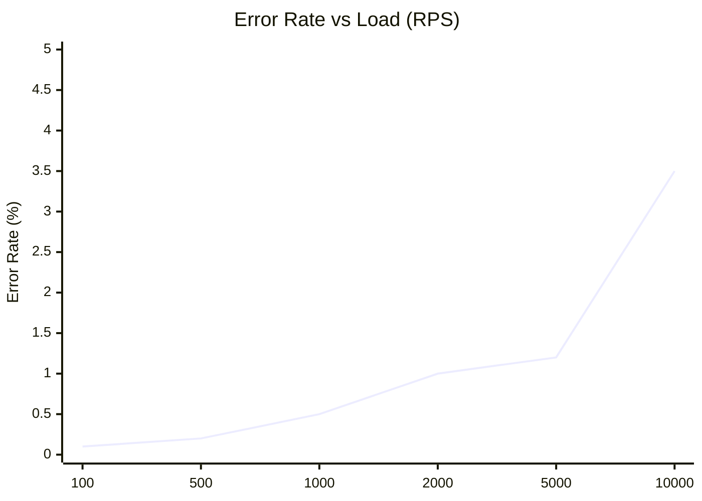

## Optimization Impact

### Before vs After Optimization
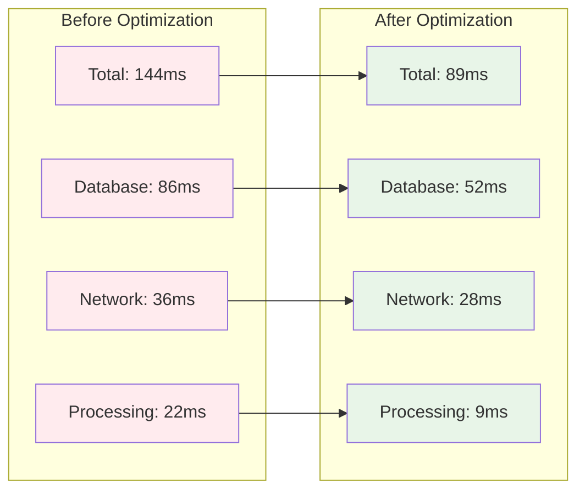

This comprehensive latency analysis provides a detailed breakdown of how requests flow through the Chaos World microservices architecture and where optimizations can be applied to improve performance.
