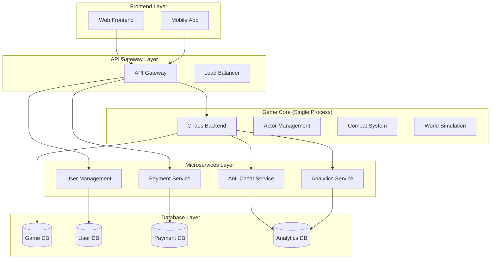
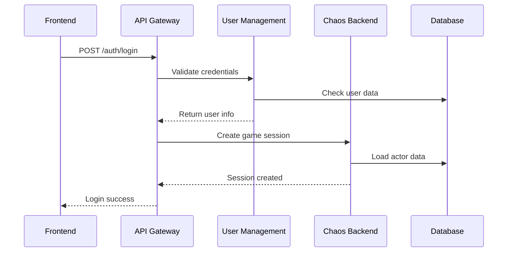
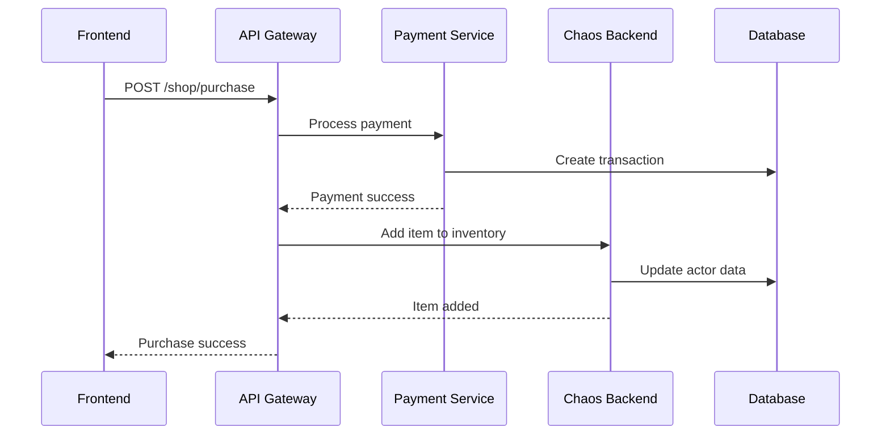
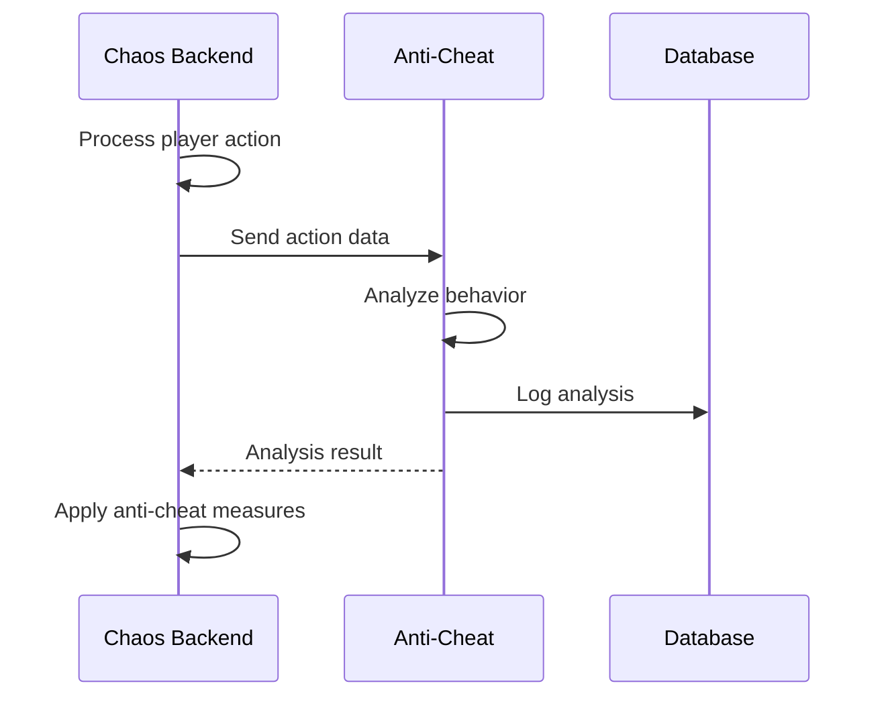

# Microservices Architecture - Chaos World

## 📋 Overview

Kiến trúc microservices cho Chaos World MMORPG, được thiết kế để đảm bảo performance cao cho game logic while maintaining scalability và security cho các services khác.

## 🏗️ Architecture Overview



## 🎯 Service Responsibilities

### 1. Chaos Backend (Game Logic Core)
```yaml
Purpose: Real-time game logic processing
Technology: Rust (single process)
Performance: < 1ms latency, 10K+ TPS
Database: MongoDB (chaos_game)
Responsibilities:
  - Actor management
  - Combat system
  - World simulation
  - Real-time calculations
  - Game state management
```

### 2. User Management Service
```yaml
Purpose: Authentication and user data
Technology: Rust/Go
Performance: < 100ms latency, 1K TPS
Database: PostgreSQL
Responsibilities:
  - User registration/login
  - Authentication/authorization
  - Profile management
  - Session management
  - User preferences
```

### 3. Payment Service
```yaml
Purpose: Financial transactions
Technology: Rust/Go
Performance: < 500ms latency, 100 TPS
Database: PostgreSQL
Responsibilities:
  - Payment processing
  - Transaction management
  - Billing history
  - Refund handling
  - Compliance (PCI DSS)
```

### 4. Anti-Cheat Service
```yaml
Purpose: Security and fraud detection
Technology: Python/Rust
Performance: < 50ms latency, 5K TPS
Database: ClickHouse
Responsibilities:
  - Behavior analysis
  - Cheat detection
  - Security monitoring
  - Ban management
  - ML-based detection
```

### 5. Analytics Service
```yaml
Purpose: Data collection and analysis
Technology: Python/Go
Performance: < 1s latency, 100K TPS
Database: ClickHouse/BigQuery
Responsibilities:
  - Event collection
  - Data processing
  - Business intelligence
  - Reporting
  - Machine learning
```

### 6. API Gateway
```yaml
Purpose: Entry point and routing
Technology: Rust/Axum
Performance: < 10ms latency, 50K TPS
Responsibilities:
  - Request routing
  - Authentication
  - Rate limiting
  - Load balancing
  - Protocol translation
```

## 🔌 Communication Patterns

### 1. Synchronous Communication
```yaml
HTTP/gRPC:
  - User authentication
  - Payment processing
  - Real-time game actions
  - Configuration updates

Protocols:
  - HTTP/2 for web APIs
  - gRPC for inter-service
  - WebSocket for real-time
```

### 2. Asynchronous Communication
```yaml
Event Streaming:
  - Game events
  - Analytics data
  - Anti-cheat analysis
  - System notifications

Technologies:
  - Apache Kafka
  - Redis Streams
  - RabbitMQ
```

### 3. Data Synchronization
```yaml
Database Sync:
  - User data sync
  - Configuration sync
  - Analytics data sync

Technologies:
  - Database replication
  - Event sourcing
  - CQRS pattern
```

## 📊 Data Flow Examples

### Player Login Flow


### Purchase Item Flow


### Anti-Cheat Analysis Flow


## 🗄️ Database Strategy

### Database per Service
```yaml
chaos_backend:
  database: chaos_game (MongoDB)
  collections: actors, world_state, combat_logs

user_management:
  database: user_db (PostgreSQL)
  tables: users, sessions, profiles

payment_service:
  database: payment_db (PostgreSQL)
  tables: transactions, payments, refunds

anti_cheat:
  database: security_db (ClickHouse)
  tables: behavior_logs, cheat_events

analytics:
  database: analytics_db (ClickHouse)
  tables: events, metrics, reports
```

### Data Consistency
```yaml
Eventual Consistency:
  - User data sync
  - Analytics data
  - Configuration updates

Strong Consistency:
  - Payment transactions
  - Game state changes
  - Security events
```

## 🔒 Security Architecture

### Authentication Flow
```yaml
1. User login → User Management Service
2. JWT token generation
3. Token validation at API Gateway
4. Service-to-service authentication
5. Token refresh mechanism
```

### Authorization
```yaml
Role-Based Access Control:
  - Player roles
  - Admin roles
  - Service roles

Permission Matrix:
  - Game actions
  - Admin functions
  - Service access
```

### Data Protection
```yaml
Encryption:
  - Data at rest (AES-256)
  - Data in transit (TLS 1.3)
  - Database encryption

Compliance:
  - PCI DSS (Payment data)
  - GDPR (User data)
  - SOC 2 (Security)
```

## 📈 Scalability Strategy

### Horizontal Scaling
```yaml
Stateless Services:
  - User Management
  - Payment Service
  - Analytics Service
  - API Gateway

Stateful Services:
  - Chaos Backend (single instance)
  - Anti-Cheat (ML models)
```

### Vertical Scaling
```yaml
Game Core:
  - High-performance CPU
  - Large memory (64GB+)
  - Fast storage (NVMe SSD)
  - Low-latency network
```

### Caching Strategy
```yaml
Redis Cache:
  - User sessions
  - Game configuration
  - Frequently accessed data

Application Cache:
  - Actor data
  - World state
  - Combat calculations
```

## 🚀 Deployment Architecture

### Container Orchestration
```yaml
Kubernetes:
  - Service discovery
  - Load balancing
  - Auto-scaling
  - Health checks
  - Rolling updates
```

### Service Mesh
```yaml
Istio:
  - Traffic management
  - Security policies
  - Observability
  - Circuit breakers
```

### Monitoring
```yaml
Observability Stack:
  - Prometheus (metrics)
  - Grafana (dashboards)
  - Jaeger (tracing)
  - ELK Stack (logging)
```

## 🧪 Testing Strategy

### Test Types
```yaml
Unit Tests:
  - Individual service testing
  - Mock external dependencies
  - Fast execution

Integration Tests:
  - Service-to-service communication
  - Database integration
  - API testing

End-to-End Tests:
  - Complete user journeys
  - Performance testing
  - Load testing
```

### Test Environment
```yaml
Development:
  - Local development
  - Docker Compose
  - Mock services

Staging:
  - Production-like environment
  - Real services
  - Performance testing

Production:
  - Blue-green deployment
  - Canary releases
  - Rollback capability
```

## 📚 Documentation Structure

```
docs/
├── chaos-backend/           # Game Logic Core
├── microservices-architecture/  # Overall architecture
├── api-gateway/             # API Gateway service
├── user-management/         # User Management service
├── payment-service/         # Payment service
├── anti-cheat-service/      # Anti-Cheat service
└── analytics-service/       # Analytics service
```

## 🔗 Related Documentation

- [Chaos Backend](./chaos-backend/README.md)
- [API Gateway](./api-gateway/README.md)
- [User Management](./user-management/README.md)
- [Payment Service](./payment-service/README.md)
- [Anti-Cheat Service](./anti-cheat-service/README.md)
- [Analytics Service](./analytics-service/README.md)
