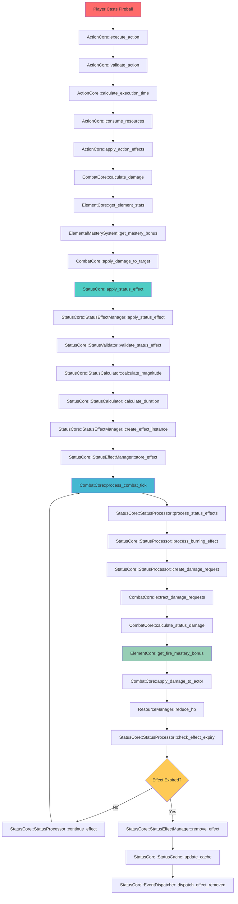
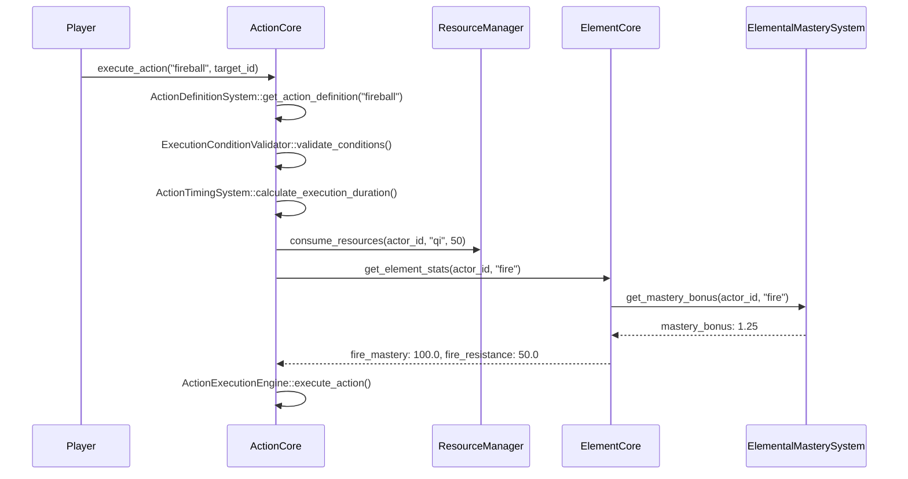
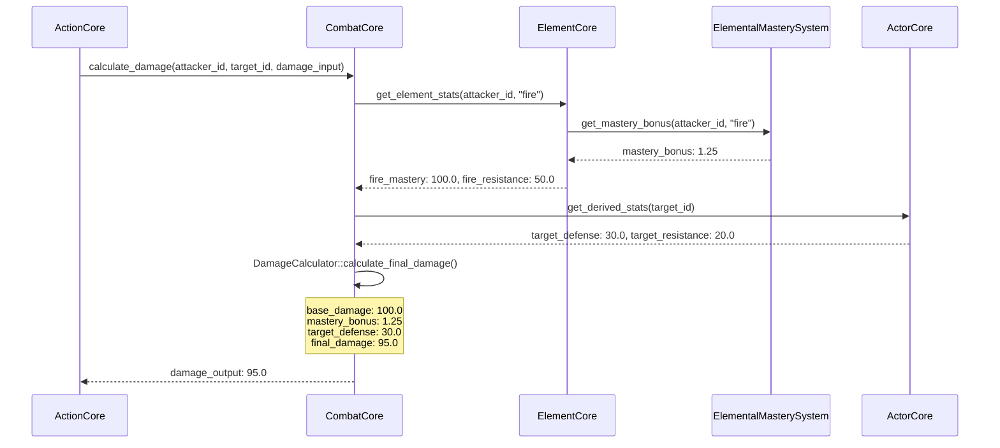
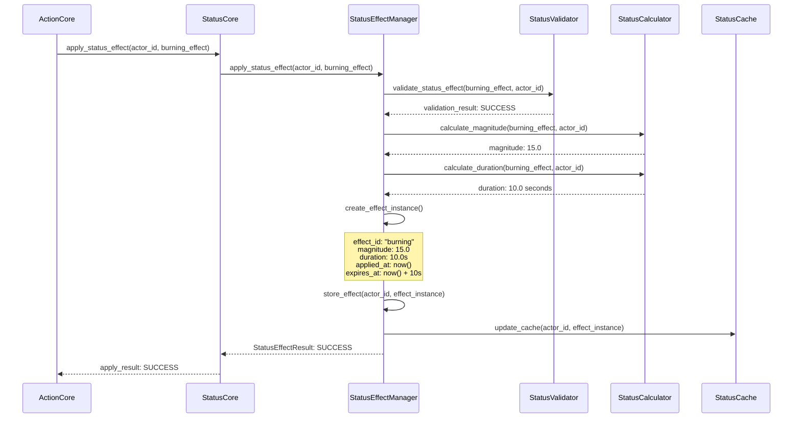
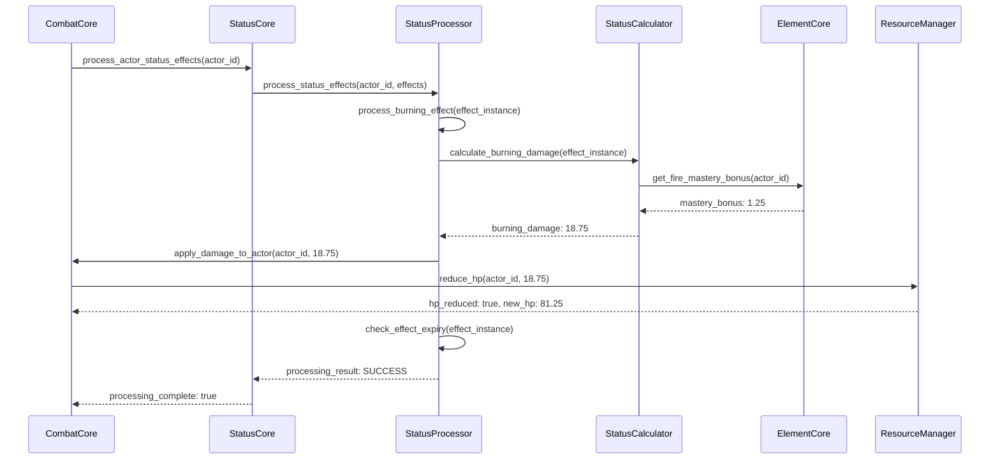
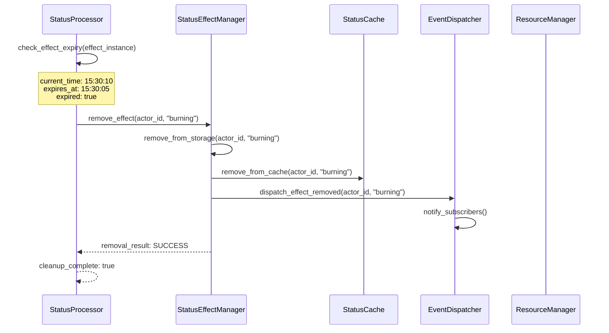

# Burning Status Combat Flow Diagram

## 📋 **Tổng Quan**

Visual flow diagram chi tiết cho việc apply và xử lý trạng thái burning trong combat, bao gồm các class/method cụ thể từ tất cả các hệ thống liên quan.

## 🔥 **Burning Status Combat Flow**



## 🏗️ **Detailed Class/Method Flow**

### **Phase 1: Action Execution**



### **Phase 2: Damage Calculation**



### **Phase 3: Status Effect Application**



### **Phase 4: Combat Tick Processing**



### **Phase 5: Effect Expiry and Cleanup**



## 🔧 **Specific Class/Method Implementations**

### **1. ActionCore Classes**

```rust
// ActionCore::ActionExecutionEngine
impl ActionExecutionEngine {
    pub async fn execute_action(
        &self,
        action_id: &str,
        actor_id: &str,
        target_id: &str,
        context: &ActionContext
    ) -> Result<ActionResult, ActionError> {
        // Get action definition
        let action_def = self.action_definition_system.get_action_definition(action_id)?;
        
        // Validate execution conditions
        self.execution_condition_validator.validate_conditions(
            &action_def.conditions,
            actor_id,
            context
        ).await?;
        
        // Calculate execution duration
        let execution_duration = self.action_timing_system.calculate_execution_duration(
            &action_def,
            actor_id,
            context
        ).await?;
        
        // Consume resources
        self.resource_manager.consume_resources(
            actor_id,
            &action_def.resource_consumption
        ).await?;
        
        // Execute action effects
        self.execute_action_effects(&action_def, actor_id, target_id, context).await?;
        
        Ok(ActionResult {
            success: true,
            execution_duration,
            effects_applied: vec![],
        })
    }
}

// ActionCore::ActionDefinitionSystem
impl ActionDefinitionSystem {
    pub fn get_action_definition(&self, action_id: &str) -> Result<ActionDefinition, ActionError> {
        self.action_definitions.get(action_id)
            .cloned()
            .ok_or_else(|| ActionError::ActionNotFound(action_id.to_string()))
    }
}
```

### **2. CombatCore Classes**

```rust
// CombatCore::DamageCalculator
impl DamageCalculator {
    pub async fn calculate_damage(
        &self,
        attacker_id: &str,
        target_id: &str,
        damage_input: &DamageInput
    ) -> Result<DamageOutput, CombatError> {
        // Get attacker stats
        let attacker_stats = self.element_core.get_element_stats(attacker_id, &damage_input.element_id).await?;
        let mastery_bonus = self.elemental_mastery_system.get_mastery_bonus(attacker_id, &damage_input.element_id).await?;
        
        // Get target stats
        let target_stats = self.actor_core.get_derived_stats(target_id).await?;
        
        // Calculate base damage
        let base_damage = damage_input.base_damage;
        
        // Apply mastery bonus
        let mastery_damage = base_damage * mastery_bonus;
        
        // Apply target defense
        let defense_reduction = target_stats.get_defense(&damage_input.element_id).unwrap_or(0.0);
        let final_damage = (mastery_damage - defense_reduction).max(0.0);
        
        Ok(DamageOutput {
            total_damage: final_damage,
            element_damage: HashMap::from([(damage_input.element_id.clone(), final_damage)]),
            critical_hit: false,
            critical_multiplier: 1.0,
            damage_breakdown: vec![],
        })
    }
}

// CombatCore::CombatProcessor
impl CombatProcessor {
    pub async fn process_combat_tick(&self, combat_id: &str) -> Result<CombatTickResult, CombatError> {
        // Get all actors in combat
        let actors = self.get_combat_actors(combat_id).await?;
        
        // Process status effects for each actor
        for actor_id in actors {
            self.status_core.process_actor_status_effects(&actor_id).await?;
        }
        
        Ok(CombatTickResult {
            tick_number: self.get_current_tick(),
            actors_processed: actors.len(),
            effects_processed: 0, // Will be updated by status core
        })
    }
}
```

### **3. StatusCore Classes**

```rust
// StatusCore::StatusEffectManager
impl StatusEffectManager {
    pub async fn apply_status_effect(
        &self,
        actor_id: &str,
        status_effect: StatusEffect,
        magnitude: f64,
        duration: Duration,
        context: &StatusContext
    ) -> Result<StatusEffectResult, StatusError> {
        // Validate status effect
        self.status_validator.validate_status_effect(&status_effect, actor_id, context).await?;
        
        // Create effect instance
        let effect_instance = StatusEffectInstance {
            effect_id: status_effect.effect_id.clone(),
            effect_name: status_effect.effect_name.clone(),
            effect_name_vi: status_effect.effect_name_vi.clone(),
            category: status_effect.category.clone(),
            effect_type: status_effect.effect_type.clone(),
            magnitude,
            duration,
            target: status_effect.target.clone(),
            source: status_effect.source.clone(),
            conditions: status_effect.conditions.clone(),
            interactions: status_effect.interactions.clone(),
            immunity_list: status_effect.immunity_list.clone(),
            movement_restrictions: status_effect.movement_restrictions.clone(),
            visual_effects: status_effect.visual_effects.clone(),
            audio_effects: status_effect.audio_effects.clone(),
            properties: status_effect.properties.clone(),
            priority: status_effect.priority,
            applied_at: SystemTime::now(),
            expires_at: SystemTime::now() + duration,
            is_active: true,
        };
        
        // Store effect instance
        let mut active_effects = self.active_effects.write().await;
        active_effects.entry(actor_id.to_string())
            .or_insert_with(Vec::new)
            .push(effect_instance.clone());
        
        // Update cache
        self.status_cache.update_actor_status_effect(actor_id, &effect_instance).await?;
        
        Ok(StatusEffectResult {
            effect_id: status_effect.effect_id.clone(),
            success: true,
            reason: StatusEffectFailureReason::None,
            magnitude,
            duration,
            applied_at: Some(effect_instance.applied_at),
            expires_at: Some(effect_instance.expires_at),
        })
    }
}

// StatusCore::StatusProcessor
impl StatusProcessor {
    pub async fn process_burning_effect(
        &self,
        effect_instance: &StatusEffectInstance,
        actor_id: &str,
        context: &StatusContext
    ) -> Result<StatusEffectResult, StatusError> {
        // Calculate burning damage
        let burning_damage = self.status_calculator.calculate_burning_damage(
            effect_instance,
            actor_id,
            context
        ).await?;
        
        // Apply damage to actor
        self.combat_core.apply_damage_to_actor(actor_id, burning_damage).await?;
        
        // Check if effect should expire
        let should_expire = self.check_effect_expiry(effect_instance).await?;
        
        if should_expire {
            self.status_effect_manager.remove_status_effect(actor_id, &effect_instance.effect_id).await?;
        }
        
        Ok(StatusEffectResult {
            effect_id: effect_instance.effect_id.clone(),
            success: true,
            reason: StatusEffectFailureReason::None,
            magnitude: burning_damage,
            duration: effect_instance.duration,
            applied_at: Some(effect_instance.applied_at),
            expires_at: Some(effect_instance.expires_at),
        })
    }
}

// StatusCore::StatusCalculator
impl StatusCalculator {
    pub async fn calculate_burning_damage(
        &self,
        effect_instance: &StatusEffectInstance,
        actor_id: &str,
        context: &StatusContext
    ) -> Result<f64, StatusError> {
        // Get base magnitude
        let base_magnitude = effect_instance.magnitude;
        
        // Get fire mastery bonus
        let fire_mastery_bonus = self.element_core.get_fire_mastery_bonus(actor_id).await?;
        
        // Calculate final damage
        let final_damage = base_magnitude * fire_mastery_bonus;
        
        Ok(final_damage)
    }
}
```

### **4. ElementCore Classes**

```rust
// ElementCore::ElementStatsProvider
impl ElementStatsProvider {
    pub async fn get_element_stats(
        &self,
        actor_id: &str,
        element_id: &str
    ) -> Result<ElementStats, ElementError> {
        let element_definition = self.get_element_definition(element_id).await?;
        let actor_stats = self.actor_core.get_derived_stats(actor_id).await?;
        
        // Calculate element-specific stats
        let element_mastery = self.calculate_element_mastery(actor_id, element_id).await?;
        let element_resistance = self.calculate_element_resistance(actor_id, element_id).await?;
        
        Ok(ElementStats {
            element_id: element_id.to_string(),
            mastery: element_mastery,
            resistance: element_resistance,
            derived_stats: actor_stats,
        })
    }
}

// ElementCore::ElementalMasterySystem
impl ElementalMasterySystem {
    pub async fn get_mastery_bonus(
        &self,
        actor_id: &str,
        element_id: &str
    ) -> Result<f64, ElementError> {
        let mastery_data = self.get_element_mastery_data(actor_id, element_id).await?;
        let mastery_level = self.calculate_mastery_level(&mastery_data).await?;
        
        // Calculate bonus based on mastery level
        let bonus = 1.0 + (mastery_level as f64 * 0.1);
        
        Ok(bonus)
    }
}
```

### **5. ResourceManager Classes**

```rust
// ResourceManager::ResourceProcessor
impl ResourceProcessor {
    pub async fn reduce_hp(
        &self,
        actor_id: &str,
        damage: f64
    ) -> Result<ResourceUpdateResult, ResourceError> {
        let mut actor_resources = self.get_actor_resources(actor_id).await?;
        
        // Reduce HP
        let current_hp = actor_resources.get("hp").unwrap_or(&0.0);
        let new_hp = (current_hp - damage).max(0.0);
        actor_resources.insert("hp".to_string(), new_hp);
        
        // Update actor resources
        self.update_actor_resources(actor_id, &actor_resources).await?;
        
        Ok(ResourceUpdateResult {
            resource_id: "hp".to_string(),
            old_value: *current_hp,
            new_value: new_hp,
            change_amount: -damage,
        })
    }
}
```

## 📊 **Data Flow Example**

### **Burning Effect Data Flow**

```yaml
# Input Data
fireball_action:
  action_id: "fireball"
  base_damage: 100.0
  element_id: "fire"
  status_effects:
    - effect_id: "burning"
      magnitude:
        base_value: 15.0
        scaling_factor: 0.1
        scaling_stat: "intelligence"
      duration:
        base_duration: 10.0
        scaling_factor: 0.05
        scaling_stat: "wisdom"

# Processing Data
actor_stats:
  intelligence: 50.0
  wisdom: 40.0
  fire_mastery: 100.0
  fire_resistance: 50.0

# Calculated Values
burning_magnitude: 15.0 + (50.0 * 0.1) = 20.0
burning_duration: 10.0 + (40.0 * 0.05) = 12.0 seconds
fire_mastery_bonus: 1.0 + (100.0 * 0.01) = 2.0
burning_damage_per_tick: 20.0 * 2.0 = 40.0

# Final Result
burning_effect_instance:
  effect_id: "burning"
  magnitude: 20.0
  duration: 12.0 seconds
  applied_at: "2025-01-27T15:30:00Z"
  expires_at: "2025-01-27T15:30:12Z"
  damage_per_tick: 40.0
```

## 🎯 **Key Integration Points**

1. **ActionCore → CombatCore**: Action execution triggers damage calculation
2. **CombatCore → StatusCore**: Damage application triggers status effect application
3. **StatusCore → ElementCore**: Status effect calculation uses element mastery
4. **StatusCore → ResourceManager**: Status effect damage reduces actor HP
5. **ElementCore → ElementalMasterySystem**: Element stats calculation uses mastery system
6. **CombatCore → StatusCore**: Combat tick processing triggers status effect processing

---

**Last Updated**: 2025-01-27  
**Version**: 1.0  
**Status**: Design Complete  
**Maintainer**: Chaos World Team
