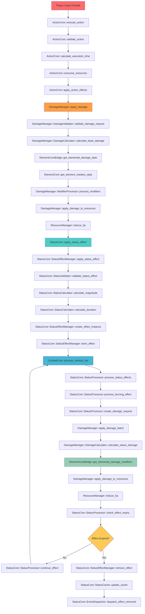
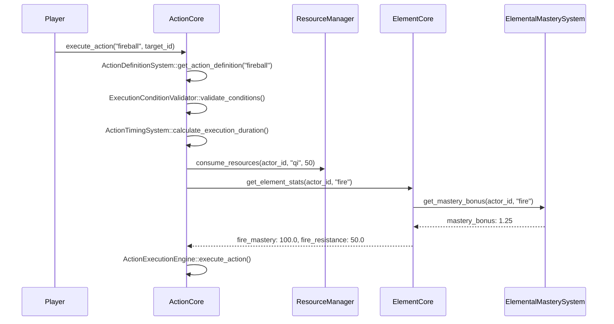
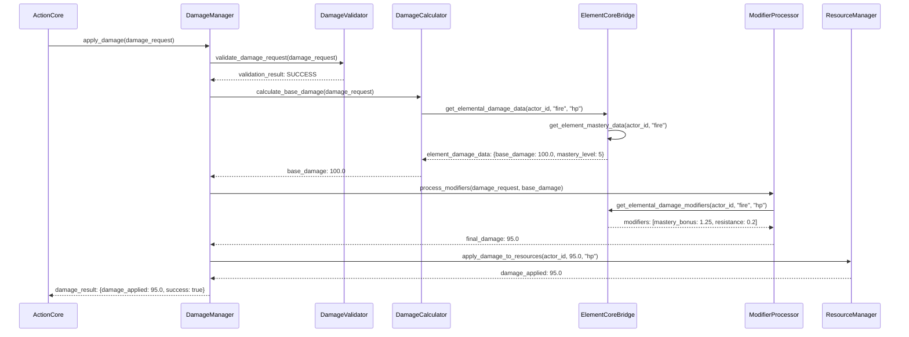
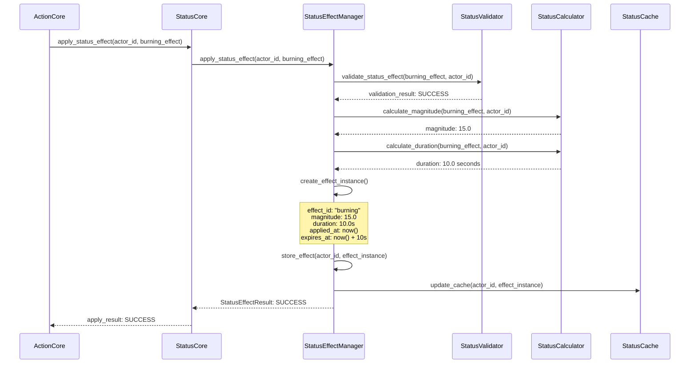
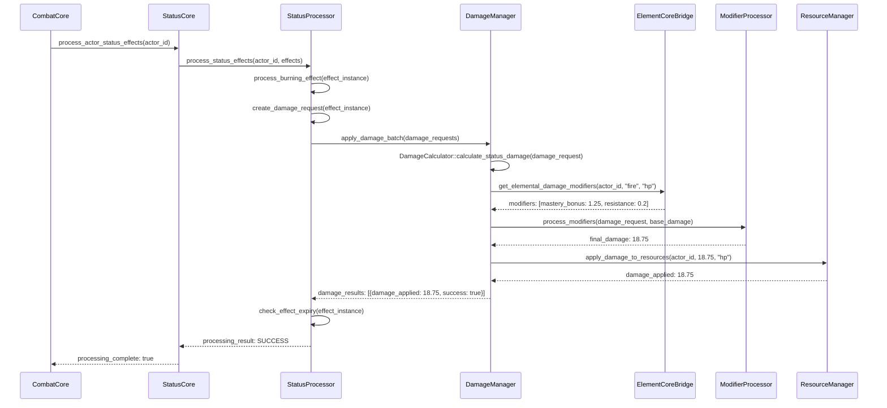
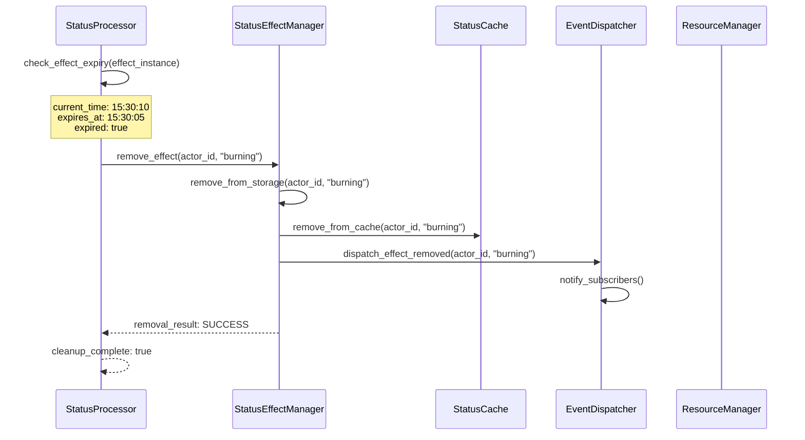

# Burning Status Combat Flow Diagram

## 📋 **Tổng Quan**

Visual flow diagram chi tiết cho việc apply và xử lý trạng thái burning trong combat, bao gồm các class/method cụ thể từ tất cả các hệ thống liên quan.

**🔄 Updated with Damage Manager**: Flow diagram đã được cập nhật để tích hợp Damage Manager system, thay thế direct damage calculations bằng centralized damage processing.

## 🔥 **Burning Status Combat Flow**



## 🏗️ **Detailed Class/Method Flow**

### **Phase 1: Action Execution**



### **Phase 2: Damage Calculation with Damage Manager**



### **Phase 3: Status Effect Application**



### **Phase 4: Combat Tick Processing with Damage Manager**



### **Phase 5: Effect Expiry and Cleanup**



## 🔧 **Specific Class/Method Implementations**

### **1. ActionCore Classes**

```rust
// ActionCore::ActionExecutionEngine
impl ActionExecutionEngine {
    pub async fn execute_action(
        &self,
        action_id: &str,
        actor_id: &str,
        target_id: &str,
        context: &ActionContext
    ) -> Result<ActionResult, ActionError> {
        // Get action definition
        let action_def = self.action_definition_system.get_action_definition(action_id)?;
        
        // Validate execution conditions
        self.execution_condition_validator.validate_conditions(
            &action_def.conditions,
            actor_id,
            context
        ).await?;
        
        // Calculate execution duration
        let execution_duration = self.action_timing_system.calculate_execution_duration(
            &action_def,
            actor_id,
            context
        ).await?;
        
        // Consume resources
        self.resource_manager.consume_resources(
            actor_id,
            &action_def.resource_consumption
        ).await?;
        
        // Execute action effects
        self.execute_action_effects(&action_def, actor_id, target_id, context).await?;
        
        Ok(ActionResult {
            success: true,
            execution_duration,
            effects_applied: vec![],
        })
    }
}

// ActionCore::ActionDefinitionSystem
impl ActionDefinitionSystem {
    pub fn get_action_definition(&self, action_id: &str) -> Result<ActionDefinition, ActionError> {
        self.action_definitions.get(action_id)
            .cloned()
            .ok_or_else(|| ActionError::ActionNotFound(action_id.to_string()))
    }
}
```

### **2. Damage Manager Classes**

```rust
// DamageManager::DamageManager
impl DamageManager {
    pub async fn apply_damage(
        &self,
        request: DamageRequest
    ) -> Result<DamageResult, DamageError> {
        // Validate damage request
        self.damage_validator.validate_damage_request(&request).await?;
        
        // Check damage immunity
        if self.check_damage_immunity(&request).await? {
            return Ok(self.create_immunity_result(&request));
        }
        
        // Calculate base damage
        let base_damage = self.damage_calculator.calculate_base_damage(&request).await?;
        
        // Process damage modifiers
        let modified_damage = self.modifier_processor.process_modifiers(
            &request,
            base_damage
        ).await?;
        
        // Apply damage to resources
        let damage_result = self.apply_damage_to_resources(&request, modified_damage).await?;
        
        // Dispatch damage events
        self.event_dispatcher.dispatch_damage_applied(&damage_result).await?;
        
        Ok(damage_result)
    }
    
    pub async fn apply_damage_batch(
        &self,
        requests: Vec<DamageRequest>
    ) -> Result<Vec<DamageResult>, DamageError> {
        let mut results = Vec::new();
        
        for request in requests {
            let result = self.apply_damage(request).await?;
            results.push(result);
        }
        
        Ok(results)
    }
}

// DamageManager::DamageCalculator
impl DamageCalculator {
    pub async fn calculate_base_damage(
        &self,
        request: &DamageRequest
    ) -> Result<f64, DamageError> {
        // Check cache first
        if let Some(cached_damage) = self.calculation_cache.get_damage(request).await? {
            return Ok(cached_damage);
        }
        
        // Calculate damage based on source
        let base_damage = match request.damage_source {
            DamageSource::Direct => {
                self.calculate_direct_damage(request).await?
            },
            DamageSource::Status => {
                self.calculate_status_damage(request).await?
            },
            DamageSource::Elemental => {
                self.calculate_elemental_damage(request).await?
            },
            _ => request.base_damage,
        };
        
        // Cache result
        self.calculation_cache.cache_damage(request, base_damage).await?;
        
        Ok(base_damage)
    }
}

// DamageManager::ModifierProcessor
impl ModifierProcessor {
    pub async fn process_modifiers(
        &self,
        request: &DamageRequest,
        base_damage: f64
    ) -> Result<f64, DamageError> {
        let mut final_damage = base_damage;
        let mut applied_modifiers = Vec::new();
        
        // Process request modifiers
        for modifier in &request.modifiers {
            if self.should_apply_modifier(modifier, request).await? {
                let modified_damage = self.apply_modifier(final_damage, modifier).await?;
                final_damage = modified_damage;
                applied_modifiers.push(modifier.clone());
            }
        }
        
        // Process system modifiers
        let system_modifiers = self.get_system_modifiers(request).await?;
        for modifier in system_modifiers {
            if self.should_apply_modifier(&modifier, request).await? {
                let modified_damage = self.apply_modifier(final_damage, &modifier).await?;
                final_damage = modified_damage;
                applied_modifiers.push(modifier);
            }
        }
        
        Ok(final_damage)
    }
}
```

### **3. StatusCore Classes**

```rust
// StatusCore::StatusEffectManager
impl StatusEffectManager {
    pub async fn apply_status_effect(
        &self,
        actor_id: &str,
        status_effect: StatusEffect,
        magnitude: f64,
        duration: Duration,
        context: &StatusContext
    ) -> Result<StatusEffectResult, StatusError> {
        // Validate status effect
        self.status_validator.validate_status_effect(&status_effect, actor_id, context).await?;
        
        // Create effect instance
        let effect_instance = StatusEffectInstance {
            effect_id: status_effect.effect_id.clone(),
            effect_name: status_effect.effect_name.clone(),
            effect_name_vi: status_effect.effect_name_vi.clone(),
            category: status_effect.category.clone(),
            effect_type: status_effect.effect_type.clone(),
            magnitude,
            duration,
            target: status_effect.target.clone(),
            source: status_effect.source.clone(),
            conditions: status_effect.conditions.clone(),
            interactions: status_effect.interactions.clone(),
            immunity_list: status_effect.immunity_list.clone(),
            movement_restrictions: status_effect.movement_restrictions.clone(),
            visual_effects: status_effect.visual_effects.clone(),
            audio_effects: status_effect.audio_effects.clone(),
            properties: status_effect.properties.clone(),
            priority: status_effect.priority,
            applied_at: SystemTime::now(),
            expires_at: SystemTime::now() + duration,
            is_active: true,
        };
        
        // Store effect instance
        let mut active_effects = self.active_effects.write().await;
        active_effects.entry(actor_id.to_string())
            .or_insert_with(Vec::new)
            .push(effect_instance.clone());
        
        // Update cache
        self.status_cache.update_actor_status_effect(actor_id, &effect_instance).await?;
        
        Ok(StatusEffectResult {
            effect_id: status_effect.effect_id.clone(),
            success: true,
            reason: StatusEffectFailureReason::None,
            magnitude,
            duration,
            applied_at: Some(effect_instance.applied_at),
            expires_at: Some(effect_instance.expires_at),
        })
    }
}

// StatusCore::StatusProcessor
impl StatusProcessor {
    pub async fn process_burning_effect(
        &self,
        effect_instance: &StatusEffectInstance,
        actor_id: &str,
        context: &StatusContext
    ) -> Result<StatusEffectResult, StatusError> {
        // Create damage request for burning effect
        let damage_request = self.create_damage_request(effect_instance, actor_id, context).await?;
        
        // Apply damage through Damage Manager
        let damage_results = self.damage_manager.apply_damage_batch(vec![damage_request]).await?;
        
        // Process damage results
        let mut total_damage = 0.0;
        for result in damage_results {
            if result.success {
                total_damage += result.damage_applied;
            }
        }
        
        // Check if effect should expire
        let should_expire = self.check_effect_expiry(effect_instance).await?;
        
        if should_expire {
            self.status_effect_manager.remove_status_effect(actor_id, &effect_instance.effect_id).await?;
        }
        
        Ok(StatusEffectResult {
            effect_id: effect_instance.effect_id.clone(),
            success: true,
            reason: StatusEffectFailureReason::None,
            magnitude: total_damage,
            duration: effect_instance.duration,
            applied_at: Some(effect_instance.applied_at),
            expires_at: Some(effect_instance.expires_at),
        })
    }
    
    async fn create_damage_request(
        &self,
        effect_instance: &StatusEffectInstance,
        actor_id: &str,
        context: &StatusContext
    ) -> Result<DamageRequest, StatusError> {
        Ok(DamageRequest {
            actor_id: actor_id.to_string(),
            damage_type: DamageType::HP,
            base_damage: effect_instance.magnitude,
            damage_source: DamageSource::Status,
            element_id: Some("fire".to_string()),
            source_id: Some(effect_instance.effect_id.clone()),
            modifiers: Vec::new(),
            properties: effect_instance.properties.clone(),
            context: DamageContext {
                combat_id: context.combat_id.clone(),
                attacker_id: None,
                target_id: Some(actor_id.to_string()),
                environment: context.environment.clone(),
                time: SystemTime::now(),
                additional_data: HashMap::new(),
            },
        })
    }
}
```

### **4. ElementCore Bridge Classes**

```rust
// DamageManager::ElementCoreBridge
impl ElementCoreBridge {
    pub async fn get_elemental_damage_data(
        &self,
        actor_id: &str,
        element_id: &str,
        damage_type: &str
    ) -> Result<ElementDamageData, IntegrationError> {
        // Get element mastery data
        let mastery_data = self.element_core.get_element_mastery_data(actor_id, element_id).await?;
        
        // Get element definition
        let element_def = self.element_core.get_element_definition(element_id).await?;
        
        // Calculate base damage
        let base_damage = self.calculate_elemental_base_damage(
            &mastery_data,
            &element_def,
            damage_type
        ).await?;
        
        // Calculate power scale
        let power_scale = self.calculate_elemental_power_scale(
            &mastery_data,
            &element_def
        ).await?;
        
        // Create element damage data
        Ok(ElementDamageData {
            element_id: element_id.to_string(),
            base_damage,
            power_scale,
            mastery_level: mastery_data.mastery_level,
            mastery_tier: mastery_data.mastery_tier,
            realm: mastery_data.realm,
            stage: mastery_data.stage,
            power_tier: mastery_data.power_tier,
            resistance: mastery_data.resistance,
            properties: element_def.properties,
        })
    }
    
    pub async fn get_elemental_damage_modifiers(
        &self,
        actor_id: &str,
        element_id: &str,
        damage_type: &str
    ) -> Result<Vec<DamageModifier>, IntegrationError> {
        // Get element mastery data
        let mastery_data = self.element_core.get_element_mastery_data(actor_id, element_id).await?;
        
        // Get element definition
        let element_def = self.element_core.get_element_definition(element_id).await?;
        
        // Create damage modifiers
        let mut modifiers = Vec::new();
        
        // Mastery bonus modifier
        if mastery_data.mastery_level > 0 {
            let mastery_bonus = self.calculate_mastery_bonus(&mastery_data, &element_def);
            modifiers.push(DamageModifier {
                modifier_type: DamageModifierType::Multiplier,
                value: 1.0 + mastery_bonus,
                source: format!("element_mastery_{}", element_id),
                condition: None,
                properties: HashMap::new(),
            });
        }
        
        // Element resistance modifier
        if mastery_data.resistance > 0.0 {
            modifiers.push(DamageModifier {
                modifier_type: DamageModifierType::Resistance,
                value: mastery_data.resistance,
                source: format!("element_resistance_{}", element_id),
                condition: None,
                properties: HashMap::new(),
            });
        }
        
        Ok(modifiers)
    }
}
```

### **5. ResourceManager Classes**

```rust
// ResourceManager::ResourceProcessor
impl ResourceProcessor {
    pub async fn reduce_hp(
        &self,
        actor_id: &str,
        damage: f64
    ) -> Result<ResourceUpdateResult, ResourceError> {
        let mut actor_resources = self.get_actor_resources(actor_id).await?;
        
        // Reduce HP
        let current_hp = actor_resources.get("hp").unwrap_or(&0.0);
        let new_hp = (current_hp - damage).max(0.0);
        actor_resources.insert("hp".to_string(), new_hp);
        
        // Update actor resources
        self.update_actor_resources(actor_id, &actor_resources).await?;
        
        Ok(ResourceUpdateResult {
            resource_id: "hp".to_string(),
            old_value: *current_hp,
            new_value: new_hp,
            change_amount: -damage,
        })
    }
}
```

## 📊 **Data Flow Example**

### **Burning Effect Data Flow**

```yaml
# Input Data
fireball_action:
  action_id: "fireball"
  base_damage: 100.0
  element_id: "fire"
  status_effects:
    - effect_id: "burning"
      magnitude:
        base_value: 15.0
        scaling_factor: 0.1
        scaling_stat: "intelligence"
      duration:
        base_duration: 10.0
        scaling_factor: 0.05
        scaling_stat: "wisdom"

# Processing Data
actor_stats:
  intelligence: 50.0
  wisdom: 40.0
  fire_mastery: 100.0
  fire_resistance: 50.0

# Calculated Values
burning_magnitude: 15.0 + (50.0 * 0.1) = 20.0
burning_duration: 10.0 + (40.0 * 0.05) = 12.0 seconds
fire_mastery_bonus: 1.0 + (100.0 * 0.01) = 2.0
burning_damage_per_tick: 20.0 * 2.0 = 40.0

# Final Result
burning_effect_instance:
  effect_id: "burning"
  magnitude: 20.0
  duration: 12.0 seconds
  applied_at: "2025-01-27T15:30:00Z"
  expires_at: "2025-01-27T15:30:12Z"
  damage_per_tick: 40.0
```

## 🎯 **Key Integration Points**

1. **ActionCore → DamageManager**: Action execution triggers damage calculation through Damage Manager
2. **DamageManager → ElementCoreBridge**: Damage calculation uses elemental data through bridge
3. **DamageManager → StatusCoreBridge**: Status effect damage processing through bridge
4. **DamageManager → ResourceManager**: Centralized damage application to resources
5. **StatusCore → DamageManager**: Status effect damage requests processed through Damage Manager
6. **ElementCore → ElementCoreBridge**: Element mastery data provided through bridge
7. **CombatCore → StatusCore**: Combat tick processing triggers status effect processing
8. **StatusCore → DamageManager**: Status effects create damage requests for Damage Manager

---

**Last Updated**: 2025-01-27  
**Version**: 2.0  
**Status**: Updated with Damage Manager Integration  
**Maintainer**: Chaos World Team
