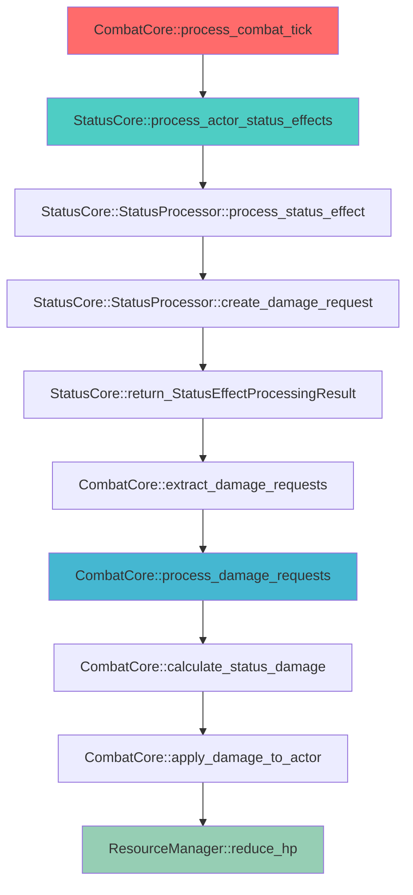

# Status Core Combat Integration Design

## 📋 **Tổng Quan**

Status Core Combat Integration Design mô tả cách StatusCore tích hợp với CombatCore một cách tối ưu, trong đó StatusCore chỉ cung cấp thông tin cần thiết và CombatCore chịu trách nhiệm tính và apply damage.

## 🎯 **Nguyên Tắc Thiết Kế**

### **1. Separation of Concerns**
- **StatusCore**: Quản lý status effects, cung cấp thông tin cần thiết
- **CombatCore**: Tính toán và apply damage, xử lý combat mechanics
- **Clear Interface**: Interface rõ ràng giữa hai hệ thống

### **2. Data Flow Optimization**
- **StatusCore → CombatCore**: Cung cấp damage requests
- **CombatCore → StatusCore**: Apply damage results
- **Minimal Coupling**: Giảm thiểu sự phụ thuộc giữa các hệ thống

### **3. Performance Considerations**
- **Batch Processing**: Xử lý nhiều damage requests cùng lúc
- **Caching**: Cache damage calculation results
- **Async Processing**: Non-blocking operations

## 🏗️ **Integration Architecture**

### **1. Status Core Interface**

```rust
/// Status Core Interface for Combat Core
#[async_trait]
pub trait StatusCoreInterface: Send + Sync {
    /// Process status effects and return damage requests
    async fn process_actor_status_effects(
        &self,
        actor_id: &str,
        context: &StatusContext
    ) -> Result<Vec<StatusEffectProcessingResult>, StatusError>;
    
    /// Get active status effects for an actor
    async fn get_actor_status_effects(
        &self,
        actor_id: &str
    ) -> Result<Vec<StatusEffectInstance>, StatusError>;
    
    /// Apply status effect to actor
    async fn apply_status_effect(
        &self,
        actor_id: &str,
        status_effect: StatusEffect,
        context: &StatusContext
    ) -> Result<StatusEffectResult, StatusError>;
    
    /// Remove status effect from actor
    async fn remove_status_effect(
        &self,
        actor_id: &str,
        effect_id: &str
    ) -> Result<StatusRemovalResult, StatusError>;
    
    /// Get damage requests from status effects
    async fn get_damage_requests(
        &self,
        actor_id: &str,
        context: &StatusContext
    ) -> Result<Vec<StatusDamageRequest>, StatusError>;
}
```

### **2. Combat Core Integration**

```rust
/// Combat Core Status Integration
pub struct CombatCoreStatusIntegration {
    // Status Core client
    status_core_client: Arc<dyn StatusCoreInterface>,
    
    // Element Core client
    element_core_client: Arc<dyn ElementCoreInterface>,
    
    // Actor Core client
    actor_core_client: Arc<dyn ActorCoreInterface>,
    
    // Resource Manager client
    resource_manager_client: Arc<dyn ResourceManagerInterface>,
    
    // Configuration
    config: CombatStatusIntegrationConfig,
}

impl CombatCoreStatusIntegration {
    /// Process status effects during combat tick
    pub async fn process_combat_tick_status_effects(
        &self,
        combat_id: &str,
        context: &CombatContext
    ) -> Result<CombatTickResult, CombatError> {
        // Get all actors in combat
        let actors = self.get_combat_actors(combat_id).await?;
        
        let mut total_damage_requests = Vec::new();
        let mut total_status_changes = Vec::new();
        
        // Process status effects for each actor
        for actor_id in actors {
            // Get status effect processing results
            let processing_results = self.status_core_client
                .process_actor_status_effects(&actor_id, &self.convert_to_status_context(context))
                .await?;
            
            // Extract damage requests
            let damage_requests: Vec<StatusDamageRequest> = processing_results
                .iter()
                .filter_map(|result| result.damage_request.clone())
                .collect();
            
            // Extract status changes
            let status_changes: Vec<StatusChange> = processing_results
                .iter()
                .flat_map(|result| result.status_changes.clone())
                .collect();
            
            total_damage_requests.extend(damage_requests);
            total_status_changes.extend(status_changes);
        }
        
        // Process all damage requests
        let damage_results = self.process_damage_requests(total_damage_requests, context).await?;
        
        // Apply status changes
        self.apply_status_changes(total_status_changes).await?;
        
        Ok(CombatTickResult {
            tick_number: self.get_current_tick(),
            actors_processed: actors.len(),
            damage_requests_processed: damage_results.len(),
            status_changes_applied: total_status_changes.len(),
        })
    }
    
    /// Process damage requests from status effects
    async fn process_damage_requests(
        &self,
        damage_requests: Vec<StatusDamageRequest>,
        context: &CombatContext
    ) -> Result<Vec<DamageResult>, CombatError> {
        let mut damage_results = Vec::new();
        
        // Group damage requests by actor for efficient processing
        let mut grouped_requests: HashMap<String, Vec<StatusDamageRequest>> = HashMap::new();
        for request in damage_requests {
            grouped_requests
                .entry(request.actor_id.clone())
                .or_insert_with(Vec::new)
                .push(request);
        }
        
        // Process each actor's damage requests
        for (actor_id, requests) in grouped_requests {
            let actor_damage_results = self.process_actor_damage_requests(actor_id, requests, context).await?;
            damage_results.extend(actor_damage_results);
        }
        
        Ok(damage_results)
    }
    
    /// Process damage requests for a single actor
    async fn process_actor_damage_requests(
        &self,
        actor_id: &str,
        requests: Vec<StatusDamageRequest>,
        context: &CombatContext
    ) -> Result<Vec<DamageResult>, CombatError> {
        let mut damage_results = Vec::new();
        
        for request in requests {
            // Calculate damage using CombatCore's damage calculator
            let damage_result = self.calculate_status_damage(actor_id, &request, context).await?;
            
            // Apply damage to actor
            self.apply_damage_to_actor(actor_id, damage_result.final_damage, &request).await?;
            
            damage_results.push(damage_result);
        }
        
        Ok(damage_results)
    }
    
    /// Calculate damage for status effect
    async fn calculate_status_damage(
        &self,
        actor_id: &str,
        request: &StatusDamageRequest,
        context: &CombatContext
    ) -> Result<DamageResult, CombatError> {
        // Get element mastery bonus
        let mastery_bonus = self.element_core_client.get_mastery_bonus(
            actor_id,
            &request.element_id
        ).await?;
        
        // Get element resistance
        let resistance = self.element_core_client.get_resistance(
            actor_id,
            &request.element_id
        ).await?;
        
        // Get actor stats
        let actor_stats = self.actor_core_client.get_derived_stats(actor_id).await?;
        
        // Calculate base damage
        let base_damage = request.base_magnitude;
        
        // Apply mastery bonus
        let mastery_damage = base_damage * mastery_bonus;
        
        // Apply resistance
        let resistance_reduction = resistance;
        let final_damage = (mastery_damage - resistance_reduction).max(0.0);
        
        // Apply additional modifiers from status effect properties
        let final_damage = self.apply_status_effect_modifiers(final_damage, &request.properties).await?;
        
        Ok(DamageResult {
            base_damage,
            mastery_bonus,
            resistance,
            final_damage,
            damage_type: self.map_status_damage_type_to_combat_damage_type(&request.damage_type),
            element_id: request.element_id.clone(),
            effect_id: request.effect_id.clone(),
        })
    }
    
    /// Apply damage to actor
    async fn apply_damage_to_actor(
        &self,
        actor_id: &str,
        damage: f64,
        request: &StatusDamageRequest
    ) -> Result<(), CombatError> {
        match request.damage_type {
            StatusDamageType::DamageOverTime => {
                // Reduce HP
                self.resource_manager_client.reduce_hp(actor_id, damage).await?;
            },
            StatusDamageType::HealOverTime => {
                // Increase HP
                self.resource_manager_client.increase_hp(actor_id, damage).await?;
            },
            StatusDamageType::StatModifier => {
                // Apply stat modifier (handled by status changes)
                // This is just for tracking purposes
            },
            _ => {
                // Other damage types are handled by status changes
            },
        }
        
        Ok(())
    }
    
    /// Apply status changes
    async fn apply_status_changes(
        &self,
        status_changes: Vec<StatusChange>
    ) -> Result<(), CombatError> {
        for change in status_changes {
            match change.change_type {
                StatusChangeType::StatModifier => {
                    // Apply stat modifier to actor
                    self.actor_core_client.modify_derived_stat(
                        &change.stat_name,
                        change.change_amount
                    ).await?;
                },
                StatusChangeType::MovementRestriction => {
                    // Apply movement restriction
                    self.apply_movement_restriction(&change).await?;
                },
                StatusChangeType::Control => {
                    // Apply control effect
                    self.apply_control_effect(&change).await?;
                },
                StatusChangeType::Immunity => {
                    // Apply immunity
                    self.apply_immunity(&change).await?;
                },
                StatusChangeType::Transformation => {
                    // Apply transformation
                    self.apply_transformation(&change).await?;
                },
            }
        }
        
        Ok(())
    }
}
```

### **3. Status Core Implementation**

```rust
/// Status Core Implementation
impl StatusCoreInterface for StatusCoreEngine {
    async fn process_actor_status_effects(
        &self,
        actor_id: &str,
        context: &StatusContext
    ) -> Result<Vec<StatusEffectProcessingResult>, StatusError> {
        // Get active status effects
        let active_effects = self.status_effect_manager.get_actor_status_effects(actor_id).await?;
        
        let mut processing_results = Vec::new();
        
        // Process each effect
        for effect in active_effects {
            let result = self.status_processor.process_status_effect(
                &effect,
                actor_id,
                context
            ).await?;
            
            processing_results.push(result);
        }
        
        Ok(processing_results)
    }
    
    async fn get_damage_requests(
        &self,
        actor_id: &str,
        context: &StatusContext
    ) -> Result<Vec<StatusDamageRequest>, StatusError> {
        // Process status effects
        let processing_results = self.process_actor_status_effects(actor_id, context).await?;
        
        // Extract damage requests
        let damage_requests: Vec<StatusDamageRequest> = processing_results
            .into_iter()
            .filter_map(|result| result.damage_request)
            .collect();
        
        Ok(damage_requests)
    }
}
```

## 🔄 **Optimized Data Flow**

### **1. Status Effect Processing Flow**



### **2. Burning Effect Example**

```rust
// StatusCore processes burning effect
impl StatusProcessor {
    pub async fn process_burning_effect(
        &self,
        effect_instance: &StatusEffectInstance,
        actor_id: &str,
        context: &StatusContext
    ) -> Result<StatusEffectProcessingResult, StatusError> {
        // StatusCore only handles status logic, no damage calculation
        let status_changes = self.calculate_status_changes(effect_instance, actor_id).await?;
        let visual_effects = self.calculate_visual_effects(effect_instance).await?;
        let audio_effects = self.calculate_audio_effects(effect_instance).await?;
        
        // Create damage request for CombatCore
        let damage_request = Some(StatusDamageRequest {
            effect_id: effect_instance.effect_id.clone(),
            effect_type: effect_instance.effect_type.clone(),
            base_magnitude: effect_instance.magnitude,
            element_id: "fire".to_string(),
            actor_id: actor_id.to_string(),
            damage_type: StatusDamageType::DamageOverTime,
            properties: effect_instance.properties.clone(),
        });
        
        Ok(StatusEffectProcessingResult {
            effect_id: effect_instance.effect_id.clone(),
            success: true,
            requires_damage_calculation: true,
            damage_request,
            status_changes,
            visual_effects,
            audio_effects,
        })
    }
}

// CombatCore calculates and applies damage
impl CombatCoreStatusIntegration {
    pub async fn calculate_status_damage(
        &self,
        actor_id: &str,
        request: &StatusDamageRequest,
        context: &CombatContext
    ) -> Result<DamageResult, CombatError> {
        // Get fire mastery bonus
        let fire_mastery_bonus = self.element_core_client.get_mastery_bonus(
            actor_id,
            "fire"
        ).await?;
        
        // Get fire resistance
        let fire_resistance = self.element_core_client.get_resistance(
            actor_id,
            "fire"
        ).await?;
        
        // Calculate final damage
        let base_damage = request.base_magnitude; // 15.0
        let mastery_damage = base_damage * fire_mastery_bonus; // 15.0 * 1.25 = 18.75
        let final_damage = (mastery_damage - fire_resistance).max(0.0); // 18.75 - 5.0 = 13.75
        
        Ok(DamageResult {
            base_damage,
            mastery_bonus: fire_mastery_bonus,
            resistance: fire_resistance,
            final_damage,
            damage_type: CombatDamageType::Fire,
            element_id: "fire".to_string(),
            effect_id: request.effect_id.clone(),
        })
    }
}
```

## 📊 **Performance Benefits**

### **1. Separation of Concerns**
- **StatusCore**: Chỉ xử lý status logic
- **CombatCore**: Chỉ xử lý damage calculation
- **Clear Boundaries**: Ranh giới rõ ràng giữa các hệ thống

### **2. Optimized Data Flow**
- **Single Responsibility**: Mỗi hệ thống có trách nhiệm riêng
- **Reduced Coupling**: Giảm sự phụ thuộc giữa các hệ thống
- **Better Performance**: Tối ưu hóa performance cho từng hệ thống

### **3. Easier Testing**
- **Unit Testing**: Dễ test từng hệ thống riêng biệt
- **Integration Testing**: Dễ test integration giữa các hệ thống
- **Mocking**: Dễ mock dependencies

## 🧪 **Testing Strategy**

### **1. StatusCore Testing**
```rust
#[tokio::test]
async fn test_status_effect_processing() {
    let status_core = create_test_status_core().await?;
    let effect = create_test_burning_effect();
    let context = create_test_status_context();
    
    let result = status_core.process_actor_status_effects("actor1", &context).await?;
    
    // Verify status processing
    assert!(result[0].success);
    assert!(result[0].requires_damage_calculation);
    assert!(result[0].damage_request.is_some());
    
    // Verify damage request
    let damage_request = result[0].damage_request.unwrap();
    assert_eq!(damage_request.effect_id, "burning");
    assert_eq!(damage_request.element_id, "fire");
    assert_eq!(damage_request.damage_type, StatusDamageType::DamageOverTime);
}
```

### **2. CombatCore Integration Testing**
```rust
#[tokio::test]
async fn test_combat_status_integration() {
    let combat_core = create_test_combat_core().await?;
    let status_core = create_test_status_core().await?;
    
    // Setup burning effect
    let burning_effect = create_test_burning_effect();
    status_core.apply_status_effect("actor1", burning_effect, &context).await?;
    
    // Process combat tick
    let result = combat_core.process_combat_tick_status_effects("combat1", &context).await?;
    
    // Verify damage was applied
    assert_eq!(result.damage_requests_processed, 1);
    
    // Verify actor HP was reduced
    let actor_hp = resource_manager.get_hp("actor1").await?;
    assert!(actor_hp < 100.0); // Assuming starting HP was 100
}
```

## 📝 **Implementation Notes**

### **1. Key Benefits**
- **Clear Separation**: StatusCore và CombatCore có trách nhiệm rõ ràng
- **Better Performance**: Tối ưu hóa performance cho từng hệ thống
- **Easier Maintenance**: Dễ maintain và debug
- **Better Testing**: Dễ test từng hệ thống riêng biệt

### **2. Data Flow**
- **StatusCore**: Cung cấp damage requests
- **CombatCore**: Tính toán và apply damage
- **ResourceManager**: Cập nhật actor resources

### **3. Interface Design**
- **StatusCoreInterface**: Interface rõ ràng cho CombatCore
- **StatusDamageRequest**: Structured data cho damage calculation
- **StatusEffectProcessingResult**: Comprehensive result structure

---

**Last Updated**: 2025-01-27  
**Version**: 1.0  
**Status**: Design Complete  
**Maintainer**: Chaos World Team
