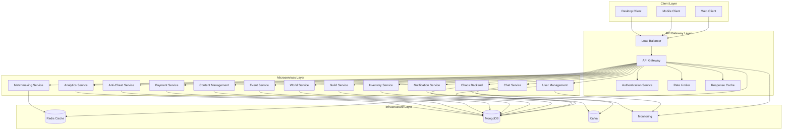

# API Gateway Architecture

## Overview
The API Gateway serves as the central entry point for all client requests in the Chaos World MMORPG backend system. It handles routing, authentication, rate limiting, load balancing, and request/response transformation.

## Architecture Diagram



## Core Components

### 1. **Request Router**
- **Purpose**: Routes incoming requests to appropriate microservices
- **Features**:
  - Path-based routing
  - Method-based routing
  - Header-based routing
  - Query parameter routing
  - Service discovery integration

### 2. **Authentication & Authorization**
- **Purpose**: Validates user identity and permissions
- **Features**:
  - JWT token validation
  - OAuth 2.0 integration
  - Role-based access control (RBAC)
  - API key authentication
  - Session management

### 3. **Rate Limiting**
- **Purpose**: Prevents abuse and ensures fair resource usage
- **Features**:
  - Per-user rate limiting
  - Per-IP rate limiting
  - Per-endpoint rate limiting
  - Burst handling
  - Sliding window algorithm

### 4. **Load Balancer**
- **Purpose**: Distributes traffic across multiple API Gateway instances
- **Features**:
  - Round-robin balancing
  - Least connections
  - Health check integration
  - Circuit breaker pattern
  - Failover handling

### 5. **Response Cache**
- **Purpose**: Improves performance by caching responses
- **Features**:
  - Redis-based caching
  - TTL management
  - Cache invalidation
  - Conditional caching
  - Cache warming

### 6. **Request/Response Transformation**
- **Purpose**: Adapts requests and responses between clients and services
- **Features**:
  - Protocol translation
  - Data format conversion
  - Header manipulation
  - Query parameter transformation
  - Response aggregation

## Technology Stack

### **Core Framework**
- **Rust + Axum**: High-performance web framework
- **Tokio**: Async runtime
- **Tower**: Middleware framework

### **Authentication**
- **JWT**: JSON Web Tokens
- **OAuth 2.0**: Authorization framework
- **Redis**: Session storage

### **Caching**
- **Redis**: Response caching
- **Moka**: In-memory caching

### **Monitoring**
- **Tracing**: Structured logging
- **Prometheus**: Metrics collection
- **Jaeger**: Distributed tracing

### **Configuration**
- **Serde**: Serialization/deserialization
- **Config**: Configuration management
- **Environment variables**: Runtime configuration

## Performance Characteristics

### **Throughput**
- **Target**: 100,000+ requests/second
- **Latency**: < 10ms p95
- **Concurrent connections**: 50,000+

### **Scalability**
- **Horizontal scaling**: Auto-scaling based on CPU/memory
- **Vertical scaling**: Up to 32 CPU cores, 128GB RAM
- **Load balancing**: Multiple instances behind load balancer

### **Reliability**
- **Uptime**: 99.9% SLA
- **Circuit breaker**: Automatic failure detection
- **Health checks**: Continuous service monitoring
- **Graceful degradation**: Fallback mechanisms

## Security Features

### **Authentication**
- JWT token validation
- OAuth 2.0 integration
- API key management
- Session management

### **Authorization**
- Role-based access control (RBAC)
- Permission-based access control
- Resource-level permissions
- Dynamic permission evaluation

### **Rate Limiting**
- Per-user rate limiting
- Per-IP rate limiting
- Per-endpoint rate limiting
- Burst handling

### **Security Headers**
- CORS configuration
- CSRF protection
- XSS prevention
- Content Security Policy (CSP)

### **Request Validation**
- Input sanitization
- Schema validation
- Size limits
- Malicious request detection

## Monitoring & Observability

### **Metrics**
- Request count and rate
- Response time percentiles
- Error rates
- Cache hit/miss ratios
- Authentication success/failure rates

### **Logging**
- Structured JSON logging
- Request/response logging
- Error logging
- Security event logging
- Audit trail

### **Tracing**
- Distributed tracing
- Request correlation IDs
- Service dependency mapping
- Performance bottleneck identification

### **Health Checks**
- Liveness probes
- Readiness probes
- Dependency health checks
- Circuit breaker status

## Configuration Management

### **Environment-based Configuration**
- Development
- Staging
- Production

### **Dynamic Configuration**
- Runtime configuration updates
- Feature flags
- A/B testing support
- Gradual rollout

### **Secrets Management**
- Environment variables
- Kubernetes secrets
- HashiCorp Vault integration
- Encrypted configuration

## Deployment Architecture

### **Containerization**
- Docker containers
- Multi-stage builds
- Optimized image size
- Security scanning

### **Orchestration**
- Kubernetes deployment
- Horizontal Pod Autoscaler (HPA)
- Service mesh integration
- Rolling updates

### **Networking**
- Load balancer configuration
- SSL/TLS termination
- Network policies
- Service discovery

## Development Guidelines

### **Code Organization**
```
src/
├── main.rs                 # Application entry point
├── config/                 # Configuration management
├── handlers/               # HTTP request handlers
├── middleware/             # Custom middleware
├── services/               # Business logic services
├── models/                 # Data models
├── utils/                  # Utility functions
└── tests/                  # Test modules
```

### **Testing Strategy**
- Unit tests for individual components
- Integration tests for API endpoints
- Load testing for performance validation
- Security testing for vulnerability assessment

### **Code Quality**
- Rust clippy for code quality
- Rustfmt for code formatting
- Cargo audit for security vulnerabilities
- Performance profiling

## Future Enhancements

### **Planned Features**
- GraphQL support
- WebSocket support
- gRPC integration
- Advanced caching strategies
- Machine learning-based rate limiting

### **Performance Optimizations**
- Connection pooling
- Request batching
- Response compression
- CDN integration

### **Security Enhancements**
- Advanced threat detection
- Behavioral analysis
- Automated security scanning
- Compliance reporting
