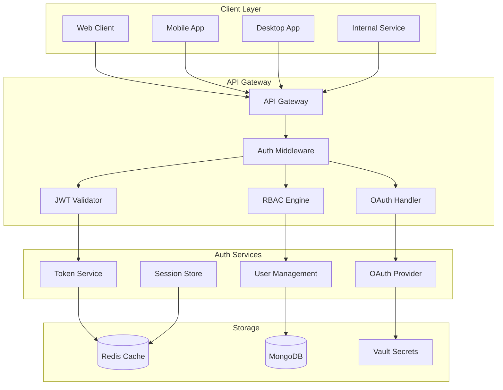
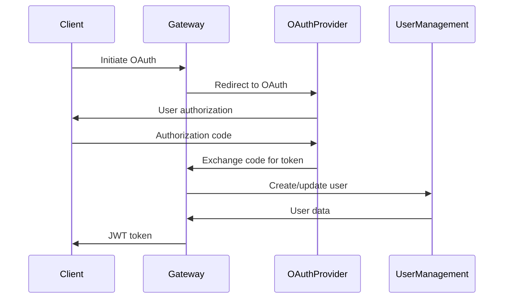

# Authentication & Authorization Design

## Overview
This document outlines the comprehensive authentication and authorization system for the Chaos World API Gateway, including JWT tokens, OAuth 2.0, role-based access control, and security policies.

## Authentication Architecture



## Authentication Methods

### 1. **JWT Bearer Token (Primary)**

#### Token Structure
```json
{
  "header": {
    "alg": "RS256",
    "typ": "JWT",
    "kid": "chaos-world-2024"
  },
  "payload": {
    "sub": "user_123456",
    "iss": "chaos-world-api",
    "aud": "chaos-world-client",
    "exp": 1640995200,
    "iat": 1640908800,
    "nbf": 1640908800,
    "jti": "jwt_789012",
    "roles": ["player", "premium"],
    "permissions": ["game:play", "inventory:manage"],
    "actor_id": "actor_789",
    "guild_id": "guild_456",
    "session_id": "session_abc123"
  }
}
```

#### Token Validation Process
1. **Extract Token**: From `Authorization: Bearer <token>` header
2. **Verify Signature**: Using RSA public key
3. **Check Expiration**: Validate `exp` claim
4. **Validate Audience**: Ensure `aud` matches expected value
5. **Check Issuer**: Verify `iss` claim
6. **Validate Not Before**: Check `nbf` claim
7. **Check JTI**: Prevent token reuse
8. **Load User Context**: Fetch additional user data

#### Token Refresh
```http
POST /api/v1/auth/refresh
Authorization: Bearer <refresh_token>
```

**Response:**
```json
{
  "access_token": "new_jwt_token",
  "refresh_token": "new_refresh_token",
  "expires_in": 3600,
  "token_type": "Bearer"
}
```

### 2. **API Key Authentication (Service-to-Service)**

#### API Key Format
```
chaos_sk_live_1234567890abcdef1234567890abcdef
chaos_sk_test_1234567890abcdef1234567890abcdef
```

#### API Key Validation
1. **Extract Key**: From `X-API-Key` header
2. **Validate Format**: Check prefix and length
3. **Lookup Key**: Query database for key details
4. **Check Status**: Verify key is active
5. **Validate Scope**: Check allowed services
6. **Rate Limit**: Apply service-specific limits

#### API Key Management
```http
POST /api/v1/auth/api-keys
Authorization: Bearer <admin_token>
Content-Type: application/json

{
  "name": "inventory-service",
  "description": "API key for inventory service",
  "scopes": ["inventory:read", "inventory:write"],
  "expires_at": "2024-12-31T23:59:59Z"
}
```

### 3. **OAuth 2.0 Integration**

#### Supported Providers
- **Google**: For social login
- **Discord**: For community integration
- **Steam**: For PC gaming integration
- **Apple**: For iOS integration

#### OAuth Flow


#### OAuth Configuration
```json
{
  "google": {
    "client_id": "google_client_id",
    "client_secret": "google_client_secret",
    "redirect_uri": "https://api.chaosworld.com/auth/google/callback",
    "scopes": ["openid", "email", "profile"]
  },
  "discord": {
    "client_id": "discord_client_id",
    "client_secret": "discord_client_secret",
    "redirect_uri": "https://api.chaosworld.com/auth/discord/callback",
    "scopes": ["identify", "email"]
  }
}
```

## Authorization System

### 1. **Role-Based Access Control (RBAC)**

#### Role Hierarchy
```
Super Admin
├── Admin
│   ├── Moderator
│   └── Support
├── Developer
│   └── Tester
└── Player
    ├── Premium Player
    ├── VIP Player
    └── Guild Leader
        └── Guild Member
```

#### Role Definitions
```json
{
  "super_admin": {
    "permissions": ["*"],
    "description": "Full system access"
  },
  "admin": {
    "permissions": [
      "users:manage",
      "content:manage",
      "analytics:view",
      "system:monitor"
    ],
    "description": "Administrative access"
  },
  "player": {
    "permissions": [
      "game:play",
      "inventory:manage",
      "chat:send",
      "guild:join"
    ],
    "description": "Basic player access"
  },
  "premium_player": {
    "permissions": [
      "game:play",
      "inventory:manage",
      "chat:send",
      "guild:join",
      "premium:features",
      "events:exclusive"
    ],
    "description": "Premium player access"
  }
}
```

### 2. **Permission-Based Access Control (PBAC)**

#### Permission Structure
```
resource:action:scope
```

**Examples:**
- `game:play:world` - Play in world
- `inventory:read:own` - Read own inventory
- `guild:manage:own` - Manage own guild
- `admin:users:all` - Manage all users

#### Permission Evaluation
```rust
pub struct Permission {
    pub resource: String,
    pub action: String,
    pub scope: String,
}

pub fn has_permission(
    user_permissions: &[Permission],
    required_permission: &Permission
) -> bool {
    // Check exact match
    if user_permissions.contains(required_permission) {
        return true;
    }
    
    // Check wildcard permissions
    for permission in user_permissions {
        if permission.resource == "*" || 
           (permission.resource == required_permission.resource && 
            permission.action == "*") {
            return true;
        }
    }
    
    false
}
```

### 3. **Resource-Based Authorization**

#### Actor Ownership
```rust
pub struct ActorOwnership {
    pub actor_id: String,
    pub owner_id: String,
    pub guild_id: Option<String>,
    pub permissions: Vec<String>,
}

pub fn can_access_actor(
    user_id: &str,
    actor_id: &str,
    action: &str
) -> bool {
    // Check direct ownership
    if is_actor_owner(user_id, actor_id) {
        return true;
    }
    
    // Check guild membership
    if let Some(guild_id) = get_actor_guild(actor_id) {
        if is_guild_member(user_id, guild_id) {
            return check_guild_permissions(user_id, guild_id, action);
        }
    }
    
    false
}
```

#### Guild Permissions
```json
{
  "guild_leader": {
    "permissions": [
      "guild:manage",
      "guild:invite",
      "guild:kick",
      "guild:promote"
    ]
  },
  "guild_officer": {
    "permissions": [
      "guild:invite",
      "guild:kick",
      "guild:manage_events"
    ]
  },
  "guild_member": {
    "permissions": [
      "guild:chat",
      "guild:view_roster"
    ]
  }
}
```

## Security Policies

### 1. **Password Security**

#### Password Requirements
- **Minimum Length**: 12 characters
- **Character Types**: Uppercase, lowercase, numbers, symbols
- **Common Passwords**: Blocked using haveibeenpwned API
- **Password History**: Last 5 passwords cannot be reused

#### Password Hashing
```rust
use argon2::{Argon2, PasswordHasher, PasswordVerifier};
use argon2::password_hash::{PasswordHash, SaltString};

pub fn hash_password(password: &str) -> Result<String, AuthError> {
    let salt = SaltString::generate(&mut OsRng);
    let argon2 = Argon2::default();
    
    let password_hash = argon2
        .hash_password(password.as_bytes(), &salt)
        .map_err(|_| AuthError::HashingFailed)?;
    
    Ok(password_hash.to_string())
}
```

### 2. **Session Management**

#### Session Configuration
```json
{
  "session_duration": "24h",
  "refresh_token_duration": "30d",
  "max_concurrent_sessions": 5,
  "idle_timeout": "2h",
  "secure_cookies": true,
  "http_only": true,
  "same_site": "strict"
}
```

#### Session Storage
```rust
pub struct Session {
    pub session_id: String,
    pub user_id: String,
    pub created_at: DateTime<Utc>,
    pub expires_at: DateTime<Utc>,
    pub last_activity: DateTime<Utc>,
    pub ip_address: String,
    pub user_agent: String,
    pub is_active: bool,
}
```

### 3. **Rate Limiting**

#### Rate Limit Tiers
```json
{
  "unauthenticated": {
    "requests_per_minute": 10,
    "burst_limit": 20
  },
  "authenticated": {
    "requests_per_minute": 100,
    "burst_limit": 200
  },
  "premium": {
    "requests_per_minute": 1000,
    "burst_limit": 2000
  },
  "api_key": {
    "requests_per_minute": 10000,
    "burst_limit": 20000
  }
}
```

#### Rate Limit Implementation
```rust
pub struct RateLimiter {
    redis: RedisClient,
    window_size: Duration,
    max_requests: u32,
}

impl RateLimiter {
    pub async fn check_rate_limit(
        &self,
        key: &str,
        identifier: &str
    ) -> Result<RateLimitResult, RateLimitError> {
        let redis_key = format!("rate_limit:{}:{}", key, identifier);
        let current = self.redis.incr(&redis_key, 1).await?;
        
        if current == 1 {
            self.redis.expire(&redis_key, self.window_size).await?;
        }
        
        if current > self.max_requests {
            Ok(RateLimitResult::Exceeded {
                limit: self.max_requests,
                remaining: 0,
                reset_time: self.get_reset_time().await?,
            })
        } else {
            Ok(RateLimitResult::Allowed {
                limit: self.max_requests,
                remaining: self.max_requests - current,
                reset_time: self.get_reset_time().await?,
            })
        }
    }
}
```

### 4. **Security Headers**

#### Required Headers
```http
Strict-Transport-Security: max-age=31536000; includeSubDomains
X-Content-Type-Options: nosniff
X-Frame-Options: DENY
X-XSS-Protection: 1; mode=block
Content-Security-Policy: default-src 'self'; script-src 'self' 'unsafe-inline'
Referrer-Policy: strict-origin-when-cross-origin
Permissions-Policy: geolocation=(), microphone=(), camera=()
```

#### CORS Configuration
```json
{
  "allowed_origins": [
    "https://chaosworld.com",
    "https://app.chaosworld.com",
    "https://staging.chaosworld.com"
  ],
  "allowed_methods": ["GET", "POST", "PUT", "DELETE", "OPTIONS"],
  "allowed_headers": [
    "Authorization",
    "Content-Type",
    "X-API-Key",
    "X-Client-ID"
  ],
  "exposed_headers": ["X-RateLimit-Limit", "X-RateLimit-Remaining"],
  "max_age": 86400,
  "credentials": true
}
```

## Implementation Details

### 1. **Authentication Middleware**

```rust
pub struct AuthMiddleware {
    jwt_validator: JWTValidator,
    rbac_engine: RBACEngine,
    rate_limiter: RateLimiter,
}

impl AuthMiddleware {
    pub async fn authenticate(
        &self,
        request: &mut Request<Body>
    ) -> Result<AuthContext, AuthError> {
        // Extract token
        let token = self.extract_token(request)?;
        
        // Validate token
        let claims = self.jwt_validator.validate(&token).await?;
        
        // Check permissions
        let permissions = self.rbac_engine.get_permissions(&claims.sub).await?;
        
        // Apply rate limiting
        self.rate_limiter.check_rate_limit(
            "authenticated",
            &claims.sub
        ).await?;
        
        Ok(AuthContext {
            user_id: claims.sub,
            roles: claims.roles,
            permissions,
            actor_id: claims.actor_id,
            guild_id: claims.guild_id,
        })
    }
}
```

### 2. **Authorization Decorator**

```rust
#[derive(Debug)]
pub struct RequirePermission {
    pub resource: String,
    pub action: String,
    pub scope: Option<String>,
}

impl RequirePermission {
    pub fn new(resource: &str, action: &str) -> Self {
        Self {
            resource: resource.to_string(),
            action: action.to_string(),
            scope: None,
        }
    }
    
    pub fn with_scope(mut self, scope: &str) -> Self {
        self.scope = Some(scope.to_string());
        self
    }
}

// Usage in handlers
#[get("/api/v1/inventory")]
#[require_permission("inventory", "read", "own")]
async fn get_inventory(
    auth: AuthContext,
    Path(actor_id): Path<String>
) -> Result<Json<Inventory>, ApiError> {
    // Handler implementation
}
```

### 3. **Token Refresh Logic**

```rust
pub struct TokenService {
    jwt_signer: JWTSigner,
    refresh_token_store: RefreshTokenStore,
    user_service: UserService,
}

impl TokenService {
    pub async fn refresh_token(
        &self,
        refresh_token: &str
    ) -> Result<TokenResponse, AuthError> {
        // Validate refresh token
        let token_data = self.refresh_token_store.get(refresh_token).await?;
        
        // Check if token is still valid
        if token_data.expires_at < Utc::now() {
            return Err(AuthError::TokenExpired);
        }
        
        // Get user data
        let user = self.user_service.get_by_id(&token_data.user_id).await?;
        
        // Generate new tokens
        let access_token = self.jwt_signer.sign(&user).await?;
        let new_refresh_token = self.refresh_token_store.create(&user.id).await?;
        
        // Revoke old refresh token
        self.refresh_token_store.revoke(refresh_token).await?;
        
        Ok(TokenResponse {
            access_token,
            refresh_token: new_refresh_token,
            expires_in: 3600,
            token_type: "Bearer".to_string(),
        })
    }
}
```

## Security Monitoring

### 1. **Audit Logging**

```rust
#[derive(Debug, Serialize)]
pub struct AuthAuditLog {
    pub timestamp: DateTime<Utc>,
    pub user_id: Option<String>,
    pub action: String,
    pub resource: String,
    pub ip_address: String,
    pub user_agent: String,
    pub success: bool,
    pub error_message: Option<String>,
    pub request_id: String,
}

pub struct AuditLogger {
    logger: Logger,
    storage: AuditStorage,
}

impl AuditLogger {
    pub async fn log_auth_event(
        &self,
        event: AuthAuditLog
    ) -> Result<(), AuditError> {
        // Log to structured logger
        self.logger.info("auth_event", &event);
        
        // Store in audit database
        self.storage.store_auth_event(event).await?;
        
        Ok(())
    }
}
```

### 2. **Security Alerts**

```rust
pub struct SecurityMonitor {
    alert_service: AlertService,
    anomaly_detector: AnomalyDetector,
}

impl SecurityMonitor {
    pub async fn monitor_auth_events(
        &self,
        event: &AuthAuditLog
    ) -> Result<(), MonitorError> {
        // Check for suspicious patterns
        if self.anomaly_detector.is_suspicious(event).await? {
            self.alert_service.send_alert(
                SecurityAlert::SuspiciousActivity {
                    user_id: event.user_id.clone(),
                    pattern: "multiple_failed_logins".to_string(),
                    severity: AlertSeverity::High,
                }
            ).await?;
        }
        
        Ok(())
    }
}
```

## Testing

### 1. **Unit Tests**

```rust
#[cfg(test)]
mod tests {
    use super::*;
    
    #[tokio::test]
    async fn test_jwt_validation() {
        let validator = JWTValidator::new("test_secret");
        let token = create_test_token();
        
        let result = validator.validate(&token).await;
        assert!(result.is_ok());
    }
    
    #[tokio::test]
    async fn test_permission_check() {
        let rbac = RBACEngine::new();
        let user_permissions = vec![
            Permission::new("inventory", "read", "own"),
            Permission::new("game", "play", "*"),
        ];
        
        assert!(rbac.has_permission(
            &user_permissions,
            &Permission::new("inventory", "read", "own")
        ));
        
        assert!(!rbac.has_permission(
            &user_permissions,
            &Permission::new("admin", "manage", "*")
        ));
    }
}
```

### 2. **Integration Tests**

```rust
#[tokio::test]
async fn test_auth_flow() {
    let app = create_test_app().await;
    
    // Test registration
    let response = app
        .post("/api/v1/users/register")
        .json(&RegisterRequest {
            username: "testuser".to_string(),
            email: "test@example.com".to_string(),
            password: "secure_password".to_string(),
        })
        .send()
        .await;
    
    assert_eq!(response.status(), 200);
    
    // Test login
    let response = app
        .post("/api/v1/users/login")
        .json(&LoginRequest {
            username: "testuser".to_string(),
            password: "secure_password".to_string(),
        })
        .send()
        .await;
    
    assert_eq!(response.status(), 200);
    let token: TokenResponse = response.json().await.unwrap();
    assert!(!token.access_token.is_empty());
}
```

## Deployment Considerations

### 1. **Secret Management**

```yaml
# Kubernetes Secret
apiVersion: v1
kind: Secret
metadata:
  name: auth-secrets
type: Opaque
data:
  jwt-secret: <base64-encoded-secret>
  oauth-google-secret: <base64-encoded-secret>
  oauth-discord-secret: <base64-encoded-secret>
```

### 2. **Environment Configuration**

```yaml
# config.yaml
auth:
  jwt:
    secret: "${JWT_SECRET}"
    algorithm: "RS256"
    access_token_ttl: "1h"
    refresh_token_ttl: "30d"
  
  oauth:
    google:
      client_id: "${GOOGLE_CLIENT_ID}"
      client_secret: "${GOOGLE_CLIENT_SECRET}"
    
  rate_limiting:
    redis_url: "${REDIS_URL}"
    default_limit: 100
    burst_limit: 200
```

### 3. **Health Checks**

```rust
pub async fn auth_health_check() -> Result<Json<HealthStatus>, ApiError> {
    let checks = vec![
        ("jwt_validator", jwt_validator.health_check().await),
        ("rbac_engine", rbac_engine.health_check().await),
        ("rate_limiter", rate_limiter.health_check().await),
    ];
    
    let status = HealthStatus {
        status: "healthy",
        checks: checks.into_iter()
            .map(|(name, result)| (name.to_string(), result.is_ok()))
            .collect(),
    };
    
    Ok(Json(status))
}
```

This comprehensive authentication and authorization system provides robust security for the Chaos World API Gateway while maintaining excellent performance and user experience.
