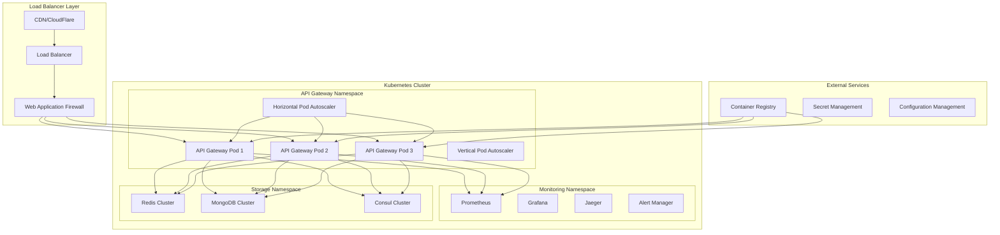

# Deployment & Scaling Documentation

## Overview
This document provides comprehensive guidance for deploying and scaling the Chaos World API Gateway, including containerization, orchestration, auto-scaling, and production deployment strategies.

## Deployment Architecture



## Containerization

### 1. **Dockerfile**

#### Multi-stage Dockerfile
```dockerfile
# Build stage
FROM rust:1.70-slim as builder

# Install system dependencies
RUN apt-get update && apt-get install -y \
    pkg-config \
    libssl-dev \
    ca-certificates \
    && rm -rf /var/lib/apt/lists/*

# Set working directory
WORKDIR /app

# Copy manifests
COPY Cargo.toml Cargo.lock ./

# Copy source code
COPY src ./src

# Build the application
RUN cargo build --release

# Runtime stage
FROM debian:bullseye-slim

# Install runtime dependencies
RUN apt-get update && apt-get install -y \
    ca-certificates \
    libssl1.1 \
    && rm -rf /var/lib/apt/lists/*

# Create non-root user
RUN groupadd -r appuser && useradd -r -g appuser appuser

# Set working directory
WORKDIR /app

# Copy binary from builder stage
COPY --from=builder /app/target/release/api-gateway /app/api-gateway

# Copy configuration files
COPY configs/ ./configs/

# Change ownership
RUN chown -R appuser:appuser /app

# Switch to non-root user
USER appuser

# Expose port
EXPOSE 8080

# Health check
HEALTHCHECK --interval=30s --timeout=3s --start-period=5s --retries=3 \
    CMD curl -f http://localhost:8080/health || exit 1

# Run the application
CMD ["./api-gateway"]
```

### 2. **Docker Compose**

#### Development Environment
```yaml
# docker-compose.yml
version: '3.8'

services:
  api-gateway:
    build: .
    ports:
      - "8080:8080"
    environment:
      - RUST_LOG=debug
      - CONSUL_URL=http://consul:8500
      - REDIS_URL=redis://redis:6379
      - MONGODB_URL=mongodb://mongodb:27017
    depends_on:
      - consul
      - redis
      - mongodb
    volumes:
      - ./configs:/app/configs
    networks:
      - chaos-world

  consul:
    image: consul:1.15
    ports:
      - "8500:8500"
    command: consul agent -dev -ui -client=0.0.0.0
    networks:
      - chaos-world

  redis:
    image: redis:7.0-alpine
    ports:
      - "6379:6379"
    command: redis-server --appendonly yes
    volumes:
      - redis_data:/data
    networks:
      - chaos-world

  mongodb:
    image: mongo:7.0
    ports:
      - "27017:27017"
    environment:
      - MONGO_INITDB_ROOT_USERNAME=admin
      - MONGO_INITDB_ROOT_PASSWORD=password
    volumes:
      - mongodb_data:/data/db
    networks:
      - chaos-world

  prometheus:
    image: prom/prometheus:latest
    ports:
      - "9090:9090"
    volumes:
      - ./monitoring/prometheus.yml:/etc/prometheus/prometheus.yml
    networks:
      - chaos-world

  grafana:
    image: grafana/grafana:latest
    ports:
      - "3000:3000"
    environment:
      - GF_SECURITY_ADMIN_PASSWORD=admin
    volumes:
      - grafana_data:/var/lib/grafana
    networks:
      - chaos-world

volumes:
  redis_data:
  mongodb_data:
  grafana_data:

networks:
  chaos-world:
    driver: bridge
```

## Kubernetes Deployment

### 1. **Namespace Configuration**

#### API Gateway Namespace
```yaml
# namespace.yaml
apiVersion: v1
kind: Namespace
metadata:
  name: api-gateway
  labels:
    name: api-gateway
    environment: production
```

### 2. **ConfigMap and Secrets**

#### Configuration
```yaml
# configmap.yaml
apiVersion: v1
kind: ConfigMap
metadata:
  name: api-gateway-config
  namespace: api-gateway
data:
  config.yaml: |
    server:
      host: "0.0.0.0"
      port: 8080
      workers: 4
    
    logging:
      level: "info"
      format: "json"
    
    metrics:
      enabled: true
      path: "/metrics"
    
    rate_limiting:
      enabled: true
      redis_url: "redis://redis:6379"
    
    service_discovery:
      consul_url: "http://consul:8500"
      datacenter: "chaos-world"
    
    health_check:
      enabled: true
      path: "/health"
      interval: "30s"
      timeout: "5s"
```

#### Secrets
```yaml
# secrets.yaml
apiVersion: v1
kind: Secret
metadata:
  name: api-gateway-secrets
  namespace: api-gateway
type: Opaque
data:
  jwt-secret: <base64-encoded-secret>
  consul-token: <base64-encoded-token>
  mongodb-password: <base64-encoded-password>
  redis-password: <base64-encoded-password>
```

### 3. **Deployment Configuration**

#### API Gateway Deployment
```yaml
# deployment.yaml
apiVersion: apps/v1
kind: Deployment
metadata:
  name: api-gateway
  namespace: api-gateway
  labels:
    app: api-gateway
    version: v1
spec:
  replicas: 3
  selector:
    matchLabels:
      app: api-gateway
  template:
    metadata:
      labels:
        app: api-gateway
        version: v1
      annotations:
        prometheus.io/scrape: "true"
        prometheus.io/port: "8080"
        prometheus.io/path: "/metrics"
    spec:
      containers:
      - name: api-gateway
        image: chaos-world/api-gateway:latest
        ports:
        - containerPort: 8080
          name: http
        env:
        - name: RUST_LOG
          value: "info"
        - name: CONSUL_URL
          value: "http://consul:8500"
        - name: REDIS_URL
          value: "redis://redis:6379"
        - name: MONGODB_URL
          value: "mongodb://mongodb:27017"
        - name: JWT_SECRET
          valueFrom:
            secretKeyRef:
              name: api-gateway-secrets
              key: jwt-secret
        resources:
          requests:
            memory: "512Mi"
            cpu: "250m"
          limits:
            memory: "1Gi"
            cpu: "500m"
        livenessProbe:
          httpGet:
            path: /health
            port: 8080
          initialDelaySeconds: 30
          periodSeconds: 10
          timeoutSeconds: 5
          failureThreshold: 3
        readinessProbe:
          httpGet:
            path: /ready
            port: 8080
          initialDelaySeconds: 5
          periodSeconds: 5
          timeoutSeconds: 3
          failureThreshold: 3
        volumeMounts:
        - name: config
          mountPath: /app/configs
          readOnly: true
      volumes:
      - name: config
        configMap:
          name: api-gateway-config
      nodeSelector:
        kubernetes.io/os: linux
      tolerations:
      - key: "node-role.kubernetes.io/master"
        operator: "Exists"
        effect: "NoSchedule"
```

### 4. **Service Configuration**

#### API Gateway Service
```yaml
# service.yaml
apiVersion: v1
kind: Service
metadata:
  name: api-gateway
  namespace: api-gateway
  labels:
    app: api-gateway
spec:
  selector:
    app: api-gateway
  ports:
  - name: http
    port: 80
    targetPort: 8080
    protocol: TCP
  type: ClusterIP
---
apiVersion: v1
kind: Service
metadata:
  name: api-gateway-headless
  namespace: api-gateway
  labels:
    app: api-gateway
spec:
  selector:
    app: api-gateway
  ports:
  - name: http
    port: 8080
    targetPort: 8080
    protocol: TCP
  clusterIP: None
```

### 5. **Ingress Configuration**

#### Ingress Resource
```yaml
# ingress.yaml
apiVersion: networking.k8s.io/v1
kind: Ingress
metadata:
  name: api-gateway
  namespace: api-gateway
  annotations:
    kubernetes.io/ingress.class: "nginx"
    nginx.ingress.kubernetes.io/ssl-redirect: "true"
    nginx.ingress.kubernetes.io/force-ssl-redirect: "true"
    nginx.ingress.kubernetes.io/rate-limit: "100"
    nginx.ingress.kubernetes.io/rate-limit-window: "1m"
    cert-manager.io/cluster-issuer: "letsencrypt-prod"
spec:
  tls:
  - hosts:
    - api.chaosworld.com
    secretName: api-gateway-tls
  rules:
  - host: api.chaosworld.com
    http:
      paths:
      - path: /
        pathType: Prefix
        backend:
          service:
            name: api-gateway
            port:
              number: 80
```

## Auto-scaling Configuration

### 1. **Horizontal Pod Autoscaler**

#### HPA Configuration
```yaml
# hpa.yaml
apiVersion: autoscaling/v2
kind: HorizontalPodAutoscaler
metadata:
  name: api-gateway-hpa
  namespace: api-gateway
spec:
  scaleTargetRef:
    apiVersion: apps/v1
    kind: Deployment
    name: api-gateway
  minReplicas: 3
  maxReplicas: 20
  metrics:
  - type: Resource
    resource:
      name: cpu
      target:
        type: Utilization
        averageUtilization: 70
  - type: Resource
    resource:
      name: memory
      target:
        type: Utilization
        averageUtilization: 80
  - type: Pods
    pods:
      metric:
        name: api_gateway_requests_per_second
      target:
        type: AverageValue
        averageValue: "100"
  behavior:
    scaleUp:
      stabilizationWindowSeconds: 60
      policies:
      - type: Percent
        value: 100
        periodSeconds: 15
      - type: Pods
        value: 4
        periodSeconds: 15
      selectPolicy: Max
    scaleDown:
      stabilizationWindowSeconds: 300
      policies:
      - type: Percent
        value: 10
        periodSeconds: 60
      selectPolicy: Min
```

### 2. **Vertical Pod Autoscaler**

#### VPA Configuration
```yaml
# vpa.yaml
apiVersion: autoscaling.k8s.io/v1
kind: VerticalPodAutoscaler
metadata:
  name: api-gateway-vpa
  namespace: api-gateway
spec:
  targetRef:
    apiVersion: apps/v1
    kind: Deployment
    name: api-gateway
  updatePolicy:
    updateMode: "Auto"
  resourcePolicy:
    containerPolicies:
    - containerName: api-gateway
      minAllowed:
        cpu: 100m
        memory: 128Mi
      maxAllowed:
        cpu: 2
        memory: 4Gi
      controlledResources: ["cpu", "memory"]
```

### 3. **Custom Metrics**

#### Custom Metrics API
```yaml
# custom-metrics.yaml
apiVersion: v1
kind: Service
metadata:
  name: custom-metrics-api
  namespace: kube-system
spec:
  selector:
    app: custom-metrics-api
  ports:
  - port: 443
    targetPort: 6443
---
apiVersion: apps/v1
kind: Deployment
metadata:
  name: custom-metrics-api
  namespace: kube-system
spec:
  replicas: 1
  selector:
    matchLabels:
      app: custom-metrics-api
  template:
    metadata:
      labels:
        app: custom-metrics-api
    spec:
      containers:
      - name: custom-metrics-api
        image: directxman12/k8s-prometheus-adapter:latest
        args:
        - --prometheus-url=http://prometheus:9090
        - --metrics-relist-interval=1m
        - --v=10
        - --config=/etc/adapter/config.yaml
        ports:
        - containerPort: 6443
        volumeMounts:
        - name: config
          mountPath: /etc/adapter
      volumes:
      - name: config
        configMap:
          name: custom-metrics-config
```

## Production Deployment

### 1. **Production Environment Setup**

#### Production Values
```yaml
# values-production.yaml
replicaCount: 5

image:
  repository: chaos-world/api-gateway
  tag: "v1.0.0"
  pullPolicy: IfNotPresent

service:
  type: ClusterIP
  port: 80
  targetPort: 8080

ingress:
  enabled: true
  className: "nginx"
  annotations:
    nginx.ingress.kubernetes.io/ssl-redirect: "true"
    nginx.ingress.kubernetes.io/force-ssl-redirect: "true"
    nginx.ingress.kubernetes.io/rate-limit: "1000"
    nginx.ingress.kubernetes.io/rate-limit-window: "1m"
    cert-manager.io/cluster-issuer: "letsencrypt-prod"
  hosts:
    - host: api.chaosworld.com
      paths:
        - path: /
          pathType: Prefix
  tls:
    - secretName: api-gateway-tls
      hosts:
        - api.chaosworld.com

resources:
  requests:
    memory: "1Gi"
    cpu: "500m"
  limits:
    memory: "2Gi"
    cpu: "1000m"

autoscaling:
  enabled: true
  minReplicas: 5
  maxReplicas: 50
  targetCPUUtilizationPercentage: 70
  targetMemoryUtilizationPercentage: 80

nodeSelector:
  kubernetes.io/os: linux

tolerations:
  - key: "node-role.kubernetes.io/master"
    operator: "Exists"
    effect: "NoSchedule"

affinity:
  podAntiAffinity:
    preferredDuringSchedulingIgnoredDuringExecution:
    - weight: 100
      podAffinityTerm:
        labelSelector:
          matchExpressions:
          - key: app
            operator: In
            values:
            - api-gateway
        topologyKey: kubernetes.io/hostname
```

### 2. **Blue-Green Deployment**

#### Blue-Green Strategy
```yaml
# blue-green-deployment.yaml
apiVersion: argoproj.io/v1alpha1
kind: Rollout
metadata:
  name: api-gateway-rollout
  namespace: api-gateway
spec:
  replicas: 5
  strategy:
    blueGreen:
      activeService: api-gateway-active
      previewService: api-gateway-preview
      autoPromotionEnabled: false
      scaleDownDelaySeconds: 30
      prePromotionAnalysis:
        templates:
        - templateName: success-rate
        args:
        - name: service-name
          value: api-gateway-preview
      postPromotionAnalysis:
        templates:
        - templateName: success-rate
        args:
        - name: service-name
          value: api-gateway-active
  selector:
    matchLabels:
      app: api-gateway
  template:
    metadata:
      labels:
        app: api-gateway
    spec:
      containers:
      - name: api-gateway
        image: chaos-world/api-gateway:latest
        ports:
        - containerPort: 8080
        resources:
          requests:
            memory: "1Gi"
            cpu: "500m"
          limits:
            memory: "2Gi"
            cpu: "1000m"
```

### 3. **Canary Deployment**

#### Canary Strategy
```yaml
# canary-deployment.yaml
apiVersion: argoproj.io/v1alpha1
kind: Rollout
metadata:
  name: api-gateway-canary
  namespace: api-gateway
spec:
  replicas: 5
  strategy:
    canary:
      steps:
      - setWeight: 20
      - pause: {duration: 10m}
      - setWeight: 40
      - pause: {duration: 10m}
      - setWeight: 60
      - pause: {duration: 10m}
      - setWeight: 80
      - pause: {duration: 10m}
      analysis:
        templates:
        - templateName: success-rate
        args:
        - name: service-name
          value: api-gateway
        startingStep: 2
        successfulRunHistoryLimit: 3
        unsuccessfulRunHistoryLimit: 3
  selector:
    matchLabels:
      app: api-gateway
  template:
    metadata:
      labels:
        app: api-gateway
    spec:
      containers:
      - name: api-gateway
        image: chaos-world/api-gateway:latest
        ports:
        - containerPort: 8080
```

## Monitoring and Alerting

### 1. **Prometheus Configuration**

#### Prometheus Rules
```yaml
# prometheus-rules.yaml
apiVersion: monitoring.coreos.com/v1
kind: PrometheusRule
metadata:
  name: api-gateway-rules
  namespace: api-gateway
spec:
  groups:
  - name: api-gateway
    rules:
    - alert: HighErrorRate
      expr: rate(api_gateway_requests_failed_total[5m]) / rate(api_gateway_requests_total[5m]) > 0.05
      for: 2m
      labels:
        severity: warning
      annotations:
        summary: "High error rate detected"
        description: "Error rate is {{ $value | humanizePercentage }} for the last 5 minutes"
    
    - alert: HighResponseTime
      expr: histogram_quantile(0.95, rate(api_gateway_request_duration_seconds_bucket[5m])) > 1.0
      for: 3m
      labels:
        severity: warning
      annotations:
        summary: "High response time detected"
        description: "95th percentile response time is {{ $value }}s"
    
    - alert: PodCrashLooping
      expr: rate(kube_pod_container_status_restarts_total[15m]) > 0
      for: 5m
      labels:
        severity: critical
      annotations:
        summary: "Pod is crash looping"
        description: "Pod {{ $labels.pod }} is restarting frequently"
```

### 2. **Grafana Dashboard**

#### Dashboard Configuration
```yaml
# grafana-dashboard.yaml
apiVersion: v1
kind: ConfigMap
metadata:
  name: api-gateway-dashboard
  namespace: api-gateway
  labels:
    grafana_dashboard: "1"
data:
  api-gateway.json: |
    {
      "dashboard": {
        "title": "API Gateway Overview",
        "panels": [
          {
            "title": "Request Rate",
            "type": "graph",
            "targets": [
              {
                "expr": "rate(api_gateway_requests_total[5m])",
                "legendFormat": "Requests/sec"
              }
            ]
          },
          {
            "title": "Response Time",
            "type": "graph",
            "targets": [
              {
                "expr": "histogram_quantile(0.95, rate(api_gateway_request_duration_seconds_bucket[5m]))",
                "legendFormat": "95th percentile"
              }
            ]
          }
        ]
      }
    }
```

## Security Configuration

### 1. **Network Policies**

#### Network Policy
```yaml
# network-policy.yaml
apiVersion: networking.k8s.io/v1
kind: NetworkPolicy
metadata:
  name: api-gateway-netpol
  namespace: api-gateway
spec:
  podSelector:
    matchLabels:
      app: api-gateway
  policyTypes:
  - Ingress
  - Egress
  ingress:
  - from:
    - namespaceSelector:
        matchLabels:
          name: ingress-nginx
    ports:
    - protocol: TCP
      port: 8080
  egress:
  - to:
    - namespaceSelector:
        matchLabels:
          name: consul
    ports:
    - protocol: TCP
      port: 8500
  - to:
    - namespaceSelector:
        matchLabels:
          name: redis
    ports:
    - protocol: TCP
      port: 6379
  - to:
    - namespaceSelector:
        matchLabels:
          name: mongodb
    ports:
    - protocol: TCP
      port: 27017
```

### 2. **Pod Security Policy**

#### Pod Security Policy
```yaml
# pod-security-policy.yaml
apiVersion: policy/v1beta1
kind: PodSecurityPolicy
metadata:
  name: api-gateway-psp
  namespace: api-gateway
spec:
  privileged: false
  allowPrivilegeEscalation: false
  requiredDropCapabilities:
    - ALL
  volumes:
    - 'configMap'
    - 'emptyDir'
    - 'projected'
    - 'secret'
    - 'downwardAPI'
    - 'persistentVolumeClaim'
  runAsUser:
    rule: 'MustRunAsNonRoot'
  seLinux:
    rule: 'RunAsAny'
  fsGroup:
    rule: 'RunAsAny'
```

## Disaster Recovery

### 1. **Backup Strategy**

#### Backup Configuration
```yaml
# backup.yaml
apiVersion: v1
kind: ConfigMap
metadata:
  name: backup-script
  namespace: api-gateway
data:
  backup.sh: |
    #!/bin/bash
    # Backup API Gateway configuration
    kubectl get configmap api-gateway-config -n api-gateway -o yaml > backup-configmap.yaml
    kubectl get secret api-gateway-secrets -n api-gateway -o yaml > backup-secrets.yaml
    kubectl get deployment api-gateway -n api-gateway -o yaml > backup-deployment.yaml
    
    # Upload to S3
    aws s3 cp backup-configmap.yaml s3://chaos-world-backups/api-gateway/
    aws s3 cp backup-secrets.yaml s3://chaos-world-backups/api-gateway/
    aws s3 cp backup-deployment.yaml s3://chaos-world-backups/api-gateway/
```

### 2. **Recovery Procedures**

#### Recovery Script
```bash
#!/bin/bash
# recovery.sh

# Restore from backup
aws s3 cp s3://chaos-world-backups/api-gateway/backup-configmap.yaml .
aws s3 cp s3://chaos-world-backups/api-gateway/backup-secrets.yaml .
aws s3 cp s3://chaos-world-backups/api-gateway/backup-deployment.yaml .

# Apply configurations
kubectl apply -f backup-configmap.yaml
kubectl apply -f backup-secrets.yaml
kubectl apply -f backup-deployment.yaml

# Verify deployment
kubectl get pods -n api-gateway
kubectl get svc -n api-gateway
kubectl get ingress -n api-gateway
```

## Performance Tuning

### 1. **Resource Optimization**

#### Resource Recommendations
```yaml
# resource-optimization.yaml
apiVersion: v1
kind: ConfigMap
metadata:
  name: resource-optimization
  namespace: api-gateway
data:
  recommendations: |
    # CPU Recommendations
    - Minimum: 250m per pod
    - Recommended: 500m per pod
    - Maximum: 1000m per pod
    
    # Memory Recommendations
    - Minimum: 512Mi per pod
    - Recommended: 1Gi per pod
    - Maximum: 2Gi per pod
    
    # Replica Recommendations
    - Minimum: 3 replicas
    - Recommended: 5 replicas
    - Maximum: 50 replicas
    
    # Scaling Thresholds
    - CPU: 70% utilization
    - Memory: 80% utilization
    - Requests per second: 100 per pod
```

### 2. **Performance Monitoring**

#### Performance Metrics
```yaml
# performance-metrics.yaml
apiVersion: v1
kind: ConfigMap
metadata:
  name: performance-metrics
  namespace: api-gateway
data:
  metrics.yaml: |
    performance_metrics:
      - name: "request_duration_p95"
        threshold: 1.0
        unit: "seconds"
      - name: "request_duration_p99"
        threshold: 2.0
        unit: "seconds"
      - name: "error_rate"
        threshold: 0.05
        unit: "percentage"
      - name: "throughput"
        threshold: 1000
        unit: "requests_per_second"
```

This comprehensive deployment and scaling documentation provides everything needed to deploy and scale the Chaos World API Gateway in production environments.
