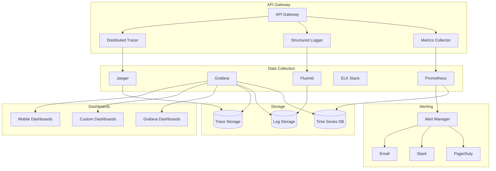

# Monitoring & Observability Setup

## Overview
This document defines the comprehensive monitoring and observability strategy for the Chaos World API Gateway, including metrics collection, logging, distributed tracing, alerting, and dashboard configuration.

## Observability Architecture



## Metrics Collection

### 1. **Core Metrics**

#### Application Metrics
```rust
use prometheus::{Counter, Histogram, Gauge, Registry, Opts, HistogramOpts, GaugeOpts};

pub struct APIGatewayMetrics {
    // Request metrics
    pub total_requests: Counter,
    pub successful_requests: Counter,
    pub failed_requests: Counter,
    pub request_duration: Histogram,
    pub request_size: Histogram,
    pub response_size: Histogram,
    
    // Authentication metrics
    pub auth_attempts: Counter,
    pub auth_successes: Counter,
    pub auth_failures: Counter,
    pub jwt_validations: Counter,
    pub jwt_validation_duration: Histogram,
    
    // Rate limiting metrics
    pub rate_limited_requests: Counter,
    pub rate_limit_violations: Counter,
    pub rate_limit_duration: Histogram,
    
    // Service discovery metrics
    pub service_discovery_requests: Counter,
    pub service_discovery_duration: Histogram,
    pub healthy_services: Gauge,
    pub unhealthy_services: Gauge,
    
    // Load balancing metrics
    pub load_balancer_requests: Counter,
    pub load_balancer_duration: Histogram,
    pub active_connections: Gauge,
    pub connection_errors: Counter,
    
    // Circuit breaker metrics
    pub circuit_breaker_opens: Counter,
    pub circuit_breaker_closes: Counter,
    pub circuit_breaker_half_opens: Counter,
    pub circuit_breaker_state: Gauge,
    
    // System metrics
    pub memory_usage: Gauge,
    pub cpu_usage: Gauge,
    pub thread_count: Gauge,
    pub gc_duration: Histogram,
}

impl APIGatewayMetrics {
    pub fn new(registry: &Registry) -> Result<Self, prometheus::Error> {
        Ok(Self {
            total_requests: Counter::new(
                "api_gateway_requests_total",
                "Total number of requests"
            )?,
            successful_requests: Counter::new(
                "api_gateway_requests_successful_total",
                "Total number of successful requests"
            )?,
            failed_requests: Counter::new(
                "api_gateway_requests_failed_total",
                "Total number of failed requests"
            )?,
            request_duration: Histogram::with_opts(
                HistogramOpts::new(
                    "api_gateway_request_duration_seconds",
                    "Request duration in seconds"
                )
                .buckets(vec![0.001, 0.005, 0.01, 0.025, 0.05, 0.1, 0.25, 0.5, 1.0, 2.5, 5.0, 10.0])
            )?,
            request_size: Histogram::with_opts(
                HistogramOpts::new(
                    "api_gateway_request_size_bytes",
                    "Request size in bytes"
                )
                .buckets(vec![100.0, 1000.0, 10000.0, 100000.0, 1000000.0])
            )?,
            response_size: Histogram::with_opts(
                HistogramOpts::new(
                    "api_gateway_response_size_bytes",
                    "Response size in bytes"
                )
                .buckets(vec![100.0, 1000.0, 10000.0, 100000.0, 1000000.0])
            )?,
            auth_attempts: Counter::new(
                "api_gateway_auth_attempts_total",
                "Total number of authentication attempts"
            )?,
            auth_successes: Counter::new(
                "api_gateway_auth_successes_total",
                "Total number of successful authentications"
            )?,
            auth_failures: Counter::new(
                "api_gateway_auth_failures_total",
                "Total number of failed authentications"
            )?,
            jwt_validations: Counter::new(
                "api_gateway_jwt_validations_total",
                "Total number of JWT validations"
            )?,
            jwt_validation_duration: Histogram::with_opts(
                HistogramOpts::new(
                    "api_gateway_jwt_validation_duration_seconds",
                    "JWT validation duration in seconds"
                )
                .buckets(vec![0.001, 0.005, 0.01, 0.025, 0.05, 0.1, 0.25, 0.5])
            )?,
            rate_limited_requests: Counter::new(
                "api_gateway_rate_limited_requests_total",
                "Total number of rate limited requests"
            )?,
            rate_limit_violations: Counter::new(
                "api_gateway_rate_limit_violations_total",
                "Total number of rate limit violations"
            )?,
            rate_limit_duration: Histogram::with_opts(
                HistogramOpts::new(
                    "api_gateway_rate_limit_duration_seconds",
                    "Rate limiting duration in seconds"
                )
                .buckets(vec![0.001, 0.005, 0.01, 0.025, 0.05, 0.1, 0.25, 0.5])
            )?,
            service_discovery_requests: Counter::new(
                "api_gateway_service_discovery_requests_total",
                "Total number of service discovery requests"
            )?,
            service_discovery_duration: Histogram::with_opts(
                HistogramOpts::new(
                    "api_gateway_service_discovery_duration_seconds",
                    "Service discovery duration in seconds"
                )
                .buckets(vec![0.001, 0.005, 0.01, 0.025, 0.05, 0.1, 0.25, 0.5, 1.0])
            )?,
            healthy_services: Gauge::new(
                "api_gateway_healthy_services",
                "Number of healthy services"
            )?,
            unhealthy_services: Gauge::new(
                "api_gateway_unhealthy_services",
                "Number of unhealthy services"
            )?,
            load_balancer_requests: Counter::new(
                "api_gateway_load_balancer_requests_total",
                "Total number of load balancer requests"
            )?,
            load_balancer_duration: Histogram::with_opts(
                HistogramOpts::new(
                    "api_gateway_load_balancer_duration_seconds",
                    "Load balancer duration in seconds"
                )
                .buckets(vec![0.001, 0.005, 0.01, 0.025, 0.05, 0.1, 0.25, 0.5])
            )?,
            active_connections: Gauge::new(
                "api_gateway_active_connections",
                "Number of active connections"
            )?,
            connection_errors: Counter::new(
                "api_gateway_connection_errors_total",
                "Total number of connection errors"
            )?,
            circuit_breaker_opens: Counter::new(
                "api_gateway_circuit_breaker_opens_total",
                "Total number of circuit breaker opens"
            )?,
            circuit_breaker_closes: Counter::new(
                "api_gateway_circuit_breaker_closes_total",
                "Total number of circuit breaker closes"
            )?,
            circuit_breaker_half_opens: Counter::new(
                "api_gateway_circuit_breaker_half_opens_total",
                "Total number of circuit breaker half opens"
            )?,
            circuit_breaker_state: Gauge::new(
                "api_gateway_circuit_breaker_state",
                "Circuit breaker state (0=closed, 1=open, 0.5=half-open)"
            )?,
            memory_usage: Gauge::new(
                "api_gateway_memory_usage_bytes",
                "Memory usage in bytes"
            )?,
            cpu_usage: Gauge::new(
                "api_gateway_cpu_usage_percent",
                "CPU usage percentage"
            )?,
            thread_count: Gauge::new(
                "api_gateway_thread_count",
                "Number of threads"
            )?,
            gc_duration: Histogram::with_opts(
                HistogramOpts::new(
                    "api_gateway_gc_duration_seconds",
                    "Garbage collection duration in seconds"
                )
                .buckets(vec![0.001, 0.005, 0.01, 0.025, 0.05, 0.1, 0.25, 0.5, 1.0])
            )?,
        })
    }
    
    pub fn register(&self, registry: &Registry) -> Result<(), prometheus::Error> {
        registry.register(Box::new(self.total_requests.clone()))?;
        registry.register(Box::new(self.successful_requests.clone()))?;
        registry.register(Box::new(self.failed_requests.clone()))?;
        registry.register(Box::new(self.request_duration.clone()))?;
        registry.register(Box::new(self.request_size.clone()))?;
        registry.register(Box::new(self.response_size.clone()))?;
        registry.register(Box::new(self.auth_attempts.clone()))?;
        registry.register(Box::new(self.auth_successes.clone()))?;
        registry.register(Box::new(self.auth_failures.clone()))?;
        registry.register(Box::new(self.jwt_validations.clone()))?;
        registry.register(Box::new(self.jwt_validation_duration.clone()))?;
        registry.register(Box::new(self.rate_limited_requests.clone()))?;
        registry.register(Box::new(self.rate_limit_violations.clone()))?;
        registry.register(Box::new(self.rate_limit_duration.clone()))?;
        registry.register(Box::new(self.service_discovery_requests.clone()))?;
        registry.register(Box::new(self.service_discovery_duration.clone()))?;
        registry.register(Box::new(self.healthy_services.clone()))?;
        registry.register(Box::new(self.unhealthy_services.clone()))?;
        registry.register(Box::new(self.load_balancer_requests.clone()))?;
        registry.register(Box::new(self.load_balancer_duration.clone()))?;
        registry.register(Box::new(self.active_connections.clone()))?;
        registry.register(Box::new(self.connection_errors.clone()))?;
        registry.register(Box::new(self.circuit_breaker_opens.clone()))?;
        registry.register(Box::new(self.circuit_breaker_closes.clone()))?;
        registry.register(Box::new(self.circuit_breaker_half_opens.clone()))?;
        registry.register(Box::new(self.circuit_breaker_state.clone()))?;
        registry.register(Box::new(self.memory_usage.clone()))?;
        registry.register(Box::new(self.cpu_usage.clone()))?;
        registry.register(Box::new(self.thread_count.clone()))?;
        registry.register(Box::new(self.gc_duration.clone()))?;
        Ok(())
    }
}
```

### 2. **Custom Metrics**

#### Business Metrics
```rust
pub struct BusinessMetrics {
    pub active_users: Gauge,
    pub premium_users: Gauge,
    pub api_usage_by_tier: Counter,
    pub revenue_metrics: Counter,
    pub feature_usage: Counter,
    pub error_rate_by_service: Counter,
    pub response_time_by_service: Histogram,
}

impl BusinessMetrics {
    pub fn new(registry: &Registry) -> Result<Self, prometheus::Error> {
        Ok(Self {
            active_users: Gauge::with_opts(
                GaugeOpts::new(
                    "api_gateway_active_users",
                    "Number of active users"
                )
                .const_label("tier", "all")
            )?,
            premium_users: Gauge::with_opts(
                GaugeOpts::new(
                    "api_gateway_premium_users",
                    "Number of premium users"
                )
                .const_label("tier", "premium")
            )?,
            api_usage_by_tier: Counter::with_opts(
                Opts::new(
                    "api_gateway_api_usage_by_tier_total",
                    "API usage by tier"
                )
                .variable_label("tier")
            )?,
            revenue_metrics: Counter::with_opts(
                Opts::new(
                    "api_gateway_revenue_total",
                    "Revenue metrics"
                )
                .variable_label("currency")
            )?,
            feature_usage: Counter::with_opts(
                Opts::new(
                    "api_gateway_feature_usage_total",
                    "Feature usage metrics"
                )
                .variable_label("feature")
            )?,
            error_rate_by_service: Counter::with_opts(
                Opts::new(
                    "api_gateway_error_rate_by_service_total",
                    "Error rate by service"
                )
                .variable_label("service")
            )?,
            response_time_by_service: Histogram::with_opts(
                HistogramOpts::new(
                    "api_gateway_response_time_by_service_seconds",
                    "Response time by service"
                )
                .variable_label("service")
                .buckets(vec![0.001, 0.005, 0.01, 0.025, 0.05, 0.1, 0.25, 0.5, 1.0, 2.5, 5.0])
            )?,
        })
    }
}
```

## Structured Logging

### 1. **Logging Configuration**

#### Logging Setup
```rust
use tracing::{info, warn, error, debug, trace};
use tracing_subscriber::{layer::SubscriberExt, util::SubscriberInitExt, EnvFilter, Registry};
use tracing_opentelemetry::OpenTelemetrySpanExt;

pub struct LoggingConfig {
    pub level: String,
    pub format: LogFormat,
    pub output: LogOutput,
    pub sampling: LogSampling,
}

#[derive(Debug, Clone)]
pub enum LogFormat {
    Json,
    Pretty,
    Compact,
}

#[derive(Debug, Clone)]
pub enum LogOutput {
    Stdout,
    File(String),
    Both(String),
}

#[derive(Debug, Clone)]
pub struct LogSampling {
    pub enabled: bool,
    pub rate: f64,
    pub burst: u32,
}

impl LoggingConfig {
    pub fn init(&self) -> Result<(), Box<dyn std::error::Error>> {
        let filter = EnvFilter::try_from_default_env()
            .unwrap_or_else(|_| EnvFilter::new(&self.level));
        
        let registry = Registry::default().with(filter);
        
        match self.format {
            LogFormat::Json => {
                let json_layer = tracing_subscriber::fmt::layer()
                    .json()
                    .with_current_span(true)
                    .with_span_list(true);
                
                registry.with(json_layer).init();
            }
            LogFormat::Pretty => {
                let pretty_layer = tracing_subscriber::fmt::layer()
                    .pretty()
                    .with_thread_ids(true)
                    .with_thread_names(true);
                
                registry.with(pretty_layer).init();
            }
            LogFormat::Compact => {
                let compact_layer = tracing_subscriber::fmt::layer()
                    .compact()
                    .with_thread_ids(true);
                
                registry.with(compact_layer).init();
            }
        }
        
        Ok(())
    }
}
```

### 2. **Structured Logging**

#### Request Logging
```rust
#[derive(Debug, Serialize)]
pub struct RequestLog {
    pub request_id: String,
    pub method: String,
    pub path: String,
    pub query: Option<String>,
    pub headers: HashMap<String, String>,
    pub user_id: Option<String>,
    pub ip_address: String,
    pub user_agent: Option<String>,
    pub timestamp: DateTime<Utc>,
    pub duration: Duration,
    pub status_code: u16,
    pub response_size: Option<usize>,
    pub error: Option<String>,
}

impl RequestLog {
    pub fn new(request: &Request<Body>) -> Self {
        Self {
            request_id: generate_request_id(),
            method: request.method().to_string(),
            path: request.uri().path().to_string(),
            query: request.uri().query().map(|q| q.to_string()),
            headers: extract_headers(request),
            user_id: extract_user_id(request),
            ip_address: extract_ip_address(request),
            user_agent: extract_user_agent(request),
            timestamp: Utc::now(),
            duration: Duration::ZERO,
            status_code: 0,
            response_size: None,
            error: None,
        }
    }
    
    pub fn log(&self) {
        info!(
            request_id = %self.request_id,
            method = %self.method,
            path = %self.path,
            query = ?self.query,
            user_id = ?self.user_id,
            ip_address = %self.ip_address,
            user_agent = ?self.user_agent,
            duration_ms = self.duration.as_millis(),
            status_code = self.status_code,
            response_size = ?self.response_size,
            error = ?self.error,
            "Request processed"
        );
    }
}
```

#### Error Logging
```rust
#[derive(Debug, Serialize)]
pub struct ErrorLog {
    pub error_id: String,
    pub error_type: String,
    pub error_message: String,
    pub stack_trace: Option<String>,
    pub context: HashMap<String, String>,
    pub request_id: Option<String>,
    pub user_id: Option<String>,
    pub timestamp: DateTime<Utc>,
    pub severity: ErrorSeverity,
}

#[derive(Debug, Serialize)]
pub enum ErrorSeverity {
    Low,
    Medium,
    High,
    Critical,
}

impl ErrorLog {
    pub fn new(error: &dyn std::error::Error, context: HashMap<String, String>) -> Self {
        Self {
            error_id: generate_error_id(),
            error_type: std::any::type_name_of_val(error).to_string(),
            error_message: error.to_string(),
            stack_trace: Some(format!("{:?}", error)),
            context,
            request_id: None,
            user_id: None,
            timestamp: Utc::now(),
            severity: ErrorSeverity::Medium,
        }
    }
    
    pub fn log(&self) {
        match self.severity {
            ErrorSeverity::Low => {
                debug!(
                    error_id = %self.error_id,
                    error_type = %self.error_type,
                    error_message = %self.error_message,
                    context = ?self.context,
                    request_id = ?self.request_id,
                    user_id = ?self.user_id,
                    "Error occurred"
                );
            }
            ErrorSeverity::Medium => {
                warn!(
                    error_id = %self.error_id,
                    error_type = %self.error_type,
                    error_message = %self.error_message,
                    context = ?self.context,
                    request_id = ?self.request_id,
                    user_id = ?self.user_id,
                    "Error occurred"
                );
            }
            ErrorSeverity::High => {
                error!(
                    error_id = %self.error_id,
                    error_type = %self.error_type,
                    error_message = %self.error_message,
                    stack_trace = ?self.stack_trace,
                    context = ?self.context,
                    request_id = ?self.request_id,
                    user_id = ?self.user_id,
                    "Error occurred"
                );
            }
            ErrorSeverity::Critical => {
                error!(
                    error_id = %self.error_id,
                    error_type = %self.error_type,
                    error_message = %self.error_message,
                    stack_trace = ?self.stack_trace,
                    context = ?self.context,
                    request_id = ?self.request_id,
                    user_id = ?self.user_id,
                    "CRITICAL ERROR OCCURRED"
                );
            }
        }
    }
}
```

## Distributed Tracing

### 1. **Tracing Setup**

#### OpenTelemetry Configuration
```rust
use opentelemetry::{global, sdk::Resource, KeyValue};
use opentelemetry_jaeger::JaegerExporter;
use opentelemetry_sdk::trace::{Tracer, TracerProvider};
use tracing_opentelemetry::OpenTelemetrySpanExt;

pub struct TracingConfig {
    pub service_name: String,
    pub service_version: String,
    pub jaeger_endpoint: String,
    pub sampling_rate: f64,
}

impl TracingConfig {
    pub fn init(&self) -> Result<Tracer, Box<dyn std::error::Error>> {
        let exporter = JaegerExporter::builder()
            .with_agent_endpoint(&self.jaeger_endpoint)
            .with_process(opentelemetry_jaeger::Process {
                service_name: self.service_name.clone(),
                tags: vec![
                    KeyValue::new("service.version", self.service_version.clone()),
                    KeyValue::new("service.environment", "production"),
                ],
            })
            .build()?;
        
        let tracer_provider = TracerProvider::builder()
            .with_batch_exporter(exporter, opentelemetry_sdk::runtime::Tokio)
            .with_resource(Resource::new(vec![
                KeyValue::new("service.name", self.service_name.clone()),
                KeyValue::new("service.version", self.service_version.clone()),
            ]))
            .with_sampler(opentelemetry_sdk::trace::Sampler::TraceIdRatioBased(self.sampling_rate))
            .build();
        
        let tracer = tracer_provider.tracer("api-gateway");
        
        global::set_tracer_provider(tracer_provider);
        
        Ok(tracer)
    }
}
```

### 2. **Span Creation**

#### Request Span
```rust
use tracing::{span, Level, Instrument};
use tracing_opentelemetry::OpenTelemetrySpanExt;

pub struct RequestSpan {
    span: tracing::Span,
}

impl RequestSpan {
    pub fn new(request: &Request<Body>) -> Self {
        let span = span!(
            Level::INFO,
            "api_gateway_request",
            request_id = %generate_request_id(),
            method = %request.method(),
            path = %request.uri().path(),
            user_id = ?extract_user_id(request),
            ip_address = %extract_ip_address(request)
        );
        
        Self { span }
    }
    
    pub fn enter(&self) -> tracing::span::Entered<'_> {
        self.span.enter()
    }
    
    pub fn set_status_code(&self, status_code: u16) {
        self.span.record("status_code", status_code);
    }
    
    pub fn set_duration(&self, duration: Duration) {
        self.span.record("duration_ms", duration.as_millis() as u64);
    }
    
    pub fn set_error(&self, error: &str) {
        self.span.record("error", error);
    }
}

impl Drop for RequestSpan {
    fn drop(&mut self) {
        self.span.record("completed_at", Utc::now().timestamp_millis());
    }
}
```

#### Service Call Span
```rust
pub struct ServiceCallSpan {
    span: tracing::Span,
}

impl ServiceCallSpan {
    pub fn new(service_name: &str, operation: &str) -> Self {
        let span = span!(
            Level::INFO,
            "service_call",
            service = %service_name,
            operation = %operation,
            timestamp = %Utc::now().timestamp_millis()
        );
        
        Self { span }
    }
    
    pub fn enter(&self) -> tracing::span::Entered<'_> {
        self.span.enter()
    }
    
    pub fn set_response_time(&self, duration: Duration) {
        self.span.record("response_time_ms", duration.as_millis() as u64);
    }
    
    pub fn set_status(&self, status: &str) {
        self.span.record("status", status);
    }
    
    pub fn set_error(&self, error: &str) {
        self.span.record("error", error);
    }
}
```

## Alerting Configuration

### 1. **Alert Rules**

#### Prometheus Alert Rules
```yaml
# alerts.yaml
groups:
  - name: api_gateway_alerts
    rules:
      - alert: HighErrorRate
        expr: rate(api_gateway_requests_failed_total[5m]) / rate(api_gateway_requests_total[5m]) > 0.05
        for: 2m
        labels:
          severity: warning
          service: api-gateway
        annotations:
          summary: "High error rate detected"
          description: "Error rate is {{ $value | humanizePercentage }} for the last 5 minutes"
      
      - alert: HighResponseTime
        expr: histogram_quantile(0.95, rate(api_gateway_request_duration_seconds_bucket[5m])) > 1.0
        for: 3m
        labels:
          severity: warning
          service: api-gateway
        annotations:
          summary: "High response time detected"
          description: "95th percentile response time is {{ $value }}s"
      
      - alert: CircuitBreakerOpen
        expr: api_gateway_circuit_breaker_state > 0
        for: 1m
        labels:
          severity: critical
          service: api-gateway
        annotations:
          summary: "Circuit breaker is open"
          description: "Circuit breaker for service {{ $labels.service }} is open"
      
      - alert: HighMemoryUsage
        expr: api_gateway_memory_usage_bytes / (1024 * 1024 * 1024) > 8
        for: 5m
        labels:
          severity: warning
          service: api-gateway
        annotations:
          summary: "High memory usage"
          description: "Memory usage is {{ $value }}GB"
      
      - alert: ServiceDown
        expr: up{job="api-gateway"} == 0
        for: 1m
        labels:
          severity: critical
          service: api-gateway
        annotations:
          summary: "API Gateway is down"
          description: "API Gateway service is not responding"
      
      - alert: RateLimitViolations
        expr: rate(api_gateway_rate_limit_violations_total[5m]) > 100
        for: 2m
        labels:
          severity: warning
          service: api-gateway
        annotations:
          summary: "High rate limit violations"
          description: "Rate limit violations: {{ $value }} per second"
```

### 2. **Alert Manager Configuration**

#### Alert Manager Setup
```yaml
# alertmanager.yaml
global:
  smtp_smarthost: 'localhost:587'
  smtp_from: 'alerts@chaosworld.com'
  smtp_auth_username: 'alerts@chaosworld.com'
  smtp_auth_password: 'password'

route:
  group_by: ['alertname', 'service']
  group_wait: 10s
  group_interval: 10s
  repeat_interval: 1h
  receiver: 'default'
  routes:
    - match:
        severity: critical
      receiver: 'critical-alerts'
    - match:
        severity: warning
      receiver: 'warning-alerts'

receivers:
  - name: 'default'
    email_configs:
      - to: 'admin@chaosworld.com'
        subject: 'Chaos World Alert: {{ .GroupLabels.alertname }}'
        body: |
          {{ range .Alerts }}
          Alert: {{ .Annotations.summary }}
          Description: {{ .Annotations.description }}
          {{ end }}
  
  - name: 'critical-alerts'
    email_configs:
      - to: 'admin@chaosworld.com'
        subject: 'CRITICAL: Chaos World Alert: {{ .GroupLabels.alertname }}'
        body: |
          {{ range .Alerts }}
          Alert: {{ .Annotations.summary }}
          Description: {{ .Annotations.description }}
          {{ end }}
    slack_configs:
      - api_url: 'https://hooks.slack.com/services/...'
        channel: '#alerts'
        title: 'Critical Alert'
        text: |
          {{ range .Alerts }}
          *{{ .Annotations.summary }}*
          {{ .Annotations.description }}
          {{ end }}
  
  - name: 'warning-alerts'
    email_configs:
      - to: 'dev-team@chaosworld.com'
        subject: 'Warning: Chaos World Alert: {{ .GroupLabels.alertname }}'
        body: |
          {{ range .Alerts }}
          Alert: {{ .Annotations.summary }}
          Description: {{ .Annotations.description }}
          {{ end }}
```

## Dashboard Configuration

### 1. **Grafana Dashboards**

#### API Gateway Overview Dashboard
```json
{
  "dashboard": {
    "title": "API Gateway Overview",
    "panels": [
      {
        "title": "Request Rate",
        "type": "graph",
        "targets": [
          {
            "expr": "rate(api_gateway_requests_total[5m])",
            "legendFormat": "Requests/sec"
          }
        ]
      },
      {
        "title": "Response Time",
        "type": "graph",
        "targets": [
          {
            "expr": "histogram_quantile(0.95, rate(api_gateway_request_duration_seconds_bucket[5m]))",
            "legendFormat": "95th percentile"
          },
          {
            "expr": "histogram_quantile(0.50, rate(api_gateway_request_duration_seconds_bucket[5m]))",
            "legendFormat": "50th percentile"
          }
        ]
      },
      {
        "title": "Error Rate",
        "type": "graph",
        "targets": [
          {
            "expr": "rate(api_gateway_requests_failed_total[5m]) / rate(api_gateway_requests_total[5m])",
            "legendFormat": "Error Rate"
          }
        ]
      },
      {
        "title": "Active Connections",
        "type": "singlestat",
        "targets": [
          {
            "expr": "api_gateway_active_connections",
            "legendFormat": "Active Connections"
          }
        ]
      }
    ]
  }
}
```

#### Service Health Dashboard
```json
{
  "dashboard": {
    "title": "Service Health",
    "panels": [
      {
        "title": "Service Status",
        "type": "table",
        "targets": [
          {
            "expr": "api_gateway_healthy_services",
            "legendFormat": "Healthy Services"
          },
          {
            "expr": "api_gateway_unhealthy_services",
            "legendFormat": "Unhealthy Services"
          }
        ]
      },
      {
        "title": "Circuit Breaker Status",
        "type": "graph",
        "targets": [
          {
            "expr": "api_gateway_circuit_breaker_state",
            "legendFormat": "Circuit Breaker State"
          }
        ]
      }
    ]
  }
}
```

### 2. **Custom Dashboards**

#### Business Metrics Dashboard
```rust
pub struct BusinessDashboard {
    metrics: BusinessMetrics,
    dashboard_service: DashboardService,
}

impl BusinessDashboard {
    pub async fn get_dashboard_data(&self) -> Result<DashboardData, DashboardError> {
        let active_users = self.metrics.active_users.get();
        let premium_users = self.metrics.premium_users.get();
        let api_usage = self.get_api_usage_by_tier().await?;
        let revenue = self.get_revenue_metrics().await?;
        let feature_usage = self.get_feature_usage().await?;
        
        Ok(DashboardData {
            active_users,
            premium_users,
            api_usage,
            revenue,
            feature_usage,
            timestamp: Utc::now(),
        })
    }
    
    async fn get_api_usage_by_tier(&self) -> Result<Vec<TierUsage>, DashboardError> {
        // Implementation to get API usage by tier
        Ok(vec![])
    }
    
    async fn get_revenue_metrics(&self) -> Result<Vec<RevenueMetric>, DashboardError> {
        // Implementation to get revenue metrics
        Ok(vec![])
    }
    
    async fn get_feature_usage(&self) -> Result<Vec<FeatureUsage>, DashboardError> {
        // Implementation to get feature usage
        Ok(vec![])
    }
}
```

## Health Checks

### 1. **Health Check Endpoints**

#### Health Check Implementation
```rust
pub struct HealthChecker {
    metrics: APIGatewayMetrics,
    service_registry: Arc<dyn ServiceRegistry>,
    dependencies: Vec<HealthCheckDependency>,
}

#[derive(Debug)]
pub struct HealthCheckDependency {
    pub name: String,
    pub check_fn: Box<dyn Fn() -> Box<dyn Future<Output = HealthCheckResult> + Send + Unpin>>,
}

#[derive(Debug)]
pub struct HealthCheckResult {
    pub status: HealthStatus,
    pub message: String,
    pub duration: Duration,
    pub details: Option<HashMap<String, String>>,
}

#[derive(Debug)]
pub enum HealthStatus {
    Healthy,
    Unhealthy,
    Degraded,
}

impl HealthChecker {
    pub async fn check_health(&self) -> HealthCheckResult {
        let start = Instant::now();
        
        // Check system metrics
        let system_health = self.check_system_health().await;
        
        // Check dependencies
        let dependency_health = self.check_dependencies().await;
        
        // Check service registry
        let registry_health = self.check_service_registry().await;
        
        let duration = start.elapsed();
        
        let overall_status = if system_health.status == HealthStatus::Healthy &&
                              dependency_health.iter().all(|h| h.status == HealthStatus::Healthy) &&
                              registry_health.status == HealthStatus::Healthy {
            HealthStatus::Healthy
        } else if system_health.status == HealthStatus::Unhealthy ||
                   dependency_health.iter().any(|h| h.status == HealthStatus::Unhealthy) ||
                   registry_health.status == HealthStatus::Unhealthy {
            HealthStatus::Unhealthy
        } else {
            HealthStatus::Degraded
        };
        
        HealthCheckResult {
            status: overall_status,
            message: format!("Health check completed in {:?}", duration),
            duration,
            details: Some(HashMap::from([
                ("system".to_string(), format!("{:?}", system_health.status)),
                ("dependencies".to_string(), format!("{:?}", dependency_health.len())),
                ("registry".to_string(), format!("{:?}", registry_health.status)),
            ])),
        }
    }
    
    async fn check_system_health(&self) -> HealthCheckResult {
        let start = Instant::now();
        
        // Check memory usage
        let memory_usage = self.metrics.memory_usage.get();
        let memory_healthy = memory_usage < 8_000_000_000; // 8GB
        
        // Check CPU usage
        let cpu_usage = self.metrics.cpu_usage.get();
        let cpu_healthy = cpu_usage < 80.0; // 80%
        
        let status = if memory_healthy && cpu_healthy {
            HealthStatus::Healthy
        } else {
            HealthStatus::Unhealthy
        };
        
        HealthCheckResult {
            status,
            message: format!("Memory: {}GB, CPU: {}%", memory_usage / 1_000_000_000, cpu_usage),
            duration: start.elapsed(),
            details: Some(HashMap::from([
                ("memory_usage".to_string(), memory_usage.to_string()),
                ("cpu_usage".to_string(), cpu_usage.to_string()),
            ])),
        }
    }
    
    async fn check_dependencies(&self) -> Vec<HealthCheckResult> {
        let mut results = Vec::new();
        
        for dependency in &self.dependencies {
            let start = Instant::now();
            let result = (dependency.check_fn)().await;
            let duration = start.elapsed();
            
            results.push(HealthCheckResult {
                status: result.status,
                message: result.message,
                duration,
                details: result.details,
            });
        }
        
        results
    }
    
    async fn check_service_registry(&self) -> HealthCheckResult {
        let start = Instant::now();
        
        match self.service_registry.discover_services("health-check").await {
            Ok(_) => HealthCheckResult {
                status: HealthStatus::Healthy,
                message: "Service registry is accessible".to_string(),
                duration: start.elapsed(),
                details: None,
            },
            Err(e) => HealthCheckResult {
                status: HealthStatus::Unhealthy,
                message: format!("Service registry error: {}", e),
                duration: start.elapsed(),
                details: None,
            },
        }
    }
}
```

## Testing

### 1. **Metrics Tests**

```rust
#[cfg(test)]
mod tests {
    use super::*;
    
    #[tokio::test]
    async fn test_metrics_collection() {
        let registry = Registry::new();
        let metrics = APIGatewayMetrics::new(&registry).unwrap();
        metrics.register(&registry).unwrap();
        
        // Test request metrics
        metrics.total_requests.inc();
        metrics.successful_requests.inc();
        metrics.request_duration.observe(0.1);
        
        // Test authentication metrics
        metrics.auth_attempts.inc();
        metrics.auth_successes.inc();
        metrics.jwt_validations.inc();
        
        // Verify metrics are collected
        assert_eq!(metrics.total_requests.get(), 1.0);
        assert_eq!(metrics.successful_requests.get(), 1.0);
        assert_eq!(metrics.auth_attempts.get(), 1.0);
    }
    
    #[tokio::test]
    async fn test_health_check() {
        let metrics = APIGatewayMetrics::new(&Registry::new()).unwrap();
        let registry = MockServiceRegistry::new();
        let health_checker = HealthChecker::new(metrics, Arc::new(registry), vec![]);
        
        let result = health_checker.check_health().await;
        assert!(matches!(result.status, HealthStatus::Healthy | HealthStatus::Degraded));
    }
}
```

This comprehensive monitoring and observability setup provides complete visibility into the API Gateway's performance, health, and business metrics.
