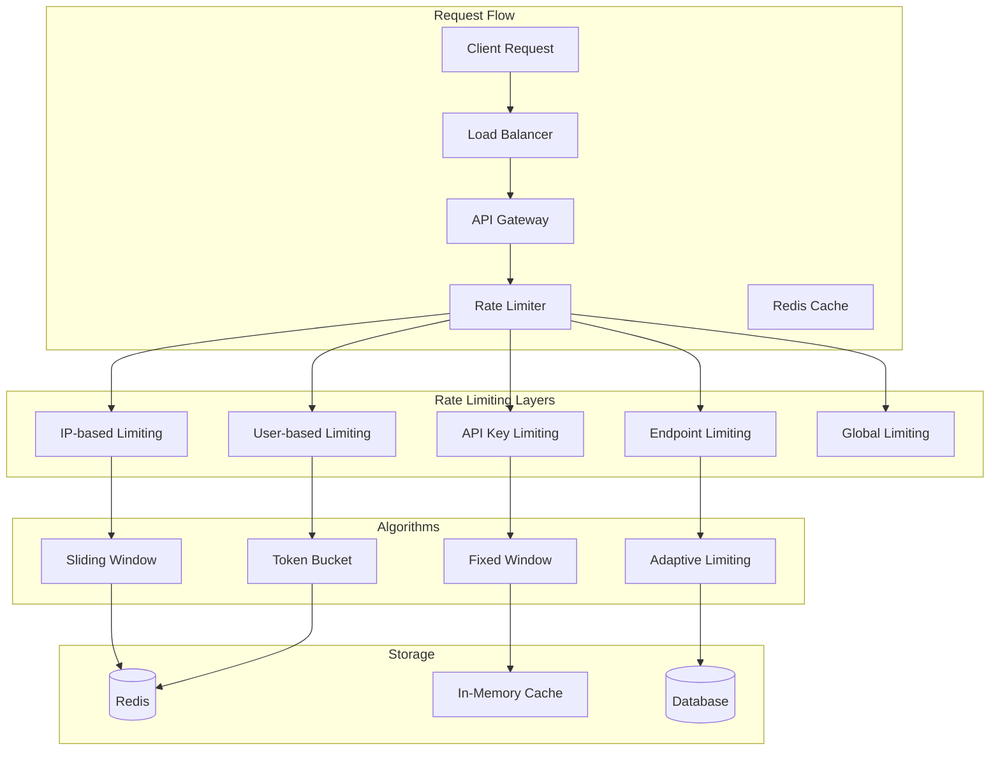

# Rate Limiting & Security Policies

## Overview
This document defines comprehensive rate limiting strategies and security policies for the Chaos World API Gateway to ensure fair resource usage, prevent abuse, and maintain system stability.

## Rate Limiting Architecture



## Rate Limiting Strategies

### 1. **Multi-Tier Rate Limiting**

#### Tier Structure
```json
{
  "tiers": {
    "anonymous": {
      "requests_per_minute": 10,
      "burst_limit": 20,
      "daily_limit": 1000,
      "description": "Unauthenticated users"
    },
    "authenticated": {
      "requests_per_minute": 100,
      "burst_limit": 200,
      "daily_limit": 10000,
      "description": "Regular authenticated users"
    },
    "premium": {
      "requests_per_minute": 500,
      "burst_limit": 1000,
      "daily_limit": 50000,
      "description": "Premium subscribers"
    },
    "vip": {
      "requests_per_minute": 1000,
      "burst_limit": 2000,
      "daily_limit": 100000,
      "description": "VIP users"
    },
    "api_key": {
      "requests_per_minute": 10000,
      "burst_limit": 20000,
      "daily_limit": 1000000,
      "description": "Service-to-service communication"
    },
    "admin": {
      "requests_per_minute": 50000,
      "burst_limit": 100000,
      "daily_limit": 5000000,
      "description": "Administrative access"
    }
  }
}
```

#### Dynamic Tier Assignment
```rust
pub struct RateLimitTier {
    pub name: String,
    pub requests_per_minute: u32,
    pub burst_limit: u32,
    pub daily_limit: u32,
    pub window_size: Duration,
}

impl RateLimitTier {
    pub fn for_user(&self, user: &User) -> Self {
        match user.subscription_tier {
            SubscriptionTier::Free => self.tiers.authenticated,
            SubscriptionTier::Premium => self.tiers.premium,
            SubscriptionTier::VIP => self.tiers.vip,
            SubscriptionTier::Admin => self.tiers.admin,
        }
    }
    
    pub fn for_api_key(&self, api_key: &ApiKey) -> Self {
        match api_key.tier {
            ApiKeyTier::Standard => self.tiers.api_key,
            ApiKeyTier::HighVolume => self.tiers.admin,
        }
    }
}
```

### 2. **Algorithm Implementation**

#### Sliding Window Algorithm
```rust
pub struct SlidingWindowLimiter {
    redis: RedisClient,
    window_size: Duration,
    max_requests: u32,
}

impl SlidingWindowLimiter {
    pub async fn check_rate_limit(
        &self,
        key: &str,
        identifier: &str
    ) -> Result<RateLimitResult, RateLimitError> {
        let now = Utc::now();
        let window_start = now - self.window_size;
        
        // Get current window requests
        let current_requests = self.redis
            .zcount(
                &format!("rate_limit:{}:{}", key, identifier),
                window_start.timestamp(),
                now.timestamp()
            )
            .await?;
        
        if current_requests >= self.max_requests {
            return Ok(RateLimitResult::Exceeded {
                limit: self.max_requests,
                remaining: 0,
                reset_time: window_start + self.window_size,
            });
        }
        
        // Add current request
        self.redis
            .zadd(
                &format!("rate_limit:{}:{}", key, identifier),
                now.timestamp(),
                now.timestamp()
            )
            .await?;
        
        // Set expiration
        self.redis
            .expire(
                &format!("rate_limit:{}:{}", key, identifier),
                self.window_size
            )
            .await?;
        
        Ok(RateLimitResult::Allowed {
            limit: self.max_requests,
            remaining: self.max_requests - current_requests - 1,
            reset_time: window_start + self.window_size,
        })
    }
}
```

#### Token Bucket Algorithm
```rust
pub struct TokenBucketLimiter {
    redis: RedisClient,
    capacity: u32,
    refill_rate: f64, // tokens per second
    burst_limit: u32,
}

impl TokenBucketLimiter {
    pub async fn check_rate_limit(
        &self,
        key: &str,
        identifier: &str
    ) -> Result<RateLimitResult, RateLimitError> {
        let now = Utc::now();
        let bucket_key = format!("token_bucket:{}:{}", key, identifier);
        
        // Get current bucket state
        let bucket_data: Option<TokenBucketData> = self.redis
            .hgetall(&bucket_key)
            .await?;
        
        let mut bucket = bucket_data.unwrap_or_else(|| TokenBucketData {
            tokens: self.capacity as f64,
            last_refill: now,
        });
        
        // Refill tokens
        let time_passed = (now - bucket.last_refill).num_seconds() as f64;
        let tokens_to_add = time_passed * self.refill_rate;
        bucket.tokens = (bucket.tokens + tokens_to_add).min(self.capacity as f64);
        bucket.last_refill = now;
        
        // Check if request can be processed
        if bucket.tokens >= 1.0 {
            bucket.tokens -= 1.0;
            
            // Update bucket state
            self.redis
                .hset(&bucket_key, bucket)
                .await?;
            
            self.redis
                .expire(&bucket_key, Duration::hours(1))
                .await?;
            
            Ok(RateLimitResult::Allowed {
                limit: self.capacity,
                remaining: bucket.tokens as u32,
                reset_time: now + Duration::seconds((1.0 / self.refill_rate) as i64),
            })
        } else {
            Ok(RateLimitResult::Exceeded {
                limit: self.capacity,
                remaining: 0,
                reset_time: now + Duration::seconds((1.0 / self.refill_rate) as i64),
            })
        }
    }
}
```

### 3. **Endpoint-Specific Rate Limiting**

#### Endpoint Configuration
```json
{
  "endpoints": {
    "/api/v1/users/login": {
      "requests_per_minute": 5,
      "burst_limit": 10,
      "algorithm": "sliding_window",
      "description": "Login attempts"
    },
    "/api/v1/users/register": {
      "requests_per_minute": 3,
      "burst_limit": 5,
      "algorithm": "sliding_window",
      "description": "Registration attempts"
    },
    "/api/v1/game/actions": {
      "requests_per_minute": 60,
      "burst_limit": 120,
      "algorithm": "token_bucket",
      "description": "Game actions"
    },
    "/api/v1/chat/messages": {
      "requests_per_minute": 30,
      "burst_limit": 60,
      "algorithm": "sliding_window",
      "description": "Chat messages"
    },
    "/api/v1/inventory": {
      "requests_per_minute": 20,
      "burst_limit": 40,
      "algorithm": "token_bucket",
      "description": "Inventory operations"
    }
  }
}
```

#### Dynamic Endpoint Limiting
```rust
pub struct EndpointRateLimiter {
    config: EndpointConfig,
    limiters: HashMap<String, Box<dyn RateLimiter>>,
}

impl EndpointRateLimiter {
    pub async fn check_endpoint_limit(
        &self,
        endpoint: &str,
        identifier: &str
    ) -> Result<RateLimitResult, RateLimitError> {
        let endpoint_config = self.config.get_endpoint_config(endpoint)?;
        let limiter = self.get_limiter(endpoint_config)?;
        
        limiter.check_rate_limit(endpoint, identifier).await
    }
    
    fn get_limiter(&self, config: &EndpointConfig) -> Result<&Box<dyn RateLimiter>, RateLimitError> {
        self.limiters.get(&config.algorithm)
            .ok_or_else(|| RateLimitError::LimiterNotFound(config.algorithm.clone()))
    }
}
```

## Security Policies

### 1. **IP-Based Security**

#### IP Whitelist/Blacklist
```rust
pub struct IPSecurityPolicy {
    whitelist: HashSet<IpAddr>,
    blacklist: HashSet<IpAddr>,
    suspicious_ips: HashMap<IpAddr, SuspiciousActivity>,
}

impl IPSecurityPolicy {
    pub fn is_allowed(&self, ip: IpAddr) -> bool {
        if self.blacklist.contains(&ip) {
            return false;
        }
        
        if self.whitelist.contains(&ip) {
            return true;
        }
        
        // Check for suspicious activity
        if let Some(activity) = self.suspicious_ips.get(&ip) {
            return !activity.is_blocked();
        }
        
        true
    }
    
    pub fn mark_suspicious(&mut self, ip: IpAddr, activity_type: SuspiciousActivityType) {
        let activity = self.suspicious_ips.entry(ip)
            .or_insert_with(|| SuspiciousActivity::new());
        
        activity.add_incident(activity_type);
    }
}
```

#### Geographic Restrictions
```rust
pub struct GeoRestrictionPolicy {
    allowed_countries: HashSet<String>,
    blocked_countries: HashSet<String>,
    geoip_db: GeoIPDatabase,
}

impl GeoRestrictionPolicy {
    pub fn is_allowed(&self, ip: IpAddr) -> Result<bool, GeoError> {
        let country = self.geoip_db.lookup_country(ip)?;
        
        if self.blocked_countries.contains(&country) {
            return Ok(false);
        }
        
        if self.allowed_countries.is_empty() || self.allowed_countries.contains(&country) {
            return Ok(true);
        }
        
        Ok(false)
    }
}
```

### 2. **Request Validation**

#### Input Sanitization
```rust
pub struct RequestValidator {
    max_body_size: usize,
    max_headers: usize,
    allowed_content_types: HashSet<String>,
    forbidden_patterns: Vec<Regex>,
}

impl RequestValidator {
    pub fn validate_request(&self, request: &Request<Body>) -> Result<(), ValidationError> {
        // Check body size
        if let Some(content_length) = request.headers().get("content-length") {
            let size: usize = content_length.to_str()?.parse()?;
            if size > self.max_body_size {
                return Err(ValidationError::BodyTooLarge);
            }
        }
        
        // Check header count
        if request.headers().len() > self.max_headers {
            return Err(ValidationError::TooManyHeaders);
        }
        
        // Check content type
        if let Some(content_type) = request.headers().get("content-type") {
            let ct = content_type.to_str()?;
            if !self.allowed_content_types.contains(ct) {
                return Err(ValidationError::InvalidContentType);
            }
        }
        
        // Check for forbidden patterns
        for pattern in &self.forbidden_patterns {
            if pattern.is_match(request.uri().path()) {
                return Err(ValidationError::ForbiddenPattern);
            }
        }
        
        Ok(())
    }
}
```

#### SQL Injection Prevention
```rust
pub struct SQLInjectionDetector {
    patterns: Vec<Regex>,
    whitelist: HashSet<String>,
}

impl SQLInjectionDetector {
    pub fn detect(&self, input: &str) -> bool {
        // Check against known SQL injection patterns
        for pattern in &self.patterns {
            if pattern.is_match(input) {
                return true;
            }
        }
        
        // Check for suspicious SQL keywords
        let sql_keywords = ["SELECT", "INSERT", "UPDATE", "DELETE", "DROP", "UNION"];
        let upper_input = input.to_uppercase();
        
        for keyword in &sql_keywords {
            if upper_input.contains(keyword) && !self.whitelist.contains(input) {
                return true;
            }
        }
        
        false
    }
}
```

### 3. **DDoS Protection**

#### Connection Limiting
```rust
pub struct DDoSProtection {
    max_connections_per_ip: u32,
    connection_timeout: Duration,
    active_connections: HashMap<IpAddr, Vec<Instant>>,
}

impl DDoSProtection {
    pub fn check_connection_limit(&mut self, ip: IpAddr) -> bool {
        let now = Instant::now();
        let connections = self.active_connections.entry(ip).or_insert_with(Vec::new);
        
        // Remove expired connections
        connections.retain(|&time| now.duration_since(time) < self.connection_timeout);
        
        // Check if under limit
        if connections.len() < self.max_connections_per_ip as usize {
            connections.push(now);
            true
        } else {
            false
        }
    }
}
```

#### Adaptive Rate Limiting
```rust
pub struct AdaptiveRateLimiter {
    base_limit: u32,
    current_limit: u32,
    adjustment_factor: f64,
    load_threshold: f64,
    system_metrics: SystemMetrics,
}

impl AdaptiveRateLimiter {
    pub async fn adjust_rate_limit(&mut self) -> Result<(), RateLimitError> {
        let cpu_usage = self.system_metrics.get_cpu_usage().await?;
        let memory_usage = self.system_metrics.get_memory_usage().await?;
        let load_avg = (cpu_usage + memory_usage) / 2.0;
        
        if load_avg > self.load_threshold {
            // Reduce rate limit when system is under load
            self.current_limit = (self.current_limit as f64 * self.adjustment_factor) as u32;
        } else {
            // Increase rate limit when system is healthy
            self.current_limit = (self.current_limit as f64 / self.adjustment_factor) as u32;
        }
        
        // Ensure minimum and maximum bounds
        self.current_limit = self.current_limit
            .max(self.base_limit / 4)
            .min(self.base_limit * 2);
        
        Ok(())
    }
}
```

### 4. **Security Headers**

#### Security Header Middleware
```rust
pub struct SecurityHeaderMiddleware;

impl SecurityHeaderMiddleware {
    pub fn apply_headers(response: &mut Response<Body>) {
        response.headers_mut().insert(
            "Strict-Transport-Security",
            "max-age=31536000; includeSubDomains; preload".parse().unwrap()
        );
        
        response.headers_mut().insert(
            "X-Content-Type-Options",
            "nosniff".parse().unwrap()
        );
        
        response.headers_mut().insert(
            "X-Frame-Options",
            "DENY".parse().unwrap()
        );
        
        response.headers_mut().insert(
            "X-XSS-Protection",
            "1; mode=block".parse().unwrap()
        );
        
        response.headers_mut().insert(
            "Content-Security-Policy",
            "default-src 'self'; script-src 'self' 'unsafe-inline'; style-src 'self' 'unsafe-inline'".parse().unwrap()
        );
        
        response.headers_mut().insert(
            "Referrer-Policy",
            "strict-origin-when-cross-origin".parse().unwrap()
        );
    }
}
```

## Monitoring & Alerting

### 1. **Rate Limit Metrics**

```rust
pub struct RateLimitMetrics {
    pub total_requests: Counter,
    pub rate_limited_requests: Counter,
    pub requests_per_second: Gauge,
    pub active_connections: Gauge,
    pub error_rate: Gauge,
}

impl RateLimitMetrics {
    pub fn record_request(&self, was_rate_limited: bool) {
        self.total_requests.inc();
        if was_rate_limited {
            self.rate_limited_requests.inc();
        }
    }
    
    pub fn update_requests_per_second(&self, rps: f64) {
        self.requests_per_second.set(rps);
    }
}
```

### 2. **Security Alerts**

```rust
pub struct SecurityAlertManager {
    alert_service: AlertService,
    thresholds: SecurityThresholds,
}

impl SecurityAlertManager {
    pub async fn check_security_metrics(&self, metrics: &SecurityMetrics) -> Result<(), AlertError> {
        // Check for DDoS attacks
        if metrics.requests_per_second > self.thresholds.ddos_threshold {
            self.alert_service.send_alert(
                SecurityAlert::DDoSAttack {
                    rps: metrics.requests_per_second,
                    severity: AlertSeverity::Critical,
                }
            ).await?;
        }
        
        // Check for suspicious IPs
        if metrics.suspicious_ips > self.thresholds.suspicious_ip_threshold {
            self.alert_service.send_alert(
                SecurityAlert::SuspiciousActivity {
                    ip_count: metrics.suspicious_ips,
                    severity: AlertSeverity::High,
                }
            ).await?;
        }
        
        // Check for failed authentication attempts
        if metrics.failed_auth_attempts > self.thresholds.failed_auth_threshold {
            self.alert_service.send_alert(
                SecurityAlert::BruteForceAttack {
                    failed_attempts: metrics.failed_auth_attempts,
                    severity: AlertSeverity::High,
                }
            ).await?;
        }
        
        Ok(())
    }
}
```

### 3. **Real-time Monitoring Dashboard**

```rust
pub struct SecurityDashboard {
    metrics_collector: MetricsCollector,
    alert_manager: SecurityAlertManager,
    dashboard_service: DashboardService,
}

impl SecurityDashboard {
    pub async fn get_security_status(&self) -> Result<SecurityStatus, DashboardError> {
        let metrics = self.metrics_collector.collect_security_metrics().await?;
        
        Ok(SecurityStatus {
            current_rps: metrics.requests_per_second,
            rate_limited_requests: metrics.rate_limited_requests,
            active_connections: metrics.active_connections,
            suspicious_ips: metrics.suspicious_ips,
            failed_auth_attempts: metrics.failed_auth_attempts,
            system_health: self.calculate_system_health(&metrics),
            alerts: self.alert_manager.get_active_alerts().await?,
        })
    }
}
```

## Configuration Management

### 1. **Rate Limiting Configuration**

```yaml
# rate_limiting.yaml
rate_limiting:
  default_tier: "authenticated"
  
  tiers:
    anonymous:
      requests_per_minute: 10
      burst_limit: 20
      daily_limit: 1000
      algorithm: "sliding_window"
    
    authenticated:
      requests_per_minute: 100
      burst_limit: 200
      daily_limit: 10000
      algorithm: "token_bucket"
    
    premium:
      requests_per_minute: 500
      burst_limit: 1000
      daily_limit: 50000
      algorithm: "token_bucket"
  
  endpoints:
    "/api/v1/users/login":
      requests_per_minute: 5
      burst_limit: 10
      algorithm: "sliding_window"
    
    "/api/v1/game/actions":
      requests_per_minute: 60
      burst_limit: 120
      algorithm: "token_bucket"
  
  adaptive_limiting:
    enabled: true
    adjustment_factor: 0.8
    load_threshold: 0.8
    min_limit_factor: 0.25
    max_limit_factor: 2.0
```

### 2. **Security Configuration**

```yaml
# security.yaml
security:
  ip_security:
    whitelist: []
    blacklist: []
    max_connections_per_ip: 100
    connection_timeout: "5m"
  
  geo_restrictions:
    enabled: false
    allowed_countries: []
    blocked_countries: []
  
  request_validation:
    max_body_size: "10MB"
    max_headers: 50
    allowed_content_types:
      - "application/json"
      - "application/x-www-form-urlencoded"
      - "multipart/form-data"
  
  ddos_protection:
    enabled: true
    max_requests_per_second: 1000
    burst_threshold: 2000
    block_duration: "1h"
  
  security_headers:
    hsts:
      max_age: 31536000
      include_subdomains: true
      preload: true
    
    csp:
      default_src: "'self'"
      script_src: "'self' 'unsafe-inline'"
      style_src: "'self' 'unsafe-inline'"
```

## Testing

### 1. **Rate Limiting Tests**

```rust
#[cfg(test)]
mod tests {
    use super::*;
    
    #[tokio::test]
    async fn test_sliding_window_limiter() {
        let limiter = SlidingWindowLimiter::new(
            RedisClient::new("redis://localhost:6379").unwrap(),
            Duration::minutes(1),
            10
        );
        
        let key = "test_key";
        let identifier = "test_user";
        
        // Test normal requests
        for i in 0..10 {
            let result = limiter.check_rate_limit(key, identifier).await.unwrap();
            assert!(matches!(result, RateLimitResult::Allowed { .. }));
        }
        
        // Test rate limit exceeded
        let result = limiter.check_rate_limit(key, identifier).await.unwrap();
        assert!(matches!(result, RateLimitResult::Exceeded { .. }));
    }
    
    #[tokio::test]
    async fn test_token_bucket_limiter() {
        let limiter = TokenBucketLimiter::new(
            RedisClient::new("redis://localhost:6379").unwrap(),
            10,
            1.0, // 1 token per second
            20
        );
        
        let key = "test_key";
        let identifier = "test_user";
        
        // Test burst capacity
        for i in 0..20 {
            let result = limiter.check_rate_limit(key, identifier).await.unwrap();
            assert!(matches!(result, RateLimitResult::Allowed { .. }));
        }
        
        // Test rate limit exceeded
        let result = limiter.check_rate_limit(key, identifier).await.unwrap();
        assert!(matches!(result, RateLimitResult::Exceeded { .. }));
    }
}
```

### 2. **Security Tests**

```rust
#[tokio::test]
async fn test_ip_security_policy() {
    let mut policy = IPSecurityPolicy::new();
    
    // Test whitelist
    policy.add_to_whitelist("192.168.1.1".parse().unwrap());
    assert!(policy.is_allowed("192.168.1.1".parse().unwrap()));
    
    // Test blacklist
    policy.add_to_blacklist("10.0.0.1".parse().unwrap());
    assert!(!policy.is_allowed("10.0.0.1".parse().unwrap()));
    
    // Test suspicious activity
    policy.mark_suspicious("10.0.0.2".parse().unwrap(), SuspiciousActivityType::MultipleFailedLogins);
    assert!(!policy.is_allowed("10.0.0.2".parse().unwrap()));
}

#[tokio::test]
async fn test_sql_injection_detector() {
    let detector = SQLInjectionDetector::new();
    
    // Test malicious input
    assert!(detector.detect("'; DROP TABLE users; --"));
    assert!(detector.detect("1' OR '1'='1"));
    assert!(detector.detect("UNION SELECT * FROM users"));
    
    // Test legitimate input
    assert!(!detector.detect("normal_user_input"));
    assert!(!detector.detect("SELECT * FROM users WHERE id = 1"));
}
```

## Deployment

### 1. **Kubernetes Configuration**

```yaml
# rate-limiting-configmap.yaml
apiVersion: v1
kind: ConfigMap
metadata:
  name: rate-limiting-config
data:
  rate_limiting.yaml: |
    # Rate limiting configuration
    rate_limiting:
      default_tier: "authenticated"
      tiers:
        anonymous:
          requests_per_minute: 10
          burst_limit: 20
        authenticated:
          requests_per_minute: 100
          burst_limit: 200
```

### 2. **Redis Configuration**

```yaml
# redis-config.yaml
apiVersion: v1
kind: ConfigMap
metadata:
  name: redis-config
data:
  redis.conf: |
    # Redis configuration for rate limiting
    maxmemory 2gb
    maxmemory-policy allkeys-lru
    save 900 1
    save 300 10
    save 60 10000
```

### 3. **Monitoring Setup**

```yaml
# prometheus-config.yaml
apiVersion: v1
kind: ConfigMap
metadata:
  name: prometheus-config
data:
  prometheus.yml: |
    global:
      scrape_interval: 15s
    
    scrape_configs:
      - job_name: 'api-gateway'
        static_configs:
          - targets: ['api-gateway:8080']
        metrics_path: '/metrics'
        scrape_interval: 5s
```

This comprehensive rate limiting and security policy system ensures the Chaos World API Gateway can handle high traffic while maintaining security and preventing abuse.
