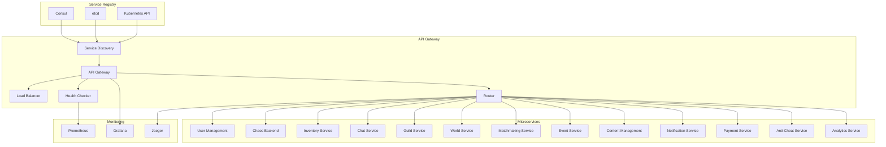

# Service Discovery & Routing Configuration

## Overview
This document defines the service discovery mechanisms and routing configuration for the Chaos World API Gateway, including dynamic service registration, load balancing, health checks, and failover strategies.

## Service Discovery Architecture



## Service Discovery Implementation

### 1. **Service Registration**

#### Service Definition
```rust
#[derive(Debug, Clone, Serialize, Deserialize)]
pub struct ServiceDefinition {
    pub id: String,
    pub name: String,
    pub version: String,
    pub address: String,
    pub port: u16,
    pub tags: Vec<String>,
    pub meta: HashMap<String, String>,
    pub health_check: HealthCheckConfig,
    pub load_balancer: LoadBalancerConfig,
}

#[derive(Debug, Clone, Serialize, Deserialize)]
pub struct HealthCheckConfig {
    pub http: Option<HttpHealthCheck>,
    pub tcp: Option<TcpHealthCheck>,
    pub grpc: Option<GrpcHealthCheck>,
    pub interval: Duration,
    pub timeout: Duration,
    pub deregister_critical_service_after: Duration,
}

#[derive(Debug, Clone, Serialize, Deserialize)]
pub struct LoadBalancerConfig {
    pub algorithm: LoadBalancingAlgorithm,
    pub weight: u32,
    pub max_connections: u32,
    pub circuit_breaker: CircuitBreakerConfig,
}
```

#### Service Registry Interface
```rust
#[async_trait]
pub trait ServiceRegistry {
    async fn register_service(&self, service: &ServiceDefinition) -> Result<(), RegistryError>;
    async fn deregister_service(&self, service_id: &str) -> Result<(), RegistryError>;
    async fn discover_services(&self, service_name: &str) -> Result<Vec<ServiceInstance>, RegistryError>;
    async fn watch_services(&self, service_name: &str) -> Result<ServiceWatcher, RegistryError>;
    async fn get_service_health(&self, service_id: &str) -> Result<ServiceHealth, RegistryError>;
}

pub struct ServiceInstance {
    pub id: String,
    pub name: String,
    pub address: String,
    pub port: u16,
    pub tags: Vec<String>,
    pub meta: HashMap<String, String>,
    pub health: ServiceHealth,
    pub last_updated: DateTime<Utc>,
}
```

### 2. **Consul Integration**

#### Consul Service Registry
```rust
pub struct ConsulServiceRegistry {
    client: consul::Client,
    datacenter: String,
}

impl ConsulServiceRegistry {
    pub fn new(consul_url: &str, datacenter: &str) -> Result<Self, RegistryError> {
        let client = consul::Client::new(consul_url, consul::Config::default())?;
        Ok(Self {
            client,
            datacenter: datacenter.to_string(),
        })
    }
}

#[async_trait]
impl ServiceRegistry for ConsulServiceRegistry {
    async fn register_service(&self, service: &ServiceDefinition) -> Result<(), RegistryError> {
        let consul_service = consul::catalog::CatalogRegistration {
            node: "api-gateway".to_string(),
            address: Some(service.address.clone()),
            service: Some(consul::catalog::CatalogService {
                id: Some(service.id.clone()),
                service: service.name.clone(),
                tags: Some(service.tags.clone()),
                address: Some(service.address.clone()),
                port: Some(service.port),
                meta: Some(service.meta.clone()),
                check: Some(consul::catalog::CatalogCheck {
                    http: service.health_check.http.as_ref().map(|h| h.url.clone()),
                    interval: Some(service.health_check.interval.as_secs().to_string() + "s"),
                    timeout: Some(service.health_check.timeout.as_secs().to_string() + "s"),
                    deregister_critical_service_after: Some(
                        service.health_check.deregister_critical_service_after
                            .as_secs()
                            .to_string() + "s"
                    ),
                    ..Default::default()
                }),
                ..Default::default()
            }),
            ..Default::default()
        };

        self.client
            .catalog()
            .register(&consul_service)
            .await
            .map_err(|e| RegistryError::RegistrationFailed(e.to_string()))?;

        Ok(())
    }

    async fn discover_services(&self, service_name: &str) -> Result<Vec<ServiceInstance>, RegistryError> {
        let services = self.client
            .catalog()
            .service(service_name, None)
            .await
            .map_err(|e| RegistryError::DiscoveryFailed(e.to_string()))?;

        let instances = services
            .into_iter()
            .map(|service| ServiceInstance {
                id: service.service_id.unwrap_or_default(),
                name: service.service_name.unwrap_or_default(),
                address: service.service_address.unwrap_or_default(),
                port: service.service_port.unwrap_or(0),
                tags: service.service_tags.unwrap_or_default(),
                meta: service.service_meta.unwrap_or_default(),
                health: ServiceHealth::Unknown,
                last_updated: Utc::now(),
            })
            .collect();

        Ok(instances)
    }
}
```

### 3. **Kubernetes Service Discovery**

#### Kubernetes Service Registry
```rust
pub struct KubernetesServiceRegistry {
    client: k8s_openapi::Client,
    namespace: String,
}

impl KubernetesServiceRegistry {
    pub async fn new(namespace: &str) -> Result<Self, RegistryError> {
        let client = k8s_openapi::Client::new().await?;
        Ok(Self {
            client,
            namespace: namespace.to_string(),
        })
    }
}

#[async_trait]
impl ServiceRegistry for KubernetesServiceRegistry {
    async fn discover_services(&self, service_name: &str) -> Result<Vec<ServiceInstance>, RegistryError> {
        let services: k8s_openapi::api::core::v1::ServiceList = self.client
            .list_namespaced_service(&self.namespace, None)
            .await
            .map_err(|e| RegistryError::DiscoveryFailed(e.to_string()))?;

        let instances = services
            .items
            .into_iter()
            .filter(|service| {
                service.metadata.name.as_ref()
                    .map(|name| name.contains(service_name))
                    .unwrap_or(false)
            })
            .filter_map(|service| {
                let name = service.metadata.name?;
                let spec = service.spec?;
                let ports = spec.ports?;
                
                Some(ServiceInstance {
                    id: format!("{}-{}", name, self.namespace),
                    name: name.clone(),
                    address: spec.cluster_ip?,
                    port: ports.first()?.port? as u16,
                    tags: vec!["kubernetes".to_string()],
                    meta: service.metadata.labels.unwrap_or_default(),
                    health: ServiceHealth::Unknown,
                    last_updated: Utc::now(),
                })
            })
            .collect();

        Ok(instances)
    }
}
```

## Routing Configuration

### 1. **Route Definition**

#### Route Structure
```rust
#[derive(Debug, Clone, Serialize, Deserialize)]
pub struct Route {
    pub id: String,
    pub name: String,
    pub path: String,
    pub methods: Vec<HttpMethod>,
    pub service_name: String,
    pub load_balancer: LoadBalancerConfig,
    pub middleware: Vec<MiddlewareConfig>,
    pub timeout: Duration,
    pub retry_policy: RetryPolicy,
    pub circuit_breaker: CircuitBreakerConfig,
}

#[derive(Debug, Clone, Serialize, Deserialize)]
pub struct LoadBalancerConfig {
    pub algorithm: LoadBalancingAlgorithm,
    pub health_check: HealthCheckConfig,
    pub sticky_session: Option<StickySessionConfig>,
}

#[derive(Debug, Clone, Serialize, Deserialize)]
pub enum LoadBalancingAlgorithm {
    RoundRobin,
    LeastConnections,
    WeightedRoundRobin,
    IPHash,
    Random,
    LeastResponseTime,
}

#[derive(Debug, Clone, Serialize, Deserialize)]
pub struct RetryPolicy {
    pub max_attempts: u32,
    pub backoff_strategy: BackoffStrategy,
    pub retryable_status_codes: Vec<u16>,
}

#[derive(Debug, Clone, Serialize, Deserialize)]
pub enum BackoffStrategy {
    Fixed(Duration),
    Exponential { base: Duration, max: Duration },
    Linear(Duration),
}
```

### 2. **Dynamic Routing**

#### Route Manager
```rust
pub struct RouteManager {
    routes: Arc<RwLock<HashMap<String, Route>>>,
    service_registry: Arc<dyn ServiceRegistry>,
    load_balancers: Arc<RwLock<HashMap<String, Box<dyn LoadBalancer>>>>,
}

impl RouteManager {
    pub async fn add_route(&self, route: Route) -> Result<(), RoutingError> {
        // Validate route
        self.validate_route(&route).await?;
        
        // Create load balancer for service
        let load_balancer = self.create_load_balancer(&route).await?;
        
        // Store route and load balancer
        {
            let mut routes = self.routes.write().await;
            routes.insert(route.id.clone(), route);
        }
        
        {
            let mut load_balancers = self.load_balancers.write().await;
            load_balancers.insert(route.service_name.clone(), load_balancer);
        }
        
        Ok(())
    }
    
    pub async fn find_route(&self, path: &str, method: &HttpMethod) -> Option<Route> {
        let routes = self.routes.read().await;
        
        routes
            .values()
            .find(|route| {
                route.path == path && route.methods.contains(method)
            })
            .cloned()
    }
    
    async fn validate_route(&self, route: &Route) -> Result<(), RoutingError> {
        // Check if service exists
        let services = self.service_registry
            .discover_services(&route.service_name)
            .await?;
        
        if services.is_empty() {
            return Err(RoutingError::ServiceNotFound(route.service_name.clone()));
        }
        
        // Validate path format
        if !route.path.starts_with('/') {
            return Err(RoutingError::InvalidPath(route.path.clone()));
        }
        
        Ok(())
    }
}
```

### 3. **Load Balancing Implementation**

#### Load Balancer Trait
```rust
#[async_trait]
pub trait LoadBalancer: Send + Sync {
    async fn select_instance(&self, service_name: &str) -> Result<ServiceInstance, LoadBalancingError>;
    async fn update_instances(&self, service_name: &str, instances: Vec<ServiceInstance>) -> Result<(), LoadBalancingError>;
    async fn get_healthy_instances(&self, service_name: &str) -> Result<Vec<ServiceInstance>, LoadBalancingError>;
}

pub struct RoundRobinLoadBalancer {
    instances: Arc<RwLock<HashMap<String, Vec<ServiceInstance>>>>,
    current_index: Arc<RwLock<HashMap<String, AtomicUsize>>>,
}

#[async_trait]
impl LoadBalancer for RoundRobinLoadBalancer {
    async fn select_instance(&self, service_name: &str) -> Result<ServiceInstance, LoadBalancingError> {
        let instances = self.get_healthy_instances(service_name).await?;
        
        if instances.is_empty() {
            return Err(LoadBalancingError::NoHealthyInstances);
        }
        
        let current_index = {
            let mut index_map = self.current_index.write().await;
            let index = index_map.entry(service_name.to_string()).or_insert_with(|| AtomicUsize::new(0));
            index.fetch_add(1, Ordering::Relaxed) % instances.len()
        };
        
        Ok(instances[current_index].clone())
    }
    
    async fn get_healthy_instances(&self, service_name: &str) -> Result<Vec<ServiceInstance>, LoadBalancingError> {
        let instances = self.instances.read().await;
        let service_instances = instances
            .get(service_name)
            .ok_or(LoadBalancingError::ServiceNotFound)?;
        
        let healthy_instances: Vec<ServiceInstance> = service_instances
            .iter()
            .filter(|instance| instance.health == ServiceHealth::Healthy)
            .cloned()
            .collect();
        
        Ok(healthy_instances)
    }
}
```

#### Least Connections Load Balancer
```rust
pub struct LeastConnectionsLoadBalancer {
    instances: Arc<RwLock<HashMap<String, Vec<ServiceInstance>>>>,
    connection_counts: Arc<RwLock<HashMap<String, HashMap<String, AtomicU32>>>>,
}

#[async_trait]
impl LoadBalancer for LeastConnectionsLoadBalancer {
    async fn select_instance(&self, service_name: &str) -> Result<ServiceInstance, LoadBalancingError> {
        let instances = self.get_healthy_instances(service_name).await?;
        
        if instances.is_empty() {
            return Err(LoadBalancingError::NoHealthyInstances);
        }
        
        let connection_counts = self.connection_counts.read().await;
        let service_counts = connection_counts
            .get(service_name)
            .ok_or(LoadBalancingError::ServiceNotFound)?;
        
        let selected_instance = instances
            .iter()
            .min_by_key(|instance| {
                service_counts
                    .get(&instance.id)
                    .map(|count| count.load(Ordering::Relaxed))
                    .unwrap_or(0)
            })
            .ok_or(LoadBalancingError::NoHealthyInstances)?;
        
        Ok(selected_instance.clone())
    }
}
```

## Health Checking

### 1. **Health Check Implementation**

#### Health Checker
```rust
pub struct HealthChecker {
    http_client: reqwest::Client,
    check_interval: Duration,
    timeout: Duration,
    service_health: Arc<RwLock<HashMap<String, ServiceHealth>>>,
}

impl HealthChecker {
    pub async fn start_health_checks(&self, services: Vec<ServiceInstance>) -> Result<(), HealthCheckError> {
        for service in services {
            let checker = self.clone();
            let service_id = service.id.clone();
            let service_name = service.name.clone();
            let health_url = format!("http://{}:{}/health", service.address, service.port);
            
            tokio::spawn(async move {
                let mut interval = tokio::time::interval(checker.check_interval);
                
                loop {
                    interval.tick().await;
                    
                    match checker.check_service_health(&health_url).await {
                        Ok(health) => {
                            let mut service_health = checker.service_health.write().await;
                            service_health.insert(service_id.clone(), health);
                        }
                        Err(e) => {
                            tracing::warn!("Health check failed for {}: {}", service_name, e);
                            let mut service_health = checker.service_health.write().await;
                            service_health.insert(service_id.clone(), ServiceHealth::Unhealthy);
                        }
                    }
                }
            });
        }
        
        Ok(())
    }
    
    async fn check_service_health(&self, health_url: &str) -> Result<ServiceHealth, HealthCheckError> {
        let response = self.http_client
            .get(health_url)
            .timeout(self.timeout)
            .send()
            .await?;
        
        if response.status().is_success() {
            Ok(ServiceHealth::Healthy)
        } else {
            Ok(ServiceHealth::Unhealthy)
        }
    }
}
```

### 2. **Circuit Breaker**

#### Circuit Breaker Implementation
```rust
pub struct CircuitBreaker {
    failure_threshold: u32,
    recovery_timeout: Duration,
    state: Arc<RwLock<CircuitBreakerState>>,
    failure_count: Arc<RwLock<HashMap<String, AtomicU32>>>,
    last_failure_time: Arc<RwLock<HashMap<String, Instant>>>,
}

#[derive(Debug, Clone)]
pub enum CircuitBreakerState {
    Closed,
    Open,
    HalfOpen,
}

impl CircuitBreaker {
    pub async fn call<F, T>(&self, service_id: &str, operation: F) -> Result<T, CircuitBreakerError>
    where
        F: Future<Output = Result<T, Box<dyn std::error::Error + Send + Sync>>>,
    {
        let state = self.get_state(service_id).await;
        
        match state {
            CircuitBreakerState::Closed => {
                match operation.await {
                    Ok(result) => {
                        self.reset_failure_count(service_id).await;
                        Ok(result)
                    }
                    Err(e) => {
                        self.record_failure(service_id).await;
                        Err(CircuitBreakerError::ServiceError(e))
                    }
                }
            }
            CircuitBreakerState::Open => {
                if self.should_attempt_reset(service_id).await {
                    self.set_state(service_id, CircuitBreakerState::HalfOpen).await;
                    self.call(service_id, operation).await
                } else {
                    Err(CircuitBreakerError::CircuitOpen)
                }
            }
            CircuitBreakerState::HalfOpen => {
                match operation.await {
                    Ok(result) => {
                        self.set_state(service_id, CircuitBreakerState::Closed).await;
                        self.reset_failure_count(service_id).await;
                        Ok(result)
                    }
                    Err(e) => {
                        self.set_state(service_id, CircuitBreakerState::Open).await;
                        self.record_failure(service_id).await;
                        Err(CircuitBreakerError::ServiceError(e))
                    }
                }
            }
        }
    }
    
    async fn get_state(&self, service_id: &str) -> CircuitBreakerState {
        let state = self.state.read().await;
        state.get(service_id).cloned().unwrap_or(CircuitBreakerState::Closed)
    }
    
    async fn record_failure(&self, service_id: &str) {
        let mut failure_counts = self.failure_count.write().await;
        let count = failure_counts
            .entry(service_id.to_string())
            .or_insert_with(|| AtomicU32::new(0));
        
        let current_count = count.fetch_add(1, Ordering::Relaxed) + 1;
        
        if current_count >= self.failure_threshold {
            self.set_state(service_id, CircuitBreakerState::Open).await;
            let mut last_failure = self.last_failure_time.write().await;
            last_failure.insert(service_id.to_string(), Instant::now());
        }
    }
}
```

## Configuration Management

### 1. **Route Configuration**

#### YAML Configuration
```yaml
# routing.yaml
routes:
  - id: "user-management"
    name: "User Management API"
    path: "/api/v1/users"
    methods: ["GET", "POST", "PUT", "DELETE"]
    service_name: "user-management"
    load_balancer:
      algorithm: "round_robin"
      health_check:
        http:
          url: "/health"
        interval: "30s"
        timeout: "5s"
    timeout: "30s"
    retry_policy:
      max_attempts: 3
      backoff_strategy:
        type: "exponential"
        base: "1s"
        max: "10s"
      retryable_status_codes: [500, 502, 503, 504]
    circuit_breaker:
      failure_threshold: 5
      recovery_timeout: "60s"
  
  - id: "game-actions"
    name: "Game Actions API"
    path: "/api/v1/game"
    methods: ["GET", "POST"]
    service_name: "chaos-backend"
    load_balancer:
      algorithm: "least_connections"
      health_check:
        http:
          url: "/health"
        interval: "10s"
        timeout: "3s"
    timeout: "60s"
    retry_policy:
      max_attempts: 2
      backoff_strategy:
        type: "fixed"
        duration: "2s"
      retryable_status_codes: [500, 502, 503]
    circuit_breaker:
      failure_threshold: 10
      recovery_timeout: "30s"
```

### 2. **Service Discovery Configuration**

#### Consul Configuration
```yaml
# consul.yaml
consul:
  address: "consul:8500"
  datacenter: "chaos-world"
  token: "${CONSUL_TOKEN}"
  
services:
  - name: "user-management"
    port: 8080
    health_check:
      http: "http://localhost:8080/health"
      interval: "30s"
      timeout: "5s"
    tags:
      - "api"
      - "user-management"
      - "v1"
  
  - name: "chaos-backend"
    port: 8081
    health_check:
      http: "http://localhost:8081/health"
      interval: "10s"
      timeout: "3s"
    tags:
      - "api"
      - "game-logic"
      - "v1"
```

### 3. **Kubernetes Configuration**

#### Service Definition
```yaml
# user-management-service.yaml
apiVersion: v1
kind: Service
metadata:
  name: user-management
  labels:
    app: user-management
    version: v1
spec:
  selector:
    app: user-management
  ports:
    - port: 8080
      targetPort: 8080
      protocol: TCP
  type: ClusterIP
---
apiVersion: apps/v1
kind: Deployment
metadata:
  name: user-management
spec:
  replicas: 3
  selector:
    matchLabels:
      app: user-management
  template:
    metadata:
      labels:
        app: user-management
        version: v1
    spec:
      containers:
      - name: user-management
        image: chaos-world/user-management:latest
        ports:
        - containerPort: 8080
        livenessProbe:
          httpGet:
            path: /health
            port: 8080
          initialDelaySeconds: 30
          periodSeconds: 10
        readinessProbe:
          httpGet:
            path: /ready
            port: 8080
          initialDelaySeconds: 5
          periodSeconds: 5
```

## Monitoring & Observability

### 1. **Routing Metrics**

#### Metrics Collection
```rust
pub struct RoutingMetrics {
    pub total_requests: Counter,
    pub successful_requests: Counter,
    pub failed_requests: Counter,
    pub request_duration: Histogram,
    pub active_connections: Gauge,
    pub circuit_breaker_state: Gauge,
}

impl RoutingMetrics {
    pub fn record_request(&self, duration: Duration, success: bool) {
        self.total_requests.inc();
        self.request_duration.observe(duration.as_secs_f64());
        
        if success {
            self.successful_requests.inc();
        } else {
            self.failed_requests.inc();
        }
    }
    
    pub fn update_circuit_breaker_state(&self, service_id: &str, state: &CircuitBreakerState) {
        let state_value = match state {
            CircuitBreakerState::Closed => 0.0,
            CircuitBreakerState::Open => 1.0,
            CircuitBreakerState::HalfOpen => 0.5,
        };
        
        self.circuit_breaker_state
            .with_label_values(&[service_id])
            .set(state_value);
    }
}
```

### 2. **Service Discovery Metrics**

#### Discovery Metrics
```rust
pub struct ServiceDiscoveryMetrics {
    pub service_instances: Gauge,
    pub healthy_instances: Gauge,
    pub discovery_errors: Counter,
    pub registration_errors: Counter,
    pub health_check_duration: Histogram,
}

impl ServiceDiscoveryMetrics {
    pub fn update_service_instances(&self, service_name: &str, total: usize, healthy: usize) {
        self.service_instances
            .with_label_values(&[service_name])
            .set(total as f64);
        
        self.healthy_instances
            .with_label_values(&[service_name])
            .set(healthy as f64);
    }
    
    pub fn record_health_check_duration(&self, service_name: &str, duration: Duration) {
        self.health_check_duration
            .with_label_values(&[service_name])
            .observe(duration.as_secs_f64());
    }
}
```

## Testing

### 1. **Service Discovery Tests**

```rust
#[cfg(test)]
mod tests {
    use super::*;
    
    #[tokio::test]
    async fn test_service_discovery() {
        let registry = MockServiceRegistry::new();
        let service = ServiceDefinition {
            id: "test-service-1".to_string(),
            name: "test-service".to_string(),
            address: "127.0.0.1".to_string(),
            port: 8080,
            tags: vec!["test".to_string()],
            meta: HashMap::new(),
            health_check: HealthCheckConfig::default(),
            load_balancer: LoadBalancerConfig::default(),
        };
        
        registry.register_service(&service).await.unwrap();
        
        let instances = registry.discover_services("test-service").await.unwrap();
        assert_eq!(instances.len(), 1);
        assert_eq!(instances[0].id, "test-service-1");
    }
    
    #[tokio::test]
    async fn test_load_balancing() {
        let mut load_balancer = RoundRobinLoadBalancer::new();
        
        let instances = vec![
            ServiceInstance {
                id: "instance-1".to_string(),
                name: "test-service".to_string(),
                address: "127.0.0.1".to_string(),
                port: 8080,
                tags: vec![],
                meta: HashMap::new(),
                health: ServiceHealth::Healthy,
                last_updated: Utc::now(),
            },
            ServiceInstance {
                id: "instance-2".to_string(),
                name: "test-service".to_string(),
                address: "127.0.0.2".to_string(),
                port: 8080,
                tags: vec![],
                meta: HashMap::new(),
                health: ServiceHealth::Healthy,
                last_updated: Utc::now(),
            },
        ];
        
        load_balancer.update_instances("test-service", instances).await.unwrap();
        
        // Test round-robin selection
        let instance1 = load_balancer.select_instance("test-service").await.unwrap();
        let instance2 = load_balancer.select_instance("test-service").await.unwrap();
        let instance3 = load_balancer.select_instance("test-service").await.unwrap();
        
        assert_eq!(instance1.id, "instance-1");
        assert_eq!(instance2.id, "instance-2");
        assert_eq!(instance3.id, "instance-1");
    }
}
```

### 2. **Circuit Breaker Tests**

```rust
#[tokio::test]
async fn test_circuit_breaker() {
    let circuit_breaker = CircuitBreaker::new(3, Duration::from_secs(60));
    
    // Test successful calls
    for _ in 0..3 {
        let result = circuit_breaker.call("test-service", async {
            Ok("success")
        }).await;
        assert!(result.is_ok());
    }
    
    // Test failure threshold
    for _ in 0..3 {
        let result = circuit_breaker.call("test-service", async {
            Err(Box::new(std::io::Error::new(std::io::ErrorKind::Other, "test error")))
        }).await;
        assert!(result.is_err());
    }
    
    // Test circuit open
    let result = circuit_breaker.call("test-service", async {
        Ok("should not reach here")
    }).await;
    assert!(matches!(result, Err(CircuitBreakerError::CircuitOpen)));
}
```

This comprehensive service discovery and routing configuration provides robust, scalable, and maintainable routing for the Chaos World API Gateway.
